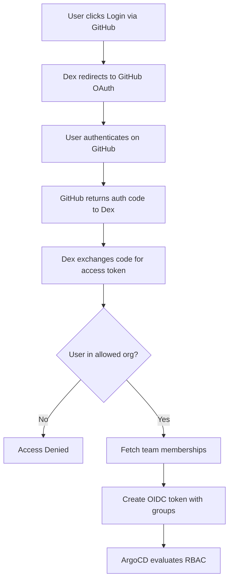

# How to Configure Dex Connector for GitHub Organization in ArgoCD

Author: [nawazdhandala](https://github.com/nawazdhandala)

Tags: ArgoCD, GitOps, Kubernetes, GitHub, Dex

Description: Learn how to configure the Dex GitHub connector in ArgoCD to restrict SSO access by GitHub organization and map teams to ArgoCD RBAC roles.

---

Using GitHub organizations for ArgoCD authentication is a natural fit when your team already manages code repositories and deployments through GitHub. The Dex GitHub connector allows you to restrict ArgoCD access to members of specific GitHub organizations and map GitHub team memberships to ArgoCD RBAC roles.

This guide focuses specifically on the organization and team filtering capabilities of the Dex GitHub connector, going deeper than a general GitHub OAuth setup.

## How the GitHub Connector Works

The Dex GitHub connector uses GitHub's OAuth API to authenticate users and then uses the GitHub API to verify organization membership and fetch team information. This two-step process means:

1. Users authenticate with their GitHub credentials (including 2FA if enabled)
2. Dex checks if the user belongs to an allowed organization
3. Dex fetches the user's team memberships from the allowed organizations
4. The team memberships become groups in the OIDC token that ArgoCD uses for RBAC



## Step 1: Create a GitHub OAuth App

Create the OAuth application at the organization level for better control:

1. Go to your GitHub organization page
2. Navigate to **Settings > Developer settings > OAuth Apps**
3. Click **New OAuth App**
4. Configure:
   - **Application name**: `ArgoCD`
   - **Homepage URL**: `https://argocd.example.com`
   - **Authorization callback URL**: `https://argocd.example.com/api/dex/callback`
5. Click **Register application**
6. Generate a client secret and save both the Client ID and Client Secret

Creating the app at the organization level (instead of personal settings) ensures the organization admins can manage the OAuth app.

## Step 2: Configure Organization Filtering

### Single Organization

The basic configuration restricts access to one organization:

```yaml
apiVersion: v1
kind: ConfigMap
metadata:
  name: argocd-cm
  namespace: argocd
data:
  url: https://argocd.example.com
  dex.config: |
    connectors:
      - type: github
        id: github
        name: GitHub
        config:
          clientID: your-github-client-id
          clientSecret: $dex.github.clientSecret
          redirectURI: https://argocd.example.com/api/dex/callback
          orgs:
            - name: my-organization
          loadAllGroups: true
          useLoginAsID: true
```

With this configuration, only members of `my-organization` can log into ArgoCD. All other GitHub users will be denied.

### Multiple Organizations

Allow members from multiple organizations:

```yaml
          orgs:
            - name: primary-org
            - name: partner-org
            - name: contractor-org
```

### Organization with Team Filtering

For tighter control, restrict to specific teams within an organization:

```yaml
          orgs:
            - name: my-organization
              teams:
                - platform-engineering
                - sre
                - backend-developers
                - frontend-developers
```

Now only members of these specific teams (not just the organization) can access ArgoCD. This is important because large organizations may have hundreds or thousands of members, but only a subset needs ArgoCD access.

### Mixed Configuration

Combine full organization access with team-filtered access:

```yaml
          orgs:
            # All members of the core-infra org can log in
            - name: core-infra-org

            # Only specific teams from the engineering org
            - name: engineering-org
              teams:
                - devops
                - sre

            # Only the approved team from the contractor org
            - name: contractor-org
              teams:
                - approved-contractors
```

## Step 3: Understanding Group Names

When GitHub teams are passed as groups in the OIDC token, they follow the format `organization:team-slug`. Team slugs are the URL-friendly versions of team names:

| GitHub Team Name | Group in ArgoCD |
|---|---|
| Platform Engineering | `my-org:platform-engineering` |
| SRE Team | `my-org:sre-team` |
| Backend Developers | `my-org:backend-developers` |
| DevOps / Infrastructure | `my-org:devops-infrastructure` |

To find the exact team slug, check the team URL on GitHub: `https://github.com/orgs/my-org/teams/platform-engineering`

## Step 4: Configure RBAC

Map GitHub organization teams to ArgoCD roles:

```yaml
apiVersion: v1
kind: ConfigMap
metadata:
  name: argocd-rbac-cm
  namespace: argocd
data:
  policy.default: role:readonly
  policy.csv: |
    # Platform Engineering team gets full admin access
    g, my-organization:platform-engineering, role:admin

    # SRE team gets admin access
    g, my-organization:sre, role:admin

    # Backend developers can deploy to staging and dev
    p, role:backend-dev, applications, get, */*, allow
    p, role:backend-dev, applications, sync, staging/*, allow
    p, role:backend-dev, applications, sync, dev/*, allow
    p, role:backend-dev, applications, create, dev/*, allow
    p, role:backend-dev, applications, delete, dev/*, allow
    p, role:backend-dev, logs, get, */*, allow
    g, my-organization:backend-developers, role:backend-dev

    # Frontend developers get similar access
    g, my-organization:frontend-developers, role:backend-dev

    # Contractors get read-only access
    g, contractor-org:approved-contractors, role:readonly

  scopes: '[groups]'
```

## Step 5: Handling Nested Teams

GitHub supports nested teams (child teams within parent teams). The Dex connector handles these as separate groups. For example:

```
engineering (parent team)
  backend (child team)
  frontend (child team)
  mobile (child team)
```

In ArgoCD RBAC, these would be:

```yaml
  policy.csv: |
    # Parent team - base access for all engineers
    g, my-org:engineering, role:engineer-base

    # Child teams - additional specific access
    g, my-org:backend, role:backend-access
    g, my-org:frontend, role:frontend-access
    g, my-org:mobile, role:mobile-access
```

A user who is a member of `my-org:backend` might also be a member of `my-org:engineering` (depending on your GitHub team structure), giving them the union of both roles' permissions.

## Step 6: Using loadAllGroups vs Specific Teams

The `loadAllGroups` setting controls whether Dex fetches all team memberships or only those for teams listed in the `orgs.teams` configuration:

```yaml
          # Fetch ALL teams the user belongs to
          loadAllGroups: true

          # Only fetch teams listed in the orgs section
          loadAllGroups: false
```

When `loadAllGroups` is `true`:
- Dex fetches all team memberships for the user across allowed organizations
- More flexible for RBAC - you can reference any team in policy.csv
- More API calls to GitHub, which could hit rate limits for large organizations

When `loadAllGroups` is `false`:
- Dex only checks membership in the teams explicitly listed in the `orgs` configuration
- Fewer API calls
- You can only use listed teams in RBAC policies

For most setups, `loadAllGroups: true` is the better choice unless you have rate limiting concerns.

## GitHub Enterprise Server

For GitHub Enterprise Server (self-hosted), add the enterprise hostname:

```yaml
          orgs:
            - name: my-organization
              teams:
                - platform-team
          loadAllGroups: true
          useLoginAsID: true
          # GitHub Enterprise Server configuration
          hostName: github.internal.example.com
```

If your GitHub Enterprise uses a self-signed certificate:

```yaml
          hostName: github.internal.example.com
          rootCA: /etc/dex/tls/github-ca.crt
```

Mount the CA certificate into the Dex container as described in the LDAP guide.

## Verifying the Configuration

After setup, verify everything works:

```bash
# Restart Dex and ArgoCD server
kubectl -n argocd rollout restart deployment argocd-dex-server
kubectl -n argocd rollout restart deployment argocd-server

# Check Dex logs for connector initialization
kubectl -n argocd logs deploy/argocd-dex-server | grep -i "github\|connector"

# Login and check user info
argocd login argocd.example.com --sso
argocd account get-user-info
```

The user info output should show your GitHub username and the groups (teams) you belong to.

## Revoking Access

Access revocation happens at the GitHub level:

1. **Remove from organization** - Immediately prevents login
2. **Remove from team** - Reduces permissions at next login (existing sessions may persist until token expiry)
3. **Revoke OAuth app authorization** - User must re-authorize on next login

For immediate revocation, you can also:

```bash
# Delete the user's ArgoCD token
argocd account delete-token --account <username>
```

## Troubleshooting

### "Not a member of any allowed organization"

The user is not in any of the organizations listed in `orgs`. Check:
- The user has accepted the organization invitation
- The organization name is spelled correctly (case-sensitive)
- The user's organization membership is not private (for some configurations)

### Teams Not Available in RBAC

1. Verify `loadAllGroups: true` is set
2. Check that the OAuth app has the `read:org` scope
3. Look at Dex logs for API errors:
```bash
kubectl -n argocd logs deploy/argocd-dex-server | grep -i "team\|group\|error"
```

### GitHub API Rate Limiting

If you see rate limit errors in Dex logs:
- Reduce the number of concurrent logins
- Set `loadAllGroups: false` and only list needed teams
- Consider using a GitHub App instead of an OAuth App for higher rate limits

## Summary

The Dex GitHub connector for ArgoCD provides a clean integration path when your team uses GitHub as its primary platform. Organization filtering ensures only authorized users can access ArgoCD, and team-based RBAC mapping gives you fine-grained control over who can deploy what. The combination of GitHub organization management and ArgoCD RBAC creates a security model where code access and deployment access are managed through the same platform.

For more on GitHub OAuth setup, see [How to Configure SSO with GitHub OAuth in ArgoCD](https://oneuptime.com/blog/post/2026-02-26-argocd-sso-github-oauth/view).
