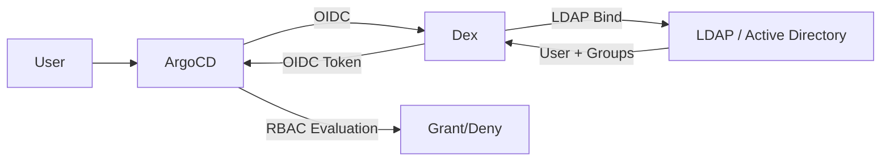

# How to Configure Dex Connector for LDAP in ArgoCD

Author: [nawazdhandala](https://github.com/nawazdhandala)

Tags: ArgoCD, GitOps, Kubernetes, LDAP, Dex

Description: Learn how to configure the Dex LDAP connector in ArgoCD for authenticating users against Active Directory or OpenLDAP with group-based access control.

---

Many enterprises still rely on LDAP (Lightweight Directory Access Protocol) or Microsoft Active Directory for centralized user management. While newer OIDC-based providers are gaining ground, LDAP remains deeply embedded in many corporate environments. ArgoCD supports LDAP authentication through Dex, its bundled identity broker.

This guide walks through configuring the Dex LDAP connector in ArgoCD for both Active Directory and OpenLDAP environments.

## Why Dex for LDAP

ArgoCD's built-in OIDC support cannot connect to LDAP directly because LDAP is not an OIDC-compatible protocol. Dex bridges this gap by:

1. Presenting an OIDC interface to ArgoCD
2. Authenticating users against LDAP behind the scenes
3. Fetching group memberships from LDAP
4. Packaging everything into OIDC tokens that ArgoCD understands



## Prerequisites

- ArgoCD v2.0+ with Dex enabled (default in standard installations)
- LDAP or Active Directory server accessible from the ArgoCD namespace
- A service account (bind DN) with read access to user and group objects
- Knowledge of your LDAP directory structure (base DNs, object classes, attribute names)

## Configuration for Active Directory

Active Directory is the most common LDAP implementation in enterprise environments. Here is a typical configuration:

```yaml
apiVersion: v1
kind: ConfigMap
metadata:
  name: argocd-cm
  namespace: argocd
data:
  url: https://argocd.example.com
  dex.config: |
    connectors:
      - type: ldap
        id: activedirectory
        name: Active Directory
        config:
          # LDAP server address
          host: ldap.example.com:636

          # Use LDAPS (LDAP over TLS)
          # Set to true for ldaps:// connections
          insecureNoSSL: false

          # Skip TLS verification (not recommended for production)
          insecureSkipVerify: false

          # Path to CA certificate for the LDAP server
          rootCA: /etc/dex/tls/ldap-ca.crt

          # Service account for LDAP searches
          bindDN: CN=argocd-svc,OU=ServiceAccounts,DC=example,DC=com
          bindPW: $dex.ldap.bindPW

          # User search configuration
          userSearch:
            # Base DN where users are located
            baseDN: DC=example,DC=com
            # LDAP filter for finding users
            filter: "(objectClass=person)"
            # Attribute used for username input
            username: sAMAccountName
            # Attribute used as the unique user identifier
            idAttr: sAMAccountName
            # Attribute used for the user's email
            emailAttr: userPrincipalName
            # Attribute used for the display name
            nameAttr: displayName

          # Group search configuration
          groupSearch:
            # Base DN where groups are located
            baseDN: DC=example,DC=com
            # LDAP filter for finding groups
            filter: "(objectClass=group)"
            # How to match users to groups
            userMatchers:
              - userAttr: DN
                groupAttr: member
            # Attribute used as the group name in ArgoCD
            nameAttr: cn
```

### Mounting the CA Certificate

If your LDAP server uses a private CA, mount the certificate into the Dex container:

```yaml
# Create a ConfigMap with the CA certificate
kubectl -n argocd create configmap ldap-ca-cert \
  --from-file=ldap-ca.crt=/path/to/ldap-ca.crt
```

Patch the Dex deployment to mount it:

```bash
kubectl -n argocd patch deployment argocd-dex-server --type json -p '[
  {
    "op": "add",
    "path": "/spec/template/spec/volumes/-",
    "value": {
      "name": "ldap-ca",
      "configMap": {
        "name": "ldap-ca-cert"
      }
    }
  },
  {
    "op": "add",
    "path": "/spec/template/spec/containers/0/volumeMounts/-",
    "value": {
      "name": "ldap-ca",
      "mountPath": "/etc/dex/tls",
      "readOnly": true
    }
  }
]'
```

### Storing the Bind Password

Store the LDAP bind password in the ArgoCD secret:

```bash
kubectl -n argocd patch secret argocd-secret --type merge -p '
{
  "stringData": {
    "dex.ldap.bindPW": "your-ldap-bind-password"
  }
}'
```

## Configuration for OpenLDAP

OpenLDAP uses different attribute names and object classes than Active Directory:

```yaml
  dex.config: |
    connectors:
      - type: ldap
        id: openldap
        name: OpenLDAP
        config:
          host: ldap.example.com:636
          insecureNoSSL: false
          insecureSkipVerify: false
          rootCA: /etc/dex/tls/ldap-ca.crt
          bindDN: cn=admin,dc=example,dc=com
          bindPW: $dex.ldap.bindPW

          userSearch:
            baseDN: ou=People,dc=example,dc=com
            filter: "(objectClass=inetOrgPerson)"
            username: uid
            idAttr: uid
            emailAttr: mail
            nameAttr: cn

          groupSearch:
            baseDN: ou=Groups,dc=example,dc=com
            filter: "(objectClass=groupOfNames)"
            userMatchers:
              - userAttr: DN
                groupAttr: member
            nameAttr: cn
```

## Nested Groups (Active Directory)

Active Directory supports nested groups (group A is a member of group B). By default, Dex only looks at direct group membership. To search nested groups, use the AD-specific LDAP_MATCHING_RULE_IN_CHAIN filter:

```yaml
          groupSearch:
            baseDN: DC=example,DC=com
            filter: "(objectClass=group)"
            userMatchers:
              - userAttr: DN
                groupAttr: "member:1.2.840.113556.1.4.1941:"
            nameAttr: cn
```

The `1.2.840.113556.1.4.1941` OID tells Active Directory to recursively resolve group memberships.

## Configuring RBAC with LDAP Groups

Once Dex is configured to fetch LDAP groups, map them to ArgoCD roles:

```yaml
apiVersion: v1
kind: ConfigMap
metadata:
  name: argocd-rbac-cm
  namespace: argocd
data:
  policy.default: role:readonly
  policy.csv: |
    # AD group "ArgoCD-Admins" gets full admin access
    g, ArgoCD-Admins, role:admin

    # AD group "DevOps-Team" gets admin access
    g, DevOps-Team, role:admin

    # AD group "Developers" gets limited access
    p, role:developer, applications, get, */*, allow
    p, role:developer, applications, sync, staging/*, allow
    p, role:developer, applications, sync, dev/*, allow
    p, role:developer, logs, get, */*, allow
    g, Developers, role:developer

    # AD group "QA-Team" gets read-only
    g, QA-Team, role:readonly

  scopes: '[groups]'
```

The group names in `policy.csv` must match the `cn` attribute (or whatever you set as `nameAttr` in the group search) of the LDAP groups.

## Using StartTLS

If your LDAP server uses StartTLS (upgrading a plain connection to TLS) instead of LDAPS (TLS from the start):

```yaml
          # Use port 389 with StartTLS
          host: ldap.example.com:389
          insecureNoSSL: false
          startTLS: true
          rootCA: /etc/dex/tls/ldap-ca.crt
```

## Testing LDAP Connectivity

Before configuring Dex, test LDAP connectivity from within the cluster:

```bash
# Deploy a temporary LDAP test pod
kubectl -n argocd run ldap-test --rm -it --image=alpine -- sh

# Inside the pod, install ldap-utils
apk add openldap-clients

# Test bind
ldapsearch -x -H ldaps://ldap.example.com:636 \
  -D "CN=argocd-svc,OU=ServiceAccounts,DC=example,DC=com" \
  -w "bind-password" \
  -b "DC=example,DC=com" \
  "(sAMAccountName=testuser)" \
  sAMAccountName displayName memberOf

# Test group search
ldapsearch -x -H ldaps://ldap.example.com:636 \
  -D "CN=argocd-svc,OU=ServiceAccounts,DC=example,DC=com" \
  -w "bind-password" \
  -b "DC=example,DC=com" \
  "(objectClass=group)" cn member
```

## Troubleshooting

### "LDAP Result Code 49 - Invalid Credentials"

The bind DN or password is wrong. Check:
- The bind DN format matches your directory (use `CN=` for AD, `cn=` or `uid=` for OpenLDAP)
- The password is correct and not expired
- The account is not locked out

### Users Can Authenticate but See No Groups

1. Check the group search configuration matches your directory structure:
```bash
# Test group search from a pod
ldapsearch -x -H ldaps://ldap.example.com:636 \
  -D "CN=argocd-svc,OU=ServiceAccounts,DC=example,DC=com" \
  -w "password" \
  -b "OU=Groups,DC=example,DC=com" \
  "(member=CN=TestUser,OU=Users,DC=example,DC=com)" cn
```

2. Verify the `userMatchers` configuration:
   - For AD: `userAttr: DN` and `groupAttr: member`
   - For OpenLDAP (posixGroup): `userAttr: uid` and `groupAttr: memberUid`

3. Check Dex logs:
```bash
kubectl -n argocd logs deploy/argocd-dex-server | grep -i "ldap\|group"
```

### "LDAP Result Code 32 - No Such Object"

The base DN in your search configuration does not exist. Verify:
```bash
ldapsearch -x -H ldaps://ldap.example.com:636 \
  -D "CN=argocd-svc,OU=ServiceAccounts,DC=example,DC=com" \
  -w "password" \
  -b "DC=example,DC=com" \
  -s base "(objectClass=*)"
```

### TLS Connection Failures

```bash
# Test TLS from within the cluster
kubectl -n argocd run tls-test --rm -it --image=alpine -- sh
apk add openssl
echo | openssl s_client -connect ldap.example.com:636 -showcerts
```

### Slow Authentication

If LDAP searches are slow, narrow the search scope:
- Use more specific base DNs (e.g., `OU=Users,DC=example,DC=com` instead of `DC=example,DC=com`)
- Add more specific filters
- Ensure LDAP indexes are set up for the attributes being searched

## Summary

The Dex LDAP connector bridges ArgoCD with enterprise directory services. The configuration requires understanding your directory structure - base DNs, object classes, and attribute names. Active Directory and OpenLDAP have different defaults for these, so make sure to use the right values for your environment. Once configured, LDAP groups map directly to ArgoCD RBAC roles, giving you centralized access management.

For more on Dex and ArgoCD, see [How to Implement ArgoCD SSO with Dex](https://oneuptime.com/blog/post/2026-02-02-argocd-sso-dex/view).
