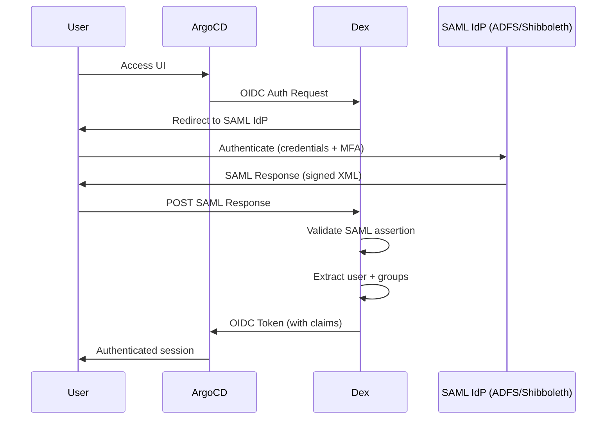

# How to Configure Dex Connector for SAML in ArgoCD

Author: [nawazdhandala](https://github.com/nawazdhandala)

Tags: ArgoCD, GitOps, Kubernetes, SAML, Dex

Description: Step-by-step guide to configuring the Dex SAML connector in ArgoCD for SSO with enterprise SAML identity providers like ADFS, Shibboleth, and PingFederate.

---

SAML (Security Assertion Markup Language) is still widely used in enterprise environments, particularly with identity providers like ADFS (Active Directory Federation Services), Shibboleth, PingFederate, and older on-premises identity systems. While OIDC is the more modern protocol, many organizations have existing SAML infrastructure that they need to integrate with ArgoCD.

ArgoCD supports SAML through its bundled Dex identity broker. This guide covers the complete configuration for connecting ArgoCD to SAML identity providers.

## How SAML Works with ArgoCD

SAML uses XML-based assertions to exchange authentication information. The flow through Dex looks like this:



Dex acts as a SAML Service Provider (SP) that translates SAML assertions into OIDC tokens for ArgoCD.

## Prerequisites

- ArgoCD v2.0+ with Dex enabled
- A SAML 2.0 identity provider (ADFS, Shibboleth, PingFederate, etc.)
- Admin access to the identity provider to create a relying party trust
- The IdP's SAML metadata XML or its metadata URL

## Step 1: Gather SAML IdP Information

You need the following from your SAML identity provider:

1. **SSO URL** - The URL where Dex sends SAML authentication requests
2. **Entity ID** - The identifier of the IdP
3. **Certificate** - The IdP's signing certificate (to verify SAML responses)

These are usually found in the IdP's metadata XML. If the IdP provides a metadata URL:

```bash
curl https://adfs.example.com/FederationMetadata/2007-06/FederationMetadata.xml > idp-metadata.xml
```

## Step 2: Configure the SAML IdP

### ADFS Configuration

In ADFS, create a Relying Party Trust:

1. Open the ADFS Management Console
2. Click **Add Relying Party Trust**
3. Select **Enter data about the relying party manually**
4. Configure:
   - **Display name**: `ArgoCD Dex`
   - **Profile**: SAML 2.0
   - **Certificate**: Skip (Dex does not sign requests by default)
   - **URL**: Enable SAML 2.0 WebSSO protocol
   - **Relying party SAML 2.0 SSO service URL**: `https://argocd.example.com/api/dex/callback`
   - **Relying party trust identifier**: `https://argocd.example.com/api/dex/callback`
5. Configure claim rules:
   - Add a rule to send LDAP attributes:
     - Email address as `email`
     - Display name as `name`
     - Token-Groups (Unqualified Names) as `groups`

### Generic SAML IdP Configuration

For other SAML identity providers, configure:

- **ACS (Assertion Consumer Service) URL**: `https://argocd.example.com/api/dex/callback`
- **Entity ID / Audience**: `https://argocd.example.com/api/dex/callback`
- **NameID format**: Email or Persistent
- **Attribute statements**:
  - `email` - User's email address
  - `name` - User's display name
  - `groups` - User's group memberships

## Step 3: Store the IdP Certificate

Create a Kubernetes Secret or ConfigMap with the IdP's signing certificate:

```bash
# Download the IdP certificate (extract from metadata or get from IdP admin)
kubectl -n argocd create configmap saml-idp-cert \
  --from-file=idp-ca.pem=/path/to/idp-certificate.pem
```

Mount it in the Dex container:

```bash
kubectl -n argocd patch deployment argocd-dex-server --type json -p '[
  {
    "op": "add",
    "path": "/spec/template/spec/volumes/-",
    "value": {
      "name": "saml-idp-cert",
      "configMap": {
        "name": "saml-idp-cert"
      }
    }
  },
  {
    "op": "add",
    "path": "/spec/template/spec/containers/0/volumeMounts/-",
    "value": {
      "name": "saml-idp-cert",
      "mountPath": "/etc/dex/saml",
      "readOnly": true
    }
  }
]'
```

## Step 4: Configure Dex SAML Connector

Edit the `argocd-cm` ConfigMap:

```yaml
apiVersion: v1
kind: ConfigMap
metadata:
  name: argocd-cm
  namespace: argocd
data:
  url: https://argocd.example.com
  dex.config: |
    connectors:
      - type: saml
        id: saml
        name: Corporate SSO
        config:
          # SAML IdP SSO URL
          ssoURL: https://adfs.example.com/adfs/ls/

          # Path to the IdP's signing certificate (inside Dex container)
          caData: /etc/dex/saml/idp-ca.pem
          # Or inline the certificate:
          # ca: |
          #   -----BEGIN CERTIFICATE-----
          #   MIIDpDCCAoy...
          #   -----END CERTIFICATE-----

          # Redirect URI (must match what's configured in the IdP)
          redirectURI: https://argocd.example.com/api/dex/callback

          # Entity ID (must match the IdP's relying party trust identifier)
          entityIssuer: https://argocd.example.com/api/dex/callback

          # SSO issuer (the IdP's entity ID)
          ssoIssuer: http://adfs.example.com/adfs/services/trust

          # Attribute mapping
          usernameAttr: name
          emailAttr: email
          groupsAttr: groups

          # NameID policy
          nameIDPolicyFormat: emailAddress

          # Allow unencrypted assertions (set based on your IdP's configuration)
          insecureSkipSignatureValidation: false
```

### Using Metadata URL Instead

If your IdP provides a metadata endpoint, you can reference it directly:

```yaml
          # Use metadata URL instead of manual configuration
          ssoURL: https://adfs.example.com/adfs/ls/
          caData: /etc/dex/saml/idp-ca.pem
          redirectURI: https://argocd.example.com/api/dex/callback
          entityIssuer: https://argocd.example.com/api/dex/callback
```

## Step 5: Configure RBAC

Map SAML groups to ArgoCD roles:

```yaml
apiVersion: v1
kind: ConfigMap
metadata:
  name: argocd-rbac-cm
  namespace: argocd
data:
  policy.default: role:readonly
  policy.csv: |
    # SAML group mappings
    g, ArgoCD-Admins, role:admin
    g, Platform-Engineers, role:admin

    p, role:developer, applications, get, */*, allow
    p, role:developer, applications, sync, staging/*, allow
    p, role:developer, applications, sync, dev/*, allow
    p, role:developer, logs, get, */*, allow
    g, Developers, role:developer

    g, QA-Engineers, role:readonly

  scopes: '[groups]'
```

## Step 6: Restart and Test

```bash
kubectl -n argocd rollout restart deployment argocd-server
kubectl -n argocd rollout restart deployment argocd-dex-server
```

Test the login:

1. Open `https://argocd.example.com`
2. Click **Login via Corporate SSO**
3. You should be redirected to your SAML IdP's login page
4. After authentication, you should be redirected back to ArgoCD

## ADFS-Specific Claim Rules

For ADFS, you need to configure issuance transform rules on the relying party trust. Here are common rules:

### Send Email

```
Rule name: Email
Rule type: Send LDAP Attributes as Claims
Attribute store: Active Directory
LDAP Attribute: E-Mail-Addresses
Outgoing Claim Type: E-Mail Address
```

### Send Name

```
Rule name: Name
Rule type: Send LDAP Attributes as Claims
Attribute store: Active Directory
LDAP Attribute: Display-Name
Outgoing Claim Type: Name
```

### Send Groups

```
Rule name: Groups
Rule type: Send LDAP Attributes as Claims
Attribute store: Active Directory
LDAP Attribute: Token-Groups - Unqualified Names
Outgoing Claim Type: Group
```

Make sure the outgoing claim names match what you configured in `groupsAttr`, `emailAttr`, and `usernameAttr` in the Dex configuration.

## Troubleshooting

### "SAML response validation failed"

The SAML response signature could not be verified. Check:
- The IdP certificate is correct and not expired
- The certificate path in the Dex container is correct
- The certificate format is PEM (Base64 encoded)

```bash
# Check the certificate
openssl x509 -in /path/to/idp-cert.pem -text -noout

# Check expiry
openssl x509 -in /path/to/idp-cert.pem -noout -dates
```

### "No email attribute found"

The SAML assertion does not contain the expected email attribute. Check:
- The attribute name in the IdP's claim rules matches `emailAttr` in Dex
- ADFS may send claims with different names (e.g., `http://schemas.xmlsoap.org/ws/2005/05/identity/claims/emailaddress`)

Try setting the full attribute name:

```yaml
          emailAttr: http://schemas.xmlsoap.org/ws/2005/05/identity/claims/emailaddress
          usernameAttr: http://schemas.xmlsoap.org/ws/2005/05/identity/claims/name
          groupsAttr: http://schemas.xmlsoap.org/claims/Group
```

### Groups Not Appearing

1. Check that the IdP sends group information in the SAML assertion
2. Verify the `groupsAttr` matches the claim name
3. Check Dex logs:
```bash
kubectl -n argocd logs deploy/argocd-dex-server | grep -i "saml\|group"
```

### Redirect Loop

If you get stuck in a redirect loop:
- Make sure the `entityIssuer` matches what the IdP expects
- Verify the `redirectURI` matches the ACS URL in the IdP
- Check that the `url` in `argocd-cm` does not have a trailing slash

### Clock Skew Issues

SAML assertions have time-based validity. If there is a clock difference between the IdP and the Dex server:
- Sync NTP on both servers
- Some Dex SAML configurations allow a `allowedClockSkew` parameter

## Security Considerations

1. **Always validate signatures** - Never set `insecureSkipSignatureValidation: true` in production
2. **Use HTTPS** - Both ArgoCD and the IdP should use HTTPS
3. **Rotate IdP certificates** - Plan for certificate rotation and update Dex when the IdP certificate changes
4. **Limit attribute release** - Only request the attributes you need from the IdP
5. **Monitor Dex logs** - Watch for authentication failures and suspicious activity

## Summary

The Dex SAML connector allows ArgoCD to integrate with enterprise SAML identity providers like ADFS, Shibboleth, and PingFederate. The setup involves creating a relying party trust in the IdP, configuring attribute claim rules, and pointing Dex to the IdP's SSO URL and certificate. While SAML configuration can be finicky due to the XML-based protocol, the result is a seamless SSO experience for users authenticating with their corporate credentials.

For more on Dex and ArgoCD, see [How to Implement ArgoCD SSO with Dex](https://oneuptime.com/blog/post/2026-02-02-argocd-sso-dex/view).
