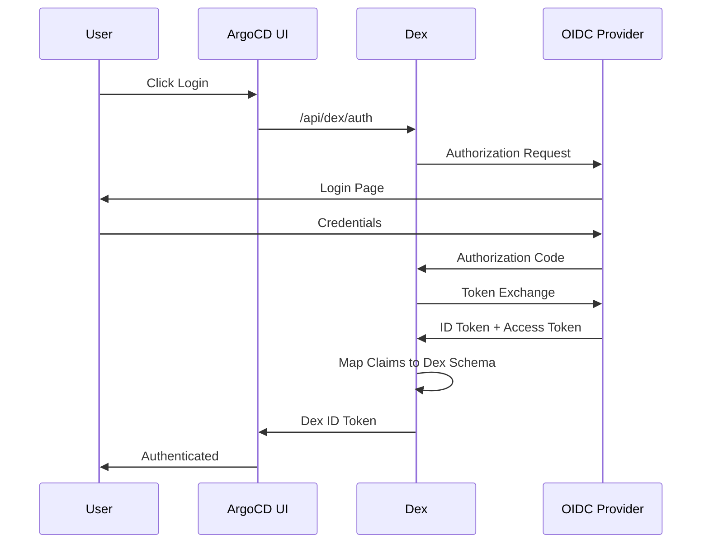

# How to Integrate ArgoCD with Dex OIDC

Author: [nawazdhandala](https://github.com/nawazdhandala)

Tags: ArgoCD, GitOps, Kubernetes, OIDC, Dex

Description: Learn how to configure ArgoCD's built-in Dex server with OpenID Connect providers for flexible authentication, including multi-provider setup, custom claims, and token management.

---

ArgoCD ships with Dex, an identity service that acts as a portal to other identity providers using OpenID Connect (OIDC). While ArgoCD can connect directly to OIDC providers, using Dex as an intermediary gives you the ability to federate multiple identity providers, normalize claims across providers, and handle authentication for both the web UI and CLI in a unified way.

This guide covers configuring Dex's OIDC connector in ArgoCD for various identity providers and use cases.

## Why Use Dex OIDC vs Direct OIDC

ArgoCD supports both direct OIDC configuration (via `oidc.config` in argocd-cm) and Dex-mediated OIDC. Here is when to use each:

**Use Dex OIDC when:**
- You need to connect multiple identity providers simultaneously
- You want to normalize group claims across different providers
- You need LDAP and OIDC authentication at the same time
- Your IdP has limitations that Dex can work around

**Use direct OIDC when:**
- You have a single identity provider
- You want minimal configuration
- You do not need claim transformation

## Dex OIDC Architecture



## Basic OIDC Configuration with Dex

Here is the fundamental configuration pattern:

```yaml
apiVersion: v1
kind: ConfigMap
metadata:
  name: argocd-cm
  namespace: argocd
data:
  url: https://argocd.example.com

  dex.config: |
    connectors:
    - type: oidc
      id: my-oidc-provider
      name: Corporate SSO
      config:
        issuer: https://sso.example.com
        clientID: argocd-dex-client
        clientSecret: $dex.oidc.clientSecret
        redirectURI: https://argocd.example.com/api/dex/callback

        # Request these scopes from the IdP
        scopes:
        - openid
        - profile
        - email
        - groups

        # Map IdP claims to Dex attributes
        userIDKey: sub
        userNameKey: preferred_username
        emailKey: email

        # If your IdP includes groups in the ID token
        insecureEnableGroups: true
        groupsKey: groups
```

Store the client secret in argocd-secret:

```bash
kubectl patch secret argocd-secret -n argocd \
  --type merge \
  -p '{"stringData": {"dex.oidc.clientSecret": "your-client-secret"}}'
```

## Keycloak Integration

Keycloak is a popular open-source identity provider. Configure it as a Dex OIDC connector:

### Step 1: Create Keycloak Client

In the Keycloak admin console:
1. Create a new client with Client ID `argocd-dex`
2. Set Access Type to `confidential`
3. Add Valid Redirect URI: `https://argocd.example.com/api/dex/callback`
4. Enable "Include Client Roles" in the token
5. Add a group membership mapper:
   - Mapper Type: Group Membership
   - Token Claim Name: groups
   - Full group path: OFF

### Step 2: Dex Configuration for Keycloak

```yaml
dex.config: |
  connectors:
  - type: oidc
    id: keycloak
    name: Keycloak
    config:
      issuer: https://keycloak.example.com/realms/your-realm
      clientID: argocd-dex
      clientSecret: $dex.oidc.clientSecret
      redirectURI: https://argocd.example.com/api/dex/callback
      scopes:
      - openid
      - profile
      - email
      - groups
      insecureEnableGroups: true
      groupsKey: groups
      userIDKey: sub
      userNameKey: preferred_username
```

## Google Workspace Integration

Google Workspace supports OIDC and can include group memberships with the admin SDK:

```yaml
dex.config: |
  connectors:
  - type: oidc
    id: google
    name: Google Workspace
    config:
      issuer: https://accounts.google.com
      clientID: your-client-id.apps.googleusercontent.com
      clientSecret: $dex.oidc.googleClientSecret
      redirectURI: https://argocd.example.com/api/dex/callback
      scopes:
      - openid
      - profile
      - email
      # Google does not include groups in OIDC tokens
      # Use the Google connector type instead for group support
      hostedDomains:
      - example.com
```

For Google Workspace groups, use the dedicated Google connector instead of generic OIDC:

```yaml
dex.config: |
  connectors:
  - type: google
    id: google
    name: Google Workspace
    config:
      clientID: your-client-id.apps.googleusercontent.com
      clientSecret: $dex.oidc.googleClientSecret
      redirectURI: https://argocd.example.com/api/dex/callback
      hostedDomains:
      - example.com
      # Service account for group lookups
      serviceAccountFilePath: /tmp/google-sa.json
      adminEmail: admin@example.com
      # Fetch groups from Google Workspace
      fetchTransitiveGroupMembership: true
```

## Multi-Provider Federation

One of Dex's best features is supporting multiple identity providers simultaneously:

```yaml
dex.config: |
  connectors:
  # Internal employees use Keycloak
  - type: oidc
    id: internal
    name: Internal SSO
    config:
      issuer: https://keycloak.internal.example.com/realms/corp
      clientID: argocd-internal
      clientSecret: $dex.oidc.internalSecret
      redirectURI: https://argocd.example.com/api/dex/callback
      scopes: [openid, profile, email, groups]
      insecureEnableGroups: true
      groupsKey: groups

  # Contractors use GitHub
  - type: github
    id: github
    name: GitHub (Contractors)
    config:
      clientID: github-client-id
      clientSecret: $dex.github.clientSecret
      redirectURI: https://argocd.example.com/api/dex/callback
      orgs:
      - name: your-org
        teams:
        - contractors

  # Partner companies use their own OIDC
  - type: oidc
    id: partner
    name: Partner SSO
    config:
      issuer: https://sso.partner-company.com
      clientID: argocd-partner
      clientSecret: $dex.oidc.partnerSecret
      redirectURI: https://argocd.example.com/api/dex/callback
      scopes: [openid, profile, email]
```

Users see a provider selection screen when logging in.

## Custom Claim Mapping

Some OIDC providers use non-standard claim names. Dex lets you map them:

```yaml
config:
  issuer: https://custom-idp.example.com
  clientID: argocd
  clientSecret: $dex.oidc.clientSecret
  redirectURI: https://argocd.example.com/api/dex/callback
  scopes:
  - openid
  - profile
  - email
  - custom_groups_scope

  # Map custom claim names to Dex standard attributes
  userIDKey: user_id          # Default: sub
  userNameKey: login_name     # Default: name
  emailKey: email_address     # Default: email
  groupsKey: team_memberships # Default: groups

  insecureEnableGroups: true

  # Override claim verification if needed
  insecureSkipEmailVerified: true
```

## RBAC Configuration

Map groups from your OIDC provider to ArgoCD roles:

```yaml
apiVersion: v1
kind: ConfigMap
metadata:
  name: argocd-rbac-cm
  namespace: argocd
data:
  policy.default: role:readonly
  scopes: '[groups, email]'

  policy.csv: |
    p, role:admin, *, *, */*, allow

    p, role:developer, applications, get, */*, allow
    p, role:developer, applications, list, */*, allow
    p, role:developer, applications, sync, */*, allow

    # Groups from internal Keycloak
    g, platform-engineering, role:admin
    g, app-developers, role:developer

    # GitHub teams (prefixed with org name)
    g, your-org:contractors, role:readonly

    # Partner groups
    g, partner-devops, role:developer
```

## Token Expiry and Refresh

Configure token lifetimes in Dex:

```yaml
dex.config: |
  # Token expiry settings
  expiry:
    # How long the ID token is valid
    idTokens: "24h"
    # How long signing keys are valid before rotation
    signingKeys: "6h"

  connectors:
  - type: oidc
    # ... connector config
```

## Troubleshooting

### Enable Debug Logging

```bash
kubectl patch configmap argocd-cmd-params-cm -n argocd \
  --type merge \
  -p '{"data": {"dexserver.log.level": "debug"}}'

kubectl rollout restart deployment argocd-dex-server -n argocd
kubectl logs -f deployment/argocd-dex-server -n argocd
```

### Verify OIDC Discovery

Check that Dex can reach your OIDC provider's discovery endpoint:

```bash
# From within the cluster
kubectl run curl --image=curlimages/curl --rm -it -- \
  curl -s https://sso.example.com/.well-known/openid-configuration | jq .
```

### Groups Not Appearing

1. Check that `insecureEnableGroups: true` is set
2. Verify the `groupsKey` matches your IdP's claim name
3. Check that the OIDC scope for groups is requested
4. Some IdPs only include groups in the access token, not the ID token - check your IdP configuration

Monitor authentication health with OneUptime to quickly detect when OIDC provider issues affect ArgoCD access.

## Conclusion

Dex's OIDC connector gives ArgoCD flexible, federated authentication that works with virtually any modern identity provider. The ability to run multiple connectors simultaneously makes it ideal for organizations that need to authenticate different user populations - internal employees, contractors, and partners - through different identity providers while maintaining unified RBAC policies. The configuration is straightforward once you understand the claim mapping between your IdP and Dex, and debug logging makes troubleshooting manageable.
