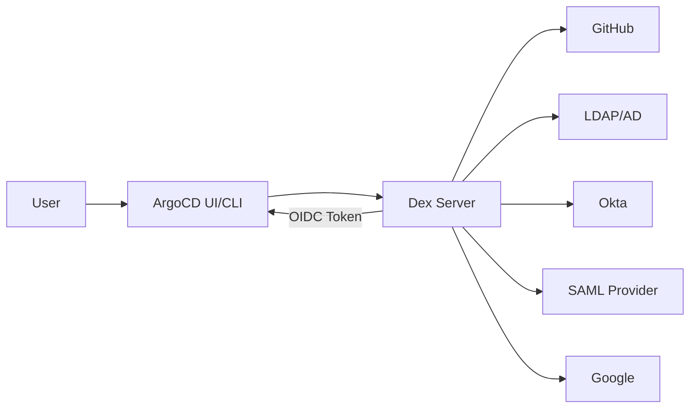
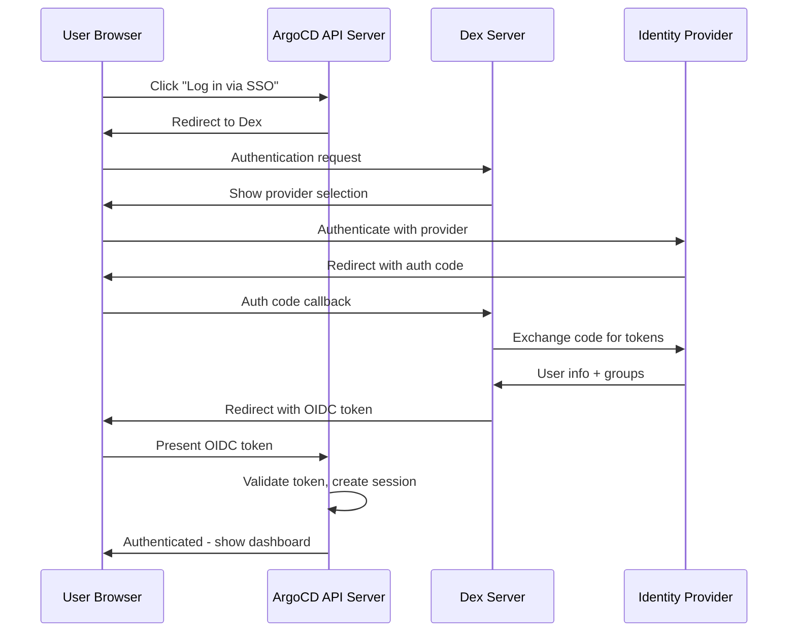

# How ArgoCD Dex Server Handles Authentication

Author: [nawazdhandala](https://github.com/nawazdhandala)

Tags: ArgoCD, GitOps, Kubernetes, Authentication, SSO

Description: A comprehensive guide to the ArgoCD Dex server explaining how it brokers authentication between identity providers and ArgoCD for single sign-on.

---

ArgoCD does not have a built-in user management system for enterprise authentication. Instead, it relies on Dex, an OpenID Connect (OIDC) identity broker, to handle single sign-on (SSO). Dex sits between ArgoCD and your identity provider - whether that is GitHub, GitLab, LDAP, SAML, Okta, Azure AD, or any other provider - and translates their authentication protocols into something ArgoCD understands.

This post explains how Dex works, how it integrates with ArgoCD, and how to configure it for common identity providers.

## What Is Dex?

Dex is an open-source OIDC identity service that acts as a "federation hub." It does not store users or passwords itself. Instead, it delegates authentication to upstream identity providers and issues its own OIDC tokens.

Think of Dex as a universal translator. Your identity provider speaks its own language (SAML, LDAP, OAuth2), and ArgoCD speaks OIDC. Dex translates between them.



## The Authentication Flow

When a user logs into ArgoCD through Dex, this is the complete flow:

1. User clicks "Log in via SSO" in the ArgoCD UI
2. ArgoCD redirects the user to the Dex login page
3. Dex shows the configured identity provider options
4. User selects their provider and authenticates (enters credentials at GitHub, Okta, etc.)
5. The identity provider redirects back to Dex with the user's identity
6. Dex creates an OIDC ID token containing the user's email and group memberships
7. Dex redirects back to ArgoCD with the token
8. ArgoCD validates the token and creates a session



## Dex Configuration in ArgoCD

Dex is configured through the `argocd-cm` ConfigMap. Here is the configuration structure:

```yaml
apiVersion: v1
kind: ConfigMap
metadata:
  name: argocd-cm
  namespace: argocd
data:
  # The external URL where ArgoCD is accessible
  url: https://argocd.example.com

  # Dex configuration
  dex.config: |
    connectors:
    - type: github
      id: github
      name: GitHub
      config:
        clientID: $dex.github.clientID
        clientSecret: $dex.github.clientSecret
        orgs:
        - name: my-organization
```

The `$dex.github.clientID` syntax references values stored in the `argocd-secret` Secret:

```yaml
apiVersion: v1
kind: Secret
metadata:
  name: argocd-secret
  namespace: argocd
stringData:
  dex.github.clientID: "your-github-oauth-app-id"
  dex.github.clientSecret: "your-github-oauth-app-secret"
```

## Configuring Common Identity Providers

### GitHub

GitHub is one of the most common providers. You need to create an OAuth App in your GitHub organization settings.

```yaml
dex.config: |
  connectors:
  - type: github
    id: github
    name: GitHub
    config:
      clientID: $dex.github.clientID
      clientSecret: $dex.github.clientSecret
      orgs:
      - name: my-organization
        # Optionally restrict to specific teams
        teams:
        - platform-team
        - developers
```

The GitHub connector maps GitHub teams to ArgoCD groups. A user in the `my-organization/platform-team` team will have the group `my-organization:platform-team` in their OIDC token.

### LDAP / Active Directory

For organizations using LDAP or Active Directory:

```yaml
dex.config: |
  connectors:
  - type: ldap
    id: ldap
    name: Corporate LDAP
    config:
      host: ldap.example.com:636
      insecureNoSSL: false
      insecureSkipVerify: false
      rootCAData: <base64-encoded-ca-cert>
      bindDN: cn=argocd-service,ou=services,dc=example,dc=com
      bindPW: $dex.ldap.bindPW
      userSearch:
        baseDN: ou=people,dc=example,dc=com
        filter: "(objectClass=person)"
        username: uid
        idAttr: uid
        emailAttr: mail
        nameAttr: cn
      groupSearch:
        baseDN: ou=groups,dc=example,dc=com
        filter: "(objectClass=groupOfNames)"
        userMatchers:
        - userAttr: DN
          groupAttr: member
        nameAttr: cn
```

The LDAP connector searches for users and their group memberships. Groups found in LDAP are passed through as ArgoCD groups in the OIDC token.

### Okta

For Okta, you can use either the OIDC connector or the SAML connector:

```yaml
dex.config: |
  connectors:
  - type: oidc
    id: okta
    name: Okta
    config:
      issuer: https://my-company.okta.com
      clientID: $dex.okta.clientID
      clientSecret: $dex.okta.clientSecret
      redirectURI: https://argocd.example.com/api/dex/callback
      scopes:
      - openid
      - profile
      - email
      - groups
      insecureEnableGroups: true
```

### Azure AD (Microsoft Entra ID)

```yaml
dex.config: |
  connectors:
  - type: microsoft
    id: azure-ad
    name: Azure AD
    config:
      clientID: $dex.azure.clientID
      clientSecret: $dex.azure.clientSecret
      redirectURI: https://argocd.example.com/api/dex/callback
      tenant: your-tenant-id
      groups:
      - ArgoCD-Admins
      - ArgoCD-Developers
```

## Mapping Identity Provider Groups to RBAC

The real power of Dex comes from connecting identity provider groups to ArgoCD RBAC policies. When Dex includes group information in the OIDC token, ArgoCD can use those groups in its RBAC rules.

```yaml
# argocd-rbac-cm ConfigMap
apiVersion: v1
kind: ConfigMap
metadata:
  name: argocd-rbac-cm
  namespace: argocd
data:
  policy.csv: |
    # GitHub team 'my-organization:platform-team' gets admin access
    g, my-organization:platform-team, role:admin

    # GitHub team 'my-organization:developers' gets read-only + sync
    p, role:developer, applications, get, */*, allow
    p, role:developer, applications, sync, */*, allow
    g, my-organization:developers, role:developer

    # LDAP group 'devops' gets admin access
    g, devops, role:admin
```

For more details on RBAC, see [how to configure RBAC policies in ArgoCD](https://oneuptime.com/blog/post/2026-01-25-rbac-policies-argocd/view).

## Dex Deployment Details

Dex runs as a separate Deployment in the ArgoCD namespace:

```bash
# Check Dex deployment
kubectl get deployment argocd-dex-server -n argocd

# View Dex logs for authentication debugging
kubectl logs -l app.kubernetes.io/name=argocd-dex-server -n argocd

# Dex exposes port 5556 (HTTP) and 5557 (gRPC)
kubectl get svc argocd-dex-server -n argocd
```

Dex stores its state (tokens, refresh tokens, authentication codes) in Kubernetes custom resources by default. This means it does not need an external database.

## Troubleshooting Authentication

**Problem: "Failed to authenticate: invalid session" after login**

Check that the ArgoCD URL in `argocd-cm` matches the URL users access. Dex's redirect URIs must match exactly.

```bash
# Verify the URL configuration
kubectl get configmap argocd-cm -n argocd -o jsonpath='{.data.url}'
```

**Problem: Groups not appearing in ArgoCD**

Not all identity providers include groups by default. Check these things:

1. Verify the connector configuration includes group scopes
2. Check Dex logs for the claims received from the identity provider
3. Some providers require explicit configuration to include groups in tokens

```bash
# Check what claims Dex received
kubectl logs -l app.kubernetes.io/name=argocd-dex-server -n argocd | grep -i "groups"
```

**Problem: "connector not found" error**

The connector ID in the Dex configuration must be unique and valid. Check for typos in the `argocd-cm` ConfigMap.

**Problem: Dex pod keeps restarting**

Usually a configuration error. Check the Dex logs for parsing errors in the configuration:

```bash
kubectl logs -l app.kubernetes.io/name=argocd-dex-server -n argocd --previous
```

## When to Use Dex vs Direct OIDC

ArgoCD also supports direct OIDC without Dex. Use direct OIDC when:

- Your identity provider already speaks OIDC natively (Okta, Auth0, Azure AD)
- You do not need to aggregate multiple identity providers
- You want fewer moving parts

Use Dex when:

- Your identity provider uses SAML or LDAP (not OIDC)
- You want to support multiple identity providers simultaneously
- You need GitHub or GitLab team-based authentication

Direct OIDC configuration goes in `argocd-cm`:

```yaml
apiVersion: v1
kind: ConfigMap
metadata:
  name: argocd-cm
  namespace: argocd
data:
  url: https://argocd.example.com
  oidc.config: |
    name: Okta
    issuer: https://my-company.okta.com
    clientID: $oidc.okta.clientID
    clientSecret: $oidc.okta.clientSecret
    requestedScopes:
    - openid
    - profile
    - email
    - groups
```

For a complete SSO setup guide, see [how to configure SSO with OIDC in ArgoCD](https://oneuptime.com/blog/post/2026-01-25-sso-oidc-argocd/view).

## The Bottom Line

Dex is ArgoCD's authentication adapter. It takes the complexity of different identity provider protocols and presents a unified OIDC interface to ArgoCD. For most organizations, configuring Dex with your existing identity provider is straightforward and gives you SSO with group-based RBAC out of the box. The key is getting the connector configuration right and ensuring group claims flow through from your identity provider to ArgoCD's RBAC policies.
