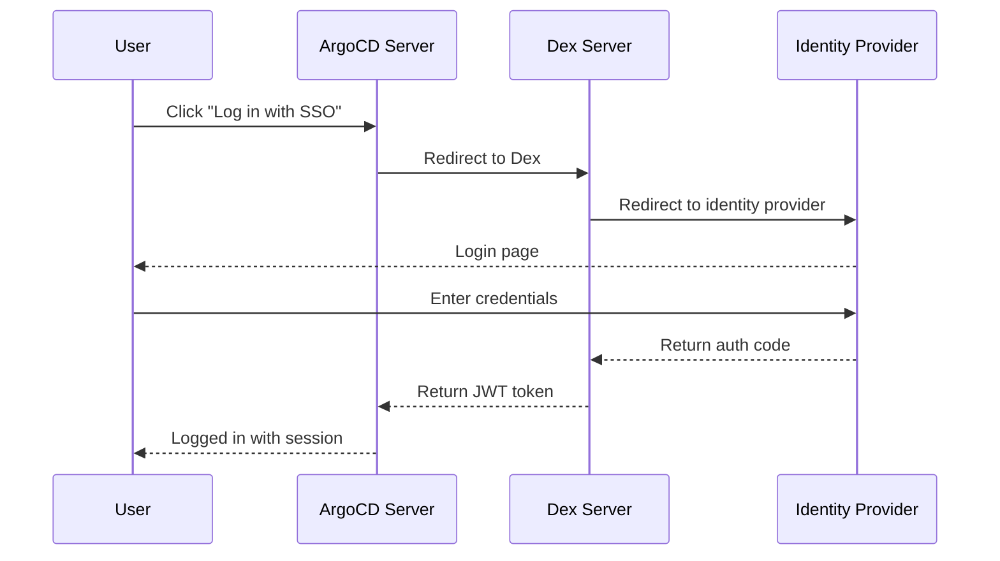

# How to Configure argocd-dex Server Options

Author: [nawazdhandala](https://github.com/nawazdhandala)

Tags: ArgoCD, GitOps, Kubernetes, Dex, SSO Authentication

Description: Learn how to configure the ArgoCD Dex server for SSO authentication with OIDC, LDAP, SAML, and GitHub/GitLab connectors including all key options.

---

Dex is the identity service that ArgoCD uses for Single Sign-On (SSO). When you log in to ArgoCD through your company's identity provider - whether that is Okta, Azure AD, Google Workspace, GitHub, GitLab, or LDAP - Dex handles the authentication flow. The argocd-dex-server component runs Dex as a sidecar service alongside ArgoCD, and its configuration determines how your users authenticate.

This guide covers the Dex server configuration options, how to set up common identity providers, and how to troubleshoot authentication issues.

## How Dex Works with ArgoCD

Dex acts as a bridge between ArgoCD and your identity provider. Instead of ArgoCD implementing every authentication protocol directly, it delegates to Dex, which supports OIDC, LDAP, SAML, and many specific provider connectors.



## Dex Server Command-Line Options

The argocd-dex-server has its own set of command-line options, separate from Dex's configuration file.

### Basic Options

```yaml
apiVersion: apps/v1
kind: Deployment
metadata:
  name: argocd-dex-server
  namespace: argocd
spec:
  template:
    spec:
      containers:
        - name: dex
          command:
            - /shared/argocd-dex
            - rundex
          # Additional environment variables
          env:
            - name: ARGOCD_DEX_SERVER_DISABLE_TLS
              value: "true"
            - name: ARGOCD_DEX_SERVER_LOGFORMAT
              value: "json"
            - name: ARGOCD_DEX_SERVER_LOGLEVEL
              value: "info"
```

### --loglevel

Controls Dex log verbosity. Particularly useful for debugging authentication issues.

```yaml
env:
  - name: ARGOCD_DEX_SERVER_LOGLEVEL
    value: "debug"
```

### --logformat

Choose between text and JSON format.

```yaml
env:
  - name: ARGOCD_DEX_SERVER_LOGFORMAT
    value: "json"
```

## Dex Configuration in argocd-cm

The main Dex configuration lives in the `argocd-cm` ConfigMap under the `dex.config` key. This is where you define connectors, static clients, and other Dex settings.

### Basic Structure

```yaml
apiVersion: v1
kind: ConfigMap
metadata:
  name: argocd-cm
  namespace: argocd
data:
  url: https://argocd.example.com
  dex.config: |
    connectors:
      - type: <connector-type>
        id: <connector-id>
        name: <display-name>
        config:
          <connector-specific-config>
```

## Configuring Common Identity Providers

### GitHub Connector

```yaml
data:
  dex.config: |
    connectors:
      - type: github
        id: github
        name: GitHub
        config:
          clientID: $dex.github.clientID
          clientSecret: $dex.github.clientSecret
          orgs:
            - name: my-org
              teams:
                - platform-team
                - developers
```

The `$dex.github.clientID` syntax references values from the `argocd-secret`.

```bash
# Store GitHub OAuth credentials
kubectl -n argocd patch secret argocd-secret --type merge -p '{
  "stringData": {
    "dex.github.clientID": "your-github-client-id",
    "dex.github.clientSecret": "your-github-client-secret"
  }
}'
```

### GitLab Connector

```yaml
data:
  dex.config: |
    connectors:
      - type: gitlab
        id: gitlab
        name: GitLab
        config:
          baseURL: https://gitlab.example.com
          clientID: $dex.gitlab.clientID
          clientSecret: $dex.gitlab.clientSecret
          groups:
            - my-org/platform-team
```

### OIDC Connector (Okta, Auth0, Keycloak)

```yaml
data:
  dex.config: |
    connectors:
      - type: oidc
        id: okta
        name: Okta
        config:
          issuer: https://my-company.okta.com
          clientID: $dex.okta.clientID
          clientSecret: $dex.okta.clientSecret
          insecureEnableGroups: true
          scopes:
            - openid
            - profile
            - email
            - groups
```

### Azure AD (Microsoft Entra ID)

```yaml
data:
  dex.config: |
    connectors:
      - type: microsoft
        id: azure-ad
        name: Azure AD
        config:
          clientID: $dex.azure.clientID
          clientSecret: $dex.azure.clientSecret
          tenant: your-tenant-id
          groups:
            - ArgoCD-Admins
            - ArgoCD-Developers
          # Include nested group memberships
          includeAllGroups: false
```

### LDAP Connector

```yaml
data:
  dex.config: |
    connectors:
      - type: ldap
        id: ldap
        name: LDAP
        config:
          host: ldap.example.com:636
          insecureNoSSL: false
          insecureSkipVerify: false
          rootCA: /etc/dex/ldap-ca.crt
          bindDN: cn=argocd,ou=service-accounts,dc=example,dc=com
          bindPW: $dex.ldap.bindPW
          usernamePrompt: Username
          userSearch:
            baseDN: ou=users,dc=example,dc=com
            filter: "(objectClass=person)"
            username: uid
            idAttr: uid
            emailAttr: mail
            nameAttr: displayName
          groupSearch:
            baseDN: ou=groups,dc=example,dc=com
            filter: "(objectClass=groupOfNames)"
            userMatchers:
              - userAttr: DN
                groupAttr: member
            nameAttr: cn
```

### SAML Connector

```yaml
data:
  dex.config: |
    connectors:
      - type: saml
        id: saml
        name: SAML SSO
        config:
          ssoURL: https://idp.example.com/sso/saml
          caData: <base64-encoded-ca-cert>
          redirectURI: https://argocd.example.com/api/dex/callback
          usernameAttr: name
          emailAttr: email
          groupsAttr: groups
```

## Multiple Connectors

You can configure multiple connectors so users can choose how to log in.

```yaml
data:
  dex.config: |
    connectors:
      - type: github
        id: github
        name: GitHub
        config:
          clientID: $dex.github.clientID
          clientSecret: $dex.github.clientSecret
          orgs:
            - name: my-org
      - type: oidc
        id: okta
        name: Okta SSO
        config:
          issuer: https://my-company.okta.com
          clientID: $dex.okta.clientID
          clientSecret: $dex.okta.clientSecret
      - type: ldap
        id: ldap
        name: LDAP
        config:
          host: ldap.example.com:636
          # ... ldap config
```

## RBAC Integration with Groups

After configuring Dex, map identity provider groups to ArgoCD roles.

```yaml
# argocd-rbac-cm ConfigMap
apiVersion: v1
kind: ConfigMap
metadata:
  name: argocd-rbac-cm
  namespace: argocd
data:
  policy.csv: |
    # Map GitHub team to admin role
    g, my-org:platform-team, role:admin

    # Map Okta group to readonly role
    g, ArgoCD-Developers, role:readonly

    # Map LDAP group to custom role
    p, role:deployer, applications, sync, */*, allow
    p, role:deployer, applications, get, */*, allow
    g, deploy-team, role:deployer
  policy.default: role:readonly
```

## Dex Server Resource Configuration

```yaml
containers:
  - name: dex
    resources:
      requests:
        cpu: 10m
        memory: 64Mi
      limits:
        cpu: 100m
        memory: 128Mi
```

Dex is lightweight and does not need many resources. It is primarily doing HTTP redirects and token validation.

## Dex Storage

By default, Dex uses Kubernetes custom resources for storage. This is configured automatically by ArgoCD.

```yaml
# This is auto-generated, but you can override it
data:
  dex.config: |
    storage:
      type: kubernetes
      config:
        inCluster: true
```

## Troubleshooting Dex

### Check Dex Logs

Most authentication issues are visible in the Dex server logs.

```bash
# View Dex server logs
kubectl logs -n argocd deployment/argocd-dex-server

# With debug logging for more detail
kubectl logs -n argocd deployment/argocd-dex-server | grep -i "error\|failed\|warning"
```

### Common Issues

#### Callback URL Mismatch

The callback URL in your identity provider must match exactly.

```text
https://argocd.example.com/api/dex/callback
```

#### Groups Not Appearing

If groups are not mapped to RBAC roles, check that:
1. The connector is configured to request groups scope
2. The identity provider is sending group claims
3. The group names in RBAC match exactly

```bash
# Check what claims Dex receives (enable debug logging)
kubectl logs -n argocd deployment/argocd-dex-server | grep "groups"
```

#### Token Expired

If users get logged out too quickly, increase the token lifetime in the ArgoCD ConfigMap.

```yaml
data:
  # Session timeout (default is 24 hours)
  timeout.session: "24h"
  # Reconciliation timeout
  timeout.reconciliation: "180s"
```

#### Dex Not Starting

If Dex fails to start, it is usually a configuration error. Check the ConfigMap.

```bash
# Validate the dex config
kubectl get configmap argocd-cm -n argocd -o yaml | grep -A 100 "dex.config"
```

### Testing the Dex Connection

```bash
# Check if Dex is healthy
kubectl exec -n argocd deployment/argocd-server -- \
  curl -s http://argocd-dex-server:5556/dex/.well-known/openid-configuration | jq .
```

## Bypassing Dex for Direct OIDC

If you prefer to connect ArgoCD directly to your OIDC provider without Dex, you can configure it in `argocd-cm`.

```yaml
data:
  oidc.config: |
    name: Okta
    issuer: https://my-company.okta.com
    clientID: <your-client-id>
    clientSecret: $oidc.okta.clientSecret
    requestedScopes:
      - openid
      - profile
      - email
      - groups
```

This approach is simpler but only supports OIDC. Dex supports a wider range of protocols.

## Conclusion

The argocd-dex-server is what makes ArgoCD's SSO work. The configuration is primarily done through the `dex.config` key in the `argocd-cm` ConfigMap, where you define connectors for your identity providers. The most commonly used connectors are OIDC (for Okta, Keycloak, Auth0), GitHub, GitLab, Azure AD, and LDAP. The key to successful Dex configuration is getting the callback URL right, ensuring group scopes are requested, and mapping groups to ArgoCD RBAC roles. When something goes wrong, debug logging in Dex usually reveals the problem quickly.
