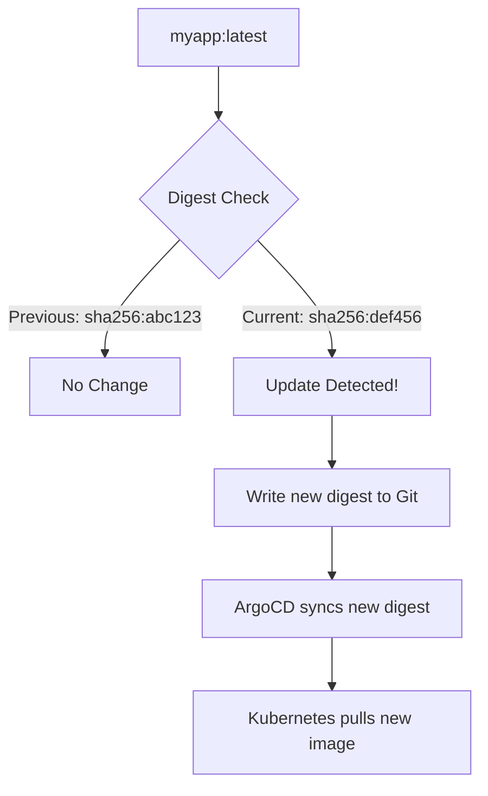

# How to Use Digest Strategy for Image Updates

Author: [nawazdhandala](https://github.com/nawazdhandala)

Tags: ArgoCD, GitOps, Kubernetes, Image Updater, Container Image

Description: Learn how to use the digest update strategy in ArgoCD Image Updater to track mutable tags like latest and detect when the underlying image content changes by monitoring SHA256 digests.

---

The digest strategy in ArgoCD Image Updater solves a specific problem: tracking mutable tags. A mutable tag like `latest` or `stable` can point to different image contents over time without the tag name changing. The digest strategy detects when the actual image behind a tag changes by comparing SHA256 digests, and then updates your deployment to pin to the new digest.

## Understanding the Problem

Consider this scenario. Your deployment uses the image `myapp:latest`. The CI pipeline builds a new image and pushes it with the `latest` tag. Kubernetes does not redeploy because the image reference in the manifest has not changed - it still says `myapp:latest`. Even with `imagePullPolicy: Always`, you lose the GitOps guarantee of knowing exactly what is running.

The digest strategy fixes this by converting mutable tags to immutable digest references.



## How the Digest Strategy Works

1. Image Updater monitors a specific tag (e.g., `latest`)
2. It periodically checks the registry for the current digest of that tag
3. When the digest changes (meaning a new image was pushed with the same tag), Image Updater updates the deployment
4. The deployment is updated to reference the image by its digest: `myapp@sha256:abc123...`

## Basic Configuration

```yaml
apiVersion: argoproj.io/v1alpha1
kind: Application
metadata:
  name: myapp
  namespace: argocd
  annotations:
    # Track the 'latest' tag and detect digest changes
    argocd-image-updater.argoproj.io/image-list: myapp=myregistry.com/myapp:latest
    argocd-image-updater.argoproj.io/myapp.update-strategy: digest
spec:
  project: default
  source:
    repoURL: https://github.com/my-org/k8s-manifests.git
    targetRevision: main
    path: apps/myapp
  destination:
    server: https://kubernetes.default.svc
    namespace: production
  syncPolicy:
    automated:
      prune: true
      selfHeal: true
```

Note the key difference from other strategies: you specify the tag directly in the image reference (`myapp:latest`), not as a constraint.

## Tracking Different Tags

### Track the "stable" Tag

```yaml
annotations:
  argocd-image-updater.argoproj.io/image-list: myapp=myregistry.com/myapp:stable
  argocd-image-updater.argoproj.io/myapp.update-strategy: digest
```

### Track a Branch Tag

```yaml
annotations:
  argocd-image-updater.argoproj.io/image-list: myapp=myregistry.com/myapp:main
  argocd-image-updater.argoproj.io/myapp.update-strategy: digest
```

### Track Multiple Tags for Different Images

```yaml
annotations:
  argocd-image-updater.argoproj.io/image-list: |
    frontend=myregistry.com/frontend:latest,
    backend=myregistry.com/backend:stable
  argocd-image-updater.argoproj.io/frontend.update-strategy: digest
  argocd-image-updater.argoproj.io/backend.update-strategy: digest
```

## What Gets Written to Git

When Image Updater detects a digest change, it writes the full digest reference to your manifests.

### Before Update (Kustomize)

```yaml
# kustomization.yaml
images:
  - name: myregistry.com/myapp
    newTag: "latest"
```

### After Update (Kustomize)

```yaml
# kustomization.yaml
images:
  - name: myregistry.com/myapp
    digest: "sha256:a3ed95caeb02ffe68cdd9fd84406680ae93d633cb16422d00e8a7c22955b46d4"
```

### Helm Values Write-Back

```yaml
annotations:
  argocd-image-updater.argoproj.io/write-back-method: git
  argocd-image-updater.argoproj.io/write-back-target: "helmvalues:values.yaml"
  argocd-image-updater.argoproj.io/myapp.helm.image-name: image.repository
  argocd-image-updater.argoproj.io/myapp.helm.image-tag: image.digest
```

The values file will be updated:

```yaml
image:
  repository: myregistry.com/myapp
  digest: "sha256:a3ed95caeb02ffe68cdd9fd84406680ae93d633cb16422d00e8a7c22955b46d4"
```

## Use Cases for the Digest Strategy

### Tracking Third-Party Images

When you depend on third-party images that use mutable tags:

```yaml
annotations:
  # Track nginx:1.25 and detect when it gets security patches
  argocd-image-updater.argoproj.io/image-list: nginx=docker.io/library/nginx:1.25
  argocd-image-updater.argoproj.io/nginx.update-strategy: digest
```

This is useful because projects like Nginx regularly update the `1.25` tag with security patches without changing the tag itself.

### Internal "Latest" Workflow

For teams that push to a `latest` tag from their main branch:

```yaml
annotations:
  argocd-image-updater.argoproj.io/image-list: myapp=myregistry.com/myapp:latest
  argocd-image-updater.argoproj.io/myapp.update-strategy: digest
  argocd-image-updater.argoproj.io/write-back-method: git
  argocd-image-updater.argoproj.io/git-branch: main
  argocd-image-updater.argoproj.io/write-back-target: kustomization
```

### Staging Environment with Mutable Tags

```yaml
annotations:
  argocd-image-updater.argoproj.io/image-list: myapp=myregistry.com/myapp:staging
  argocd-image-updater.argoproj.io/myapp.update-strategy: digest
```

## Digest Strategy vs Other Strategies

| Feature | Digest | Latest | Semver |
|---------|--------|--------|--------|
| Tracks a single tag | Yes | No (scans all tags) | No (scans all tags) |
| Detects content changes | Yes | No (uses timestamps) | No (uses version numbers) |
| Works with mutable tags | Yes | Partially | No |
| Output format | `image@sha256:...` | `image:tag` | `image:tag` |
| Immutable references | Yes | No | No |
| Supports multi-arch | Yes | Yes | Yes |

## Platform-Specific Digest Tracking

For multi-architecture images, specify the platform:

```yaml
annotations:
  argocd-image-updater.argoproj.io/image-list: myapp=myregistry.com/myapp:latest
  argocd-image-updater.argoproj.io/myapp.update-strategy: digest
  argocd-image-updater.argoproj.io/myapp.platforms: "linux/amd64"
```

This ensures Image Updater tracks the digest for the correct architecture.

## Security Benefits

Using digest references provides stronger security guarantees:

1. **Immutability** - Once deployed, you know exactly what binary is running. A tag can be moved, but a digest cannot.

2. **Supply chain security** - Digest references prevent tag-swapping attacks where an attacker pushes a malicious image with the same tag.

3. **Reproducibility** - You can always redeploy the exact same image by referencing its digest.

4. **Audit trail** - Git history shows the exact digest that was deployed at each point in time.

## Complete Working Example

```yaml
apiVersion: argoproj.io/v1alpha1
kind: Application
metadata:
  name: webapp-staging
  namespace: argocd
  annotations:
    # Track the staging tag
    argocd-image-updater.argoproj.io/image-list: webapp=myregistry.com/webapp:staging
    argocd-image-updater.argoproj.io/webapp.update-strategy: digest
    # Write digest to Git
    argocd-image-updater.argoproj.io/write-back-method: git
    argocd-image-updater.argoproj.io/git-branch: main
    argocd-image-updater.argoproj.io/write-back-target: kustomization
spec:
  project: default
  source:
    repoURL: https://github.com/my-org/k8s-manifests.git
    targetRevision: main
    path: overlays/staging
  destination:
    server: https://kubernetes.default.svc
    namespace: staging
  syncPolicy:
    automated:
      prune: true
      selfHeal: true
```

## Troubleshooting

**Digest not updating** - Check that the tag actually changed in the registry:

```bash
# Get the current digest for a tag
crane digest myregistry.com/myapp:latest

# Compare with what Image Updater has
kubectl logs -n argocd deployment/argocd-image-updater --tail=100 | grep "digest"
```

**Image pull errors with digest** - Some older registries may not support pulling by digest. Verify:

```bash
# Test pulling by digest
docker pull myregistry.com/myapp@sha256:abc123...
```

**Frequent unnecessary updates** - If multi-arch images have different digests per platform, make sure you set the `platforms` annotation to avoid flip-flopping.

**ArgoCD shows OutOfSync after digest update** - Make sure the deployment manifest in your cluster supports digest references. The image field should accept the `@sha256:` format.

For monitoring digest changes, use [ArgoCD notifications](https://oneuptime.com/blog/post/2026-01-25-notifications-argocd/view) to get alerts when new digests are detected and deployed.

The digest strategy is the right choice when you work with mutable tags and want the strongest possible guarantee about what is actually running in your cluster. It provides immutable, verifiable references while still supporting the convenience of mutable tag workflows.
