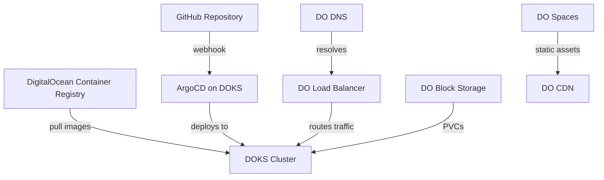

# How to Use ArgoCD with DigitalOcean Kubernetes

Author: [nawazdhandala](https://github.com/nawazdhandala)

Tags: ArgoCD, GitOps, Kubernetes, DigitalOcean, Cloud

Description: Learn how to set up and use ArgoCD on DigitalOcean Kubernetes (DOKS) with best practices for ingress, storage, and container registry integration.

---

DigitalOcean Kubernetes (DOKS) is one of the most approachable managed Kubernetes services available. It is affordable, easy to set up, and works great for small to mid-sized teams. Combining DOKS with ArgoCD gives you a production-ready GitOps pipeline without the complexity (or cost) of larger cloud providers.

This guide walks through deploying ArgoCD on DOKS, connecting it to DigitalOcean Container Registry (DOCR), setting up ingress with a DigitalOcean load balancer, and common configurations specific to the DigitalOcean ecosystem.

## Prerequisites

Before starting, make sure you have:

- A DigitalOcean account
- A DOKS cluster created (at least 2 nodes, 2 vCPU / 4GB RAM each)
- `doctl` CLI installed and authenticated
- `kubectl` configured to talk to your DOKS cluster
- A domain name configured in DigitalOcean DNS (optional but recommended)

## Step 1: Connect to Your DOKS Cluster

```bash
# Authenticate doctl
doctl auth init

# Save kubeconfig for your cluster
doctl kubernetes cluster kubeconfig save my-cluster

# Verify connection
kubectl get nodes
```

## Step 2: Install ArgoCD on DOKS

The standard ArgoCD installation works perfectly on DOKS.

```bash
# Create the argocd namespace
kubectl create namespace argocd

# Install ArgoCD using the official manifests
kubectl apply -n argocd -f https://raw.githubusercontent.com/argoproj/argo-cd/stable/manifests/install.yaml

# Wait for all pods to be ready
kubectl wait --for=condition=Ready pod --all -n argocd --timeout=300s
```

Retrieve the initial admin password.

```bash
# Get the initial admin password
kubectl -n argocd get secret argocd-initial-admin-secret \
  -o jsonpath="{.data.password}" | base64 -d
```

## Step 3: Expose ArgoCD with DigitalOcean Load Balancer

DOKS integrates natively with DigitalOcean load balancers. The simplest way to expose ArgoCD is to change the service type.

```bash
# Patch the ArgoCD server service to use LoadBalancer
kubectl patch svc argocd-server -n argocd -p '{"spec": {"type": "LoadBalancer"}}'
```

However, for production you will want to use an ingress controller. Install Nginx Ingress with DigitalOcean annotations.

```yaml
# nginx-ingress-app.yaml
apiVersion: argoproj.io/v1alpha1
kind: Application
metadata:
  name: nginx-ingress
  namespace: argocd
spec:
  project: default
  source:
    repoURL: https://kubernetes.github.io/ingress-nginx
    chart: ingress-nginx
    targetRevision: 4.x
    helm:
      values: |
        controller:
          service:
            annotations:
              # DigitalOcean-specific annotations
              service.beta.kubernetes.io/do-loadbalancer-name: "my-lb"
              service.beta.kubernetes.io/do-loadbalancer-protocol: "https"
              service.beta.kubernetes.io/do-loadbalancer-certificate-id: "<YOUR_CERT_ID>"
              service.beta.kubernetes.io/do-loadbalancer-redirect-http-to-https: "true"
              service.beta.kubernetes.io/do-loadbalancer-size-slug: "lb-small"
  destination:
    server: https://kubernetes.default.svc
    namespace: ingress-nginx
  syncPolicy:
    automated:
      prune: true
      selfHeal: true
    syncOptions:
      - CreateNamespace=true
```

Then create an ingress for ArgoCD.

```yaml
# argocd-ingress.yaml
apiVersion: networking.k8s.io/v1
kind: Ingress
metadata:
  name: argocd-server-ingress
  namespace: argocd
  annotations:
    nginx.ingress.kubernetes.io/ssl-passthrough: "true"
    nginx.ingress.kubernetes.io/backend-protocol: "HTTPS"
spec:
  ingressClassName: nginx
  rules:
    - host: argocd.example.com
      http:
        paths:
          - path: /
            pathType: Prefix
            backend:
              service:
                name: argocd-server
                port:
                  number: 443
```

## Step 4: Configure DigitalOcean Container Registry

DOKS has native integration with DigitalOcean Container Registry. First, create a registry and integrate it with your cluster.

```bash
# Create a container registry (if not already done)
doctl registry create my-registry

# Integrate the registry with your DOKS cluster
doctl registry kubernetes-manifest | kubectl apply -f -

# Alternatively, integrate directly
doctl kubernetes cluster registry add my-cluster
```

This automatically creates image pull secrets in all namespaces. For ArgoCD to pull Helm charts from DOCR (if you store them there), add a repository configuration.

```yaml
# docr-repo-secret.yaml
apiVersion: v1
kind: Secret
metadata:
  name: docr-repo
  namespace: argocd
  labels:
    argocd.argoproj.io/secret-type: repository
stringData:
  type: helm
  name: docr
  enableOCI: "true"
  url: registry.digitalocean.com/my-registry
  username: "<DOCR_TOKEN>"
  password: "<DOCR_TOKEN>"
```

You can generate a DOCR token with the API.

```bash
# Generate a read-only registry token
doctl registry docker-config
```

## Step 5: Configure DigitalOcean Volumes for Persistent Storage

If any of your ArgoCD-managed applications need persistent storage, DOKS provides a CSI driver for DigitalOcean Block Storage that is pre-installed.

```yaml
# Example PVC that ArgoCD would deploy
apiVersion: v1
kind: PersistentVolumeClaim
metadata:
  name: app-data
spec:
  accessModes:
    - ReadWriteOnce
  storageClassName: do-block-storage
  resources:
    requests:
      storage: 10Gi
```

## Step 6: Set Up DNS with DigitalOcean

If your domain is managed by DigitalOcean DNS, you can use ExternalDNS to automatically create DNS records for your ArgoCD-managed services.

```yaml
# external-dns-app.yaml
apiVersion: argoproj.io/v1alpha1
kind: Application
metadata:
  name: external-dns
  namespace: argocd
spec:
  project: default
  source:
    repoURL: https://kubernetes-sigs.github.io/external-dns
    chart: external-dns
    targetRevision: 1.x
    helm:
      values: |
        provider: digitalocean
        env:
          - name: DO_TOKEN
            valueFrom:
              secretKeyRef:
                name: digitalocean-token
                key: token
        domainFilters:
          - example.com
  destination:
    server: https://kubernetes.default.svc
    namespace: external-dns
  syncPolicy:
    automated:
      prune: true
      selfHeal: true
    syncOptions:
      - CreateNamespace=true
```

## Sample Full Application Deployment

Here is a complete example of deploying an application on DOKS with ArgoCD, using the DigitalOcean ecosystem.

```yaml
# my-web-app.yaml
apiVersion: argoproj.io/v1alpha1
kind: Application
metadata:
  name: my-web-app
  namespace: argocd
spec:
  project: default
  source:
    repoURL: https://github.com/my-org/my-web-app
    targetRevision: main
    path: k8s/overlays/production
  destination:
    server: https://kubernetes.default.svc
    namespace: production
  syncPolicy:
    automated:
      prune: true
      selfHeal: true
    syncOptions:
      - CreateNamespace=true
```

## Architecture on DigitalOcean



## DOKS-Specific Tips

### Node Pool Sizing

ArgoCD itself is not resource-heavy, but the controller can use significant memory when managing hundreds of applications. For a dedicated ArgoCD node pool:

```bash
# Create a dedicated node pool for ArgoCD
doctl kubernetes cluster node-pool create my-cluster \
  --name argocd-pool \
  --size s-2vcpu-4gb \
  --count 2 \
  --label role=argocd \
  --taint dedicated=argocd:NoSchedule
```

Then add a toleration and node selector to ArgoCD.

### Monitoring with DigitalOcean

DOKS supports the DigitalOcean Monitoring agent. You can deploy it with ArgoCD and also use it to monitor ArgoCD itself.

```bash
# Install the DO monitoring stack
doctl kubernetes cluster monitoring install my-cluster
```

### Cost Optimization

DOKS charges per node, not per cluster. Keep your ArgoCD deployment lean:

- Use a single replica of each ArgoCD component for small deployments
- Scale up only when you have more than 50 applications
- Use the `s-2vcpu-4gb` droplet size as a starting point

## Troubleshooting on DOKS

### Load Balancer Stuck in Pending

If your load balancer service stays in pending state, check that you have not hit the load balancer limit on your account.

```bash
# List load balancers
doctl compute load-balancer list
```

### PVC Stuck in Pending

DigitalOcean Block Storage requires `ReadWriteOnce` access mode. If a PVC is stuck, check that you are not requesting `ReadWriteMany`.

### Image Pull Failures

If pods cannot pull images from DOCR, verify the registry integration.

```bash
# Check if registry credentials exist in the namespace
kubectl get secrets -n my-app | grep registry
```

## Conclusion

DigitalOcean Kubernetes is an excellent platform for running ArgoCD. The managed load balancers, DNS, container registry, and block storage all integrate cleanly with Kubernetes. For smaller teams or projects where the big three cloud providers feel like overkill, DOKS with ArgoCD gives you a fully functional GitOps pipeline at a fraction of the cost.

The setup is straightforward: install ArgoCD, configure ingress with a DO load balancer, integrate your container registry, and start deploying applications. The simplicity of the DigitalOcean ecosystem is one of its biggest strengths.
