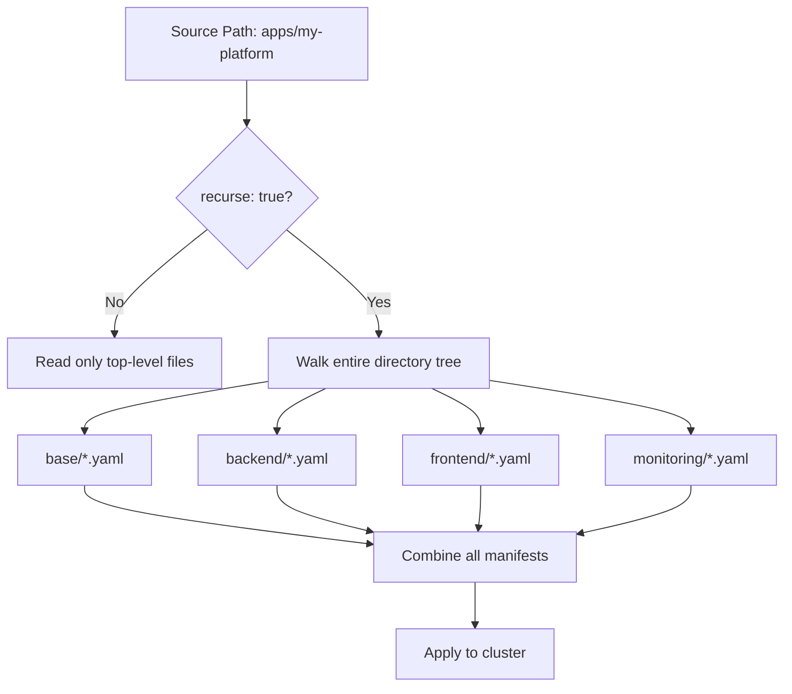

# How to Use Directory Recursion in ArgoCD

Author: [nawazdhandala](https://github.com/nawazdhandala)

Tags: ArgoCD, GitOps, Kubernetes, YAML, Directory Management

Description: Learn how to use ArgoCD directory recursion to deploy Kubernetes manifests from nested directory structures, including configuration options and practical examples.

---

By default, ArgoCD only reads manifests from the top level of the directory specified in your Application source path. If your YAML files are organized in subdirectories, ArgoCD will not see them unless you enable directory recursion. This is a simple but essential configuration that changes how ArgoCD scans for manifest files.

## The Problem: Nested Directories Are Ignored

Consider this directory structure:

```text
apps/
  my-platform/
    base/
      namespace.yaml
      rbac.yaml
    backend/
      deployment.yaml
      service.yaml
      configmap.yaml
    frontend/
      deployment.yaml
      service.yaml
      ingress.yaml
    monitoring/
      servicemonitor.yaml
      prometheusrule.yaml
```

If your ArgoCD Application points to `apps/my-platform`, only files directly inside `my-platform/` are read. The files in `base/`, `backend/`, `frontend/`, and `monitoring/` are invisible to ArgoCD.

## Enabling Directory Recursion

Add `directory.recurse: true` to your Application spec:

```yaml
# argocd-app-recursive.yaml - Enable recursive directory scanning
apiVersion: argoproj.io/v1alpha1
kind: Application
metadata:
  name: my-platform
  namespace: argocd
spec:
  project: default
  source:
    repoURL: https://github.com/your-org/k8s-manifests.git
    targetRevision: main
    path: apps/my-platform
    directory:
      recurse: true  # Scan all subdirectories for manifests
  destination:
    server: https://kubernetes.default.svc
    namespace: default
  syncPolicy:
    automated:
      prune: true
      selfHeal: true
```

Or via the CLI:

```bash
# Create application with directory recursion enabled
argocd app create my-platform \
  --repo https://github.com/your-org/k8s-manifests.git \
  --path apps/my-platform \
  --dest-server https://kubernetes.default.svc \
  --dest-namespace default \
  --directory-recurse \
  --sync-policy automated \
  --auto-prune \
  --self-heal
```

With recursion enabled, ArgoCD now scans all subdirectories and reads every `.yaml`, `.yml`, and `.json` file it finds.

## How Recursive Scanning Works



ArgoCD walks the entire directory tree starting from the source path. Every file matching the include pattern (default: all YAML/JSON files) is parsed and included in the application.

## Practical Example: Multi-Component Application

Let us set up a real application with a nested structure. This example deploys a web application with a backend API, frontend, and monitoring:

```text
apps/
  ecommerce/
    namespaces/
      namespace.yaml
    backend/
      deployment.yaml
      service.yaml
      hpa.yaml
    frontend/
      deployment.yaml
      service.yaml
      ingress.yaml
    database/
      statefulset.yaml
      service.yaml
      pvc.yaml
    config/
      backend-config.yaml
      frontend-config.yaml
    monitoring/
      servicemonitor-backend.yaml
      servicemonitor-frontend.yaml
```

The ArgoCD Application with recursion picks up all 12 files:

```yaml
apiVersion: argoproj.io/v1alpha1
kind: Application
metadata:
  name: ecommerce
  namespace: argocd
spec:
  project: default
  source:
    repoURL: https://github.com/your-org/k8s-manifests.git
    targetRevision: main
    path: apps/ecommerce
    directory:
      recurse: true
  destination:
    server: https://kubernetes.default.svc
    namespace: ecommerce
  syncPolicy:
    automated:
      prune: true
      selfHeal: true
    syncOptions:
      - CreateNamespace=true
```

## Controlling Recursion with Include and Exclude

When recursion is enabled, you might pick up files you do not want. Combine recursion with include/exclude patterns:

```yaml
spec:
  source:
    path: apps/my-platform
    directory:
      recurse: true
      # Only include YAML files, skip everything else
      include: '*.yaml'
      exclude: 'test-*.yaml'
```

This is useful when your directory contains test fixtures, documentation, or helper scripts alongside the actual manifests.

## Ordering Resources Across Directories

With recursive scanning, resources from all directories are gathered into a flat list. ArgoCD applies them based on sync waves, not directory structure. Use sync wave annotations to control the order:

```yaml
# namespaces/namespace.yaml - Deploy first
apiVersion: v1
kind: Namespace
metadata:
  name: ecommerce
  annotations:
    argocd.argoproj.io/sync-wave: "-2"

---
# config/backend-config.yaml - Deploy second
apiVersion: v1
kind: ConfigMap
metadata:
  name: backend-config
  namespace: ecommerce
  annotations:
    argocd.argoproj.io/sync-wave: "-1"

---
# backend/deployment.yaml - Deploy third (default wave 0)
apiVersion: apps/v1
kind: Deployment
metadata:
  name: backend-api
  namespace: ecommerce
  # No sync-wave annotation means wave 0
```

The directory names (base, backend, frontend) have no effect on ordering - only sync wave annotations matter.

## Recursion with Jsonnet and Kustomize

An important thing to know: `directory.recurse` only works with the directory source type (plain YAML). If ArgoCD detects a `kustomization.yaml` file in any directory, it switches to Kustomize mode for that directory. Similarly, a `Chart.yaml` triggers Helm mode.

This means if your recursive directory tree contains a `kustomization.yaml` somewhere, things can get confusing. The best practice is to keep your directory source purely plain YAML when using recursion.

```yaml
# This works - pure YAML directory with recursion
spec:
  source:
    path: apps/my-app
    directory:
      recurse: true

# This could cause issues - if any subdirectory has kustomization.yaml,
# ArgoCD may try to run kustomize build instead of reading plain YAML
```

If you need Kustomize in some subdirectories and plain YAML in others, use separate ArgoCD Applications for each.

## Performance Considerations

Recursive scanning has performance implications:

- **Large directory trees slow down syncs** - If your path contains hundreds of files across many directories, the repo server takes longer to process them.
- **Every change triggers a full rescan** - When any file in the recursive tree changes, ArgoCD rescans everything.
- **Git clone includes everything** - ArgoCD clones the full repository, so having thousands of files in a recursive path does not add extra clone time, but parsing does take time.

For very large deployments, consider splitting into multiple ArgoCD Applications with focused, non-recursive paths instead of one recursive application:

```yaml
# Instead of one recursive app covering everything:
# spec:
#   source:
#     path: apps/platform
#     directory:
#       recurse: true

# Use focused apps:
# App 1
spec:
  source:
    path: apps/platform/backend

# App 2
spec:
  source:
    path: apps/platform/frontend

# App 3
spec:
  source:
    path: apps/platform/monitoring
```

## Debugging Recursion Issues

When recursion does not pick up files you expect:

```bash
# Check what ArgoCD will render
argocd app manifests my-platform

# Count the manifests ArgoCD sees
argocd app manifests my-platform | grep -c "^apiVersion:"

# Verify the directory structure in Git
git ls-tree -r --name-only HEAD apps/my-platform/

# Check application details for any errors
argocd app get my-platform
```

Common issues include:

- **Forgetting to set `recurse: true`** - The default is `false`
- **Files with wrong extensions** - ArgoCD looks for `.yaml`, `.yml`, and `.json`
- **Empty YAML files** - Files that are empty or only contain comments are silently skipped
- **Hidden files** - Files starting with `.` are ignored
- **Symlinks** - Symbolic links may not be followed depending on the Git server

## Best Practices

**Use recursion for cohesive applications** - Recursion works best when all files in the tree belong to the same logical application.

**Avoid mixing source types** - Do not put `kustomization.yaml` or `Chart.yaml` in a recursive directory tree.

**Use sync waves for ordering** - Directory names do not affect apply order. Always use sync wave annotations.

**Keep the tree shallow** - Two or three levels of nesting is usually enough. Deeply nested trees are harder to maintain and slower to process.

For more about file filtering with recursion, see our guide on [including and excluding files in directory sources](https://oneuptime.com/blog/post/2026-02-26-argocd-include-exclude-files-directory/view). For organizing your manifests effectively, check out [organizing plain YAML manifests for ArgoCD](https://oneuptime.com/blog/post/2026-02-26-argocd-organize-plain-yaml-manifests/view).
