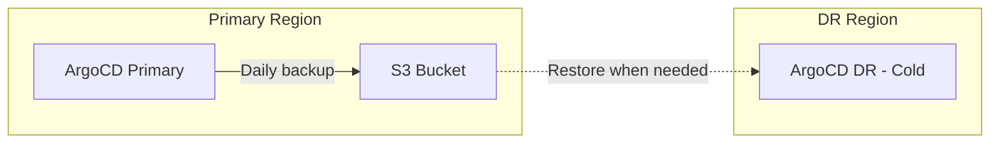
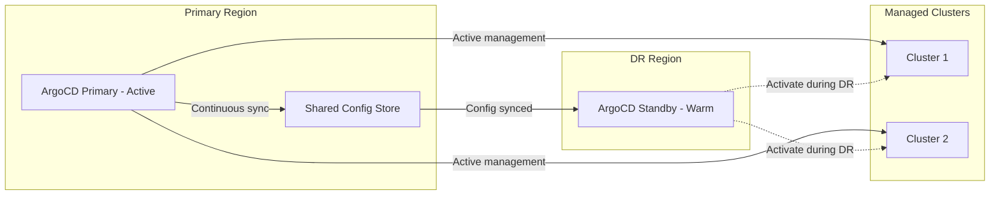
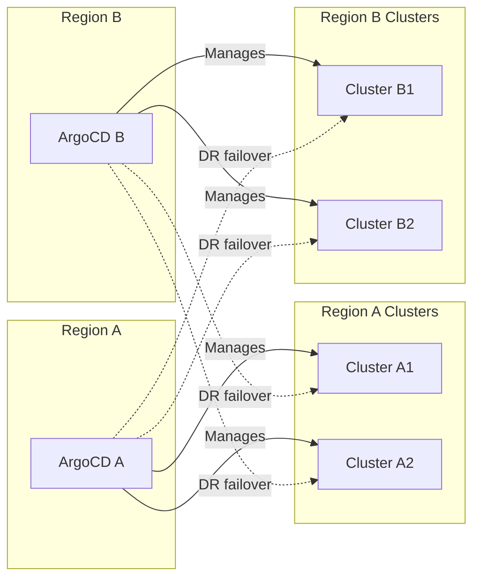

# How to Configure ArgoCD Disaster Recovery

Author: [nawazdhandala](https://github.com/nawazdhandala)

Tags: ArgoCD, GitOps, Kubernetes, Disaster Recovery, Business Continuity

Description: Learn how to design and implement a disaster recovery strategy for ArgoCD, including standby clusters, automated failover, RPO/RTO planning, and cross-region recovery procedures.

---

Disaster recovery for ArgoCD goes beyond simple backups. It means having a tested plan to restore your entire GitOps pipeline within a defined time window after a catastrophic failure. Without DR, losing your ArgoCD cluster means losing the ability to deploy, update, or recover any application it manages. This guide covers DR architecture, implementation, and testing for ArgoCD.

## Define RPO and RTO

Before building a DR solution, define your recovery objectives:

- **RPO (Recovery Point Objective)**: How much data can you afford to lose? For ArgoCD, this means how stale can your backup be?
- **RTO (Recovery Time Objective)**: How quickly must ArgoCD be operational after a disaster?

| DR Tier | RPO | RTO | Approach |
|---|---|---|---|
| Basic | 24 hours | 4 hours | Daily backups, manual restore |
| Standard | 1 hour | 1 hour | Frequent backups, scripted restore |
| Premium | Near zero | 15 minutes | Standby cluster, automated failover |
| Enterprise | Zero | 5 minutes | Active-active, multi-region |

## DR Architecture Options

### Option 1: Backup and Restore (Basic)

The simplest DR approach. Back up ArgoCD configuration daily and restore to a new cluster when needed.



**Pros**: Simple, low cost
**Cons**: Long RTO, potential data loss up to 24 hours

### Option 2: Warm Standby

A second ArgoCD instance runs in a different cluster/region with regularly synced configuration, but does not actively manage clusters.



### Option 3: Active-Active (Enterprise)

Two ArgoCD instances in different regions, each managing a subset of clusters. During DR, the surviving instance takes over the other's clusters.



## Implementing Warm Standby

This is the most practical DR approach for most organizations.

### Step 1: Set Up the Standby Cluster

Install ArgoCD in the DR cluster with the same configuration:

```bash
# Install ArgoCD in DR cluster
kubectl config use-context dr-cluster
kubectl create namespace argocd
helm install argocd argo/argo-cd \
  --namespace argocd \
  --values argocd-ha-values.yaml
```

### Step 2: Continuous Configuration Sync

Create a CronJob that syncs configuration from primary to standby every hour:

```yaml
apiVersion: batch/v1
kind: CronJob
metadata:
  name: argocd-dr-sync
  namespace: argocd
spec:
  schedule: "0 * * * *"  # Every hour
  jobTemplate:
    spec:
      template:
        spec:
          serviceAccountName: argocd-dr-sync
          containers:
            - name: sync
              image: bitnami/kubectl:latest
              env:
                - name: PRIMARY_KUBECONFIG
                  value: /etc/kubeconfig/primary
                - name: AWS_REGION
                  value: us-east-1
              command:
                - /bin/bash
                - -c
                - |
                  set -e

                  # Export from primary
                  echo "Exporting from primary cluster..."
                  kubectl --kubeconfig="$PRIMARY_KUBECONFIG" \
                    get applications.argoproj.io -n argocd -o yaml > /tmp/apps.yaml
                  kubectl --kubeconfig="$PRIMARY_KUBECONFIG" \
                    get appprojects.argoproj.io -n argocd -o yaml > /tmp/projects.yaml
                  kubectl --kubeconfig="$PRIMARY_KUBECONFIG" \
                    get applicationsets.argoproj.io -n argocd -o yaml > /tmp/appsets.yaml
                  kubectl --kubeconfig="$PRIMARY_KUBECONFIG" \
                    get secrets -n argocd \
                    -l argocd.argoproj.io/secret-type=repository -o yaml > /tmp/repos.yaml
                  kubectl --kubeconfig="$PRIMARY_KUBECONFIG" \
                    get secrets -n argocd \
                    -l argocd.argoproj.io/secret-type=cluster -o yaml > /tmp/clusters.yaml
                  kubectl --kubeconfig="$PRIMARY_KUBECONFIG" \
                    get configmap argocd-cm -n argocd -o yaml > /tmp/argocd-cm.yaml
                  kubectl --kubeconfig="$PRIMARY_KUBECONFIG" \
                    get configmap argocd-rbac-cm -n argocd -o yaml > /tmp/argocd-rbac-cm.yaml

                  # Import to standby (this cluster)
                  echo "Importing to standby cluster..."
                  kubectl apply -f /tmp/argocd-cm.yaml
                  kubectl apply -f /tmp/argocd-rbac-cm.yaml
                  kubectl apply -f /tmp/repos.yaml
                  kubectl apply -f /tmp/clusters.yaml
                  kubectl apply -f /tmp/projects.yaml
                  kubectl apply -f /tmp/appsets.yaml

                  # Import applications but disable auto-sync
                  # (standby should not actively manage clusters)
                  cat /tmp/apps.yaml | \
                    python3 -c "
                  import sys, yaml
                  docs = yaml.safe_load_all(sys.stdin)
                  for doc in docs:
                    if doc and doc.get('kind') == 'ApplicationList':
                      for item in doc.get('items', []):
                        sp = item.get('spec', {}).get('syncPolicy', {})
                        sp.pop('automated', None)
                        item['spec']['syncPolicy'] = sp
                        # Remove status and resourceVersion
                        item.get('metadata', {}).pop('resourceVersion', None)
                        item.pop('status', None)
                      yaml.dump(doc, sys.stdout)
                  " | kubectl apply -f -

                  echo "DR sync complete at $(date)"
              volumeMounts:
                - name: primary-kubeconfig
                  mountPath: /etc/kubeconfig
                  readOnly: true
          volumes:
            - name: primary-kubeconfig
              secret:
                secretName: primary-cluster-kubeconfig
          restartPolicy: OnFailure
```

### Step 3: DR Activation Script

When disaster strikes, activate the standby:

```bash
#!/bin/bash
# activate-dr.sh - Run this on the DR cluster to activate it

echo "=== ArgoCD DR Activation ==="
echo "WARNING: This will activate the DR ArgoCD instance"
echo "It will start managing all clusters previously managed by primary"
read -p "Continue? (yes/no): " confirm

if [ "$confirm" != "yes" ]; then
  echo "Aborted"
  exit 1
fi

# Step 1: Enable auto-sync on all applications
echo "Enabling auto-sync on applications..."
for APP in $(kubectl get applications.argoproj.io -n argocd -o jsonpath='{.items[*].metadata.name}'); do
  kubectl patch application "$APP" -n argocd --type merge -p '{
    "spec": {
      "syncPolicy": {
        "automated": {
          "prune": true,
          "selfHeal": true
        }
      }
    }
  }'
  echo "Enabled auto-sync for $APP"
done

# Step 2: Verify cluster connections
echo "Verifying cluster connections..."
argocd cluster list

# Step 3: Trigger sync for all applications
echo "Triggering sync for all applications..."
for APP in $(argocd app list -o name); do
  argocd app sync "$APP" --async
done

# Step 4: Monitor sync status
echo "Monitoring sync status..."
sleep 30
argocd app list

echo "=== DR Activation Complete ==="
echo "ArgoCD DR instance is now actively managing clusters"
echo "Update DNS/load balancer to point to DR ArgoCD endpoint"
```

### Step 4: DNS Failover

Configure DNS to switch users to the DR ArgoCD:

```bash
# Using Route53 health checks and failover routing
aws route53 create-health-check \
  --caller-reference "argocd-primary-health-$(date +%s)" \
  --health-check-config '{
    "FullyQualifiedDomainName": "argocd-primary.example.com",
    "Port": 443,
    "Type": "HTTPS",
    "ResourcePath": "/healthz",
    "RequestInterval": 10,
    "FailureThreshold": 3
  }'

# Configure failover DNS record
aws route53 change-resource-record-sets \
  --hosted-zone-id Z1234567890 \
  --change-batch '{
    "Changes": [{
      "Action": "UPSERT",
      "ResourceRecordSet": {
        "Name": "argocd.example.com",
        "Type": "CNAME",
        "SetIdentifier": "primary",
        "Failover": "PRIMARY",
        "HealthCheckId": "health-check-id",
        "TTL": 60,
        "ResourceRecords": [{"Value": "argocd-primary.example.com"}]
      }
    }, {
      "Action": "UPSERT",
      "ResourceRecordSet": {
        "Name": "argocd.example.com",
        "Type": "CNAME",
        "SetIdentifier": "secondary",
        "Failover": "SECONDARY",
        "TTL": 60,
        "ResourceRecords": [{"Value": "argocd-dr.example.com"}]
      }
    }]
  }'
```

## DR Testing

Test DR procedures quarterly:

```bash
#!/bin/bash
# dr-test.sh - Test DR procedure without impacting production

echo "=== ArgoCD DR Test ==="

# 1. Verify standby is synced
echo "Checking standby sync status..."
PRIMARY_APPS=$(kubectl --kubeconfig primary-kubeconfig \
  get applications.argoproj.io -n argocd --no-headers | wc -l)
DR_APPS=$(kubectl get applications.argoproj.io -n argocd --no-headers | wc -l)

echo "Primary applications: $PRIMARY_APPS"
echo "DR applications: $DR_APPS"

if [ "$PRIMARY_APPS" != "$DR_APPS" ]; then
  echo "WARNING: Application count mismatch!"
fi

# 2. Verify cluster connections from DR
echo "Testing cluster connections from DR..."
for CLUSTER in $(kubectl get secrets -n argocd \
  -l argocd.argoproj.io/secret-type=cluster \
  -o jsonpath='{.items[*].data.server}'); do
  SERVER=$(echo "$CLUSTER" | base64 -d)
  echo "Testing connection to $SERVER..."
  argocd cluster get "$SERVER" 2>/dev/null && echo "OK" || echo "FAIL"
done

# 3. Test single app sync (non-destructively)
echo "Testing single application sync..."
TEST_APP=$(kubectl get applications.argoproj.io -n argocd -o jsonpath='{.items[0].metadata.name}')
argocd app diff "$TEST_APP" 2>/dev/null && echo "Diff successful" || echo "Diff failed"

echo "=== DR Test Complete ==="
```

## Post-DR: Failback Procedure

After the primary is restored, fail back:

```bash
#!/bin/bash
# failback.sh

echo "=== ArgoCD Failback to Primary ==="

# 1. Sync configuration from DR to primary
echo "Syncing DR state to primary..."
# Export from DR
kubectl get applications.argoproj.io -n argocd -o yaml > /tmp/dr-apps.yaml
# Import to primary
kubectl --kubeconfig primary-kubeconfig apply -f /tmp/dr-apps.yaml

# 2. Enable auto-sync on primary
echo "Enabling primary..."
# (same as activation script but targeting primary)

# 3. Disable auto-sync on DR
echo "Deactivating DR..."
for APP in $(kubectl get applications.argoproj.io -n argocd -o jsonpath='{.items[*].metadata.name}'); do
  kubectl patch application "$APP" -n argocd --type json \
    -p '[{"op": "remove", "path": "/spec/syncPolicy/automated"}]' 2>/dev/null
done

# 4. Update DNS back to primary
echo "Update DNS to point back to primary"

echo "=== Failback Complete ==="
```

Disaster recovery is not optional for production ArgoCD. The approach you choose depends on your RPO and RTO requirements. Start with basic backup/restore and evolve to warm standby as your deployment matures. Most importantly, test your DR procedures regularly. For monitoring your DR readiness, see our guide on [monitoring ArgoCD component health](https://oneuptime.com/blog/post/2026-02-26-argocd-monitor-component-health/view).
