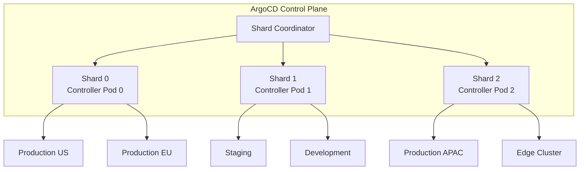

# How to Distribute Clusters Across Controller Shards in ArgoCD

Author: [nawazdhandala](https://github.com/nawazdhandala)

Tags: ArgoCD, GitOps, Kubernetes, Scaling, Sharding

Description: Learn how to distribute Kubernetes clusters across ArgoCD controller shards for horizontal scaling and improved reconciliation performance.

---

As your ArgoCD instance grows to manage dozens or hundreds of clusters, a single application controller becomes a bottleneck. Sharding lets you split the workload across multiple controller replicas, where each shard is responsible for reconciling a subset of clusters. This guide walks through the mechanics of cluster distribution and how to configure it effectively.

## Understanding Controller Sharding

ArgoCD's application controller is the component that watches clusters, detects drift, and triggers syncs. Each cluster it manages adds to its memory footprint (for cached resource states) and CPU usage (for reconciliation loops).

Sharding divides the set of managed clusters among multiple controller instances. Each shard only watches and reconciles its assigned clusters, which reduces the per-instance resource consumption.



## Static vs Dynamic Sharding

ArgoCD supports two approaches to distributing clusters across shards.

### Static Sharding

With static sharding, you manually assign a shard number to each cluster. This gives you full control but requires manual intervention whenever you add or remove clusters.

To assign a cluster to a specific shard, annotate the cluster secret:

```yaml
apiVersion: v1
kind: Secret
metadata:
  name: my-production-cluster
  namespace: argocd
  labels:
    argocd.argoproj.io/secret-type: cluster
  annotations:
    # Assign this cluster to shard 1
    argocd.argoproj.io/shard: "1"
type: Opaque
data:
  name: cHJvZHVjdGlvbi11cw==  # production-us
  server: aHR0cHM6Ly9rdWJlcm5ldGVzLnByb2QudXMuZXhhbXBsZS5jb20=
  config: <base64-encoded-config>
```

You can also assign shards using the CLI:

```bash
# Set shard for a cluster
argocd cluster set https://kubernetes.prod.us.example.com \
  --shard 1
```

### Dynamic Sharding (Recommended)

Dynamic sharding uses a hash-based algorithm to automatically distribute clusters. See our guide on [enabling dynamic cluster distribution](https://oneuptime.com/blog/post/2026-02-26-argocd-dynamic-cluster-distribution/view) for the full setup.

## Configuring Multiple Controller Replicas

Regardless of whether you use static or dynamic sharding, you need multiple controller instances. Here is how to set up the controller as a StatefulSet with 3 replicas:

```yaml
apiVersion: apps/v1
kind: StatefulSet
metadata:
  name: argocd-application-controller
  namespace: argocd
spec:
  replicas: 3
  serviceName: argocd-application-controller
  selector:
    matchLabels:
      app.kubernetes.io/name: argocd-application-controller
  template:
    metadata:
      labels:
        app.kubernetes.io/name: argocd-application-controller
    spec:
      containers:
        - name: argocd-application-controller
          image: quay.io/argoproj/argocd:v2.12.0
          command:
            - argocd-application-controller
          env:
            # Must match the replica count
            - name: ARGOCD_CONTROLLER_REPLICAS
              value: "3"
          resources:
            requests:
              cpu: 500m
              memory: 512Mi
            limits:
              cpu: "2"
              memory: 4Gi
```

Each pod in the StatefulSet gets an ordinal index (0, 1, 2), which becomes its shard ID. Pod `argocd-application-controller-0` handles shard 0, pod `argocd-application-controller-1` handles shard 1, and so on.

## Choosing the Right Shard Count

The optimal number of shards depends on several factors:

| Factor | Guidance |
|--------|----------|
| Cluster count | Start with 1 shard per 20 to 30 clusters |
| Application count per cluster | Heavy clusters may need dedicated shards |
| Resource types watched | More CRDs means more cache memory |
| Reconciliation interval | Shorter intervals need more CPU |

A practical starting point for most organizations:

```text
Shard count = ceil(total_clusters / 25)
```

For example, if you manage 80 clusters, start with 4 shards. Monitor resource usage and adjust from there.

## Verifying Shard Assignments

After configuring sharding, verify that clusters are distributed as expected:

```bash
# Check which shard each cluster is assigned to
kubectl get secrets -n argocd \
  -l argocd.argoproj.io/secret-type=cluster \
  -o custom-columns='NAME:.metadata.name,SHARD:.metadata.annotations.argocd\.argoproj\.io/shard'
```

For dynamic sharding, the shard annotation is set automatically. For static sharding, you will see the values you manually assigned.

You can also check the controller logs for shard activity:

```bash
# Check shard 0's logs
kubectl logs argocd-application-controller-0 -n argocd | head -50

# Look for cluster processing messages
kubectl logs argocd-application-controller-1 -n argocd | grep "Processing"
```

## Handling the In-Cluster (Default) Cluster

The cluster where ArgoCD itself runs is known as the in-cluster destination. By default, it is assigned to shard 0. If your in-cluster has many applications, this can overload shard 0.

To balance this, you can explicitly register the in-cluster as a named cluster and assign it to a specific shard:

```bash
# Register the in-cluster explicitly
argocd cluster add in-cluster \
  --in-cluster \
  --name "management-cluster"

# Assign it to a specific shard (static sharding)
argocd cluster set https://kubernetes.default.svc \
  --shard 2
```

## Monitoring Shard Health

Each shard exposes its own set of metrics. Set up Prometheus to scrape all controller pods and use labels to distinguish shards:

```yaml
# Prometheus ServiceMonitor for controller pods
apiVersion: monitoring.coreos.com/v1
kind: ServiceMonitor
metadata:
  name: argocd-controller-metrics
  namespace: argocd
spec:
  selector:
    matchLabels:
      app.kubernetes.io/name: argocd-application-controller
  endpoints:
    - port: metrics
      interval: 30s
```

Key metrics to watch per shard:

```promql
# Reconciliation duration per shard
histogram_quantile(0.99,
  sum(rate(argocd_app_reconcile_bucket[5m])) by (le, pod)
)

# Workqueue depth - high values indicate a shard is falling behind
workqueue_depth{name="app_reconciliation_queue"}

# Memory usage per shard pod
container_memory_working_set_bytes{
  container="argocd-application-controller"
}
```

## Scaling Shards Up and Down

When scaling the StatefulSet, keep these points in mind:

1. **Scale up gradually** - add one shard at a time and monitor the redistribution
2. **Update ARGOCD_CONTROLLER_REPLICAS** - this environment variable must match the StatefulSet replica count
3. **Allow time for cache warming** - new shards need 30 to 90 seconds to build their resource caches
4. **For static sharding** - you must manually reassign clusters to the new shard

```bash
# Scale up to 4 shards
kubectl scale statefulset argocd-application-controller \
  -n argocd --replicas=4

# Also update the environment variable
kubectl set env statefulset/argocd-application-controller \
  -n argocd ARGOCD_CONTROLLER_REPLICAS=4
```

## Best Practices

1. **Use dynamic sharding** unless you have a specific reason to manually assign clusters
2. **Set PodDisruptionBudgets** to keep at least N-1 shards running during updates
3. **Use pod anti-affinity** to spread shards across nodes
4. **Monitor each shard independently** with per-pod dashboards
5. **Test failover** by intentionally killing a shard pod and watching recovery

Distributing clusters across shards is essential for running ArgoCD at scale. Whether you choose static or dynamic distribution, the key is monitoring shard health and adjusting the replica count as your infrastructure evolves.
