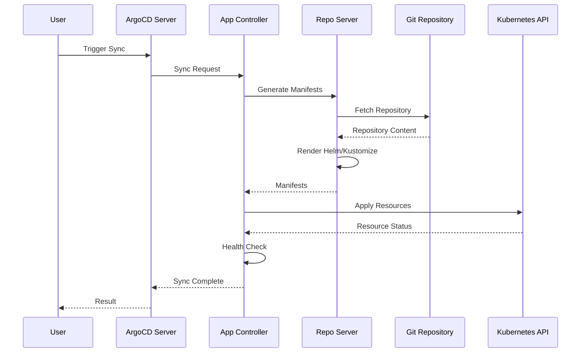

# How to Trace ArgoCD Operations with Distributed Tracing

Author: [nawazdhandala](https://github.com/nawazdhandala)

Tags: ArgoCD, GitOps, Kubernetes, Distributed Tracing, OpenTelemetry

Description: Learn how to implement distributed tracing for ArgoCD operations to understand sync lifecycles, debug slow deployments, and trace requests across components.

---

When an ArgoCD sync takes longer than expected or fails intermittently, you need to understand exactly what happened during that operation. Which component was slow? Was it the Git fetch, the manifest generation, or the Kubernetes API calls? Distributed tracing gives you a timeline view of every operation, broken down by component and operation type.

ArgoCD has built-in support for OpenTelemetry tracing since version 2.8, making it straightforward to instrument your GitOps pipeline.

## How ArgoCD Tracing Works

A single ArgoCD sync operation spans multiple components:



Each step in this sequence is captured as a span in a trace, giving you visibility into where time is spent.

## Enabling Tracing in ArgoCD

### Step 1: Configure the OTLP Endpoint

Set the tracing endpoint in the ArgoCD ConfigMap:

```yaml
apiVersion: v1
kind: ConfigMap
metadata:
  name: argocd-cm
  namespace: argocd
data:
  # Point to your OpenTelemetry Collector or Jaeger directly
  otlp.address: "otel-collector.observability:4317"
```

### Step 2: Set Environment Variables for Fine-Grained Control

For more control over tracing behavior, set environment variables on each ArgoCD component:

```yaml
# Patch for argocd-server deployment
apiVersion: apps/v1
kind: Deployment
metadata:
  name: argocd-server
  namespace: argocd
spec:
  template:
    spec:
      containers:
        - name: argocd-server
          env:
            # OTLP endpoint
            - name: OTEL_EXPORTER_OTLP_ENDPOINT
              value: "http://otel-collector.observability:4317"
            # Service name for trace identification
            - name: OTEL_SERVICE_NAME
              value: "argocd-server"
            # Sampling rate (0.0 to 1.0)
            - name: OTEL_TRACES_SAMPLER
              value: "parentbased_traceidratio"
            - name: OTEL_TRACES_SAMPLER_ARG
              value: "0.1"
            # Resource attributes
            - name: OTEL_RESOURCE_ATTRIBUTES
              value: "k8s.namespace.name=argocd,deployment.environment=production"
```

Apply similar environment variables to the repo server and application controller:

```bash
# Patch all ArgoCD components
for component in argocd-server argocd-repo-server; do
  kubectl patch deployment -n argocd $component --type=json -p='[
    {
      "op": "add",
      "path": "/spec/template/spec/containers/0/env/-",
      "value": {
        "name": "OTEL_EXPORTER_OTLP_ENDPOINT",
        "value": "http://otel-collector.observability:4317"
      }
    },
    {
      "op": "add",
      "path": "/spec/template/spec/containers/0/env/-",
      "value": {
        "name": "OTEL_TRACES_SAMPLER",
        "value": "parentbased_traceidratio"
      }
    },
    {
      "op": "add",
      "path": "/spec/template/spec/containers/0/env/-",
      "value": {
        "name": "OTEL_TRACES_SAMPLER_ARG",
        "value": "0.1"
      }
    }
  ]'
done

# Patch the statefulset for the application controller
kubectl patch statefulset -n argocd argocd-application-controller --type=json -p='[
  {
    "op": "add",
    "path": "/spec/template/spec/containers/0/env/-",
    "value": {
      "name": "OTEL_EXPORTER_OTLP_ENDPOINT",
      "value": "http://otel-collector.observability:4317"
    }
  }
]'
```

## Setting Up the Tracing Backend

### Option 1: Jaeger

Deploy Jaeger for trace storage and visualization:

```yaml
apiVersion: jaegertracing.io/v1
kind: Jaeger
metadata:
  name: argocd-jaeger
  namespace: observability
spec:
  strategy: production
  storage:
    type: elasticsearch
    options:
      es:
        server-urls: http://elasticsearch:9200
        index-prefix: argocd-traces
  collector:
    maxReplicas: 3
    resources:
      limits:
        cpu: 500m
        memory: 512Mi
  query:
    replicas: 2
```

### Option 2: Grafana Tempo

For a lighter-weight option that integrates with Grafana:

```yaml
# Tempo configuration
apiVersion: v1
kind: ConfigMap
metadata:
  name: tempo-config
  namespace: observability
data:
  tempo.yaml: |
    server:
      http_listen_port: 3200

    distributor:
      receivers:
        otlp:
          protocols:
            grpc:
              endpoint: "0.0.0.0:4317"

    storage:
      trace:
        backend: s3
        s3:
          bucket: argocd-traces
          endpoint: minio:9000
          insecure: true

    compactor:
      ring:
        kvstore:
          store: memberlist

    metrics_generator:
      registry:
        external_labels:
          source: tempo
      storage:
        path: /tmp/tempo/generator/wal
        remote_write:
          - url: http://prometheus:9090/api/v1/write
```

## Understanding ArgoCD Trace Spans

A typical ArgoCD sync trace includes these spans:

| Span Name | Component | Description |
|---|---|---|
| `argocd.sync` | Controller | Root span for the entire sync |
| `argocd.git.fetch` | Repo Server | Fetching from Git repository |
| `argocd.manifest.generate` | Repo Server | Rendering Helm/Kustomize |
| `argocd.manifest.cache.get` | Repo Server | Cache lookup for manifests |
| `argocd.kubernetes.apply` | Controller | Applying resources to cluster |
| `argocd.health.check` | Controller | Running health assessments |
| `argocd.hook.execute` | Controller | Running sync hooks |

## Analyzing Traces for Performance Issues

### Finding Slow Syncs

In Jaeger or Tempo, search for traces with:
- Service: `argocd-application-controller`
- Operation: `argocd.sync`
- Min Duration: 60s

This surfaces sync operations that took longer than a minute.

### Identifying Git Bottlenecks

Look for traces where `argocd.git.fetch` dominates the timeline. Common causes:
- Large repositories taking a long time to clone
- Slow Git hosting provider
- Missing shallow clone configuration

Fix by enabling shallow cloning:

```yaml
apiVersion: argoproj.io/v1alpha1
kind: Application
metadata:
  name: my-app
spec:
  source:
    repoURL: https://github.com/org/repo
    targetRevision: main
    # Enable shallow clone for faster fetches
    directory:
      recurse: false
```

### Identifying Manifest Generation Bottlenecks

If `argocd.manifest.generate` is slow, check:
- Complex Helm charts with many dependencies
- Kustomize overlays with heavy transformations
- Repo server resource limits

Increase repo server resources:

```yaml
apiVersion: apps/v1
kind: Deployment
metadata:
  name: argocd-repo-server
  namespace: argocd
spec:
  template:
    spec:
      containers:
        - name: argocd-repo-server
          resources:
            requests:
              cpu: 500m
              memory: 512Mi
            limits:
              cpu: 2000m
              memory: 2Gi
```

## Sampling Strategy

In production, you do not want to trace every single operation. Use a smart sampling strategy:

```yaml
# Always trace failed syncs, sample 10% of successful ones
env:
  - name: OTEL_TRACES_SAMPLER
    value: "parentbased_traceidratio"
  - name: OTEL_TRACES_SAMPLER_ARG
    value: "0.1"
```

For custom sampling that always captures errors, use the OpenTelemetry Collector's tail sampling processor:

```yaml
# OTel Collector config
processors:
  tail_sampling:
    decision_wait: 30s
    policies:
      # Always keep traces with errors
      - name: errors
        type: status_code
        status_code:
          status_codes: [ERROR]
      # Always keep slow traces
      - name: slow-traces
        type: latency
        latency:
          threshold_ms: 30000
      # Sample 10% of everything else
      - name: probabilistic
        type: probabilistic
        probabilistic:
          sampling_percentage: 10
```

## Correlating Traces with Logs and Metrics

For full observability, inject trace IDs into ArgoCD logs. This lets you click from a log line directly to the corresponding trace:

```yaml
# In Grafana, use derived fields in Loki
# to link trace IDs to Tempo/Jaeger
derivedFields:
  - datasourceUid: tempo
    matcherRegex: "traceID=(\\w+)"
    name: TraceID
    url: "$${__value.raw}"
```

## Summary

Distributed tracing transforms ArgoCD debugging from guesswork into science. By enabling OpenTelemetry tracing, you get a detailed timeline of every sync operation, from Git fetch through manifest generation to Kubernetes resource application. Use this visibility to identify bottlenecks, optimize slow components, and understand the full lifecycle of your GitOps deployments.

For the complete observability stack, combine tracing with [log aggregation](https://oneuptime.com/blog/post/2026-02-26-argocd-log-aggregation-components/view) and [custom metrics](https://oneuptime.com/blog/post/2026-02-26-argocd-custom-metrics/view).
