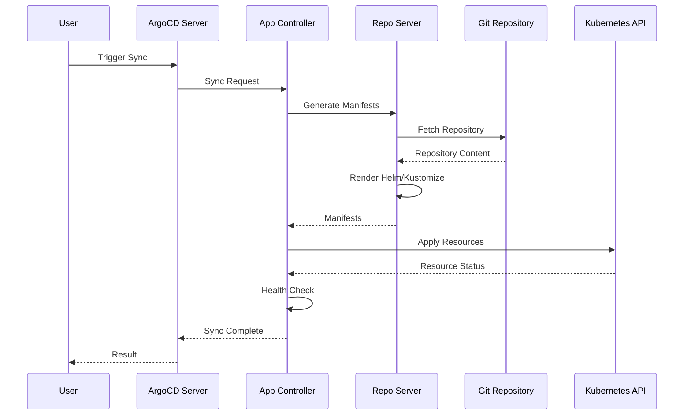

# How to Trace ArgoCD Operations with Distributed Tracing

Author: [nawazdhandala](https://github.com/nawazdhandala)

Tags: ArgoCD, GitOps, Kubernetes, Distributed Tracing, OpenTelemetry

Description: Learn how to implement distributed tracing for ArgoCD operations to understand sync lifecycles, debug slow deployments, and trace requests across components.

---

When an ArgoCD sync takes longer than expected or fails intermittently, you need to understand exactly what happened during that operation. Which component was slow? Was it the Git fetch, the manifest generation, or the Kubernetes API calls? Distributed tracing gives you a timeline view of every operation, broken down by component and operation type.

ArgoCD has built-in support for OpenTelemetry tracing, making it straightforward to instrument your GitOps pipeline.

## How ArgoCD Tracing Works

A single ArgoCD sync operation spans multiple components:


```mermaid
sequenceDiagram
    participant User
    participant Server as ArgoCD Server
    participant Controller as App Controller
    participant Repo as Repo Server
    participant Git as Git Repository
    participant K8s as Kubernetes API

    User->>Server: Trigger Sync
    Server->>Controller: Sync Request
    Controller->>Repo: Generate Manifests
    Repo->>Git: Fetch Repository
    Git-->>Repo: Repository Content
    Repo->>Repo: Render Helm/Kustomize
    Repo-->>Controller: Manifests
    Controller->>K8s: Apply Resources
    K8s-->>Controller: Resource Status
    Controller->>Controller: Health Check
    Controller-->>Server: Sync Complete
    Server-->>User: Result
```

The traced gRPC, HTTP, and Kubernetes operations give you visibility into where time is spent across this flow.

## Enabling Tracing in ArgoCD

### Step 1: Configure the OTLP Endpoint

Set the tracing endpoint in the ArgoCD command parameters ConfigMap:

```yaml
apiVersion: v1
kind: ConfigMap
metadata:
  name: argocd-cmd-params-cm
  namespace: argocd
data:
  # Point to your OpenTelemetry Collector
  otlp.address: "otel-collector.observability:4317"
  otlp.insecure: "true"
```

### Step 2: Set Environment Variables for Fine-Grained Control

For more control over tracing behavior, set ArgoCD's component-specific environment variables:

```yaml
# Patch for argocd-server deployment

apiVersion: apps/v1
kind: Deployment
metadata:
  name: argocd-server
  namespace: argocd
spec:
  template:
    spec:
      containers:
        - name: argocd-server
          env:
            # OTLP endpoint
            - name: ARGOCD_SERVER_OTLP_ADDRESS
              value: "otel-collector.observability:4317"
            # Resource attributes, separated with commas
            - name: ARGOCD_SERVER_OTLP_ATTRS
              value: "k8s.namespace.name:argocd,deployment.environment:production"
```

Apply similar environment variables to the repo server and application controller:

```bash
# Patch the API server
kubectl patch deployment -n argocd argocd-server --type=json -p='[
  {
    "op": "add",
    "path": "/spec/template/spec/containers/0/env/-",
    "value": {
      "name": "ARGOCD_SERVER_OTLP_ADDRESS",
      "value": "otel-collector.observability:4317"
    }
  }
]'

# Patch the repo server
kubectl patch deployment -n argocd argocd-repo-server --type=json -p='[
    {
      "op": "add",
      "path": "/spec/template/spec/containers/0/env/-",
      "value": {
        "name": "ARGOCD_REPO_SERVER_OTLP_ADDRESS",
        "value": "otel-collector.observability:4317"
      }
    }
]'

# Patch the statefulset for the application controller
kubectl patch statefulset -n argocd argocd-application-controller --type=json -p='[
  {
    "op": "add",
    "path": "/spec/template/spec/containers/0/env/-",
    "value": {
      "name": "ARGOCD_APPLICATION_CONTROLLER_OTLP_ADDRESS",
      "value": "otel-collector.observability:4317"
    }
  }
]'
```

## Setting Up the Tracing Backend

### Option 1: Jaeger

Deploy Jaeger for trace storage and visualization:

```yaml
apiVersion: jaegertracing.io/v1
kind: Jaeger
metadata:
  name: argocd-jaeger
  namespace: observability
spec:
  strategy: production
  storage:
    type: elasticsearch
    options:
      es:
        server-urls: http://elasticsearch:9200
        index-prefix: argocd-traces
  collector:
    maxReplicas: 3
    resources:
      limits:
        cpu: 500m
        memory: 512Mi
  query:
    replicas: 2
```

### Option 2: Grafana Tempo

For a lighter-weight option that integrates with Grafana:

```yaml
# Tempo configuration
apiVersion: v1
kind: ConfigMap
metadata:
  name: tempo-config
  namespace: observability
data:
  tempo.yaml: |
    server:
      http_listen_port: 3200

    distributor:
      receivers:
        otlp:
          protocols:
            grpc:
              endpoint: "0.0.0.0:4317"

    storage:
      trace:
        backend: s3
        s3:
          bucket: argocd-traces
          endpoint: minio:9000
          insecure: true

    compactor:
      ring:
        kvstore:
          store: memberlist

    metrics_generator:
      registry:
        external_labels:
          source: tempo
      storage:
        path: /tmp/tempo/generator/wal
        remote_write:
          - url: http://prometheus:9090/api/v1/write
```

## Understanding ArgoCD Trace Spans

A typical ArgoCD sync trace includes spans such as:

| Span Name | Component | Description |
|---|---|---|
| `/application.ApplicationService/Sync` | Server | User-initiated sync request |
| `/repository.RepoServerService/GenerateManifest` | Repo Server | Rendering Helm/Kustomize or plain manifests |
| `/repository.RepoServerService/GetRevisionMetadata` | Repo Server | Reading Git revision metadata |
| `ApplyResource` | Controller | Applying a Kubernetes resource |
| `GetResource` | Controller | Reading a Kubernetes resource |
| `PatchResource` | Controller | Patching a Kubernetes resource |

## Analyzing Traces for Performance Issues

### Finding Slow Syncs

In Jaeger or Tempo, search for traces with:
- Service: `argocd-application-controller`
- Operation: `ApplyResource`
- Min Duration: 60s

This surfaces Kubernetes apply operations that took longer than a minute. To investigate user-triggered sync calls, search the `argocd-server` service for `/application.ApplicationService/Sync`.

### Identifying Git Bottlenecks

Look for repo-server traces where repository access or manifest generation dominates the timeline. Common causes:
- Large repositories taking a long time to clone
- Slow Git hosting provider
- Missing shallow clone configuration

Fix by enabling shallow cloning on the repository:

```yaml
apiVersion: v1
kind: Secret
metadata:
  name: my-repo
  namespace: argocd
  labels:
    argocd.argoproj.io/secret-type: repository
  annotations:
    managed-by: argocd.argoproj.io
type: Opaque
stringData:
  type: git
  url: https://github.com/org/repo
  depth: "1"
```

### Identifying Manifest Generation Bottlenecks

If `/repository.RepoServerService/GenerateManifest` is slow, check:
- Complex Helm charts with many dependencies
- Kustomize overlays with heavy transformations
- Repo server resource limits

Increase repo server resources:

```yaml
apiVersion: apps/v1
kind: Deployment
metadata:
  name: argocd-repo-server
  namespace: argocd
spec:
  template:
    spec:
      containers:
        - name: argocd-repo-server
          resources:
            requests:
              cpu: 500m
              memory: 512Mi
            limits:
              cpu: 2000m
              memory: 2Gi
```

## Sampling Strategy

In production, you do not want to keep every single operation. ArgoCD's built-in exporter is configured through its `--otlp-*` flags, so use the OpenTelemetry Collector's tail sampling processor to keep the most useful traces:

```yaml
# OTel Collector config
processors:
  tail_sampling:
    decision_wait: 30s
    policies:
      # Always keep traces with errors
      - name: errors
        type: status_code
        status_code:
          status_codes: [ERROR]
      # Always keep slow traces
      - name: slow-traces
        type: latency
        latency:
          threshold_ms: 30000
      # Sample 10% of everything else
      - name: probabilistic
        type: probabilistic
        probabilistic:
          sampling_percentage: 10
```

## Correlating Traces with Logs and Metrics

For full observability, configure your log pipeline to link log lines that contain trace IDs to the corresponding trace:

```yaml
# In Grafana, use derived fields in Loki
# to link trace IDs to Tempo/Jaeger
derivedFields:
  - datasourceUid: tempo
    matcherRegex: "traceID=(\\w+)"
    name: TraceID
    url: "$${__value.raw}"
```

## Summary

Distributed tracing transforms ArgoCD debugging from guesswork into science. By enabling OpenTelemetry tracing, you get a timeline of operations across the API server, repo server, and Kubernetes resource application. Use this visibility to identify bottlenecks, optimize slow components, and understand the lifecycle of your GitOps deployments.

For the complete observability stack, combine tracing with [log aggregation](https://oneuptime.com/blog/post/2026-02-26-argocd-log-aggregation-components/view) and [custom metrics](https://oneuptime.com/blog/post/2026-02-26-argocd-custom-metrics/view).
