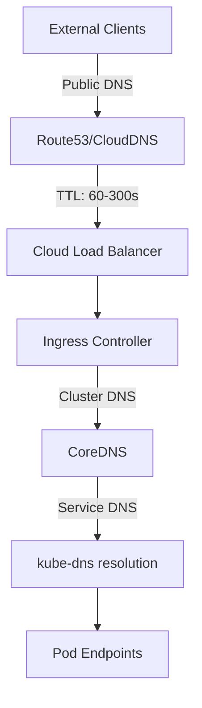

# How to Handle DNS Propagation During Deployment

Author: [nawazdhandala](https://github.com/nawazdhandala)

Tags: ArgoCD, GitOps, Kubernetes, DNS, Deployments

Description: Learn how to handle DNS propagation delays during ArgoCD deployments including service discovery, external DNS integration, and strategies for zero-downtime DNS transitions.

---

DNS propagation is the silent killer of otherwise smooth deployments. You deploy a new service, update the DNS records, and everything looks good - except some clients are still hitting the old endpoints because DNS caches have not expired. This is particularly challenging with ArgoCD-managed deployments where services, ingresses, and DNS records need to change atomically. This guide covers strategies for handling DNS propagation during ArgoCD deployments.

## Understanding DNS in Kubernetes

Kubernetes has multiple DNS layers:



Each layer has its own caching behavior:

1. **Client DNS cache** - browser, OS, application-level caching (unpredictable TTL)
2. **Recursive resolver cache** - ISP/corporate DNS servers (respects TTL)
3. **External DNS records** - Route53, CloudDNS, etc. (configurable TTL)
4. **Kubernetes Service DNS** - CoreDNS internal to the cluster (typically 30s TTL)
5. **kube-proxy/iptables** - endpoint updates (nearly instant)

## Challenge 1: External DNS Propagation

When ArgoCD deploys a new Ingress resource or updates an existing one, ExternalDNS creates or updates DNS records:

```yaml
# ingress.yaml
apiVersion: networking.k8s.io/v1
kind: Ingress
metadata:
  name: api-ingress
  annotations:
    external-dns.alpha.kubernetes.io/hostname: api.example.com
    external-dns.alpha.kubernetes.io/ttl: "60"  # Low TTL for faster propagation
spec:
  ingressClassName: nginx
  rules:
    - host: api.example.com
      http:
        paths:
          - path: /
            pathType: Prefix
            backend:
              service:
                name: api-server
                port:
                  number: 80
```

The problem is that even with a 60-second TTL, some resolvers cache for longer, and client-side caches may not respect TTL at all.

## Deploying ExternalDNS with ArgoCD

Manage ExternalDNS itself through ArgoCD:

```yaml
apiVersion: argoproj.io/v1alpha1
kind: Application
metadata:
  name: external-dns
  namespace: argocd
spec:
  project: infrastructure
  source:
    repoURL: https://kubernetes-sigs.github.io/external-dns/
    chart: external-dns
    targetRevision: 1.14.0
    helm:
      values: |
        provider: aws
        aws:
          region: us-east-1
        domainFilters:
          - example.com
        policy: upsert-only  # Never delete records
        txtPrefix: "externaldns-"
        interval: "30s"
        triggerLoopOnEvent: true
        sources:
          - ingress
          - service
        registry: txt
        txtOwnerId: production-cluster
        serviceAccount:
          annotations:
            eks.amazonaws.com/role-arn: arn:aws:iam::123456789:role/external-dns
  destination:
    server: https://kubernetes.default.svc
    namespace: external-dns
  syncPolicy:
    automated:
      prune: true
      selfHeal: true
    syncOptions:
      - CreateNamespace=true
```

## Strategy 1: Pre-Lower TTL Before Deployment

Before a major deployment that changes DNS, lower the TTL well in advance:

```yaml
# Step 1: Lower TTL (deploy this 24-48 hours before the main deployment)
apiVersion: batch/v1
kind: Job
metadata:
  name: lower-dns-ttl
  annotations:
    argocd.argoproj.io/hook: PreSync
    argocd.argoproj.io/hook-delete-policy: HookSucceeded
spec:
  template:
    spec:
      restartPolicy: Never
      containers:
        - name: dns-update
          image: amazon/aws-cli:2.15.0
          command:
            - /bin/sh
            - -c
            - |
              # Lower TTL to 30 seconds
              aws route53 change-resource-record-sets \
                --hosted-zone-id Z1234567890 \
                --change-batch '{
                  "Changes": [{
                    "Action": "UPSERT",
                    "ResourceRecordSet": {
                      "Name": "api.example.com",
                      "Type": "A",
                      "AliasTarget": {
                        "HostedZoneId": "Z32O12XQLNTSW2",
                        "DNSName": "current-lb.us-east-1.elb.amazonaws.com",
                        "EvaluateTargetHealth": true
                      }
                    }
                  }]
                }'
```

## Strategy 2: Blue-Green DNS Switching

For zero-downtime DNS transitions, use a blue-green approach:

```yaml
# Blue environment (current production)
apiVersion: networking.k8s.io/v1
kind: Ingress
metadata:
  name: api-blue
  annotations:
    external-dns.alpha.kubernetes.io/hostname: api-blue.example.com
spec:
  rules:
    - host: api-blue.example.com
      http:
        paths:
          - path: /
            pathType: Prefix
            backend:
              service:
                name: api-server-blue
                port:
                  number: 80
---
# Green environment (new version)
apiVersion: networking.k8s.io/v1
kind: Ingress
metadata:
  name: api-green
  annotations:
    external-dns.alpha.kubernetes.io/hostname: api-green.example.com
spec:
  rules:
    - host: api-green.example.com
      http:
        paths:
          - path: /
            pathType: Prefix
            backend:
              service:
                name: api-server-green
                port:
                  number: 80
---
# Production DNS - CNAME to active color
# Managed by a separate process that switches after green is verified
# api.example.com -> CNAME -> api-green.example.com
```

## Strategy 3: Weighted DNS for Gradual Migration

Use Route53 weighted routing for gradual DNS-level traffic shifting:

```yaml
# Deploy weighted DNS records through a post-sync hook
apiVersion: batch/v1
kind: Job
metadata:
  name: dns-weighted-switch
  annotations:
    argocd.argoproj.io/hook: PostSync
    argocd.argoproj.io/hook-delete-policy: HookSucceeded
spec:
  template:
    spec:
      restartPolicy: Never
      containers:
        - name: dns-switch
          image: amazon/aws-cli:2.15.0
          command:
            - /bin/sh
            - -c
            - |
              # Create weighted records
              aws route53 change-resource-record-sets \
                --hosted-zone-id Z1234567890 \
                --change-batch '{
                  "Changes": [
                    {
                      "Action": "UPSERT",
                      "ResourceRecordSet": {
                        "Name": "api.example.com",
                        "Type": "A",
                        "SetIdentifier": "old-version",
                        "Weight": 90,
                        "AliasTarget": {
                          "HostedZoneId": "Z32O12XQLNTSW2",
                          "DNSName": "old-lb.us-east-1.elb.amazonaws.com",
                          "EvaluateTargetHealth": true
                        }
                      }
                    },
                    {
                      "Action": "UPSERT",
                      "ResourceRecordSet": {
                        "Name": "api.example.com",
                        "Type": "A",
                        "SetIdentifier": "new-version",
                        "Weight": 10,
                        "AliasTarget": {
                          "HostedZoneId": "Z32O12XQLNTSW2",
                          "DNSName": "new-lb.us-east-1.elb.amazonaws.com",
                          "EvaluateTargetHealth": true
                        }
                      }
                    }
                  ]
                }'
```

## Strategy 4: Internal Service DNS Handling

For internal Kubernetes services, DNS propagation is much faster but still not instant:

```yaml
# Use headless services for direct pod-to-pod communication
apiVersion: v1
kind: Service
metadata:
  name: api-server-headless
spec:
  clusterIP: None  # Headless service
  selector:
    app: api-server
  ports:
    - port: 8080
---
# Use endpoint slices for faster endpoint updates
# (enabled by default in modern Kubernetes)
```

For internal service-to-service communication during deployments:

```yaml
# Client-side configuration to handle DNS changes
apiVersion: v1
kind: ConfigMap
metadata:
  name: client-config
data:
  DNS_RESOLVER_CACHE_TTL: "5"  # Override default DNS cache in your app
  CONNECTION_POOL_TTL: "30"     # Recycle connections frequently during deployments
  RETRY_ON_DNS_ERROR: "true"
```

## Strategy 5: Health Check DNS Readiness

Wait for DNS propagation before marking a deployment as healthy:

```yaml
# Post-sync DNS verification hook
apiVersion: batch/v1
kind: Job
metadata:
  name: verify-dns-propagation
  annotations:
    argocd.argoproj.io/hook: PostSync
    argocd.argoproj.io/hook-delete-policy: HookSucceeded
spec:
  template:
    spec:
      restartPolicy: Never
      containers:
        - name: dns-check
          image: curlimages/curl:8.5.0
          command:
            - /bin/sh
            - -c
            - |
              EXPECTED_IP="10.0.1.50"
              DOMAIN="api.example.com"
              MAX_RETRIES=30
              RETRY_INTERVAL=10

              for i in $(seq 1 $MAX_RETRIES); do
                RESOLVED_IP=$(getent hosts $DOMAIN | awk '{print $1}')
                echo "Attempt $i: $DOMAIN resolves to $RESOLVED_IP"

                if [ "$RESOLVED_IP" = "$EXPECTED_IP" ]; then
                  echo "DNS propagation verified"

                  # Also verify the endpoint is actually responding
                  HTTP_CODE=$(curl -s -o /dev/null -w "%{http_code}" https://$DOMAIN/healthz)
                  if [ "$HTTP_CODE" = "200" ]; then
                    echo "Endpoint is healthy"
                    exit 0
                  fi
                fi

                sleep $RETRY_INTERVAL
              done

              echo "DNS propagation did not complete within timeout"
              exit 1
```

## CoreDNS Configuration for Deployment Awareness

Tune CoreDNS for faster internal DNS updates:

```yaml
# CoreDNS ConfigMap managed by ArgoCD
apiVersion: v1
kind: ConfigMap
metadata:
  name: coredns
  namespace: kube-system
data:
  Corefile: |
    .:53 {
        errors
        health {
            lameduck 5s
        }
        ready
        kubernetes cluster.local in-addr.arpa ip6.arpa {
            pods insecure
            fallthrough in-addr.arpa ip6.arpa
            ttl 15  # Lower TTL for faster propagation during deployments
        }
        prometheus :9153
        forward . /etc/resolv.conf {
            max_concurrent 1000
        }
        cache 15  # Short cache TTL
        loop
        reload
        loadbalance
    }
```

## ArgoCD Application Configuration

```yaml
apiVersion: argoproj.io/v1alpha1
kind: Application
metadata:
  name: api-with-dns
  namespace: argocd
spec:
  project: production
  source:
    repoURL: https://github.com/myorg/api-server.git
    targetRevision: main
    path: k8s/production
  destination:
    server: https://kubernetes.default.svc
    namespace: api
  syncPolicy:
    automated:
      prune: true
      selfHeal: true
    syncOptions:
      - CreateNamespace=true
      - ApplyOutOfSyncOnly=true
    retry:
      limit: 5
      backoff:
        duration: 30s
        factor: 2
        maxDuration: 5m
```

## Best Practices

1. **Keep DNS TTLs low** - Use 60-second TTLs for records that might change during deployments. Lower to 30 seconds before major migrations.

2. **Use alias/CNAME records** - Instead of pointing directly to IP addresses, use CNAME or alias records to cloud load balancers that can change without DNS updates.

3. **Verify DNS propagation** - Use post-sync hooks to verify DNS records resolve correctly before marking deployments as healthy.

4. **Handle DNS failures in application code** - Applications should retry on DNS resolution failures and not cache DNS results indefinitely.

5. **Use ExternalDNS with upsert-only policy** - Prevent accidental deletion of DNS records during ArgoCD prune operations.

6. **Monitor DNS resolution** - Track DNS query latency and failure rates to catch propagation issues early.

DNS propagation during ArgoCD deployments requires careful coordination between your deployment strategy, DNS configuration, and verification steps. The strategies in this guide help you handle DNS transitions smoothly while maintaining service availability for your users.
