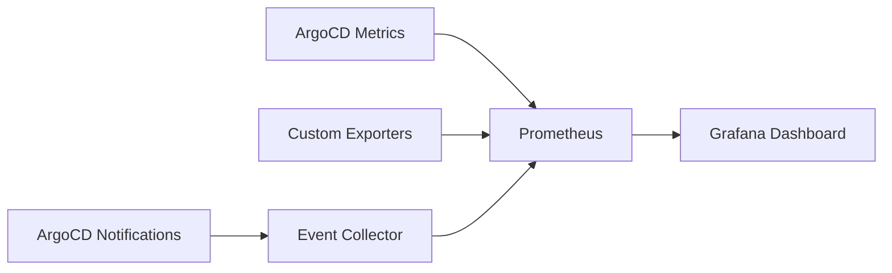

# How to Create DORA Metrics Dashboard with ArgoCD

Author: [nawazdhandala](https://github.com/nawazdhandala)

Tags: ArgoCD, GitOps, Kubernetes, DORA Metrics, Grafana

Description: Build a comprehensive DORA metrics dashboard for ArgoCD that tracks deployment frequency, lead time, change failure rate, and mean time to recovery in Grafana.

---

The four DORA metrics - Deployment Frequency, Lead Time for Changes, Change Failure Rate, and Mean Time to Recovery - are the industry standard for measuring software delivery performance. When you run ArgoCD as your deployment engine, all four metrics can be derived from ArgoCD's native telemetry combined with a few custom recording rules.

This guide walks through building a complete DORA metrics dashboard in Grafana that pulls data from ArgoCD's Prometheus metrics.

## Architecture Overview

The dashboard pulls from multiple data sources that feed into Prometheus:



You need:
1. ArgoCD Prometheus metrics (built-in)
2. Recording rules for derived metrics
3. Optional custom exporters for lead time and MTTR
4. Grafana for visualization

## Prerequisites

Ensure ArgoCD metrics are being scraped by Prometheus. Add a ServiceMonitor if you are using the Prometheus Operator:

```yaml
apiVersion: monitoring.coreos.com/v1
kind: ServiceMonitor
metadata:
  name: argocd-metrics
  namespace: argocd
  labels:
    release: prometheus
spec:
  selector:
    matchLabels:
      app.kubernetes.io/part-of: argocd
  endpoints:
    - port: metrics
      interval: 30s
    - port: server-metrics
      interval: 30s
```

## Recording Rules for DORA Metrics

Create recording rules that pre-compute DORA metrics for dashboard efficiency:

```yaml
apiVersion: monitoring.coreos.com/v1
kind: PrometheusRule
metadata:
  name: argocd-dora-recording-rules
  namespace: argocd
spec:
  groups:
    - name: argocd-dora
      interval: 5m
      rules:
        # -- Deployment Frequency --
        # Daily deployment count per app
        - record: argocd:deployments_daily:count
          expr: >
            sum(increase(
              argocd_app_sync_total{phase="Succeeded"}[24h]
            )) by (name, project)

        # Weekly deployment count per project
        - record: argocd:deployments_weekly:count
          expr: >
            sum(increase(
              argocd_app_sync_total{phase="Succeeded"}[7d]
            )) by (project)

        # -- Change Failure Rate --
        # CFR per application (7-day window)
        - record: argocd:change_failure_rate:ratio
          expr: >
            sum(increase(
              argocd_app_sync_total{phase=~"Failed|Error"}[7d]
            )) by (name)
            /
            clamp_min(
              sum(increase(
                argocd_app_sync_total[7d]
              )) by (name),
              1
            )

        # Overall CFR across all apps
        - record: argocd:change_failure_rate_overall:ratio
          expr: >
            sum(increase(
              argocd_app_sync_total{phase=~"Failed|Error"}[7d]
            ))
            /
            clamp_min(
              sum(increase(
                argocd_app_sync_total[7d]
              )),
              1
            )

        # -- Sync Duration (proxy for lead time) --
        # Average sync duration per app
        - record: argocd:sync_duration_avg:seconds
          expr: >
            avg(argocd_app_reconcile_duration_seconds)
            by (name)

        # P95 sync duration
        - record: argocd:sync_duration_p95:seconds
          expr: >
            histogram_quantile(0.95,
              sum(rate(
                argocd_app_reconcile_duration_seconds_bucket[1h]
              )) by (le, name)
            )

        # -- Health Status --
        # Count of unhealthy apps
        - record: argocd:unhealthy_apps:count
          expr: >
            count(
              argocd_app_info{health_status!="Healthy"}
            )

        # Count of out-of-sync apps
        - record: argocd:outofsync_apps:count
          expr: >
            count(
              argocd_app_info{sync_status="OutOfSync"}
            )
```

## Grafana Dashboard JSON

Here is the complete dashboard configuration. Import this into Grafana:

```json
{
  "dashboard": {
    "title": "ArgoCD DORA Metrics",
    "tags": ["argocd", "dora", "gitops"],
    "timezone": "browser",
    "panels": [
      {
        "title": "DORA Performance Level",
        "type": "stat",
        "gridPos": {"h": 4, "w": 24, "x": 0, "y": 0},
        "targets": [{
          "expr": "argocd:change_failure_rate_overall:ratio * 100",
          "legendFormat": "Change Failure Rate"
        }],
        "fieldConfig": {
          "defaults": {
            "thresholds": {
              "steps": [
                {"color": "green", "value": 0},
                {"color": "yellow", "value": 15},
                {"color": "orange", "value": 30},
                {"color": "red", "value": 46}
              ]
            },
            "unit": "percent"
          }
        }
      },
      {
        "title": "Deployment Frequency (Daily)",
        "type": "timeseries",
        "gridPos": {"h": 8, "w": 12, "x": 0, "y": 4},
        "targets": [{
          "expr": "sum(argocd:deployments_daily:count)",
          "legendFormat": "Total Deployments"
        }, {
          "expr": "sum(argocd:deployments_daily:count) by (project)",
          "legendFormat": "{{project}}"
        }]
      },
      {
        "title": "Change Failure Rate by Application",
        "type": "bargauge",
        "gridPos": {"h": 8, "w": 12, "x": 12, "y": 4},
        "targets": [{
          "expr": "topk(10, argocd:change_failure_rate:ratio * 100)",
          "legendFormat": "{{name}}"
        }],
        "fieldConfig": {
          "defaults": {
            "unit": "percent",
            "max": 100
          }
        }
      },
      {
        "title": "Sync Duration (Lead Time Proxy)",
        "type": "timeseries",
        "gridPos": {"h": 8, "w": 12, "x": 0, "y": 12},
        "targets": [{
          "expr": "argocd:sync_duration_p95:seconds",
          "legendFormat": "{{name}} P95"
        }],
        "fieldConfig": {
          "defaults": {"unit": "s"}
        }
      },
      {
        "title": "Application Health Overview",
        "type": "piechart",
        "gridPos": {"h": 8, "w": 12, "x": 12, "y": 12},
        "targets": [{
          "expr": "count(argocd_app_info) by (health_status)",
          "legendFormat": "{{health_status}}"
        }]
      },
      {
        "title": "Unhealthy Applications (Recovery Pending)",
        "type": "table",
        "gridPos": {"h": 8, "w": 24, "x": 0, "y": 20},
        "targets": [{
          "expr": "argocd_app_info{health_status!='Healthy'}",
          "format": "table",
          "instant": true
        }],
        "transformations": [{
          "id": "organize",
          "options": {
            "includeByName": {
              "name": true,
              "project": true,
              "health_status": true,
              "sync_status": true
            }
          }
        }]
      },
      {
        "title": "Deployments This Week by Project",
        "type": "bargauge",
        "gridPos": {"h": 8, "w": 12, "x": 0, "y": 28},
        "targets": [{
          "expr": "argocd:deployments_weekly:count",
          "legendFormat": "{{project}}"
        }]
      },
      {
        "title": "Git Request Latency",
        "type": "timeseries",
        "gridPos": {"h": 8, "w": 12, "x": 12, "y": 28},
        "targets": [{
          "expr": "histogram_quantile(0.95, sum(rate(argocd_git_request_duration_seconds_bucket[5m])) by (le))",
          "legendFormat": "P95 Git Fetch"
        }],
        "fieldConfig": {
          "defaults": {"unit": "s"}
        }
      }
    ],
    "templating": {
      "list": [{
        "name": "project",
        "type": "query",
        "query": "label_values(argocd_app_info, project)",
        "multi": true
      }, {
        "name": "app",
        "type": "query",
        "query": "label_values(argocd_app_info{project=~'$project'}, name)",
        "multi": true
      }]
    }
  }
}
```

## Adding the Dashboard to ArgoCD (GitOps Style)

Store the dashboard as a ConfigMap managed by ArgoCD:

```yaml
apiVersion: v1
kind: ConfigMap
metadata:
  name: argocd-dora-dashboard
  namespace: monitoring
  labels:
    grafana_dashboard: "true"
data:
  argocd-dora.json: |
    # Paste the dashboard JSON here
```

Create an ArgoCD Application to manage it:

```yaml
apiVersion: argoproj.io/v1alpha1
kind: Application
metadata:
  name: dora-dashboard
  namespace: argocd
spec:
  project: observability
  source:
    repoURL: https://github.com/your-org/platform-config
    path: dashboards/argocd-dora
    targetRevision: main
  destination:
    server: https://kubernetes.default.svc
    namespace: monitoring
  syncPolicy:
    automated:
      selfHeal: true
```

## Interpreting the Dashboard

Use the DORA benchmarks to classify your team's performance:

| Metric | Elite | High | Medium | Low |
|---|---|---|---|---|
| Deployment Frequency | Multiple/day | Weekly to daily | Monthly to weekly | Less than monthly |
| Lead Time | Under 1 hour | 1 day to 1 week | 1 week to 1 month | Over 1 month |
| Change Failure Rate | 0-15% | 16-30% | 16-30% | 46-60% |
| MTTR | Under 1 hour | Under 1 day | 1 day to 1 week | Over 6 months |

Focus on trends rather than absolute numbers. A team improving from "Low" to "Medium" is making real progress.

## Extending the Dashboard

Consider adding:

1. **Team-level views** - filter by ArgoCD project to show per-team metrics
2. **Environment comparison** - compare staging vs production metrics
3. **Trend lines** - 30-day rolling averages to smooth out noise
4. **Annotations** - mark major incidents or process changes on the timeline
5. **SLO compliance** - track how often you meet your DORA targets

## Summary

A DORA metrics dashboard for ArgoCD gives engineering leadership visibility into delivery performance. By combining ArgoCD's native Prometheus metrics with recording rules and Grafana, you can track all four DORA metrics without expensive third-party tools. Start with the basic dashboard, then extend it with custom exporters for more accurate lead time and MTTR measurements as your observability practice matures.
