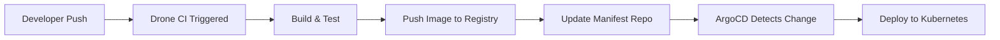

# How to Integrate ArgoCD with Drone CI

Author: [nawazdhandala](https://github.com/nawazdhandala)

Tags: ArgoCD, GitOps, Kubernetes, Drone CI, CI/CD

Description: Learn how to integrate ArgoCD with Drone CI to create a lightweight GitOps pipeline where Drone builds images and ArgoCD deploys them to Kubernetes clusters automatically.

---

Drone CI is a lightweight, container-native CI platform that pairs naturally with ArgoCD. Both tools are built with containers in mind, making the integration straightforward. Drone handles your build and test steps, then updates a Git repository that ArgoCD watches for deployment changes. This guide shows you how to set up this integration from scratch.

## The Drone CI and ArgoCD Workflow

The integration follows the standard GitOps pattern. Drone CI triggers on code changes, builds the Docker image, pushes it to a registry, and then commits the updated image tag to your deployment manifest repository. ArgoCD detects the manifest change and syncs it to the Kubernetes cluster.



## Setting Up the Drone Pipeline

### Basic Drone Pipeline Configuration

Create a `.drone.yml` file in your application repository. This pipeline builds a Docker image, pushes it to a registry, and then updates the deployment manifests.

```yaml
# .drone.yml
kind: pipeline
type: docker
name: build-and-update

trigger:
  branch:
    - main
  event:
    - push

steps:
  # Step 1: Build and push the Docker image
  - name: build-image
    image: plugins/docker
    settings:
      repo: registry.example.com/my-app
      # Use the short commit hash as the image tag
      tags:
        - ${DRONE_COMMIT_SHA:0:7}
        - latest
      username:
        from_secret: docker_username
      password:
        from_secret: docker_password

  # Step 2: Update the Kubernetes manifests
  - name: update-manifests
    image: alpine/git
    environment:
      GITHUB_TOKEN:
        from_secret: github_token
    commands:
      - apk add --no-cache sed
      - export IMAGE_TAG=${DRONE_COMMIT_SHA:0:7}
      # Clone the manifest repository
      - git clone https://$GITHUB_TOKEN@github.com/my-org/k8s-manifests.git
      - cd k8s-manifests
      # Update the image tag in the deployment file
      - sed -i "s|image: registry.example.com/my-app:.*|image: registry.example.com/my-app:$IMAGE_TAG|g" apps/my-app/deployment.yaml
      - git config user.email "drone@example.com"
      - git config user.name "Drone CI"
      - git add .
      - git commit -m "[drone] Update my-app image to $IMAGE_TAG"
      - git push origin main
```

### Using Kustomize for Manifest Updates

If your manifests use Kustomize, you can use the `kustomize edit` command instead of sed for cleaner image updates.

```yaml
  # Step 2: Update manifests using Kustomize
  - name: update-manifests
    image: line/kubectl-kustomize:latest
    environment:
      GITHUB_TOKEN:
        from_secret: github_token
    commands:
      - export IMAGE_TAG=${DRONE_COMMIT_SHA:0:7}
      - git clone https://$GITHUB_TOKEN@github.com/my-org/k8s-manifests.git
      - cd k8s-manifests/overlays/production
      # Use kustomize to set the image
      - kustomize edit set image registry.example.com/my-app=registry.example.com/my-app:$IMAGE_TAG
      - git config user.email "drone@example.com"
      - git config user.name "Drone CI"
      - git add .
      - git commit -m "[drone] Update my-app image to $IMAGE_TAG"
      - git push origin main
```

## Configuring the ArgoCD Application

Create an ArgoCD Application that watches the manifest repository for changes.

```yaml
# argocd-app.yaml
apiVersion: argoproj.io/v1alpha1
kind: Application
metadata:
  name: my-app
  namespace: argocd
spec:
  project: default
  source:
    repoURL: https://github.com/my-org/k8s-manifests.git
    targetRevision: main
    path: apps/my-app
  destination:
    server: https://kubernetes.default.svc
    namespace: production
  syncPolicy:
    automated:
      prune: true
      selfHeal: true
    retry:
      limit: 3
      backoff:
        duration: 5s
        factor: 2
        maxDuration: 3m
```

## Triggering ArgoCD Sync Directly from Drone

Instead of waiting for ArgoCD to poll for changes, you can trigger a sync directly from the Drone pipeline using the ArgoCD CLI.

```yaml
  # Step 3: Trigger ArgoCD sync
  - name: sync-argocd
    image: argoproj/argocd:v2.10.0
    environment:
      ARGOCD_SERVER:
        from_secret: argocd_server
      ARGOCD_AUTH_TOKEN:
        from_secret: argocd_token
    commands:
      # Trigger sync and wait for completion
      - argocd app sync my-app --grpc-web
      - argocd app wait my-app --health --grpc-web --timeout 300
```

## Using Drone Plugins for ArgoCD

The community has created Drone plugins specifically for ArgoCD integration. These simplify the configuration.

```yaml
  # Using the ArgoCD Drone plugin
  - name: deploy
    image: quay.io/argoproj/argocd
    environment:
      ARGOCD_SERVER:
        from_secret: argocd_server
      ARGOCD_AUTH_TOKEN:
        from_secret: argocd_token
    commands:
      - argocd app sync my-app --grpc-web --force
      - argocd app wait my-app --health --grpc-web
```

## Multi-Environment Deployments with Drone

For deploying to multiple environments, structure your Drone pipeline with promotion steps.

```yaml
kind: pipeline
type: docker
name: deploy-staging

trigger:
  branch:
    - main
  event:
    - push

steps:
  - name: build-image
    image: plugins/docker
    settings:
      repo: registry.example.com/my-app
      tags:
        - ${DRONE_COMMIT_SHA:0:7}
      username:
        from_secret: docker_username
      password:
        from_secret: docker_password

  - name: update-staging-manifests
    image: alpine/git
    environment:
      GITHUB_TOKEN:
        from_secret: github_token
    commands:
      - export IMAGE_TAG=${DRONE_COMMIT_SHA:0:7}
      - git clone https://$GITHUB_TOKEN@github.com/my-org/k8s-manifests.git
      - cd k8s-manifests/overlays/staging
      - sed -i "s|image: registry.example.com/my-app:.*|image: registry.example.com/my-app:$IMAGE_TAG|g" deployment.yaml
      - git config user.email "drone@example.com"
      - git config user.name "Drone CI"
      - git add .
      - git commit -m "[drone] Update staging my-app to $IMAGE_TAG"
      - git push origin main

---
kind: pipeline
type: docker
name: deploy-production

trigger:
  event:
    - promote
  target:
    - production

steps:
  - name: update-production-manifests
    image: alpine/git
    environment:
      GITHUB_TOKEN:
        from_secret: github_token
    commands:
      - export IMAGE_TAG=${DRONE_DEPLOY_TO}
      - git clone https://$GITHUB_TOKEN@github.com/my-org/k8s-manifests.git
      - cd k8s-manifests/overlays/production
      - sed -i "s|image: registry.example.com/my-app:.*|image: registry.example.com/my-app:$IMAGE_TAG|g" deployment.yaml
      - git config user.email "drone@example.com"
      - git config user.name "Drone CI"
      - git add .
      - git commit -m "[drone] Update production my-app to $IMAGE_TAG"
      - git push origin main
```

You can then promote to production using the Drone CLI:

```bash
# Promote build number 42 to production
drone build promote my-org/my-app 42 production
```

## Setting Up Drone Secrets

Drone stores secrets securely per repository. Add the required secrets using the Drone CLI.

```bash
# Add Docker registry credentials
drone secret add --repository my-org/my-app --name docker_username --data "myuser"
drone secret add --repository my-org/my-app --name docker_password --data "mypassword"

# Add GitHub token for manifest repo access
drone secret add --repository my-org/my-app --name github_token --data "ghp_xxxx"

# Add ArgoCD credentials
drone secret add --repository my-org/my-app --name argocd_server --data "argocd.example.com"
drone secret add --repository my-org/my-app --name argocd_token --data "eyJhbGciOiJIUzI1NiJ9..."
```

## Adding Deployment Verification

Add a verification step that checks if the deployment is healthy after ArgoCD syncs.

```yaml
  - name: verify-deployment
    image: bitnami/kubectl:latest
    environment:
      KUBECONFIG_DATA:
        from_secret: kubeconfig
    commands:
      - echo "$KUBECONFIG_DATA" > /tmp/kubeconfig
      - export KUBECONFIG=/tmp/kubeconfig
      # Wait for rollout to complete
      - kubectl rollout status deployment/my-app -n production --timeout=300s
      # Run a quick health check
      - kubectl get pods -n production -l app=my-app -o wide
```

## Monitoring and Observability

Track your Drone-to-ArgoCD deployments by integrating with monitoring tools. You can configure ArgoCD notifications to report deployment outcomes back to your team. For comprehensive monitoring of both your CI pipeline and deployment health, consider using OneUptime to monitor ArgoCD metrics.

## Troubleshooting Common Issues

**Drone cannot clone the manifest repo** - Verify the GitHub token has write permissions to the manifest repository and has not expired.

**Git push fails with conflict** - If multiple pipelines run simultaneously, you may get merge conflicts. Add a retry loop around the git push or use a locking mechanism.

**ArgoCD sync times out** - Increase the timeout in the `argocd app wait` command. Also check if the application has resource limits that prevent pods from starting.

**Image not found after push** - Make sure the registry URL in the Drone pipeline matches the image reference in your Kubernetes manifests exactly, including the registry hostname.

Drone CI and ArgoCD make a lightweight, powerful combination for GitOps pipelines. Drone keeps the CI side simple with its container-native approach, and ArgoCD ensures your Kubernetes deployments stay in sync with Git.
