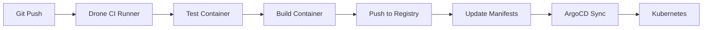

# How to Create a Complete Drone CI + ArgoCD Pipeline

Author: [nawazdhandala](https://github.com/nawazdhandala)

Tags: ArgoCD, GitOps, Kubernetes, Drone CI, CI/CD

Description: Learn how to build a complete CI/CD pipeline using Drone CI for container-native continuous integration with ArgoCD for GitOps continuous deployment to Kubernetes.

---

Drone CI is a lightweight, container-native CI platform that runs every pipeline step in an isolated container. Its simplicity and Docker-first approach make it a natural fit for teams building container-based applications. Paired with ArgoCD for the deployment side, you get a minimal-overhead CI/CD pipeline that is easy to understand and maintain.

This guide covers building a complete Drone CI + ArgoCD pipeline.

## Architecture

Drone CI runs pipelines where each step is a Docker container. After building and pushing the application image, it updates the deployment repository that ArgoCD watches:



## Deploying Drone CI with ArgoCD

Deploy Drone CI itself using ArgoCD:

```yaml
# drone-server-app.yaml
apiVersion: argoproj.io/v1alpha1
kind: Application
metadata:
  name: drone-server
  namespace: argocd
spec:
  project: platform
  source:
    repoURL: https://github.com/myorg/k8s-platform.git
    path: drone/server
    targetRevision: main
  destination:
    server: https://kubernetes.default.svc
    namespace: drone
  syncPolicy:
    automated:
      selfHeal: true
    syncOptions:
      - CreateNamespace=true
```

Drone server deployment:

```yaml
# drone/server/deployment.yaml
apiVersion: apps/v1
kind: Deployment
metadata:
  name: drone-server
  namespace: drone
spec:
  replicas: 1
  selector:
    matchLabels:
      app: drone-server
  template:
    metadata:
      labels:
        app: drone-server
    spec:
      containers:
        - name: drone
          image: drone/drone:2
          ports:
            - containerPort: 80
            - containerPort: 443
          env:
            - name: DRONE_GITHUB_CLIENT_ID
              valueFrom:
                secretKeyRef:
                  name: drone-secrets
                  key: github-client-id
            - name: DRONE_GITHUB_CLIENT_SECRET
              valueFrom:
                secretKeyRef:
                  name: drone-secrets
                  key: github-client-secret
            - name: DRONE_RPC_SECRET
              valueFrom:
                secretKeyRef:
                  name: drone-secrets
                  key: rpc-secret
            - name: DRONE_SERVER_HOST
              value: drone.internal.example.com
            - name: DRONE_SERVER_PROTO
              value: https
            - name: DRONE_DATABASE_DRIVER
              value: postgres
            - name: DRONE_DATABASE_DATASOURCE
              valueFrom:
                secretKeyRef:
                  name: drone-secrets
                  key: database-url
          resources:
            requests:
              cpu: 200m
              memory: 256Mi
          volumeMounts:
            - name: data
              mountPath: /data
      volumes:
        - name: data
          persistentVolumeClaim:
            claimName: drone-data
```

Drone runner for Kubernetes:

```yaml
# drone/runner/deployment.yaml
apiVersion: apps/v1
kind: Deployment
metadata:
  name: drone-runner
  namespace: drone
spec:
  replicas: 2
  selector:
    matchLabels:
      app: drone-runner
  template:
    metadata:
      labels:
        app: drone-runner
    spec:
      serviceAccountName: drone-runner
      containers:
        - name: runner
          image: drone/drone-runner-kube:latest
          env:
            - name: DRONE_RPC_HOST
              value: drone-server.drone.svc.cluster.local
            - name: DRONE_RPC_PROTO
              value: http
            - name: DRONE_RPC_SECRET
              valueFrom:
                secretKeyRef:
                  name: drone-secrets
                  key: rpc-secret
            - name: DRONE_NAMESPACE_DEFAULT
              value: drone-pipelines
            - name: DRONE_RUNNER_CAPACITY
              value: "5"
          resources:
            requests:
              cpu: 100m
              memory: 128Mi
```

## Drone Pipeline Configuration

The `.drone.yml` file in your application repository:

```yaml
# .drone.yml
kind: pipeline
type: kubernetes
name: ci-cd

trigger:
  branch:
    - main
  event:
    - push

steps:
  - name: test
    image: node:20-alpine
    commands:
      - npm ci
      - npm run test
      - npm run lint

  - name: security-scan
    image: aquasec/trivy:latest
    commands:
      - trivy fs --exit-code 0 --severity HIGH,CRITICAL .
    failure: ignore

  - name: build-and-push
    image: plugins/docker
    settings:
      repo: ghcr.io/myorg/api-service
      tags:
        - ${DRONE_COMMIT_SHA:0:7}
        - latest
      username:
        from_secret: docker_username
      password:
        from_secret: docker_password
      registry: ghcr.io

  - name: update-deployment
    image: alpine/git:2.43.0
    environment:
      SSH_KEY:
        from_secret: deploy_ssh_key
    commands:
      - |
        # Configure SSH
        mkdir -p ~/.ssh
        echo "$SSH_KEY" > ~/.ssh/id_rsa
        chmod 600 ~/.ssh/id_rsa
        ssh-keyscan github.com >> ~/.ssh/known_hosts

        # Get short SHA
        SHORT_SHA=$(echo $DRONE_COMMIT_SHA | cut -c1-7)

        # Clone deployment repo
        git clone git@github.com:myorg/k8s-deployments.git /tmp/deploy
        cd /tmp/deploy

        # Update image tag
        sed -i "s|image: ghcr.io/myorg/api-service:.*|image: ghcr.io/myorg/api-service:${SHORT_SHA}|" \
            apps/api-service/deployment.yaml

        # Commit and push
        git config user.name "Drone CI"
        git config user.email "drone@myorg.com"
        git add .
        git commit -m "Deploy api-service ${SHORT_SHA}

        Drone Build: ${DRONE_BUILD_LINK}
        Commit: ${DRONE_COMMIT_SHA}"
        git push origin main

---
# Separate pipeline for pull requests (test only)
kind: pipeline
type: kubernetes
name: pr-check

trigger:
  event:
    - pull_request

steps:
  - name: test
    image: node:20-alpine
    commands:
      - npm ci
      - npm run test

  - name: lint
    image: node:20-alpine
    commands:
      - npm ci
      - npm run lint
```

## ArgoCD Application

```yaml
# argocd/api-service-app.yaml
apiVersion: argoproj.io/v1alpha1
kind: Application
metadata:
  name: api-service
  namespace: argocd
spec:
  project: applications
  source:
    repoURL: https://github.com/myorg/k8s-deployments.git
    path: apps/api-service
    targetRevision: main
  destination:
    server: https://kubernetes.default.svc
    namespace: production
  syncPolicy:
    automated:
      selfHeal: true
      prune: true
```

## Multi-Environment Pipeline

Handle different environments with Drone pipeline conditions:

```yaml
# .drone.yml
kind: pipeline
type: kubernetes
name: deploy-staging

trigger:
  branch:
    - main
  event:
    - push

steps:
  - name: test
    image: node:20-alpine
    commands:
      - npm ci
      - npm test

  - name: build-and-push
    image: plugins/docker
    settings:
      repo: ghcr.io/myorg/api-service
      tags:
        - ${DRONE_COMMIT_SHA:0:7}
      registry: ghcr.io
      username:
        from_secret: docker_username
      password:
        from_secret: docker_password

  - name: deploy-staging
    image: alpine/git:2.43.0
    environment:
      SSH_KEY:
        from_secret: deploy_ssh_key
    commands:
      - |
        SHORT_SHA=$(echo $DRONE_COMMIT_SHA | cut -c1-7)
        mkdir -p ~/.ssh
        echo "$SSH_KEY" > ~/.ssh/id_rsa
        chmod 600 ~/.ssh/id_rsa
        ssh-keyscan github.com >> ~/.ssh/known_hosts

        git clone git@github.com:myorg/k8s-deployments.git /tmp/deploy
        cd /tmp/deploy

        sed -i "s|image: ghcr.io/myorg/api-service:.*|image: ghcr.io/myorg/api-service:${SHORT_SHA}|" \
            apps/api-service/overlays/staging/kustomization.yaml

        git config user.name "Drone CI"
        git config user.email "drone@myorg.com"
        git add .
        git commit -m "Deploy api-service ${SHORT_SHA} to staging"
        git push origin main

---
kind: pipeline
type: kubernetes
name: deploy-production

trigger:
  event:
    - promote
  target:
    - production

steps:
  - name: deploy-production
    image: alpine/git:2.43.0
    environment:
      SSH_KEY:
        from_secret: deploy_ssh_key
    commands:
      - |
        SHORT_SHA=$(echo $DRONE_COMMIT_SHA | cut -c1-7)
        mkdir -p ~/.ssh
        echo "$SSH_KEY" > ~/.ssh/id_rsa
        chmod 600 ~/.ssh/id_rsa
        ssh-keyscan github.com >> ~/.ssh/known_hosts

        git clone git@github.com:myorg/k8s-deployments.git /tmp/deploy
        cd /tmp/deploy

        sed -i "s|image: ghcr.io/myorg/api-service:.*|image: ghcr.io/myorg/api-service:${SHORT_SHA}|" \
            apps/api-service/overlays/production/kustomization.yaml

        git config user.name "Drone CI"
        git config user.email "drone@myorg.com"
        git add .
        git commit -m "Deploy api-service ${SHORT_SHA} to production"
        git push origin main
```

Promote to production using the Drone CLI:

```bash
# Promote a specific build to production
drone build promote myorg/api-service 42 production
```

## Drone Secrets Management

Drone secrets integrate with Kubernetes secrets. Configure them through the Drone UI or CLI:

```bash
# Add secrets via Drone CLI
drone secret add --repository myorg/api-service \
    --name docker_username --data "myuser"

drone secret add --repository myorg/api-service \
    --name docker_password --data "mytoken"

drone secret add --repository myorg/api-service \
    --name deploy_ssh_key --data @~/.ssh/deploy_key
```

For organization-wide secrets:

```bash
drone orgsecret add myorg docker_username "myuser"
drone orgsecret add myorg docker_password "mytoken"
```

## Drone Plugins for ArgoCD

Use the ArgoCD Drone plugin to trigger syncs directly:

```yaml
  - name: argocd-sync
    image: argoproj/argocd:v2.10.0
    environment:
      ARGOCD_SERVER: argocd.example.com
      ARGOCD_AUTH_TOKEN:
        from_secret: argocd_token
    commands:
      - |
        argocd app sync api-service \
            --server $ARGOCD_SERVER \
            --auth-token $ARGOCD_AUTH_TOKEN \
            --grpc-web

        argocd app wait api-service \
            --server $ARGOCD_SERVER \
            --auth-token $ARGOCD_AUTH_TOKEN \
            --grpc-web \
            --timeout 300
```

## Monitoring and Notifications

Send build notifications using Drone's webhook or Slack plugin:

```yaml
  - name: notify-success
    image: plugins/slack
    settings:
      webhook:
        from_secret: slack_webhook
      channel: deployments
      template: |
        api-service deployed successfully
        Commit: {{build.commit}}
        Build: {{build.link}}
    when:
      status:
        - success

  - name: notify-failure
    image: plugins/slack
    settings:
      webhook:
        from_secret: slack_webhook
      channel: deployments
      template: |
        api-service deployment FAILED
        Commit: {{build.commit}}
        Build: {{build.link}}
    when:
      status:
        - failure
```

## Summary

Drone CI + ArgoCD creates a lightweight, container-native CI/CD pipeline. Drone's simplicity - every step runs in a container, configuration is a single YAML file - makes it easy to set up and maintain. ArgoCD handles the deployment side through GitOps, watching the deployment repository for changes. The promote feature in Drone provides a clean mechanism for production deployments with manual approval. Both tools can run in your Kubernetes cluster, managed by ArgoCD itself.
