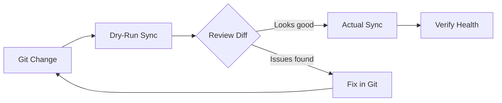

# How to Implement Dry-Run Syncs in ArgoCD

Author: [nawazdhandala](https://github.com/nawazdhandala)

Tags: ArgoCD, GitOps, Kubernetes, Deployments, Testing

Description: Learn how to implement dry-run syncs in ArgoCD to preview what changes will be applied before actually syncing, reducing deployment risk.

---

A dry-run sync lets you see exactly what ArgoCD will do when it syncs an application - without actually doing it. This is invaluable for validating changes before they hit your cluster, especially for production environments where you want to review every modification before it goes live.

This guide covers the different ways to implement dry-run syncs in ArgoCD.

## Why Dry-Run Syncs Matter

Even with thorough testing in CI, the actual sync operation can produce unexpected results. Resources might conflict with existing objects, admission webhooks might reject changes, or the diff between desired and live state might be larger than expected. A dry-run lets you catch these issues before they affect running workloads.



## Method 1: ArgoCD CLI Dry-Run

The ArgoCD CLI supports a `--dry-run` flag on the sync command:

```bash
# Dry-run sync - shows what would change without applying
argocd app sync my-app --dry-run

# Dry-run with specific resources
argocd app sync my-app --dry-run \
  --resource apps/Deployment/my-app \
  --resource /Service/my-app

# Dry-run with prune preview
argocd app sync my-app --dry-run --prune
```

The output shows the sync operations that would be performed:

```text
TIMESTAMP  GROUP  KIND        NAMESPACE   NAME    STATUS  HEALTH   HOOK  MESSAGE
           apps   Deployment  production  my-app  Synced  Healthy        deployment.apps/my-app configured (dry run)
                  Service     production  my-app  Synced  Healthy        service/my-app unchanged (dry run)
                  ConfigMap   production  config  Synced            	   configmap/config configured (dry run)
```

## Method 2: kubectl Dry-Run with ArgoCD Manifests

Generate the manifests ArgoCD would apply and test them with kubectl dry-run:

```bash
# Get the manifests ArgoCD would sync
argocd app manifests my-app --source git > /tmp/desired-manifests.yaml

# Server-side dry-run against the cluster
kubectl apply --dry-run=server -f /tmp/desired-manifests.yaml

# Client-side dry-run (no cluster needed)
kubectl apply --dry-run=client -f /tmp/desired-manifests.yaml
```

Server-side dry-run is more thorough because it processes the request through admission controllers:

```bash
# Server-side dry-run with diff output
kubectl diff -f /tmp/desired-manifests.yaml
```

The `kubectl diff` command shows exactly what would change:

```diff
diff -u -N /tmp/LIVE-123/apps.v1.Deployment.production.my-app /tmp/MERGED-456/apps.v1.Deployment.production.my-app
--- /tmp/LIVE-123/apps.v1.Deployment.production.my-app
+++ /tmp/MERGED-456/apps.v1.Deployment.production.my-app
@@ -15,7 +15,7 @@
     spec:
       containers:
       - name: my-app
-        image: myorg/my-app:v1.0.0
+        image: myorg/my-app:v2.0.0
         resources:
           limits:
-            memory: 512Mi
+            memory: 1Gi
```

## Method 3: ArgoCD Server-Side Diff

ArgoCD 2.10+ supports server-side diff, which uses the Kubernetes API server to compute the diff. This gives the most accurate preview:

```yaml
apiVersion: argoproj.io/v1alpha1
kind: Application
metadata:
  name: my-app
  annotations:
    # Enable server-side diff for this application
    argocd.argoproj.io/compare-options: ServerSideDiff=true
spec:
  project: production
  source:
    repoURL: https://github.com/myorg/gitops-repo
    path: apps/my-app/production
    targetRevision: main
  destination:
    server: https://kubernetes.default.svc
    namespace: production
```

With server-side diff enabled, the diff shown in the ArgoCD UI and CLI is exactly what would change on sync. This eliminates false positives from client-side diffing.

## Method 4: Preview Environments

For complex changes, spin up a preview environment to test the sync:

```yaml
# argocd-apps/my-app-preview.yaml
apiVersion: argoproj.io/v1alpha1
kind: Application
metadata:
  name: my-app-preview
  namespace: argocd
  labels:
    type: preview
spec:
  project: preview
  source:
    repoURL: https://github.com/myorg/gitops-repo
    path: apps/my-app/staging
    targetRevision: feature/new-deployment  # Preview branch
  destination:
    server: https://kubernetes.default.svc
    namespace: preview-my-app
  syncPolicy:
    automated:
      selfHeal: true
      prune: true
    syncOptions:
      - CreateNamespace=true
```

This deploys your changes to an isolated namespace where you can verify behavior before syncing to production.

## Method 5: Sync Hooks for Validation

Use ArgoCD sync hooks to run validation before the actual sync:

```yaml
# pre-sync-validate.yaml
apiVersion: batch/v1
kind: Job
metadata:
  name: pre-sync-validation
  annotations:
    argocd.argoproj.io/hook: PreSync
    argocd.argoproj.io/hook-delete-policy: HookSucceeded
spec:
  template:
    spec:
      containers:
        - name: validate
          image: bitnami/kubectl:latest
          command:
            - /bin/bash
            - -c
            - |
              echo "Running pre-sync validation..."

              # Check if the namespace exists
              kubectl get namespace production || {
                echo "FAIL: Namespace production does not exist"
                exit 1
              }

              # Check cluster resources
              kubectl top nodes || echo "Metrics unavailable"

              # Verify no conflicting resources
              kubectl get deployment my-app -n production -o yaml | \
                grep -q "paused: true" && {
                  echo "FAIL: Deployment is paused"
                  exit 1
                }

              echo "Pre-sync validation passed!"
      restartPolicy: Never
  backoffLimit: 0
```

## Method 6: CI Pipeline Dry-Run

Run dry-runs in your CI pipeline before merging to the main branch:

```yaml
# .github/workflows/dry-run.yaml
name: ArgoCD Dry-Run
on:
  pull_request:
    paths:
      - 'apps/**'

jobs:
  dry-run:
    runs-on: ubuntu-latest
    steps:
      - uses: actions/checkout@v4

      - name: Install ArgoCD CLI
        run: |
          curl -sSL -o /usr/local/bin/argocd \
            https://github.com/argoproj/argo-cd/releases/latest/download/argocd-linux-amd64
          chmod +x /usr/local/bin/argocd

      - name: Login to ArgoCD
        run: |
          argocd login $ARGOCD_SERVER \
            --username $ARGOCD_USER \
            --password $ARGOCD_PASSWORD \
            --grpc-web
        env:
          ARGOCD_SERVER: ${{ secrets.ARGOCD_SERVER }}
          ARGOCD_USER: ${{ secrets.ARGOCD_USER }}
          ARGOCD_PASSWORD: ${{ secrets.ARGOCD_PASSWORD }}

      - name: Dry-run changed applications
        run: |
          # Find which apps changed
          changed_files=$(git diff --name-only origin/main...HEAD)

          for file in $changed_files; do
            # Extract app name from path
            app_name=$(echo "$file" | cut -d'/' -f2)

            echo "=== Dry-run for: $app_name ==="
            argocd app diff "$app_name" \
              --local "apps/$app_name/production/" || true
          done

      - name: Post diff as PR comment
        uses: actions/github-script@v7
        with:
          script: |
            // Post the diff output as a PR comment
            // for team review before merging
```

## Automating Dry-Run Approval

Combine dry-runs with an approval workflow:

```yaml
# .github/workflows/deploy-with-approval.yaml
name: Deploy with Approval
on:
  push:
    branches: [main]
    paths: ['apps/**']

jobs:
  dry-run:
    runs-on: ubuntu-latest
    outputs:
      has_changes: ${{ steps.diff.outputs.has_changes }}
    steps:
      - uses: actions/checkout@v4

      - name: Generate diff
        id: diff
        run: |
          # Run argocd diff and capture output
          diff_output=$(argocd app diff my-app --local apps/my-app/production/ 2>&1) || true
          if [ -n "$diff_output" ]; then
            echo "has_changes=true" >> $GITHUB_OUTPUT
            echo "$diff_output" > /tmp/diff.txt
          else
            echo "has_changes=false" >> $GITHUB_OUTPUT
          fi

  approve:
    needs: dry-run
    if: needs.dry-run.outputs.has_changes == 'true'
    environment: production  # Requires manual approval
    runs-on: ubuntu-latest
    steps:
      - name: Sync application
        run: argocd app sync my-app
```

## Best Practices for Dry-Run Syncs

1. **Always dry-run production changes.** Make it a team policy that no production sync happens without a dry-run review.

2. **Use server-side diff for accuracy.** Client-side diffs can have false positives. Server-side diff through the API server gives you the real picture.

3. **Automate dry-runs in CI.** Post the diff as a PR comment so reviewers can see exactly what will change.

4. **Set up alerts for unexpected diffs.** If a dry-run shows changes you did not expect, investigate before syncing.

5. **Monitor sync outcomes with OneUptime.** Track how often dry-run predictions match actual sync results. [OneUptime](https://oneuptime.com) can help you build confidence metrics for your deployment pipeline.

## Conclusion

Dry-run syncs are a safety mechanism that costs almost nothing to implement but prevents costly deployment mistakes. Whether you use the ArgoCD CLI dry-run flag, kubectl server-side dry-run, or full preview environments, the principle is the same: review before you apply. Make dry-runs a standard part of your deployment workflow, especially for production, and you will catch issues before they affect users.
