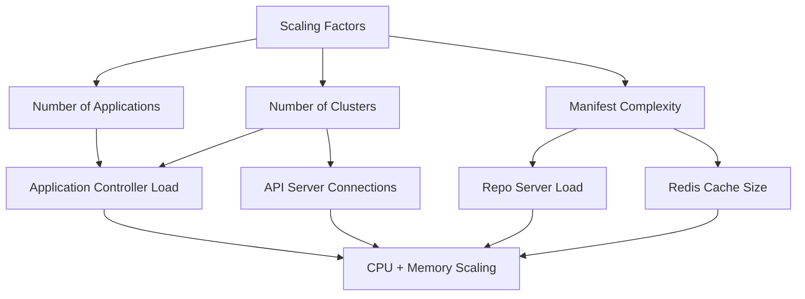

# How to Handle ArgoCD During Capacity Planning

Author: [nawazdhandala](https://github.com/nawazdhandala)

Tags: ArgoCD, GitOps, Kubernetes, Capacity Planning, Performance

Description: Learn how to plan capacity for ArgoCD as your Kubernetes deployment scales, including resource sizing, performance tuning, and scaling strategies for large environments.

---

As your Kubernetes environment grows, ArgoCD needs to scale with it. What works for 10 applications on a single cluster will not work for 500 applications across 20 clusters. Capacity planning for ArgoCD involves understanding its resource consumption patterns, identifying bottlenecks before they become outages, and scaling the right components at the right time.

## ArgoCD Resource Consumption Model

ArgoCD's resource usage scales primarily with three factors:

1. **Number of applications** - Each application requires reconciliation cycles
2. **Number of clusters** - Each cluster requires an active connection
3. **Size and complexity of manifests** - Large Helm charts or many Kustomize overlays consume more CPU and memory



## Measuring Current Usage

Before planning capacity, measure your current baseline.

```bash
# Current resource usage for all ArgoCD components
kubectl top pods -n argocd

# Resource requests and limits
kubectl get pods -n argocd -o json | \
  jq -r '.items[] | "\(.metadata.name)\t CPU-req: \(.spec.containers[0].resources.requests.cpu // "none")\t MEM-req: \(.spec.containers[0].resources.requests.memory // "none")\t CPU-limit: \(.spec.containers[0].resources.limits.cpu // "none")\t MEM-limit: \(.spec.containers[0].resources.limits.memory // "none")"'

# Current application count
argocd app list -o json | jq length

# Current cluster count
argocd cluster list -o json | jq length
```

### Key Prometheus Metrics for Capacity Planning

```promql
# Application controller CPU usage over time
rate(container_cpu_usage_seconds_total{namespace="argocd", container="argocd-application-controller"}[5m])

# Application controller memory usage
container_memory_working_set_bytes{namespace="argocd", container="argocd-application-controller"}

# Repo server CPU and memory
rate(container_cpu_usage_seconds_total{namespace="argocd", container="argocd-repo-server"}[5m])
container_memory_working_set_bytes{namespace="argocd", container="argocd-repo-server"}

# Redis memory usage
redis_memory_used_bytes{namespace="argocd"}

# Reconciliation queue depth (indicates if controller is keeping up)
workqueue_depth{name="app_reconciliation_queue"}

# Average reconciliation time
histogram_quantile(0.95, sum(rate(argocd_app_reconcile_bucket[5m])) by (le))
```

## Sizing Guidelines

Here are approximate resource recommendations based on scale.

### Small (up to 50 applications, 1 to 3 clusters)

```yaml
# Application Controller
resources:
  requests:
    cpu: 250m
    memory: 512Mi
  limits:
    cpu: 1000m
    memory: 1Gi

# Repo Server
resources:
  requests:
    cpu: 250m
    memory: 256Mi
  limits:
    cpu: 1000m
    memory: 1Gi

# API Server
resources:
  requests:
    cpu: 100m
    memory: 256Mi
  limits:
    cpu: 500m
    memory: 512Mi

# Redis
resources:
  requests:
    cpu: 100m
    memory: 128Mi
  limits:
    cpu: 500m
    memory: 256Mi
```

### Medium (50 to 200 applications, 3 to 10 clusters)

```yaml
# Application Controller
resources:
  requests:
    cpu: 1000m
    memory: 2Gi
  limits:
    cpu: 2000m
    memory: 4Gi

# Repo Server (2 replicas)
resources:
  requests:
    cpu: 500m
    memory: 1Gi
  limits:
    cpu: 2000m
    memory: 2Gi

# API Server (2 replicas)
resources:
  requests:
    cpu: 250m
    memory: 512Mi
  limits:
    cpu: 1000m
    memory: 1Gi

# Redis
resources:
  requests:
    cpu: 250m
    memory: 256Mi
  limits:
    cpu: 1000m
    memory: 512Mi
```

### Large (200+ applications, 10+ clusters)

Use the HA installation and configure sharding.

```bash
# Install HA manifests
kubectl apply -n argocd -f https://raw.githubusercontent.com/argoproj/argo-cd/stable/manifests/ha/install.yaml
```

```yaml
# Application Controller - HA with sharding
resources:
  requests:
    cpu: 2000m
    memory: 4Gi
  limits:
    cpu: 4000m
    memory: 8Gi
# Multiple replicas with cluster sharding

# Repo Server (3+ replicas)
resources:
  requests:
    cpu: 1000m
    memory: 2Gi
  limits:
    cpu: 4000m
    memory: 4Gi

# API Server (3+ replicas)
resources:
  requests:
    cpu: 500m
    memory: 1Gi
  limits:
    cpu: 2000m
    memory: 2Gi

# Redis HA (Sentinel)
resources:
  requests:
    cpu: 500m
    memory: 512Mi
  limits:
    cpu: 1000m
    memory: 1Gi
```

## Scaling Strategies

### Scaling the Application Controller with Sharding

For large environments, shard the application controller so different replicas handle different clusters.

```bash
# Set the number of controller shards
kubectl patch statefulset argocd-application-controller -n argocd \
  --type merge -p '{"spec":{"replicas":3}}'

# Configure the shard count in the controller
kubectl patch configmap argocd-cmd-params-cm -n argocd --type merge -p '{
  "data": {
    "controller.sharding.algorithm": "round-robin",
    "controller.replicas": "3"
  }
}'
```

For more on sharding, see [ArgoCD hash-based sharding](https://oneuptime.com/blog/post/2026-02-26-argocd-hash-based-sharding/view) and [configuring controller shard count](https://oneuptime.com/blog/post/2026-02-26-argocd-configure-controller-shard-count/view).

### Scaling the Repo Server

The repo server handles manifest generation. Scale it when you see high latency or queuing.

```bash
# Scale repo server replicas
kubectl scale deployment argocd-repo-server -n argocd --replicas=3

# Increase parallelism per replica
kubectl patch configmap argocd-cmd-params-cm -n argocd --type merge -p '{
  "data": {
    "reposerver.parallelism.limit": "10"
  }
}'
```

### Scaling the API Server

Scale the API server for more concurrent users and API requests.

```bash
kubectl scale deployment argocd-server -n argocd --replicas=3
```

### Redis Scaling

For large environments, switch to Redis HA with Sentinel.

```yaml
# Redis HA configuration (part of the HA install manifests)
# Provides 3 Redis replicas with Sentinel for automatic failover
```

Monitor Redis memory to prevent cache eviction.

```bash
# Check Redis memory usage
kubectl exec -n argocd deployment/argocd-redis -- redis-cli info memory | grep used_memory_human
```

## Tuning Reconciliation Frequency

As the number of applications grows, the default 3-minute reconciliation interval may be too aggressive.

```yaml
# Increase reconciliation interval for large environments
apiVersion: v1
kind: ConfigMap
metadata:
  name: argocd-cm
  namespace: argocd
data:
  # Increase from default 180s to 300s
  timeout.reconciliation: "300s"
```

For applications that do not change frequently, set per-application reconciliation.

```yaml
apiVersion: argoproj.io/v1alpha1
kind: Application
metadata:
  name: stable-infra
  namespace: argocd
  annotations:
    # This application only reconciles every 10 minutes
    argocd.argoproj.io/refresh: "600"
spec:
  # ...
```

## Capacity Planning Process

### Step 1: Project Growth

Estimate how many applications and clusters you will have in 6 and 12 months.

```text
Current: 100 apps, 5 clusters
6 months: 200 apps, 8 clusters
12 months: 400 apps, 15 clusters
```

### Step 2: Calculate Resource Needs

Use your current per-application resource consumption to project.

```promql
# Current CPU per application
sum(rate(container_cpu_usage_seconds_total{namespace="argocd"}[1h])) / count(argocd_app_info)

# Current memory per application
sum(container_memory_working_set_bytes{namespace="argocd"}) / count(argocd_app_info)
```

Multiply by projected application count and add a 30% buffer.

### Step 3: Plan Scaling Milestones

```text
At 150 apps: Scale repo server to 2 replicas
At 200 apps: Enable HA installation
At 300 apps: Enable controller sharding (3 shards)
At 500 apps: Scale repo server to 5 replicas, increase Redis memory
```

### Step 4: Set Up Capacity Alerts

```yaml
apiVersion: monitoring.coreos.com/v1
kind: PrometheusRule
metadata:
  name: argocd-capacity-alerts
  namespace: argocd
spec:
  groups:
    - name: argocd-capacity
      rules:
        - alert: ArgoCDControllerHighMemory
          expr: |
            container_memory_working_set_bytes{namespace="argocd", container="argocd-application-controller"}
            / on(pod) kube_pod_container_resource_limits{namespace="argocd", container="argocd-application-controller", resource="memory"}
            > 0.85
          for: 10m
          labels:
            severity: warning
          annotations:
            summary: "ArgoCD controller memory usage is above 85%"

        - alert: ArgoCDReconciliationSlow
          expr: |
            histogram_quantile(0.95, sum(rate(argocd_app_reconcile_bucket[5m])) by (le))
            > 30
          for: 15m
          labels:
            severity: warning
          annotations:
            summary: "ArgoCD reconciliation P95 is above 30 seconds"

        - alert: ArgoCDRepoServerQueueHigh
          expr: argocd_repo_pending_request_total > 20
          for: 10m
          labels:
            severity: warning
          annotations:
            summary: "ArgoCD repo server has high pending request count"
```

## Summary

Capacity planning for ArgoCD is about monitoring resource consumption, understanding the scaling factors (applications, clusters, manifest complexity), and having a plan for each growth milestone. Start by measuring your current baseline, project growth over 6 to 12 months, and set up alerts that warn you before you hit limits. The application controller is usually the first bottleneck (solve with sharding), followed by the repo server (solve with more replicas and parallelism), then Redis (solve with more memory and HA). Always leave a 30% resource buffer above your projected needs.
