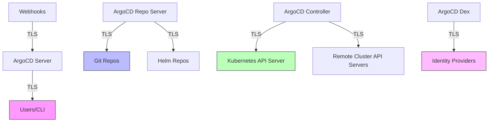

# How to Handle ArgoCD During Certificate Rotation Events

Author: [nawazdhandala](https://github.com/nawazdhandala)

Tags: ArgoCD, GitOps, Kubernetes, TLS, Certificate Management

Description: Learn how to manage ArgoCD during TLS certificate rotation for the Kubernetes API server, Git repositories, ingress, and internal components without downtime.

---

Certificate rotation is a regular maintenance task. Kubernetes API server certificates, Git repository TLS certificates, ArgoCD's own TLS certificates, and ingress certificates all expire and need renewal. If not handled properly, expired or rotated certificates can break ArgoCD's connectivity to clusters, repositories, and users. This guide covers how to handle each type of certificate rotation.

## Certificate Dependencies in ArgoCD

ArgoCD relies on multiple TLS certificates across its operation.



## Rotating the ArgoCD Server TLS Certificate

ArgoCD server uses a TLS certificate to serve the UI and API. This certificate lives in the `argocd-server-tls` Secret.

### Using cert-manager (Recommended)

If you use cert-manager, certificate rotation is automatic.

```yaml
# Certificate resource for ArgoCD server
apiVersion: cert-manager.io/v1
kind: Certificate
metadata:
  name: argocd-server-tls
  namespace: argocd
spec:
  secretName: argocd-server-tls
  issuerRef:
    name: letsencrypt-prod
    kind: ClusterIssuer
  dnsNames:
    - argocd.example.com
  # cert-manager rotates automatically before expiry
  renewBefore: 720h  # Renew 30 days before expiry
  duration: 2160h    # 90-day certificate
```

Verify the certificate status.

```bash
# Check certificate status
kubectl get certificate argocd-server-tls -n argocd

# Check when it expires
kubectl get secret argocd-server-tls -n argocd -o jsonpath='{.data.tls\.crt}' | \
  base64 -d | openssl x509 -noout -enddate
```

### Manual Certificate Rotation

If you manage certificates manually, replace the Secret.

```bash
# Generate or obtain new certificates
# Then update the Secret
kubectl create secret tls argocd-server-tls \
  --cert=new-tls.crt \
  --key=new-tls.key \
  -n argocd \
  --dry-run=client -o yaml | kubectl apply -f -

# Restart ArgoCD server to pick up the new certificate
kubectl rollout restart deployment/argocd-server -n argocd
kubectl rollout status deployment/argocd-server -n argocd
```

For more on TLS certificate management, see [ArgoCD external certificate managers](https://oneuptime.com/blog/post/2026-02-26-argocd-external-certificate-managers/view).

## Rotating the Kubernetes API Server Certificate

When the Kubernetes API server certificate rotates, ArgoCD may lose connectivity to the cluster.

### Managed Kubernetes (EKS, GKE, AKS)

Cloud providers handle API server certificate rotation automatically. ArgoCD usually handles this transparently because:

- The CA certificate does not change
- The rotation is seamless with no downtime

### Self-Managed Kubernetes

For kubeadm-managed clusters, certificate rotation requires more attention.

```bash
# Check current certificate expiry
kubeadm certs check-expiration

# Rotate certificates
kubeadm certs renew all

# Restart control plane components
systemctl restart kubelet
```

After rotation, ArgoCD may need to trust the new CA.

```bash
# Check if ArgoCD can still reach the API server
argocd cluster list

# If you see connection errors, the in-cluster config should auto-update
# But remote cluster connections may need manual update
```

### Updating Remote Cluster Certificates

When the API server certificate of a remote cluster rotates, update it in ArgoCD.

```bash
# Get the new kubeconfig for the remote cluster
# Then update the cluster in ArgoCD

# Remove and re-add the cluster
argocd cluster rm https://remote-cluster:6443
argocd cluster add remote-cluster-context --name remote-cluster

# Or update the cluster secret directly
kubectl get secret -n argocd -l argocd.argoproj.io/secret-type=cluster
```

The cluster secret contains the CA certificate, client certificate, and other connection details.

```yaml
# Cluster secret structure
apiVersion: v1
kind: Secret
metadata:
  name: cluster-remote
  namespace: argocd
  labels:
    argocd.argoproj.io/secret-type: cluster
type: Opaque
stringData:
  name: remote-cluster
  server: https://remote-cluster.example.com:6443
  config: |
    {
      "tlsClientConfig": {
        "caData": "<base64-encoded-new-CA-cert>",
        "certData": "<base64-encoded-client-cert>",
        "keyData": "<base64-encoded-client-key>"
      }
    }
```

## Rotating Git Repository Certificates

When the TLS certificate of your Git server changes, ArgoCD needs to trust the new certificate.

### Updating the TLS Certificate ConfigMap

```bash
# Get the new certificate from the Git server
openssl s_client -connect git.example.com:443 -showcerts </dev/null 2>/dev/null | \
  openssl x509 -outform PEM > git-server-new.crt
```

```yaml
# Update argocd-tls-certs-cm with the new certificate
apiVersion: v1
kind: ConfigMap
metadata:
  name: argocd-tls-certs-cm
  namespace: argocd
data:
  git.example.com: |
    -----BEGIN CERTIFICATE-----
    # New certificate content here
    -----END CERTIFICATE-----
```

```bash
# Apply the updated ConfigMap
kubectl apply -f argocd-tls-certs-cm.yaml

# Repo server picks up changes without restart (watches the ConfigMap)
# But if you want to force it:
kubectl rollout restart deployment/argocd-repo-server -n argocd
```

### Handling Self-Signed Git Certificates

If your Git server uses self-signed certificates, you have two options.

```yaml
# Option 1: Add the CA certificate to argocd-tls-certs-cm (recommended)
apiVersion: v1
kind: ConfigMap
metadata:
  name: argocd-tls-certs-cm
  namespace: argocd
data:
  git.internal.example.com: |
    -----BEGIN CERTIFICATE-----
    # Your CA certificate
    -----END CERTIFICATE-----

# Option 2: Skip TLS verification (NOT recommended for production)
# In the repository configuration
apiVersion: v1
kind: Secret
metadata:
  name: repo-git-internal
  namespace: argocd
  labels:
    argocd.argoproj.io/secret-type: repository
stringData:
  type: git
  url: https://git.internal.example.com/org/repo.git
  insecure: "true"  # Skips TLS verification
```

## Rotating ArgoCD Internal Certificates

ArgoCD components communicate internally using TLS. These certificates are managed by ArgoCD itself.

```bash
# Check the ArgoCD internal certificate
kubectl get secret argocd-secret -n argocd -o jsonpath='{.data.tls\.crt}' | \
  base64 -d | openssl x509 -noout -enddate

# ArgoCD generates these on startup if they do not exist
# To force rotation, delete the secret and restart
kubectl delete secret argocd-secret -n argocd
kubectl rollout restart deployment -n argocd
kubectl rollout restart statefulset -n argocd
```

## Rotating Dex Server Certificates

If you use Dex for SSO, its TLS certificate also needs rotation.

```bash
# Check Dex certificate expiry
kubectl get secret argocd-dex-server-tls -n argocd -o jsonpath='{.data.tls\.crt}' | \
  base64 -d | openssl x509 -noout -enddate 2>/dev/null

# If Dex uses ArgoCD's built-in TLS, rotating argocd-secret handles it
# If Dex has its own certificate, update it separately
kubectl create secret tls argocd-dex-server-tls \
  --cert=new-dex.crt \
  --key=new-dex.key \
  -n argocd \
  --dry-run=client -o yaml | kubectl apply -f -

kubectl rollout restart deployment/argocd-dex-server -n argocd
```

## Monitoring Certificate Expiry

Set up monitoring to catch certificates before they expire.

```yaml
# PrometheusRule for certificate expiry warnings
apiVersion: monitoring.coreos.com/v1
kind: PrometheusRule
metadata:
  name: argocd-cert-alerts
  namespace: argocd
spec:
  groups:
    - name: argocd-certificates
      rules:
        - alert: ArgoCDCertExpiringSoon
          expr: |
            (
              certmanager_certificate_expiration_timestamp_seconds{namespace="argocd"}
              - time()
            ) / 86400 < 30
          for: 1h
          labels:
            severity: warning
          annotations:
            summary: "ArgoCD certificate {{ $labels.name }} expires in less than 30 days"

        - alert: ArgoCDCertExpired
          expr: |
            (
              certmanager_certificate_expiration_timestamp_seconds{namespace="argocd"}
              - time()
            ) < 0
          for: 5m
          labels:
            severity: critical
          annotations:
            summary: "ArgoCD certificate {{ $labels.name }} has EXPIRED"
```

### Manual Expiry Checking Script

```bash
#!/bin/bash
# check-argocd-certs.sh
echo "=== ArgoCD Certificate Expiry Report ==="

# Check ArgoCD server TLS
echo "ArgoCD Server TLS:"
kubectl get secret argocd-server-tls -n argocd -o jsonpath='{.data.tls\.crt}' 2>/dev/null | \
  base64 -d | openssl x509 -noout -enddate 2>/dev/null || echo "  Not found or not a TLS cert"

# Check ArgoCD internal secret
echo "ArgoCD Internal:"
kubectl get secret argocd-secret -n argocd -o jsonpath='{.data.tls\.crt}' 2>/dev/null | \
  base64 -d | openssl x509 -noout -enddate 2>/dev/null || echo "  Not found or not a TLS cert"

# Check Git repository certificates
echo "Git Repository Certificates:"
for cert_key in $(kubectl get configmap argocd-tls-certs-cm -n argocd -o json 2>/dev/null | jq -r '.data | keys[]'); do
  echo "  $cert_key:"
  kubectl get configmap argocd-tls-certs-cm -n argocd -o jsonpath="{.data['$cert_key']}" | \
    openssl x509 -noout -enddate 2>/dev/null || echo "    Could not parse"
done

# Check cluster connection certificates
echo "Cluster Certificates:"
for secret in $(kubectl get secrets -n argocd -l argocd.argoproj.io/secret-type=cluster -o name); do
  name=$(kubectl get "$secret" -n argocd -o jsonpath='{.data.name}' | base64 -d)
  echo "  Cluster: $name"
done
```

## Automating Certificate Rotation

The best approach is to automate certificate rotation entirely.

```yaml
# Use cert-manager for all ArgoCD certificates
# 1. ArgoCD server
apiVersion: cert-manager.io/v1
kind: Certificate
metadata:
  name: argocd-server-tls
  namespace: argocd
spec:
  secretName: argocd-server-tls
  issuerRef:
    name: internal-ca
    kind: ClusterIssuer
  dnsNames:
    - argocd.example.com
    - argocd-server.argocd.svc
  renewBefore: 720h

---
# 2. ArgoCD repo server
apiVersion: cert-manager.io/v1
kind: Certificate
metadata:
  name: argocd-repo-server-tls
  namespace: argocd
spec:
  secretName: argocd-repo-server-tls
  issuerRef:
    name: internal-ca
    kind: ClusterIssuer
  dnsNames:
    - argocd-repo-server.argocd.svc
  renewBefore: 720h
```

## Summary

Certificate rotation in ArgoCD touches multiple components: the server TLS certificate, Git repository certificates, Kubernetes API server certificates, cluster connection certificates, and internal component certificates. Use cert-manager to automate rotation wherever possible. Monitor certificate expiry with Prometheus alerts and regular expiry checks. When rotating manually, always update the certificate in the relevant Secret or ConfigMap and restart the affected component. The most critical certificates to monitor are the API server certificate (affects cluster connectivity) and Git repository certificates (affects sync operations).
