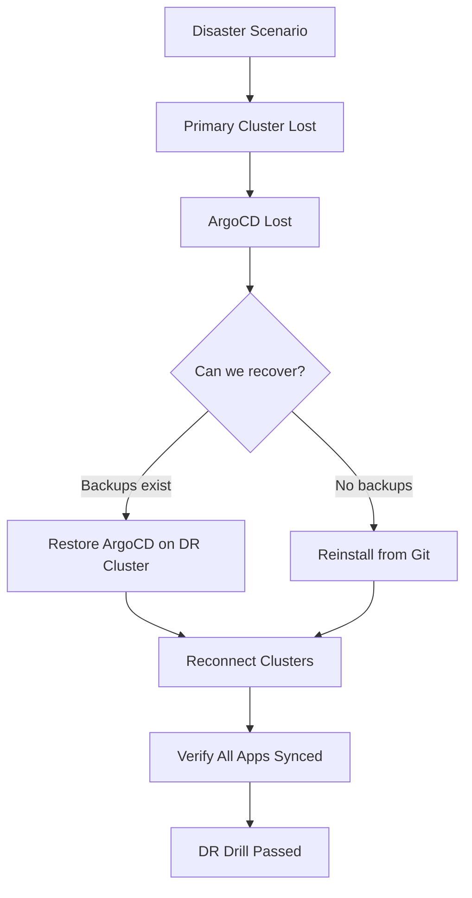

# How to Handle ArgoCD During Disaster Recovery Drills

Author: [nawazdhandala](https://github.com/nawazdhandala)

Tags: ArgoCD, GitOps, Kubernetes, Disaster Recovery, Operations

Description: Learn how to plan and execute disaster recovery drills that include ArgoCD, covering backup verification, failover testing, and full cluster recovery scenarios.

---

Disaster recovery drills test your ability to recover from catastrophic failures. With ArgoCD as your deployment engine, the drill needs to verify that you can restore not just your applications but the entire GitOps control plane. This guide covers how to plan, execute, and validate disaster recovery drills with ArgoCD.

## Why DR Drills Matter for ArgoCD

ArgoCD is a single point of control for all deployments. If ArgoCD is lost and cannot be recovered, you lose the ability to deploy, update, and manage applications across all your clusters. A DR drill validates that you can:

1. Restore ArgoCD itself from backups
2. Reconnect ArgoCD to all managed clusters
3. Resume GitOps operations with no data loss
4. Recover applications to their last known good state



## What to Back Up

Before you can drill, you need backups. Here is everything ArgoCD needs.

### ArgoCD Configuration Backup

```bash
#!/bin/bash
# backup-argocd.sh
BACKUP_DIR="argocd-backup-$(date +%Y%m%d-%H%M%S)"
mkdir -p "$BACKUP_DIR"

# Core configuration
kubectl get configmap argocd-cm -n argocd -o yaml > "$BACKUP_DIR/argocd-cm.yaml"
kubectl get configmap argocd-cmd-params-cm -n argocd -o yaml > "$BACKUP_DIR/argocd-cmd-params-cm.yaml"
kubectl get configmap argocd-rbac-cm -n argocd -o yaml > "$BACKUP_DIR/argocd-rbac-cm.yaml"
kubectl get configmap argocd-tls-certs-cm -n argocd -o yaml > "$BACKUP_DIR/argocd-tls-certs-cm.yaml"
kubectl get configmap argocd-ssh-known-hosts-cm -n argocd -o yaml > "$BACKUP_DIR/argocd-ssh-known-hosts-cm.yaml"
kubectl get configmap argocd-notifications-cm -n argocd -o yaml > "$BACKUP_DIR/argocd-notifications-cm.yaml"

# Secrets (encrypted at rest)
kubectl get secret argocd-secret -n argocd -o yaml > "$BACKUP_DIR/argocd-secret.yaml"
kubectl get secret argocd-notifications-secret -n argocd -o yaml > "$BACKUP_DIR/argocd-notifications-secret.yaml"

# Repository credentials
kubectl get secrets -n argocd -l argocd.argoproj.io/secret-type=repository -o yaml > "$BACKUP_DIR/repositories.yaml"
kubectl get secrets -n argocd -l argocd.argoproj.io/secret-type=repo-creds -o yaml > "$BACKUP_DIR/repo-creds.yaml"

# Cluster credentials
kubectl get secrets -n argocd -l argocd.argoproj.io/secret-type=cluster -o yaml > "$BACKUP_DIR/clusters.yaml"

# Applications and AppProjects
kubectl get applications -n argocd -o yaml > "$BACKUP_DIR/applications.yaml"
kubectl get appprojects -n argocd -o yaml > "$BACKUP_DIR/appprojects.yaml"
kubectl get applicationsets -n argocd -o yaml > "$BACKUP_DIR/applicationsets.yaml"

# GPG keys (if used)
kubectl get configmap argocd-gpg-keys-cm -n argocd -o yaml > "$BACKUP_DIR/argocd-gpg-keys-cm.yaml" 2>/dev/null

echo "Backup completed in $BACKUP_DIR"
tar -czf "$BACKUP_DIR.tar.gz" "$BACKUP_DIR"
echo "Compressed backup: $BACKUP_DIR.tar.gz"
```

### Using Velero for Full Namespace Backup

```bash
# Install Velero if not already present
# Then back up the entire ArgoCD namespace
velero backup create argocd-backup \
  --include-namespaces argocd \
  --wait

# Verify the backup
velero backup describe argocd-backup
velero backup logs argocd-backup
```

## DR Drill Scenarios

### Scenario 1: Complete ArgoCD Namespace Loss

Simulate losing the entire ArgoCD namespace.

```bash
# Step 1: Disable ArgoCD so it does not interfere
# (In a real drill, you might use a separate test cluster)

# Step 2: Delete the ArgoCD namespace (ONLY IN A DRILL ENVIRONMENT)
kubectl delete namespace argocd

# Step 3: Time the recovery
START_TIME=$(date +%s)

# Step 4: Recreate the namespace
kubectl create namespace argocd

# Step 5: Install ArgoCD
kubectl apply -n argocd -f https://raw.githubusercontent.com/argoproj/argo-cd/stable/manifests/install.yaml
kubectl wait --for=condition=Ready pods --all -n argocd --timeout=300s

# Step 6: Restore configuration from backups
kubectl apply -f argocd-backup/argocd-cm.yaml
kubectl apply -f argocd-backup/argocd-rbac-cm.yaml
kubectl apply -f argocd-backup/argocd-tls-certs-cm.yaml
kubectl apply -f argocd-backup/argocd-ssh-known-hosts-cm.yaml
kubectl apply -f argocd-backup/argocd-secret.yaml
kubectl apply -f argocd-backup/repositories.yaml
kubectl apply -f argocd-backup/repo-creds.yaml
kubectl apply -f argocd-backup/clusters.yaml
kubectl apply -f argocd-backup/argocd-notifications-cm.yaml
kubectl apply -f argocd-backup/argocd-notifications-secret.yaml

# Step 7: Restore AppProjects first, then Applications
kubectl apply -f argocd-backup/appprojects.yaml
kubectl apply -f argocd-backup/applicationsets.yaml
kubectl apply -f argocd-backup/applications.yaml

# Step 8: Restart ArgoCD to pick up all configuration
kubectl rollout restart deployment -n argocd
kubectl rollout restart statefulset -n argocd
kubectl wait --for=condition=Ready pods --all -n argocd --timeout=300s

# Step 9: Measure recovery time
END_TIME=$(date +%s)
echo "Recovery took $((END_TIME - START_TIME)) seconds"

# Step 10: Validate
argocd app list
```

### Scenario 2: Full Cluster Failover

Simulate losing the entire primary cluster and recovering ArgoCD on a DR cluster.

```bash
# Prerequisites: DR cluster is available, backups are accessible

# Step 1: Switch kubeconfig to DR cluster
export KUBECONFIG=~/.kube/dr-cluster-config

# Step 2: Install ArgoCD on DR cluster
kubectl create namespace argocd
kubectl apply -n argocd -f https://raw.githubusercontent.com/argoproj/argo-cd/stable/manifests/install.yaml
kubectl wait --for=condition=Ready pods --all -n argocd --timeout=300s

# Step 3: Restore from backups (same as Scenario 1, Steps 6-8)

# Step 4: Update cluster connections
# The old in-cluster connection no longer points to the right cluster
# Remote cluster connections may still work
argocd cluster list

# Step 5: Re-register the in-cluster destination if needed
# The DR cluster's own API server is now "in-cluster"
# Applications targeting the old cluster need updating
```

### Scenario 3: Git Repository Loss

Simulate losing access to the Git repository.

```bash
# Step 1: Simulate Git unavailability
# (Block network access to Git or use a test repo)

# Step 2: Verify ArgoCD continues serving the last known state
# ArgoCD caches manifests, so existing apps continue running
argocd app list

# Step 3: Check that new syncs fail gracefully
argocd app sync my-app
# Expected: Error about Git connectivity

# Step 4: Restore Git access and verify recovery
argocd app get my-app --refresh
```

## DR Drill Validation Checklist

After each drill, verify these items.

```bash
#!/bin/bash
# dr-validation.sh
echo "=== ArgoCD DR Validation ==="

# 1. ArgoCD components are running
echo "1. Component Status:"
kubectl get pods -n argocd -o wide

# 2. All clusters are connected
echo "2. Cluster Connectivity:"
argocd cluster list

# 3. All repositories are accessible
echo "3. Repository Access:"
argocd repo list

# 4. Application count matches pre-disaster
echo "4. Application Count:"
APP_COUNT=$(argocd app list -o json | jq length)
echo "   Total apps: $APP_COUNT"

# 5. Application health status
echo "5. Application Health:"
argocd app list -o json | jq -r '[.[] | .status.health.status] | group_by(.) | map({status: .[0], count: length}) | .[]'

# 6. Application sync status
echo "6. Application Sync:"
argocd app list -o json | jq -r '[.[] | .status.sync.status] | group_by(.) | map({status: .[0], count: length}) | .[]'

# 7. RBAC is working
echo "7. RBAC Check:"
argocd account list

# 8. Notifications are configured
echo "8. Notifications:"
kubectl get configmap argocd-notifications-cm -n argocd -o jsonpath='{.data}' | jq keys

# 9. SSO is working (if configured)
echo "9. SSO/Dex Status:"
kubectl get pods -n argocd -l app.kubernetes.io/name=argocd-dex-server -o jsonpath='{.items[0].status.phase}'
echo ""

echo "=== Validation Complete ==="
```

## Recovery Time Objectives

Track these metrics across drills.

| Metric | Target | How to Measure |
|--------|--------|----------------|
| ArgoCD Installation | < 5 min | Time from kubectl apply to all pods Ready |
| Configuration Restore | < 10 min | Time to apply all backup YAMLs |
| First App Sync | < 15 min | Time from restore to first successful sync |
| Full Recovery | < 30 min | Time from disaster to all apps Healthy+Synced |

## Automating DR with ArgoCD Itself

The ultimate resilience pattern is managing ArgoCD with ArgoCD (on a separate cluster).

```yaml
# ArgoCD managing its own DR setup on a backup cluster
apiVersion: argoproj.io/v1alpha1
kind: Application
metadata:
  name: argocd-dr
  namespace: argocd
spec:
  project: default
  source:
    repoURL: https://github.com/org/argocd-config.git
    targetRevision: main
    path: argocd-dr
  destination:
    # DR cluster
    name: dr-cluster
    namespace: argocd
  syncPolicy:
    automated:
      selfHeal: true
```

Store all ArgoCD configuration in Git so the DR instance can be bootstrapped from scratch.

```text
argocd-config/
  argocd-dr/
    install.yaml           # ArgoCD installation manifests
    argocd-cm.yaml         # ConfigMap
    argocd-rbac-cm.yaml    # RBAC config
    appprojects/           # All AppProject manifests
    applications/          # All Application manifests
    repositories/          # Repository credential templates
```

## Scheduling Regular Drills

```yaml
# CronJob to run DR validation weekly
apiVersion: batch/v1
kind: CronJob
metadata:
  name: argocd-dr-check
  namespace: argocd
spec:
  schedule: "0 6 * * 1"  # Every Monday at 6 AM
  jobTemplate:
    spec:
      template:
        spec:
          serviceAccountName: argocd-server
          containers:
            - name: dr-check
              image: quay.io/argoproj/argocd:v2.10.0
              command:
                - /bin/sh
                - -c
                - |
                  # Verify backup exists and is recent
                  echo "Checking ArgoCD backup freshness..."
                  # Verify all apps are healthy
                  argocd app list --server argocd-server.argocd.svc --insecure \
                    --auth-token $ARGOCD_TOKEN | grep -c "Healthy"
                  echo "DR check completed"
          restartPolicy: Never
```

## Summary

Disaster recovery drills for ArgoCD verify that you can restore the entire GitOps control plane from backups. The key components to back up are ConfigMaps, Secrets (repository credentials, cluster credentials), Applications, AppProjects, and ApplicationSets. Run drills regularly - at minimum quarterly - and track recovery time metrics. The most resilient approach is to store all ArgoCD configuration in Git and use a secondary ArgoCD instance on a DR cluster to keep the backup environment always ready. Every drill should end with a validation that confirms all components are running, all clusters are connected, and all applications are healthy and synced.
