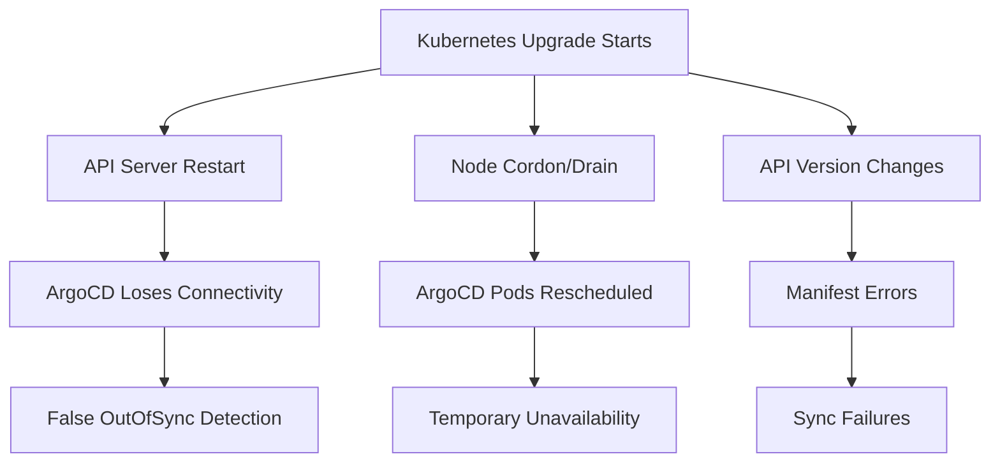

# How to Handle ArgoCD During Kubernetes Upgrades

Author: [nawazdhandala](https://github.com/nawazdhandala)

Tags: ArgoCD, GitOps, Kubernetes, Cluster Upgrades, Operations

Description: Learn how to safely manage ArgoCD during Kubernetes cluster upgrades, including pre-upgrade checks, sync window configuration, and post-upgrade validation.

---

Kubernetes cluster upgrades are one of the most critical maintenance operations you will perform. During an upgrade, the API server may restart, nodes get drained and rebooted, and API versions can change. ArgoCD needs special attention during this process to avoid cascading failures, unwanted syncs, and false drift detection. This guide covers the complete upgrade procedure with ArgoCD in mind.

## The Risks During Kubernetes Upgrades

Several things can go wrong with ArgoCD during a cluster upgrade:

1. **API server restarts** cause temporary loss of connectivity
2. **Node drains** move ArgoCD pods to other nodes
3. **Deprecated API versions** cause manifest generation failures
4. **CRD changes** may break ArgoCD's resource tracking
5. **Auto-sync during upgrades** can interfere with the upgrade process



## Pre-Upgrade Checklist

### Step 1: Check ArgoCD Compatibility

Verify that your ArgoCD version supports the target Kubernetes version.

```bash
# Check current ArgoCD version
argocd version

# Check the ArgoCD compatibility matrix
# ArgoCD 2.9.x supports Kubernetes 1.25 to 1.28
# ArgoCD 2.10.x supports Kubernetes 1.26 to 1.29
# ArgoCD 2.11.x supports Kubernetes 1.27 to 1.30
```

If your ArgoCD version does not support the target Kubernetes version, upgrade ArgoCD first.

### Step 2: Check for Deprecated APIs

Kubernetes upgrades often deprecate or remove API versions. Check if any ArgoCD-managed manifests use deprecated APIs.

```bash
# Install pluto to check for deprecated APIs
# https://github.com/FairwindsOps/pluto
brew install FairwindsOps/tap/pluto

# Scan your Git manifests
pluto detect-files -d /path/to/manifests/

# Scan live resources in the cluster
pluto detect-helm -o wide
pluto detect-api-resources -o wide
```

Common deprecations to watch for:

```yaml
# Deprecated in 1.25 - PodSecurityPolicy
# apiVersion: policy/v1beta1  # REMOVED
# kind: PodSecurityPolicy

# Deprecated in 1.22 - Ingress v1beta1
# apiVersion: networking.k8s.io/v1beta1  # Use v1 instead
# kind: Ingress

# Deprecated in 1.25 - CronJob v1beta1
# apiVersion: batch/v1beta1  # Use batch/v1
# kind: CronJob
```

Update your Git manifests before the upgrade.

### Step 3: Disable Auto-Sync

Prevent ArgoCD from making changes during the upgrade.

```bash
# Disable auto-sync on all applications
for app in $(argocd app list -o name); do
  argocd app set "$app" --sync-policy none
  echo "Disabled auto-sync for $app"
done
```

Or use a sync window to block all syncs.

```yaml
# AppProject with a deny-all sync window
apiVersion: argoproj.io/v1alpha1
kind: AppProject
metadata:
  name: default
  namespace: argocd
spec:
  syncWindows:
    # Block all syncs during the maintenance window
    - kind: deny
      schedule: '* * * * *'  # Every minute (effectively always deny)
      duration: 4h            # Block for 4 hours
      applications:
        - '*'
      clusters:
        - '*'
      namespaces:
        - '*'
```

### Step 4: Ensure ArgoCD Has Pod Disruption Budgets

```yaml
# PDB for ArgoCD components
apiVersion: policy/v1
kind: PodDisruptionBudget
metadata:
  name: argocd-server-pdb
  namespace: argocd
spec:
  minAvailable: 1
  selector:
    matchLabels:
      app.kubernetes.io/name: argocd-server
---
apiVersion: policy/v1
kind: PodDisruptionBudget
metadata:
  name: argocd-application-controller-pdb
  namespace: argocd
spec:
  minAvailable: 1
  selector:
    matchLabels:
      app.kubernetes.io/name: argocd-application-controller
---
apiVersion: policy/v1
kind: PodDisruptionBudget
metadata:
  name: argocd-repo-server-pdb
  namespace: argocd
spec:
  minAvailable: 1
  selector:
    matchLabels:
      app.kubernetes.io/name: argocd-repo-server
```

### Step 5: Back Up ArgoCD Configuration

```bash
# Export all ArgoCD applications
argocd app list -o yaml > argocd-apps-backup.yaml

# Export ArgoCD settings
kubectl get configmap argocd-cm -n argocd -o yaml > argocd-cm-backup.yaml
kubectl get configmap argocd-rbac-cm -n argocd -o yaml > argocd-rbac-backup.yaml
kubectl get secret argocd-secret -n argocd -o yaml > argocd-secret-backup.yaml

# Export AppProjects
kubectl get appprojects -n argocd -o yaml > argocd-projects-backup.yaml
```

## During the Upgrade

### Monitor ArgoCD Health

Keep an eye on ArgoCD pods during the upgrade.

```bash
# Watch ArgoCD pods in real-time
kubectl get pods -n argocd -w

# Monitor ArgoCD logs for errors
kubectl logs -f -l app.kubernetes.io/name=argocd-application-controller -n argocd --tail=100
```

### Handle Node Drains Gracefully

When nodes hosting ArgoCD pods are drained, the PDBs ensure at least one replica stays running. But on single-replica setups, there will be downtime.

```bash
# Check which node ArgoCD pods are on
kubectl get pods -n argocd -o wide

# If upgrading that specific node, you can manually move ArgoCD first
kubectl cordon <node-with-argocd>
kubectl drain <node-with-argocd> --ignore-daemonsets --delete-emptydir-data
# Wait for ArgoCD pods to reschedule
kubectl wait --for=condition=Ready pods --all -n argocd --timeout=300s
# Then proceed with node upgrade
```

## Post-Upgrade Validation

### Step 1: Verify ArgoCD Components

```bash
# Check all ArgoCD pods are running
kubectl get pods -n argocd

# Check ArgoCD version and connectivity
argocd version

# Verify cluster connection
argocd cluster list
```

### Step 2: Check Application Status

```bash
# List all applications and their sync/health status
argocd app list

# Look for any applications that are now erroring
argocd app list | grep -E "Error|Unknown|Degraded"
```

### Step 3: Fix API Version Issues

If any applications show errors due to deprecated APIs, update the manifests in Git.

```bash
# Check which apps have sync errors
for app in $(argocd app list -o name); do
  status=$(argocd app get "$app" -o json | jq -r '.status.sync.status')
  health=$(argocd app get "$app" -o json | jq -r '.status.health.status')
  if [ "$status" != "Synced" ] || [ "$health" != "Healthy" ]; then
    echo "ISSUE: $app - Sync: $status, Health: $health"
  fi
done
```

### Step 4: Re-Enable Auto-Sync

Once everything looks good, re-enable auto-sync.

```bash
# Re-enable auto-sync on all applications
for app in $(argocd app list -o name); do
  argocd app set "$app" --sync-policy automated
  echo "Re-enabled auto-sync for $app"
done
```

Or remove the deny sync window from the AppProject.

### Step 5: Force a Full Reconciliation

```bash
# Trigger a hard refresh of all applications
for app in $(argocd app list -o name); do
  argocd app get "$app" --hard-refresh
done
```

## Handling CRD Upgrades

Kubernetes upgrades sometimes change CRD versions. If ArgoCD manages CRDs, check for compatibility.

```bash
# List all CRDs and their versions
kubectl get crds -o custom-columns=NAME:.metadata.name,VERSIONS:.spec.versions[*].name

# Check if ArgoCD's own CRDs need updating
kubectl get crd applications.argoproj.io -o jsonpath='{.spec.versions[*].name}'
```

## Rolling Back

If the Kubernetes upgrade causes ArgoCD to malfunction, you have two options:

### Option 1: Restore ArgoCD Configuration

```bash
# Apply backed-up configuration
kubectl apply -f argocd-cm-backup.yaml
kubectl apply -f argocd-rbac-backup.yaml
kubectl apply -f argocd-projects-backup.yaml

# Restart ArgoCD components
kubectl rollout restart deployment -n argocd
kubectl rollout restart statefulset -n argocd
```

### Option 2: Reinstall ArgoCD

```bash
# If ArgoCD is completely broken, reinstall
kubectl delete namespace argocd
kubectl create namespace argocd
kubectl apply -n argocd -f https://raw.githubusercontent.com/argoproj/argo-cd/stable/manifests/install.yaml

# Re-apply configuration from backups
kubectl apply -f argocd-cm-backup.yaml
kubectl apply -f argocd-rbac-backup.yaml
kubectl apply -f argocd-apps-backup.yaml
kubectl apply -f argocd-projects-backup.yaml
```

## Summary

Kubernetes upgrades with ArgoCD require a structured approach: check compatibility and deprecated APIs before the upgrade, disable auto-sync and configure PDBs, monitor ArgoCD during the upgrade, then validate and re-enable auto-sync afterward. The most common issues are deprecated API versions in manifests and temporary connectivity loss during API server restarts. Always back up your ArgoCD configuration before upgrading, and test the upgrade in a non-production cluster first.
