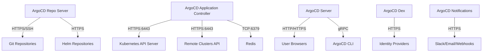

# How to Handle ArgoCD During Network Changes

Author: [nawazdhandala](https://github.com/nawazdhandala)

Tags: ArgoCD, GitOps, Kubernetes, Networking, Operations

Description: Learn how to manage ArgoCD during Kubernetes network changes including CNI migrations, DNS updates, service mesh rollouts, and network policy changes.

---

Network changes in Kubernetes can range from minor DNS configuration updates to major CNI plugin migrations. ArgoCD depends on network connectivity to function - it needs to reach Git repositories, communicate with the Kubernetes API server, and serve its UI to users. This guide covers how to handle ArgoCD during various network change scenarios.

## How ArgoCD Uses the Network

ArgoCD has several network dependencies that can be affected by changes.



## Scenario 1: CNI Plugin Migration

Migrating from one CNI to another (for example, Flannel to Calico, or Calico to Cilium) is one of the most disruptive network changes. Pod networking may be temporarily broken.

### Pre-Migration Steps

```bash
# Step 1: Disable auto-sync on all applications
for app in $(argocd app list -o name); do
  argocd app set "$app" --sync-policy none
done

# Step 2: Record current ArgoCD state
argocd app list > pre-cni-migration-state.txt

# Step 3: Verify ArgoCD is healthy before starting
kubectl get pods -n argocd
argocd app list | grep -c "Healthy"
```

### During CNI Migration

```bash
# Step 1: Install the new CNI alongside the old one (if supported)
# This depends on the specific CNI migration path

# Step 2: Monitor ArgoCD connectivity
kubectl logs -f deployment/argocd-application-controller -n argocd --tail=20 &
kubectl logs -f deployment/argocd-repo-server -n argocd --tail=20 &

# Step 3: If ArgoCD loses connectivity, it will retry automatically
# Check for connection errors
kubectl get events -n argocd --sort-by='.lastTimestamp' | tail -20
```

### Post-Migration

```bash
# Step 1: Verify all ArgoCD pods have networking
kubectl exec -n argocd deployment/argocd-repo-server -- wget -qO- https://github.com 2>&1 | head -5

# Step 2: Verify cluster connectivity
argocd cluster list

# Step 3: Force a hard refresh
for app in $(argocd app list -o name); do
  argocd app get "$app" --hard-refresh
done

# Step 4: Re-enable auto-sync
for app in $(argocd app list -o name); do
  argocd app set "$app" --sync-policy automated
done
```

## Scenario 2: DNS Configuration Changes

DNS changes affect ArgoCD's ability to resolve Git repository hostnames, identity provider URLs, and notification endpoints.

### Updating CoreDNS Configuration

```bash
# Check current CoreDNS configuration
kubectl get configmap coredns -n kube-system -o yaml

# If changing upstream DNS servers, update the ConfigMap
kubectl edit configmap coredns -n kube-system
```

```yaml
# Example CoreDNS ConfigMap with updated upstream DNS
apiVersion: v1
kind: ConfigMap
metadata:
  name: coredns
  namespace: kube-system
data:
  Corefile: |
    .:53 {
        errors
        health
        kubernetes cluster.local in-addr.arpa ip6.arpa {
          pods insecure
          fallthrough in-addr.arpa ip6.arpa
        }
        prometheus :9153
        forward . 10.0.0.1 10.0.0.2  # New upstream DNS servers
        cache 30
        loop
        reload
        loadbalance
    }
```

### Verify ArgoCD Can Resolve Hostnames

```bash
# Test DNS resolution from ArgoCD pods
kubectl exec -n argocd deployment/argocd-repo-server -- nslookup github.com
kubectl exec -n argocd deployment/argocd-server -- nslookup dex.example.com

# If resolution fails, check CoreDNS pods
kubectl get pods -n kube-system -l k8s-app=kube-dns
kubectl logs -n kube-system -l k8s-app=kube-dns --tail=20
```

### Handling Custom DNS for Private Git Repos

If your Git repositories use internal DNS, update ArgoCD's ConfigMap with custom host entries if needed.

```yaml
# ArgoCD repo server configuration for custom DNS
apiVersion: apps/v1
kind: Deployment
metadata:
  name: argocd-repo-server
  namespace: argocd
spec:
  template:
    spec:
      # Add custom host entries
      hostAliases:
        - ip: "10.0.0.50"
          hostnames:
            - "git.internal.example.com"
        - ip: "10.0.0.51"
          hostnames:
            - "helm.internal.example.com"
```

## Scenario 3: Service Mesh Rollout

Adding a service mesh like Istio or Linkerd adds sidecar proxies to all pods, changing how traffic flows. This affects ArgoCD's own pods and the applications it manages.

### Excluding ArgoCD from the Service Mesh

It is often best to exclude ArgoCD from sidecar injection, especially during initial rollout.

```yaml
# Label the ArgoCD namespace to opt out of injection
apiVersion: v1
kind: Namespace
metadata:
  name: argocd
  labels:
    # For Istio
    istio-injection: disabled
    # For Linkerd
    linkerd.io/inject: disabled
```

Or exclude specific pods.

```yaml
# Pod annotation to skip sidecar injection
apiVersion: apps/v1
kind: Deployment
metadata:
  name: argocd-server
  namespace: argocd
spec:
  template:
    metadata:
      annotations:
        # Istio
        sidecar.istio.io/inject: "false"
        # Linkerd
        linkerd.io/inject: disabled
```

### Handling ArgoCD-Managed Applications with Sidecars

When ArgoCD deploys applications that get sidecar injection, it detects the injected containers as drift. Configure `ignoreDifferences` for sidecar fields.

```yaml
# Global ignore for Istio sidecar injection
apiVersion: v1
kind: ConfigMap
metadata:
  name: argocd-cm
  namespace: argocd
data:
  resource.customizations.ignoreDifferences.apps_Deployment: |
    jqPathExpressions:
      - '.spec.template.spec.containers[] | select(.name == "istio-proxy")'
      - '.spec.template.spec.initContainers[] | select(.name == "istio-init")'
      - '.spec.template.metadata.annotations["sidecar.istio.io/status"]'
      - '.spec.template.metadata.labels["security.istio.io/tlsMode"]'
```

## Scenario 4: Network Policy Changes

Updating NetworkPolicies can accidentally block ArgoCD traffic.

### Essential Network Policies for ArgoCD

Ensure these traffic flows are always allowed.

```yaml
# Allow ArgoCD to reach the API server
apiVersion: networking.k8s.io/v1
kind: NetworkPolicy
metadata:
  name: argocd-egress-apiserver
  namespace: argocd
spec:
  podSelector:
    matchLabels:
      app.kubernetes.io/name: argocd-application-controller
  policyTypes:
    - Egress
  egress:
    # API server access
    - to:
        - ipBlock:
            cidr: 0.0.0.0/0
      ports:
        - port: 6443
          protocol: TCP

---
# Allow ArgoCD to reach Git repos
apiVersion: networking.k8s.io/v1
kind: NetworkPolicy
metadata:
  name: argocd-egress-git
  namespace: argocd
spec:
  podSelector:
    matchLabels:
      app.kubernetes.io/name: argocd-repo-server
  policyTypes:
    - Egress
  egress:
    # HTTPS for Git/Helm repos
    - ports:
        - port: 443
          protocol: TCP
        - port: 22
          protocol: TCP
    # DNS
    - to:
        - namespaceSelector: {}
          podSelector:
            matchLabels:
              k8s-app: kube-dns
      ports:
        - port: 53
          protocol: UDP
        - port: 53
          protocol: TCP

---
# Allow internal ArgoCD communication
apiVersion: networking.k8s.io/v1
kind: NetworkPolicy
metadata:
  name: argocd-internal
  namespace: argocd
spec:
  podSelector: {}
  policyTypes:
    - Ingress
  ingress:
    - from:
        - podSelector: {}
```

### Testing Network Policies Before Applying

```bash
# Use a test pod to verify connectivity before applying restrictive policies
kubectl run nettest -n argocd --rm -it --image=busybox -- sh

# Inside the pod, test critical connections
# wget -qO- https://github.com  # Git access
# wget -qO- https://kubernetes.default.svc:443/healthz --no-check-certificate  # API server
# nslookup github.com  # DNS
```

## Scenario 5: Ingress Controller Migration

When switching ingress controllers (for example, from Nginx to Traefik or to an API Gateway), ArgoCD's external access changes.

```bash
# Step 1: Set up the new ingress controller
kubectl apply -f new-ingress-controller/

# Step 2: Create the new ArgoCD ingress resource
kubectl apply -f argocd-new-ingress.yaml

# Step 3: Verify the new ingress works
curl -v https://argocd.example.com/healthz

# Step 4: Update DNS to point to the new ingress controller's IP
# (This is external to Kubernetes)

# Step 5: Remove the old ingress resource
kubectl delete ingress argocd-server-old -n argocd
```

## Monitoring Network Health

Set up alerts for network connectivity issues.

```yaml
# PrometheusRule for ArgoCD network health
apiVersion: monitoring.coreos.com/v1
kind: PrometheusRule
metadata:
  name: argocd-network-alerts
  namespace: argocd
spec:
  groups:
    - name: argocd-network
      rules:
        - alert: ArgoCDGitConnectivityLost
          expr: rate(argocd_git_request_total{grpc_code!="OK"}[5m]) > 0.5
          for: 5m
          labels:
            severity: critical
          annotations:
            summary: "ArgoCD cannot reach Git repositories"

        - alert: ArgoCDClusterConnectivityLost
          expr: argocd_cluster_info{connection_state!="Successful"} > 0
          for: 3m
          labels:
            severity: critical
          annotations:
            summary: "ArgoCD lost connectivity to cluster {{ $labels.name }}"
```

## Summary

Network changes require careful handling because ArgoCD depends on connectivity to Git repos, the Kubernetes API, identity providers, and notification endpoints. The safest approach is to disable auto-sync before major network changes, verify each connectivity path after the change, and re-enable auto-sync only after confirming everything works. For service mesh rollouts, exclude ArgoCD from sidecar injection and configure `ignoreDifferences` for injected fields in managed applications. Always maintain network policies that allow ArgoCD's essential traffic flows.
