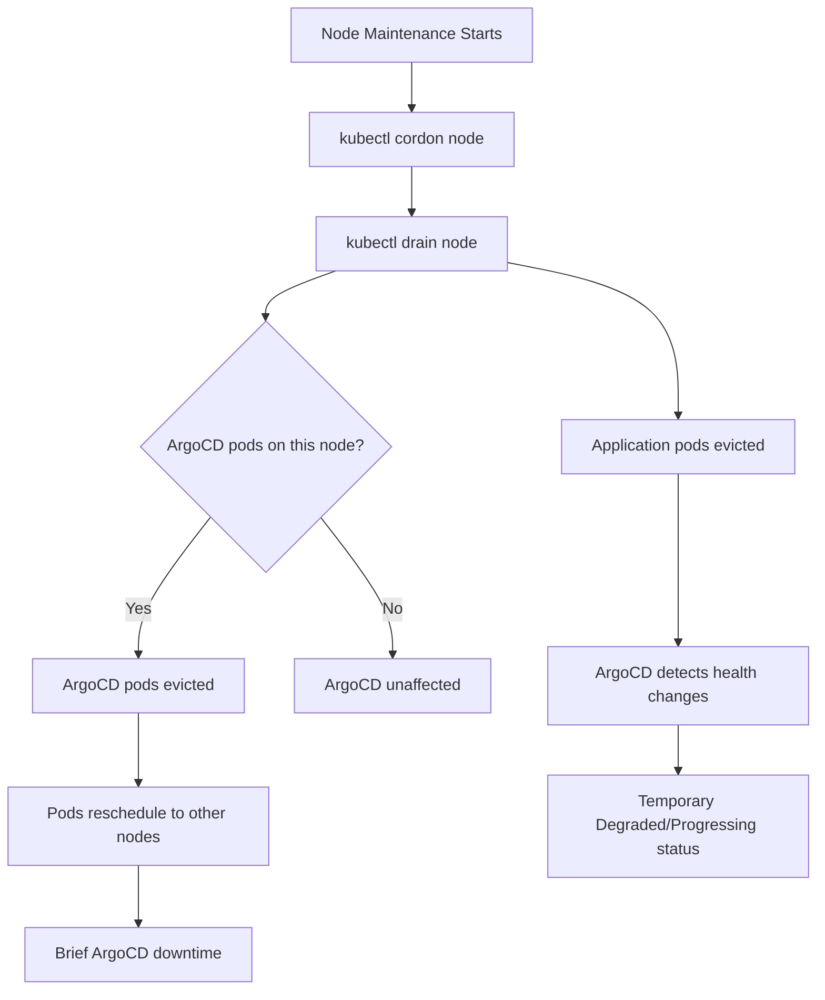

# How to Handle ArgoCD During Node Maintenance

Author: [nawazdhandala](https://github.com/nawazdhandala)

Tags: ArgoCD, GitOps, Kubernetes, Node Maintenance, Operations

Description: Learn how to manage ArgoCD during Kubernetes node maintenance operations like patching, hardware replacement, and scaling, without disrupting your GitOps pipeline.

---

Node maintenance is a routine operation in Kubernetes - OS patching, kernel upgrades, hardware replacement, or scaling events. When the node hosting ArgoCD pods gets drained, or when application pods managed by ArgoCD are rescheduled, you need to ensure the GitOps pipeline stays operational. This guide covers how to handle ArgoCD during various node maintenance scenarios.

## Understanding the Impact

When a node is cordoned and drained, all pods on that node are evicted and rescheduled to other nodes. This affects ArgoCD in two ways:

1. **ArgoCD's own pods** may be evicted if they run on the maintenance node
2. **Application pods** managed by ArgoCD will be rescheduled, triggering health status changes



## Preparing ArgoCD for Node Maintenance

### Pod Disruption Budgets

PDBs are your primary defense against node maintenance disrupting ArgoCD. They tell Kubernetes how many pods can be simultaneously unavailable.

```yaml
# PDBs for all ArgoCD components
apiVersion: policy/v1
kind: PodDisruptionBudget
metadata:
  name: argocd-server
  namespace: argocd
spec:
  minAvailable: 1
  selector:
    matchLabels:
      app.kubernetes.io/name: argocd-server

---
apiVersion: policy/v1
kind: PodDisruptionBudget
metadata:
  name: argocd-application-controller
  namespace: argocd
spec:
  minAvailable: 1
  selector:
    matchLabels:
      app.kubernetes.io/name: argocd-application-controller

---
apiVersion: policy/v1
kind: PodDisruptionBudget
metadata:
  name: argocd-repo-server
  namespace: argocd
spec:
  minAvailable: 1
  selector:
    matchLabels:
      app.kubernetes.io/name: argocd-repo-server

---
apiVersion: policy/v1
kind: PodDisruptionBudget
metadata:
  name: argocd-redis
  namespace: argocd
spec:
  minAvailable: 1
  selector:
    matchLabels:
      app.kubernetes.io/name: argocd-redis
```

For PDBs to be effective, you need multiple replicas of each component. In a single-replica deployment, a PDB with `minAvailable: 1` will block the drain entirely.

### Running Multiple Replicas

For production environments, scale ArgoCD components to at least 2 replicas.

```bash
# Scale ArgoCD server
kubectl scale deployment argocd-server -n argocd --replicas=2

# Scale repo server
kubectl scale deployment argocd-repo-server -n argocd --replicas=2

# The application controller is a StatefulSet with leader election
# Scale it for HA (only the leader is active)
kubectl scale statefulset argocd-application-controller -n argocd --replicas=2
```

Or install ArgoCD in HA mode from the start.

```bash
kubectl apply -n argocd -f https://raw.githubusercontent.com/argoproj/argo-cd/stable/manifests/ha/install.yaml
```

### Pod Anti-Affinity

Spread ArgoCD pods across nodes so a single node maintenance does not take out all replicas.

```yaml
# Anti-affinity for ArgoCD server
apiVersion: apps/v1
kind: Deployment
metadata:
  name: argocd-server
  namespace: argocd
spec:
  replicas: 2
  template:
    spec:
      affinity:
        podAntiAffinity:
          preferredDuringSchedulingIgnoredDuringExecution:
            - weight: 100
              podAffinityTerm:
                labelSelector:
                  matchExpressions:
                    - key: app.kubernetes.io/name
                      operator: In
                      values:
                        - argocd-server
                topologyKey: kubernetes.io/hostname
```

## Node Maintenance Procedures

### Scenario 1: Single Node Maintenance

When maintaining one node at a time, the procedure is straightforward.

```bash
# Step 1: Check which ArgoCD pods are on the target node
kubectl get pods -n argocd -o wide | grep <node-name>

# Step 2: If ArgoCD pods are on the node and you have HA, just drain
kubectl cordon <node-name>
kubectl drain <node-name> --ignore-daemonsets --delete-emptydir-data --timeout=300s

# Step 3: Verify ArgoCD is still healthy
kubectl get pods -n argocd
argocd app list | head -5

# Step 4: Perform maintenance on the node
# ... OS patching, hardware work, etc ...

# Step 5: Uncordon the node
kubectl uncordon <node-name>
```

### Scenario 2: Single Node Cluster or Non-HA ArgoCD

If ArgoCD is not running in HA mode, node maintenance will cause downtime.

```bash
# Step 1: Disable auto-sync to prevent issues when ArgoCD comes back
for app in $(argocd app list -o name); do
  argocd app set "$app" --sync-policy none
done

# Step 2: Note the current state
argocd app list > pre-maintenance-status.txt

# Step 3: Drain the node (ArgoCD will go down)
kubectl drain <node-name> --ignore-daemonsets --delete-emptydir-data --timeout=300s

# Step 4: ArgoCD pods will reschedule if other nodes are available
kubectl wait --for=condition=Ready pods --all -n argocd --timeout=300s

# Step 5: Verify ArgoCD recovered
argocd app list

# Step 6: Re-enable auto-sync
for app in $(argocd app list -o name); do
  argocd app set "$app" --sync-policy automated
done
```

### Scenario 3: Rolling Node Maintenance Across All Nodes

When patching all nodes, do it one at a time and verify ArgoCD health between each.

```bash
#!/bin/bash
# rolling-maintenance.sh
NODES=$(kubectl get nodes -o jsonpath='{.items[*].metadata.name}')

for node in $NODES; do
  echo "=== Starting maintenance on $node ==="

  # Cordon the node
  kubectl cordon "$node"

  # Drain with timeout
  kubectl drain "$node" --ignore-daemonsets --delete-emptydir-data --timeout=300s

  # Wait for ArgoCD to be healthy
  echo "Waiting for ArgoCD pods to be ready..."
  kubectl wait --for=condition=Ready pods -l app.kubernetes.io/part-of=argocd -n argocd --timeout=120s

  # Verify ArgoCD is functional
  UNHEALTHY=$(argocd app list -o json | jq '[.[] | select(.status.health.status != "Healthy")] | length')
  echo "Unhealthy apps: $UNHEALTHY"

  # Perform maintenance (placeholder)
  echo "Performing maintenance on $node..."
  sleep 10

  # Uncordon
  kubectl uncordon "$node"

  echo "=== Completed maintenance on $node ==="
  echo "Waiting 60s before next node..."
  sleep 60
done
```

## Handling Application Health Changes During Maintenance

When application pods are evicted during node drains, ArgoCD will report health status changes. This is expected behavior, not an issue.

### Suppress Noise from Expected Rescheduling

Configure ArgoCD notifications to not fire during maintenance windows.

```yaml
# Notification trigger with maintenance window awareness
apiVersion: v1
kind: ConfigMap
metadata:
  name: argocd-notifications-cm
  namespace: argocd
data:
  # Only alert if unhealthy for more than 10 minutes
  # This covers the rescheduling time during node maintenance
  trigger.on-health-degraded: |
    - when: app.status.health.status == 'Degraded'
      oncePer: app.status.health.status
      send: [slack-health-alert]
```

### Use Sync Windows to Prevent Maintenance Interference

Block syncs during planned maintenance to prevent ArgoCD from fighting the rescheduling.

```yaml
apiVersion: argoproj.io/v1alpha1
kind: AppProject
metadata:
  name: default
  namespace: argocd
spec:
  syncWindows:
    # Deny syncs during weekly maintenance window
    - kind: deny
      schedule: '0 2 * * 6'  # Saturday at 2 AM
      duration: 4h
      applications:
        - '*'
```

## Monitoring During Node Maintenance

Keep visibility into what is happening.

```bash
# Watch ArgoCD pods
kubectl get pods -n argocd -w &

# Watch application health
watch -n 5 'argocd app list --output wide | grep -v Healthy'

# Check for any sync errors
kubectl logs -f deployment/argocd-application-controller -n argocd --tail=50 | grep -i error
```

## Post-Maintenance Validation

After completing node maintenance, verify everything is back to normal.

```bash
# Step 1: All nodes are Ready
kubectl get nodes

# Step 2: ArgoCD pods are all running
kubectl get pods -n argocd

# Step 3: All applications are healthy and synced
argocd app list | grep -c "Healthy.*Synced"
argocd app list | grep -c -v "Healthy.*Synced"

# Step 4: Force a reconciliation to clear stale state
for app in $(argocd app list -o name); do
  argocd app get "$app" --refresh
done

# Step 5: Check for any orphaned resources
kubectl get pods --all-namespaces --field-selector=status.phase=Pending
```

## Automating with Kubernetes Job

Create a pre-maintenance Job that prepares ArgoCD.

```yaml
apiVersion: batch/v1
kind: Job
metadata:
  name: argocd-maintenance-prep
  namespace: argocd
spec:
  template:
    spec:
      serviceAccountName: argocd-server
      containers:
        - name: prep
          image: quay.io/argoproj/argocd:v2.10.0
          command:
            - /bin/sh
            - -c
            - |
              # Disable auto-sync on all applications
              argocd login argocd-server.argocd.svc:443 --insecure \
                --username admin \
                --password $(cat /var/run/secrets/argocd/admin-password)

              for app in $(argocd app list -o name); do
                argocd app set "$app" --sync-policy none
                echo "Disabled auto-sync: $app"
              done
              echo "ArgoCD prepared for maintenance"
      restartPolicy: Never
  backoffLimit: 1
```

## Summary

Node maintenance with ArgoCD comes down to preparation. Set up Pod Disruption Budgets and multiple replicas so ArgoCD survives individual node drains. Use pod anti-affinity to spread replicas across nodes. During maintenance, disable auto-sync or use sync windows to prevent ArgoCD from interfering with pod rescheduling. For rolling maintenance across all nodes, drain one node at a time and verify ArgoCD health between each. After maintenance, force a reconciliation and verify all applications are healthy and synced.
