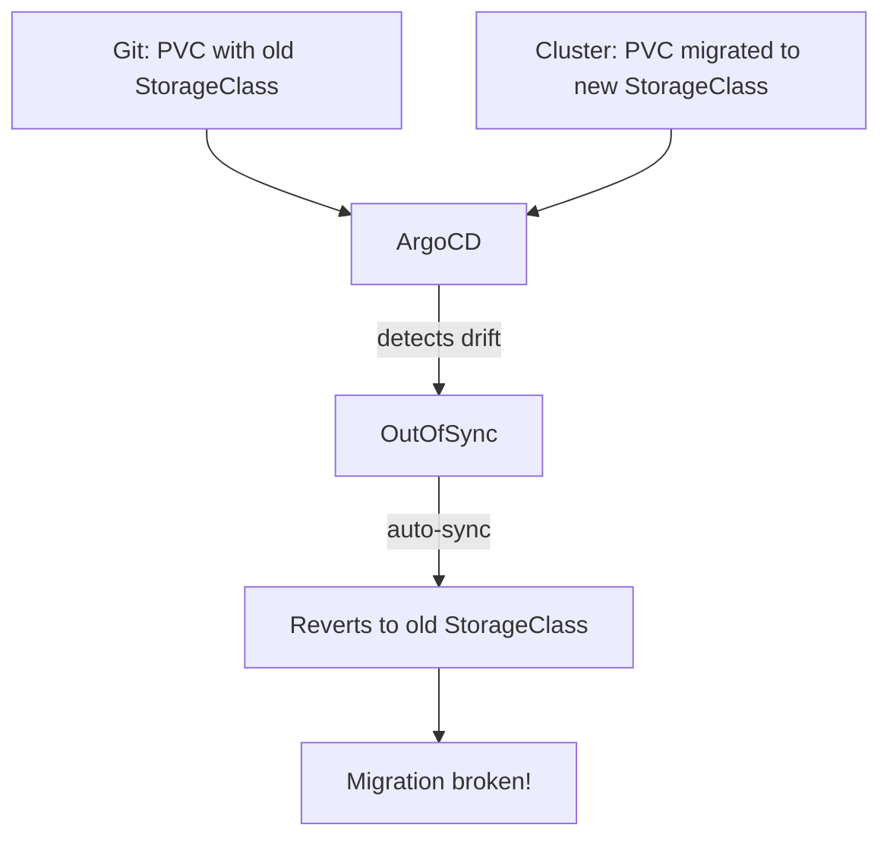
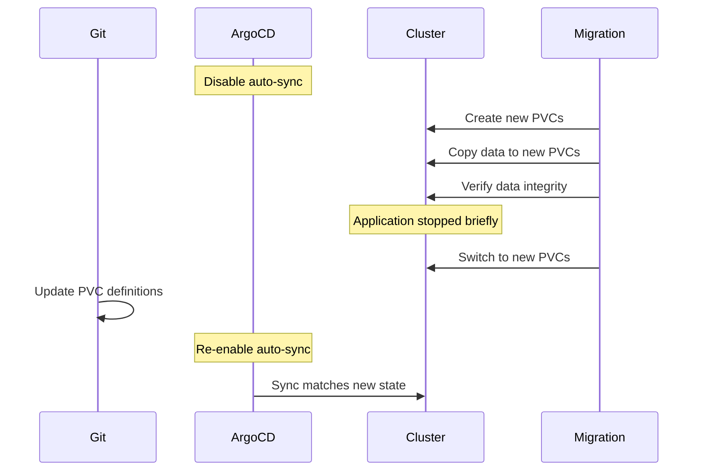

# How to Handle ArgoCD During Storage Migration

Author: [nawazdhandala](https://github.com/nawazdhandala)

Tags: ArgoCD, GitOps, Kubernetes, Storage, Migration

Description: Learn how to manage ArgoCD during Kubernetes storage migrations, including PV data movement, StorageClass changes, and minimizing application downtime.

---

Storage migrations in Kubernetes happen when you switch storage providers, change StorageClasses, migrate from local storage to network-attached storage, or move to a different CSI driver. These migrations affect applications that ArgoCD manages, and if not handled carefully, can cause sync conflicts, data loss, or extended downtime. This guide covers how to manage ArgoCD through storage migration scenarios.

## Why Storage Migrations Are Tricky with ArgoCD

ArgoCD tracks the desired state of PersistentVolumeClaims (PVCs) in Git. During a storage migration, the live PVCs in the cluster may temporarily differ from what Git declares - different StorageClass names, different volume sizes, or transitional resources that are not in Git. If auto-sync is enabled, ArgoCD may try to "fix" these differences by reverting your migration.



## Pre-Migration Planning

### Step 1: Inventory Affected PVCs

Identify which PVCs are managed by ArgoCD and which need migration.

```bash
# List all PVCs with their StorageClass and ArgoCD management labels
kubectl get pvc --all-namespaces -o custom-columns=\
NAMESPACE:.metadata.namespace,\
NAME:.metadata.name,\
STORAGECLASS:.spec.storageClassName,\
STATUS:.status.phase,\
SIZE:.spec.resources.requests.storage,\
ARGOCD_APP:.metadata.labels.app\\.kubernetes\\.io/instance

# Find PVCs using the old StorageClass
kubectl get pvc --all-namespaces -o json | \
  jq -r '.items[] | select(.spec.storageClassName == "old-storage-class") | "\(.metadata.namespace)/\(.metadata.name)"'
```

### Step 2: Disable Auto-Sync for Affected Applications

```bash
# Identify applications that manage the PVCs being migrated
for app in $(argocd app list -o name); do
  resources=$(argocd app resources "$app" 2>/dev/null | grep PersistentVolumeClaim)
  if [ -n "$resources" ]; then
    echo "Application $app manages PVCs:"
    echo "$resources"
  fi
done

# Disable auto-sync on affected applications
argocd app set my-database-app --sync-policy none
argocd app set my-stateful-app --sync-policy none
```

### Step 3: Set Up ignoreDifferences for PVC Fields

Tell ArgoCD to ignore the StorageClass and volume name fields that will change during migration.

```yaml
apiVersion: argoproj.io/v1alpha1
kind: Application
metadata:
  name: my-database-app
  namespace: argocd
spec:
  project: default
  source:
    repoURL: https://github.com/org/apps.git
    targetRevision: main
    path: database
  destination:
    server: https://kubernetes.default.svc
    namespace: database
  ignoreDifferences:
    # Ignore StorageClass changes during migration
    - group: ""
      kind: PersistentVolumeClaim
      jsonPointers:
        - /spec/storageClassName
        - /spec/volumeName
        - /spec/resources/requests/storage
```

## Migration Scenario 1: Changing StorageClass

The most common migration is switching from one StorageClass to another (for example, from local-path to Ceph or from gp2 to gp3 on AWS).

### Approach: Create New PVCs, Copy Data, Switch

```bash
# Step 1: Create a new PVC with the new StorageClass
cat <<EOF | kubectl apply -f -
apiVersion: v1
kind: PersistentVolumeClaim
metadata:
  name: my-data-new
  namespace: database
spec:
  storageClassName: new-storage-class
  accessModes:
    - ReadWriteOnce
  resources:
    requests:
      storage: 50Gi
EOF

# Step 2: Create a migration job to copy data
cat <<EOF | kubectl apply -f -
apiVersion: batch/v1
kind: Job
metadata:
  name: migrate-storage
  namespace: database
spec:
  template:
    spec:
      containers:
        - name: migrate
          image: busybox:1.36
          command:
            - sh
            - -c
            - |
              echo "Starting data copy..."
              cp -av /old-data/* /new-data/
              echo "Data copy complete."
              echo "Old data size: $(du -sh /old-data)"
              echo "New data size: $(du -sh /new-data)"
          volumeMounts:
            - name: old-data
              mountPath: /old-data
              readOnly: true
            - name: new-data
              mountPath: /new-data
      volumes:
        - name: old-data
          persistentVolumeClaim:
            claimName: my-data
        - name: new-data
          persistentVolumeClaim:
            claimName: my-data-new
      restartPolicy: Never
  backoffLimit: 3
EOF

# Step 3: Wait for the migration job to complete
kubectl wait --for=condition=Complete job/migrate-storage -n database --timeout=3600s
```

### Update Git Manifests

After data is copied, update the PVC definition in Git to use the new StorageClass and reference the new PVC.

```yaml
# Updated PVC in Git
apiVersion: v1
kind: PersistentVolumeClaim
metadata:
  name: my-data
  namespace: database
spec:
  storageClassName: new-storage-class
  accessModes:
    - ReadWriteOnce
  resources:
    requests:
      storage: 50Gi
```

Since PVCs are immutable (you cannot change the StorageClass of an existing PVC), you need to either:

1. Delete the old PVC and create a new one with the same name
2. Change the PVC name in your deployment and Git manifests

```bash
# Option A: Delete old PVC, rename new one
kubectl delete pvc my-data -n database
# Rename the new PVC (Kubernetes does not support renaming, so create a new one)
# This requires the application to be stopped

# Option B: Update the deployment to use the new PVC name
# Update the volume reference in your Deployment YAML in Git
```

## Migration Scenario 2: CSI Driver Change

When switching CSI drivers (for example, from in-tree to CSI, or between CSI providers).

```bash
# Step 1: Install the new CSI driver
kubectl apply -f new-csi-driver-manifests/

# Step 2: Create the new StorageClass
cat <<EOF | kubectl apply -f -
apiVersion: storage.k8s.io/v1
kind: StorageClass
metadata:
  name: csi-new-storage
provisioner: new-csi-driver.example.com
parameters:
  type: ssd
  replication: "3"
reclaimPolicy: Retain
volumeBindingMode: WaitForFirstConsumer
allowVolumeExpansion: true
EOF

# Step 3: Follow the data migration process from Scenario 1
```

## Migration Scenario 3: Volume Expansion

If you are just expanding volumes (not changing providers), this is simpler.

```bash
# Check if the StorageClass supports expansion
kubectl get storageclass <name> -o jsonpath='{.allowVolumeExpansion}'

# If yes, just update the PVC size in Git
```

```yaml
# Updated PVC in Git with larger size
apiVersion: v1
kind: PersistentVolumeClaim
metadata:
  name: my-data
  namespace: database
spec:
  storageClassName: existing-storage-class
  accessModes:
    - ReadWriteOnce
  resources:
    requests:
      storage: 100Gi  # Increased from 50Gi
```

ArgoCD will detect the change and sync it. The CSI driver handles the expansion.

```bash
# After ArgoCD syncs, check the expansion status
kubectl get pvc my-data -n database -o jsonpath='{.status.conditions}'
```

## Managing ArgoCD's Own Storage

ArgoCD's Redis component may use a PVC. During storage migration, handle it separately.

```bash
# Check if ArgoCD Redis uses a PVC
kubectl get pvc -n argocd

# If Redis is using ephemeral storage (default), no migration needed
# If you configured persistent Redis, include it in your migration plan
```

For ArgoCD HA installations, Redis Sentinel may use persistent storage.

```bash
# Check HA Redis PVCs
kubectl get pvc -n argocd -l app.kubernetes.io/component=redis
```

## Coordinating Git Changes with Migration

The key to a smooth migration is timing the Git changes correctly.



### Step-by-Step Coordination

```bash
# 1. Disable auto-sync
argocd app set my-app --sync-policy none

# 2. Scale down the application (to release the old PVC)
kubectl scale deployment my-app -n app-ns --replicas=0

# 3. Run the data migration job
kubectl apply -f migration-job.yaml
kubectl wait --for=condition=Complete job/migrate-data -n app-ns --timeout=3600s

# 4. Update Git manifests with new PVC configuration
# (commit and push the changes)

# 5. Delete the old PVC
kubectl delete pvc old-data-pvc -n app-ns

# 6. Sync the application from ArgoCD
argocd app sync my-app

# 7. Scale back up
kubectl scale deployment my-app -n app-ns --replicas=3

# 8. Re-enable auto-sync
argocd app set my-app --sync-policy automated

# 9. Verify
argocd app get my-app
kubectl get pods -n app-ns
```

## Post-Migration Cleanup

```bash
# Remove old StorageClass (if no longer needed)
kubectl delete storageclass old-storage-class

# Remove old PVs that are now Released
kubectl get pv | grep Released | awk '{print $1}' | xargs kubectl delete pv

# Remove migration jobs
kubectl delete job migrate-storage -n database

# Remove ignoreDifferences that were added for migration
# Update the Application manifest in Git to remove the temporary ignores

# Verify all applications are healthy
argocd app list | grep -v "Healthy.*Synced"
```

## Summary

Storage migrations with ArgoCD require careful coordination between the cluster state and Git state. The golden rule is: disable auto-sync before starting, perform the migration in the cluster, update Git to match the new state, then re-enable auto-sync. Use `ignoreDifferences` for PVC fields during the transition period, and always verify data integrity after copying. The biggest risk is ArgoCD reverting your migration by syncing back to the old state, which is why disabling auto-sync is the first and most critical step.
