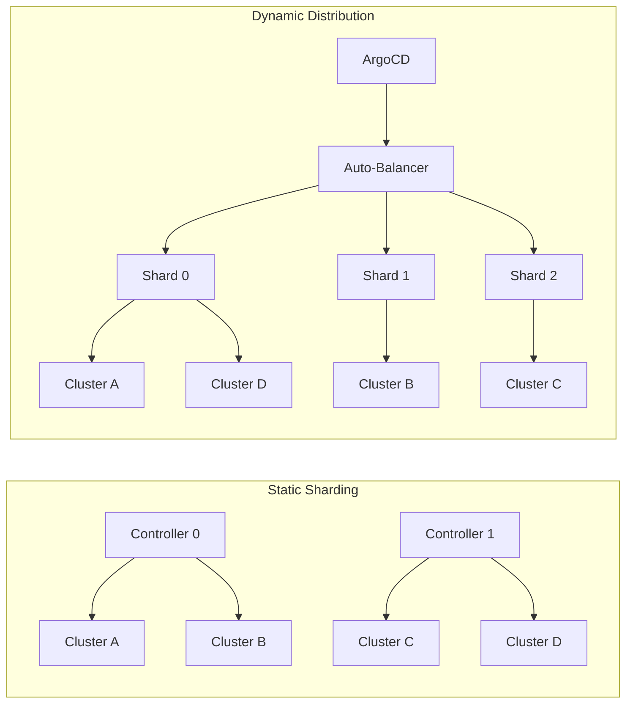

# How to Enable Dynamic Cluster Distribution in ArgoCD

Author: [nawazdhandala](https://github.com/nawazdhandala)

Tags: ArgoCD, GitOps, Kubernetes, High Availability, Cluster Management

Description: Learn how to enable dynamic cluster distribution in ArgoCD to automatically balance cluster workloads across multiple application controller replicas for better scalability.

---

When you manage hundreds of Kubernetes clusters with a single ArgoCD instance, the application controller can become a bottleneck. By default, ArgoCD runs a single application controller that reconciles every application across every cluster. Dynamic cluster distribution solves this by automatically spreading clusters across multiple controller shards, so the reconciliation load is balanced without manual intervention.

## Why You Need Dynamic Cluster Distribution

In a standard ArgoCD setup, one controller instance handles all the work. As your cluster count grows, you start noticing slower sync times, increased memory consumption, and higher CPU usage. The controller needs to watch resources across every cluster, maintain caches, and reconcile state. A single process doing all of this for 50+ clusters will eventually hit limits.

The traditional approach was static sharding - you manually assign clusters to specific controller replicas. That works, but it creates operational overhead. Every time you add or remove a cluster, someone has to update the shard assignments. Dynamic cluster distribution automates this entirely.



With dynamic distribution, ArgoCD uses a consistent hashing algorithm to assign clusters to controller shards. When a new shard comes online or an existing one goes away, clusters are automatically redistributed.

## Enabling Dynamic Cluster Distribution

Dynamic cluster distribution was introduced in ArgoCD 2.8 and requires you to configure the application controller as a StatefulSet rather than the default Deployment.

### Step 1: Update the argocd-cmd-params-cm ConfigMap

First, enable the feature through the ArgoCD configuration:

```yaml
# argocd-cmd-params-cm ConfigMap
apiVersion: v1
kind: ConfigMap
metadata:
  name: argocd-cmd-params-cm
  namespace: argocd
data:
  # Enable dynamic cluster distribution
  controller.dynamic.cluster.distribution.enabled: "true"
```

### Step 2: Deploy the Application Controller as a StatefulSet

The dynamic distribution feature relies on stable pod identities, which means you need a StatefulSet instead of a Deployment. Here is how the StatefulSet should look:

```yaml
apiVersion: apps/v1
kind: StatefulSet
metadata:
  name: argocd-application-controller
  namespace: argocd
spec:
  replicas: 3  # Number of controller shards
  serviceName: argocd-application-controller
  selector:
    matchLabels:
      app.kubernetes.io/name: argocd-application-controller
  template:
    metadata:
      labels:
        app.kubernetes.io/name: argocd-application-controller
    spec:
      containers:
        - name: argocd-application-controller
          image: quay.io/argoproj/argocd:v2.12.0
          command:
            - argocd-application-controller
          env:
            - name: ARGOCD_CONTROLLER_REPLICAS
              value: "3"
          # Resource limits should match your cluster scale
          resources:
            requests:
              cpu: "1"
              memory: 1Gi
            limits:
              cpu: "2"
              memory: 4Gi
```

The key difference from a Deployment is that each pod in the StatefulSet gets a stable identity (argocd-application-controller-0, argocd-application-controller-1, etc.). This stable identity is what allows the dynamic distribution algorithm to consistently assign clusters.

### Step 3: Configure the Headless Service

A StatefulSet requires a headless service for DNS-based discovery between shards:

```yaml
apiVersion: v1
kind: Service
metadata:
  name: argocd-application-controller
  namespace: argocd
spec:
  clusterIP: None
  selector:
    app.kubernetes.io/name: argocd-application-controller
  ports:
    - port: 8082
      targetPort: 8082
```

### Step 4: Verify the Configuration

After applying these changes, confirm that all controller pods are running:

```bash
# Check the StatefulSet status
kubectl get statefulset argocd-application-controller -n argocd

# Verify all pods are running
kubectl get pods -n argocd -l app.kubernetes.io/name=argocd-application-controller

# Check the logs for shard assignment messages
kubectl logs argocd-application-controller-0 -n argocd | grep "shard"
```

You should see log entries indicating which clusters have been assigned to each shard.

## How the Distribution Algorithm Works

ArgoCD uses a hash-based algorithm to distribute clusters. Each cluster's server URL is hashed, and the hash is mapped to a shard number using modulo arithmetic:

```text
shard = hash(cluster.server) % replicas
```

This approach has several benefits:

1. **Deterministic** - the same cluster always maps to the same shard given the same replica count
2. **Balanced** - hash functions produce a roughly even distribution
3. **Minimal disruption** - when adding or removing shards, only a fraction of clusters need to move

When you scale the StatefulSet from 3 to 4 replicas, roughly 25% of clusters will be reassigned. The rest stay on their current shard.

## Monitoring the Distribution

You can monitor which shard owns which cluster by inspecting the cluster secrets:

```bash
# List all cluster secrets and their shard assignments
kubectl get secrets -n argocd -l argocd.argoproj.io/secret-type=cluster \
  -o jsonpath='{range .items[*]}{.metadata.name}: shard={.metadata.annotations.argocd\.argoproj\.io/shard}{"\n"}{end}'
```

ArgoCD also exposes Prometheus metrics for shard monitoring:

```promql
# Number of clusters per shard
argocd_cluster_info{shard!=""}

# Controller workqueue depth per shard - useful for detecting overloaded shards
workqueue_depth{name="app_operation"}
```

## Common Issues and Troubleshooting

### Uneven Distribution

If some shards have significantly more clusters than others, it is usually because the hash function happens to cluster certain server URLs together. You can mitigate this by adjusting the replica count - sometimes going from 3 to 4 shards produces a more even spread.

### Controller Pods Not Picking Up Clusters

If a new controller pod is not reconciling its assigned clusters, check that the environment variable `ARGOCD_CONTROLLER_REPLICAS` matches the actual StatefulSet replica count:

```bash
kubectl get statefulset argocd-application-controller -n argocd \
  -o jsonpath='{.spec.replicas}'
```

### Shard Reassignment During Scaling

When scaling up or down, expect a brief period where some applications show as Unknown health status. The new shard needs to build its cache for newly assigned clusters. This typically takes 30 to 60 seconds depending on cluster size.

## Best Practices

1. **Start with 3 replicas** and scale up based on observed resource usage
2. **Set resource requests and limits** appropriately - each shard handles a fraction of the total load
3. **Monitor per-shard metrics** to detect imbalances early
4. **Use PodDisruptionBudgets** to prevent multiple shards from going down simultaneously
5. **Test scaling operations** in a staging environment first

If you are already running ArgoCD at scale, also check out our guide on [How to Distribute Clusters Across Controller Shards](https://oneuptime.com/blog/post/2026-02-26-argocd-distribute-clusters-across-shards/view) for a deeper dive into sharding strategies.

Dynamic cluster distribution is one of the most impactful features for scaling ArgoCD in production. It removes the manual burden of shard assignment and ensures your controller fleet adapts automatically as your infrastructure grows.
