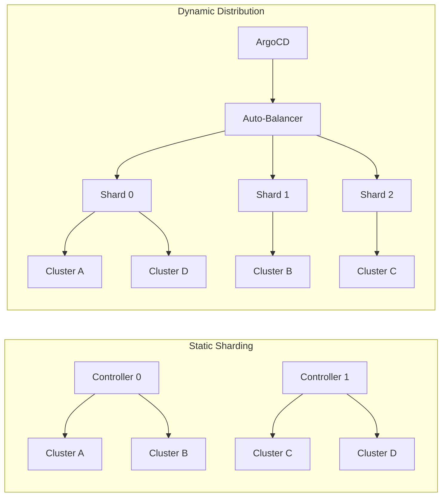

# How to Enable Dynamic Cluster Distribution in ArgoCD

Author: [nawazdhandala](https://github.com/nawazdhandala)

Tags: ArgoCD, GitOps, Kubernetes, High Availability, Cluster Management

Description: Learn how to enable dynamic cluster distribution in ArgoCD to automatically balance cluster workloads across multiple application controller replicas for better scalability.

---

When you manage hundreds of Kubernetes clusters with a single ArgoCD instance, the application controller can become a bottleneck. By default, ArgoCD runs a single application controller that reconciles every application across every cluster. Dynamic cluster distribution solves this by automatically spreading clusters across multiple controller shards, so the reconciliation load is balanced without manual intervention.

## Why You Need Dynamic Cluster Distribution

In a standard ArgoCD setup, one controller instance handles all the work. As your cluster count grows, you start noticing slower sync times, increased memory consumption, and higher CPU usage. The controller needs to watch resources across every cluster, maintain caches, and reconcile state. A single process doing all of this for 50+ clusters will eventually hit limits.

The traditional approach was static sharding - you set the number of controller replicas and ArgoCD keeps clusters assigned to those shards until the controllers restart or the cluster's `shard` field is changed manually. That works, but it creates operational overhead when you add or remove controller replicas. Dynamic cluster distribution automates this redistribution.


```mermaid
flowchart LR
    subgraph Before["Static Sharding"]
        C1[Controller 0] --> K1[Cluster A]
        C1 --> K2[Cluster B]
        C2[Controller 1] --> K3[Cluster C]
        C2 --> K4[Cluster D]
    end
    subgraph After["Dynamic Distribution"]
        DC[ArgoCD] --> Auto[Auto-Balancer]
        Auto --> S0[Shard 0]
        Auto --> S1[Shard 1]
        Auto --> S2[Shard 2]
        S0 --> CL1[Cluster A]
        S1 --> CL2[Cluster B]
        S2 --> CL3[Cluster C]
        S0 --> CL4[Cluster D]
    end
```

With dynamic distribution, ArgoCD re-runs the configured sharding algorithm when the number of controller replicas changes. When a new shard comes online or an existing one goes away, clusters are automatically redistributed.

## Enabling Dynamic Cluster Distribution

Dynamic cluster distribution was introduced in ArgoCD 2.9 as an alpha feature. In current ArgoCD releases it uses the application controller as a Deployment, not the default StatefulSet.

### Step 1: Enable Dynamic Distribution on the Controller

First, enable the feature by setting `ARGOCD_ENABLE_DYNAMIC_CLUSTER_DISTRIBUTION` on the application controller. If you use the official manifests, apply the `manifests/ha/base/controller-deployment/` Kustomize overlay, which scales the StatefulSet to zero and deploys the application controller as a Deployment. Then patch the controller environment:

```bash
kubectl set env deployment/argocd-application-controller -n argocd \
  ARGOCD_ENABLE_DYNAMIC_CLUSTER_DISTRIBUTION=true \
  ARGOCD_CONTROLLER_HEARTBEAT_TIME=10
```

### Step 2: Deploy the Application Controller as a Deployment

The dynamic distribution feature does not rely on stable StatefulSet pod identities. It uses a ConfigMap named `argocd-app-controller-shard-cm` to map controller pods to shard numbers and to store controller heartbeats. Here is how the Deployment should look:

```yaml
apiVersion: apps/v1
kind: Deployment
metadata:
  name: argocd-application-controller
  namespace: argocd
spec:
  replicas: 3  # Number of controller shards
  selector:
    matchLabels:
      app.kubernetes.io/name: argocd-application-controller
  template:
    metadata:
      labels:
        app.kubernetes.io/name: argocd-application-controller
    spec:
      containers:
        - name: argocd-application-controller
          image: quay.io/argoproj/argocd:v2.12.0
          command:
            - argocd-application-controller
          env:
            - name: ARGOCD_ENABLE_DYNAMIC_CLUSTER_DISTRIBUTION
              value: "true"
            - name: ARGOCD_CONTROLLER_HEARTBEAT_TIME
              value: "10"
          # Resource limits should match your cluster scale
          resources:
            requests:
              cpu: "1"
              memory: 1Gi
            limits:
              cpu: "2"
              memory: 4Gi
```

The key difference from static StatefulSet sharding is that the controller reads the replica count from the Deployment and records controller-to-shard mappings in the `argocd-app-controller-shard-cm` ConfigMap. This is what allows ArgoCD to redistribute clusters without relying on `ARGOCD_CONTROLLER_REPLICAS`.

### Step 3: Configure the Sharding Algorithm

Dynamic cluster distribution re-runs whichever sharding algorithm you configure. For balanced distribution, use `round-robin` or, in ArgoCD 2.12 and later, `consistent-hashing`:

```yaml
apiVersion: v1
kind: ConfigMap
metadata:
  name: argocd-cmd-params-cm
  namespace: argocd
data:
  controller.sharding.algorithm: round-robin
```

### Step 4: Verify the Configuration

After applying these changes, confirm that all controller pods are running:

```bash
# Check the Deployment status
kubectl get deployment argocd-application-controller -n argocd

# Verify all pods are running
kubectl get pods -n argocd -l app.kubernetes.io/name=argocd-application-controller

# Check the dynamic shard mapping ConfigMap
kubectl get configmap argocd-app-controller-shard-cm -n argocd -o yaml
```

You should see entries mapping shard numbers to application controller pod names and heartbeat timestamps.

## How the Distribution Algorithm Works

ArgoCD's dynamic distribution feature does not introduce a separate distribution formula. It re-runs the configured controller sharding algorithm when replicas are added or removed. The supported algorithms include `legacy`, `round-robin`, and `consistent-hashing` in ArgoCD versions that support them.

```text
controller.sharding.algorithm = legacy | round-robin | consistent-hashing
```

This approach has several benefits:

1. **Adaptive** - the shard mapping is recalculated when the Deployment replica count changes
2. **Balanced** - with `round-robin` or `consistent-hashing`, clusters are distributed more evenly across shards
3. **Less disruptive** - changing the replica count does not require updating `ARGOCD_CONTROLLER_REPLICAS` and restarting all controller pods

When you scale the Deployment from 3 to 4 replicas, ArgoCD updates the shard mapping ConfigMap and redistributes clusters according to the selected sharding algorithm.

## Monitoring the Distribution

You can monitor which controller pod owns which shard by inspecting the dynamic shard mapping ConfigMap:

```bash
# Show controller-to-shard assignments and heartbeats
kubectl get configmap argocd-app-controller-shard-cm -n argocd -o yaml
```

ArgoCD also exposes Prometheus metrics that help with shard monitoring. Query `argocd_cluster_info` per controller metrics target to see how many clusters that controller reports. If your Prometheus scrape adds a `pod` target label, you can group by that label:

```promql
# Number of clusters reported by each controller pod
count by (pod) (argocd_cluster_info)

# Controller workqueue depth - useful for detecting overloaded controllers
workqueue_depth{name="app_operation_processing_queue"}
```

## Common Issues and Troubleshooting

### Uneven Distribution

If some shards have significantly more clusters than others, check the configured `controller.sharding.algorithm`. The default `legacy` mode is not uniform; `round-robin` and `consistent-hashing` are designed to produce a more even spread.

### Controller Pods Not Picking Up Clusters

If a new controller pod is not reconciling its assigned clusters, check that dynamic distribution is enabled and that the Deployment replica count is correct:

```bash
kubectl get deployment argocd-application-controller -n argocd \
  -o jsonpath='{.spec.replicas}'

kubectl get deployment argocd-application-controller -n argocd \
  -o jsonpath='{.spec.template.spec.containers[?(@.name=="argocd-application-controller")].env[?(@.name=="ARGOCD_ENABLE_DYNAMIC_CLUSTER_DISTRIBUTION")].value}'
```

### Shard Reassignment During Scaling

When scaling up or down, expect a brief period where some applications show as Unknown health status. The new shard needs to build its cache for newly assigned clusters. This typically takes 30 to 60 seconds depending on cluster size.

## Best Practices

1. **Start with 3 replicas** and scale up based on observed resource usage
2. **Set resource requests and limits** appropriately - each shard handles a fraction of the total load
3. **Monitor per-shard metrics** to detect imbalances early
4. **Use PodDisruptionBudgets** to prevent multiple shards from going down simultaneously
5. **Test scaling operations** in a staging environment first

If you are already running ArgoCD at scale, also check out our guide on [How to Distribute Clusters Across Controller Shards](https://oneuptime.com/blog/post/2026-02-26-argocd-distribute-clusters-across-shards/view) for a deeper dive into sharding strategies.

Dynamic cluster distribution is one of the most impactful features for scaling large ArgoCD installations, but it is still an alpha feature. It removes the manual burden of shard reassignment and ensures your controller fleet adapts automatically as your infrastructure grows.
