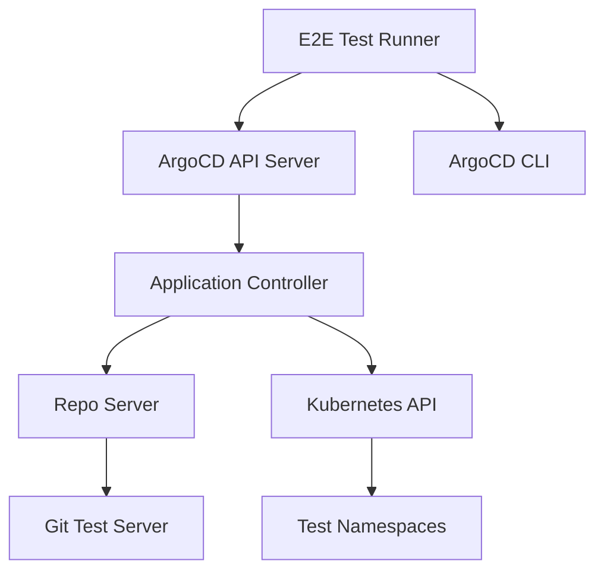

# How to Run ArgoCD E2E Tests Locally

Author: [nawazdhandala](https://github.com/nawazdhandala)

Tags: ArgoCD, GitOps, Kubernetes, Testing, CI/CD

Description: A comprehensive guide to running ArgoCD end-to-end tests locally, including environment setup, test execution, debugging failures, and writing new E2E tests.

---

Running ArgoCD's end-to-end (E2E) tests locally is critical for anyone contributing code to the project. The E2E test suite validates that all ArgoCD components work together correctly - from Git repository polling to manifest rendering to Kubernetes resource synchronization. While the CI pipeline runs these tests automatically on pull requests, running them locally lets you iterate faster and catch issues before pushing your changes.

## Understanding the E2E Test Architecture

ArgoCD's E2E tests run against a real Kubernetes cluster with a fully deployed ArgoCD instance. The tests use Go's testing framework and interact with ArgoCD through its API and CLI.



The test infrastructure includes a local Git server that hosts test repositories, ensuring tests are self-contained and do not depend on external services.

## Prerequisites

Before running E2E tests, you need a local Kubernetes cluster and several tools installed.

```bash
# Required tools
go version          # Go 1.21+
kubectl version     # kubectl matching your cluster version
kind version        # kind for creating local clusters
docker version      # Docker for building images

# Optional but helpful
k9s                 # Terminal UI for Kubernetes
stern               # Multi-pod log tailing
```

## Setting Up the Test Environment

The ArgoCD Makefile provides targets that handle most of the setup automatically.

```bash
# Clone and enter the repository
git clone https://github.com/argoproj/argo-cd.git
cd argo-cd

# Install build tools
make install-tools-local

# Generate code (required before building)
make generate-local
```

### Creating a Kind Cluster

The E2E tests expect a Kubernetes cluster. Kind (Kubernetes in Docker) is the recommended option.

```bash
# Create a kind cluster with the configuration used by CI
kind create cluster --name argocd-e2e --config test/container/kind.yaml

# If the config file does not exist, create a basic cluster
kind create cluster --name argocd-e2e

# Verify the cluster is running
kubectl cluster-info --context kind-argocd-e2e
```

### Starting the E2E Environment

ArgoCD provides a make target that builds everything and deploys it to your kind cluster.

```bash
# Build ArgoCD images and deploy to the kind cluster
# This builds the images, loads them into kind, and deploys ArgoCD
make start-e2e

# This target does several things:
# 1. Builds ArgoCD container images
# 2. Loads images into the kind cluster
# 3. Deploys ArgoCD using test manifests
# 4. Starts a local Git server for test repositories
# 5. Waits for all components to be ready
```

If you want more control over the process, you can run the steps individually.

```bash
# Build the ArgoCD image
make image DEV_IMAGE=true

# Load the image into kind
kind load docker-image argoproj/argocd:latest --name argocd-e2e

# Deploy ArgoCD with test configuration
kubectl apply -n argocd -f test/manifests/base

# Wait for components to be ready
kubectl wait --for=condition=available deployment/argocd-server -n argocd --timeout=120s
kubectl wait --for=condition=available deployment/argocd-repo-server -n argocd --timeout=120s
```

## Running the Tests

### Running the Full E2E Suite

```bash
# Run all E2E tests
make test-e2e

# This is equivalent to:
go test -v -timeout 30m ./test/e2e/...
```

The full suite can take 30 to 60 minutes depending on your machine. For development, you will usually want to run specific tests.

### Running Specific Tests

```bash
# Run a single test by name
go test -v -timeout 10m -run TestAppSyncWithHelm ./test/e2e/

# Run tests matching a pattern
go test -v -timeout 10m -run "TestApp.*Sync" ./test/e2e/

# Run tests in a specific file
go test -v -timeout 10m ./test/e2e/ -run TestHelmApp

# Run with increased verbosity for debugging
go test -v -timeout 10m -count=1 -run TestAppSyncWithHelm ./test/e2e/ 2>&1 | tee test-output.log
```

### Test Environment Variables

Several environment variables control E2E test behavior.

```bash
# Point tests at your ArgoCD instance
export ARGOCD_SERVER=localhost:8080
export ARGOCD_AUTH_TOKEN=$(argocd account generate-token --account admin)

# Use a specific kubeconfig
export KUBECONFIG=~/.kube/config

# Set the test Git server URL
export ARGOCD_E2E_GIT_SERVICE=http://localhost:9081

# Skip tests that require specific features
export ARGOCD_E2E_SKIP_HELM=true
export ARGOCD_E2E_SKIP_KUSTOMIZE=true

# Run tests with race detection (slower but catches race conditions)
go test -race -v -timeout 30m ./test/e2e/...
```

## Understanding E2E Test Structure

ArgoCD E2E tests follow a consistent pattern. Understanding this pattern helps when writing new tests or debugging failures.

```go
// test/e2e/app_sync_test.go
func TestAppSyncWithHelm(t *testing.T) {
    // Given: Create a test application pointing to a Helm chart
    app := Given(t).
        Path("helm-chart").           // Test fixture in test/e2e/testdata/
        Revision("HEAD").
        When().
        CreateApp().                   // Create the ArgoCD Application
        Sync().                        // Trigger a sync
        Then().
        Expect(OperationPhaseIs(OperationSucceeded)).  // Verify sync succeeded
        Expect(SyncStatusIs(SyncStatusCodeSynced)).    // Verify sync status
        Expect(HealthIs(health.HealthStatusHealthy))   // Verify health status
}
```

The test framework uses a fluent API with Given/When/Then patterns.

```go
// Given - sets up test preconditions
Given(t).
    Path("testdata/my-app").          // Path in the test Git repo
    DestNamespace("test-ns").         // Target namespace
    Revision("main").                  // Git revision
    Helm().                            // Use Helm
    Values("values-test.yaml")        // Custom values file

// When - performs actions
When().
    CreateApp().                       // Create the Application
    Sync().                            // Sync the Application
    PatchApp(`[{"op": "replace", "path": "/spec/source/targetRevision", "value": "v2"}]`).
    Refresh(RefreshTypeHard)           // Force refresh

// Then - verifies results
Then().
    Expect(OperationPhaseIs(OperationSucceeded)).
    Expect(ResourceSyncStatusIs("Deployment", "my-deploy", SyncStatusCodeSynced)).
    Expect(ResourceHealthIs("Deployment", "my-deploy", health.HealthStatusHealthy))
```

## Adding Test Fixtures

E2E tests use fixtures stored in `test/e2e/testdata/`. Each fixture is a directory containing Kubernetes manifests or Helm charts.

```bash
# Create a new test fixture
mkdir -p test/e2e/testdata/my-test-app

# Add a simple deployment manifest
cat > test/e2e/testdata/my-test-app/deployment.yaml <<'EOF'
apiVersion: apps/v1
kind: Deployment
metadata:
  name: my-test-app
spec:
  replicas: 1
  selector:
    matchLabels:
      app: my-test-app
  template:
    metadata:
      labels:
        app: my-test-app
    spec:
      containers:
      - name: app
        image: nginx:1.25
        ports:
        - containerPort: 80
EOF
```

## Debugging Test Failures

When tests fail, here is how to investigate.

### Check ArgoCD Component Logs

```bash
# Application controller logs
kubectl logs -n argocd deployment/argocd-application-controller --tail=100

# Repo server logs
kubectl logs -n argocd deployment/argocd-repo-server --tail=100

# API server logs
kubectl logs -n argocd deployment/argocd-server --tail=100

# Use stern for real-time multi-pod logging
stern -n argocd argocd
```

### Inspect Application State

```bash
# Check the application state during a test failure
argocd app get test-app -o yaml

# Check sync results
argocd app sync-status test-app

# Check the resources managed by the application
argocd app resources test-app
```

### Run Tests with Debug Output

```bash
# Run with Go's -v flag for verbose output
go test -v -run TestMyFailingTest ./test/e2e/ 2>&1 | tee debug.log

# Enable ArgoCD debug logging during tests
kubectl patch configmap argocd-cmd-params-cm -n argocd \
  --type merge -p '{"data":{"controller.log.level":"debug"}}'
kubectl rollout restart deployment -n argocd argocd-application-controller
```

## Writing New E2E Tests

When adding new functionality to ArgoCD, you should write E2E tests to verify it works end-to-end.

```go
// test/e2e/custom_feature_test.go
package e2e

import (
    "testing"
    . "github.com/argoproj/argo-cd/v2/test/e2e/fixture"
)

func TestCustomFeatureSync(t *testing.T) {
    // Test that our custom feature works correctly
    Given(t).
        Path("custom-feature-fixture").
        When().
        CreateApp().
        Sync().
        Then().
        Expect(OperationPhaseIs(OperationSucceeded)).
        Expect(SyncStatusIs(SyncStatusCodeSynced)).
        And(func(app *Application) {
            // Custom assertions
            assert.Equal(t, "expected-value",
                app.Status.OperationState.SyncResult.Resources[0].Message)
        })
}
```

## Cleaning Up

After running tests, clean up the test environment.

```bash
# Delete the kind cluster
kind delete cluster --name argocd-e2e

# Or just reset the ArgoCD namespace
kubectl delete namespace argocd
kubectl create namespace argocd
```

Running E2E tests locally is an investment that pays off quickly. You catch integration issues early, build confidence in your changes, and avoid the slow feedback loop of CI-only testing. Once your tests pass locally, check out our guide on [building ArgoCD from source](https://oneuptime.com/blog/post/2026-02-26-argocd-build-from-source/view) for the complete development workflow.
