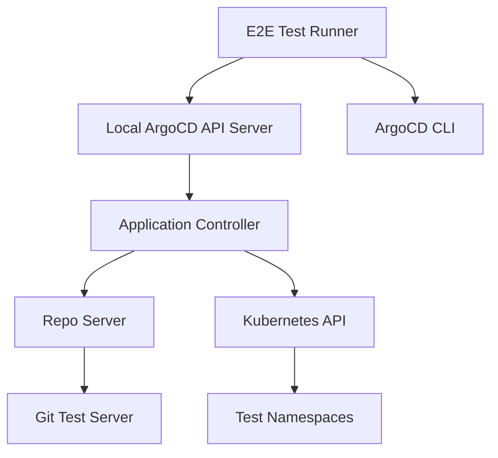

# How to Run ArgoCD E2E Tests Locally

Author: [nawazdhandala](https://github.com/nawazdhandala)

Tags: ArgoCD, GitOps, Kubernetes, Testing, CI/CD

Description: A comprehensive guide to running ArgoCD end-to-end tests locally, including environment setup, test execution, debugging failures, and writing new E2E tests.

---

Running ArgoCD's end-to-end (E2E) tests locally is critical for anyone contributing code to the project. The E2E test suite validates that all ArgoCD components work together correctly - from Git repository polling to manifest rendering to Kubernetes resource synchronization. While the CI pipeline runs these tests automatically on pull requests, running them locally lets you iterate faster and catch issues before pushing your changes.

## Understanding the E2E Test Architecture

ArgoCD's E2E tests run against a real Kubernetes cluster, with ArgoCD resources installed in the `argocd-e2e` namespace and ArgoCD services started locally by the test harness. The tests use Go's testing framework and interact with ArgoCD through its API and CLI.


```mermaid
graph TD
    A[E2E Test Runner] --> B[Local ArgoCD API Server]
    A --> C[ArgoCD CLI]
    B --> D[Application Controller]
    D --> E[Repo Server]
    E --> F[Git Test Server]
    D --> G[Kubernetes API]
    G --> H[Test Namespaces]
```

The test infrastructure includes a local Git server that hosts test repositories, ensuring tests are self-contained and do not depend on external services.

## Prerequisites

Before running E2E tests, you need a local Kubernetes cluster and several tools installed.

```bash
# Required tools

go version          # Use the Go version declared in go.mod
kubectl version     # kubectl matching your cluster version
kind version        # kind for creating local clusters
docker version      # Docker for building images
kustomize version   # Kustomize for applying test manifests

# Optional but helpful
k9s                 # Terminal UI for Kubernetes
stern               # Multi-pod log tailing
```

## Setting Up the Test Environment

The ArgoCD Makefile provides targets that handle most of the setup automatically.

```bash
# Clone and enter the repository
git clone https://github.com/argoproj/argo-cd.git
cd argo-cd

# Install build tools
make install-tools-local

# Generate code (required after changing generated APIs or manifests)
make codegen-local
```

### Creating a Kind Cluster

The E2E tests expect a Kubernetes cluster. Kind (Kubernetes in Docker) is the recommended option.

```bash
# Create a local kind cluster
kind create cluster --name argocd-e2e

# Verify the cluster is running
kubectl cluster-info --context kind-argocd-e2e
```

### Starting the E2E Environment

ArgoCD provides make targets that install the E2E resources into your current Kubernetes context and start the ArgoCD services needed by the tests.

```bash
# Start the E2E server using the virtualized toolchain
make start-e2e

# This target does several things:
# 1. Builds the argocd-test-tools image
# 2. Creates argocd-e2e namespaces in the current cluster
# 3. Applies test manifests from test/manifests/base
# 4. Starts local ArgoCD services, Redis, Dex, UI, and test repository services
# 5. Leaves the server processes running for make test-e2e
```

If you want more control over the process, you can run the steps individually.

```bash
# Apply the test manifests yourself before starting local services
kubectl create namespace argocd-e2e
kubectl config set-context --current --namespace=argocd-e2e
kustomize build test/manifests/base | kubectl apply --server-side --force-conflicts -f -

# Then start the E2E services locally
make start-e2e-local
```

## Running the Tests

### Running the Full E2E Suite

```bash
# Run all E2E tests
make test-e2e

# With a locally started server, run the local test target
make test-e2e-local
```

The full suite can take 30 to 60 minutes depending on your machine. For development, you will usually want to run specific tests.

### Running Specific Tests

```bash
# Run a single test by name
make TEST_FLAGS="-run TestHelm" test-e2e-local

# Run tests matching a pattern
make TEST_FLAGS="-run TestApp.*Sync" test-e2e-local

# Run tests in a specific file
make TEST_MODULE=./test/e2e/helm_test.go test-e2e-local

# Run with increased verbosity for debugging
make TEST_FLAGS="-run TestHelm -count=1" test-e2e-local 2>&1 | tee test-output.log
```

### Test Environment Variables

Several environment variables control E2E test behavior.

```bash
# Point tests at your ArgoCD instance
export ARGOCD_SERVER=localhost:8080

# Use a specific kubeconfig
export KUBECONFIG=~/.kube/config

# Set the test Git server URL for remote-style E2E runs
export ARGOCD_E2E_GIT_SERVICE=http://127.0.0.1:9081/argo-e2e/testdata.git

# Set the overall E2E suite timeout
export ARGOCD_E2E_TEST_TIMEOUT=2h

# Skip tests that require specific features
export ARGOCD_E2E_SKIP_HELM=true
export ARGOCD_E2E_SKIP_OPENSHIFT=true

# Run tests with race detection (slower but catches race conditions)
make TEST_FLAGS="-race" test-e2e-local
```

## Understanding E2E Test Structure

ArgoCD E2E tests follow a consistent pattern. Understanding this pattern helps when writing new tests or debugging failures.

```go
// test/e2e/app_sync_test.go
package e2e

import (
    "testing"

    "github.com/argoproj/argo-cd/gitops-engine/pkg/health"
    . "github.com/argoproj/argo-cd/gitops-engine/pkg/sync/common"

    . "github.com/argoproj/argo-cd/v3/pkg/apis/application/v1alpha1"
    . "github.com/argoproj/argo-cd/v3/test/e2e/fixture/app"
)

func TestHelmGuestbook(t *testing.T) {
    // Given: Create a test application pointing to a Helm chart
    Given(t).
        Path("helm-guestbook").       // Test fixture in test/e2e/testdata/
        Revision("HEAD").
        When().
        CreateApp().                   // Create the ArgoCD Application
        Sync().                        // Trigger a sync
        Then().
        Expect(OperationPhaseIs(OperationSucceeded)).  // Verify sync succeeded
        Expect(SyncStatusIs(SyncStatusCodeSynced)).    // Verify sync status
        Expect(HealthIs(health.HealthStatusHealthy))   // Verify health status
}
```

The test framework uses a fluent API with Given/When/Then patterns.

```go
// Given - sets up test preconditions
Given(t).
    Path("my-app").                   // Path under test/e2e/testdata/
    SetAppNamespace("test-ns").       // Application namespace
    Revision("main").                  // Git revision

// When - performs actions
When().
    CreateApp().                       // Create the Application
    Sync().                            // Sync the Application
    PatchApp(`[{"op": "replace", "path": "/spec/source/targetRevision", "value": "v2"}]`).
    Refresh(RefreshTypeHard)           // Force refresh

// Then - verifies results
Then().
    Expect(OperationPhaseIs(OperationSucceeded)).
    Expect(ResourceSyncStatusIs("Deployment", "my-deploy", SyncStatusCodeSynced)).
    Expect(ResourceHealthIs("Deployment", "my-deploy", health.HealthStatusHealthy))
```

## Adding Test Fixtures

E2E tests use fixtures stored in `test/e2e/testdata/`. Each fixture is a directory containing Kubernetes manifests or Helm charts.

```bash
# Create a new test fixture
mkdir -p test/e2e/testdata/my-test-app

# Add a simple deployment manifest
cat > test/e2e/testdata/my-test-app/deployment.yaml <<'EOF'
apiVersion: apps/v1
kind: Deployment
metadata:
  name: my-test-app
spec:
  replicas: 1
  selector:
    matchLabels:
      app: my-test-app
  template:
    metadata:
      labels:
        app: my-test-app
    spec:
      containers:
      - name: app
        image: nginx:1.25
        ports:
        - containerPort: 80
EOF
```

## Debugging Test Failures

When tests fail, here is how to investigate.

### Check ArgoCD Component Logs

```bash
# ArgoCD service logs are emitted by the local start-e2e process

# Inspect the Kubernetes resources installed for E2E tests
kubectl get all -n argocd-e2e

# Use stern for real-time multi-pod logging
stern -n argocd-e2e argocd
```

### Inspect Application State

```bash
# Check the application state during a test failure
argocd app get test-app -o yaml

# Check sync results
argocd app get test-app

# Check the resources managed by the application
argocd app resources test-app
```

### Run Tests with Debug Output

```bash
# Run with verbose output
make TEST_FLAGS="-run TestMyFailingTest" test-e2e-local 2>&1 | tee debug.log

# The E2E Procfile starts ArgoCD services with debug logging by default
ARGOCD_START=api-server make start-e2e-local
```

## Writing New E2E Tests

When adding new functionality to ArgoCD, you should write E2E tests to verify it works end-to-end.

```go
// test/e2e/custom_feature_test.go
package e2e

import (
    "testing"

    . "github.com/argoproj/argo-cd/gitops-engine/pkg/sync/common"
    "github.com/stretchr/testify/assert"

    . "github.com/argoproj/argo-cd/v3/pkg/apis/application/v1alpha1"
    . "github.com/argoproj/argo-cd/v3/test/e2e/fixture/app"
)

func TestCustomFeatureSync(t *testing.T) {
    // Test that our custom feature works correctly
    Given(t).
        Path("custom-feature-fixture").
        When().
        CreateApp().
        Sync().
        Then().
        Expect(OperationPhaseIs(OperationSucceeded)).
        Expect(SyncStatusIs(SyncStatusCodeSynced)).
        And(func(app *Application) {
            // Custom assertions
            assert.Equal(t, "expected-value",
                app.Status.OperationState.SyncResult.Resources[0].Message)
        })
}
```

## Cleaning Up

After running tests, clean up the test environment.

```bash
# Delete the kind cluster
kind delete cluster --name argocd-e2e

# Or just reset the ArgoCD E2E namespaces
kubectl delete namespace argocd-e2e argocd-e2e-external argocd-e2e-external-2
```

Running E2E tests locally is an investment that pays off quickly. You catch integration issues early, build confidence in your changes, and avoid the slow feedback loop of CI-only testing. Once your tests pass locally, check out our guide on [building ArgoCD from source](https://oneuptime.com/blog/post/2026-02-26-argocd-build-from-source/view) for the complete development workflow.
