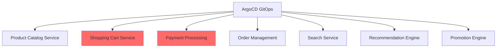

# ArgoCD for E-Commerce: Zero-Downtime Holiday Deployments

Author: [nawazdhandala](https://github.com/nawazdhandala)

Tags: ArgoCD, GitOps, Kubernetes, E-Commerce, Deployments

Description: Configure ArgoCD for e-commerce platforms with zero-downtime deployments, change freezes for peak shopping seasons, and progressive rollout strategies.

---

E-commerce platforms live and die by their uptime, especially during peak shopping events like Black Friday, Cyber Monday, Prime Day, and holiday seasons. A deployment that goes wrong during these periods can cost millions in lost revenue. ArgoCD provides the controlled, auditable deployment pipeline that e-commerce teams need, with built-in features for change freezes, progressive rollouts, and automated rollback. This guide shows how to configure ArgoCD specifically for e-commerce deployment patterns.

## The E-Commerce Deployment Challenge

E-commerce platforms have unique deployment requirements compared to typical web applications:

- **Revenue-correlated uptime.** Every minute of downtime has a direct dollar value
- **Traffic spikes.** 10-50x normal traffic during peak events
- **Feature velocity.** Marketing teams want frequent updates for promotions
- **Payment sensitivity.** Payment processing must never be interrupted
- **Global presence.** Customers across multiple time zones and regions



## Change Freeze Configuration

The most critical ArgoCD feature for e-commerce is sync windows. Configure change freezes around peak shopping periods.

```yaml
# AppProject with e-commerce sync windows
apiVersion: argoproj.io/v1alpha1
kind: AppProject
metadata:
  name: ecommerce-production
  namespace: argocd
spec:
  description: "Production e-commerce applications"
  sourceRepos:
    - 'https://github.com/org/ecommerce-gitops.git'
  destinations:
    - namespace: 'ecommerce-*'
      server: 'https://production.example.com'
  syncWindows:
    # Black Friday freeze: No automated deployments from Nov 25 to Dec 2
    - kind: deny
      schedule: '0 0 25 11 *'
      duration: 168h  # 7 days
      applications:
        - '*'
      namespaces:
        - 'ecommerce-*'

    # Cyber Monday additional protection
    - kind: deny
      schedule: '0 0 * * *'
      duration: 24h
      applications:
        - 'payment-*'
        - 'cart-*'
        - 'checkout-*'
      # Only during November-December
      # Manage this by updating the project before the season

    # Allow emergency manual syncs during freeze
    - kind: allow
      schedule: '* * * * *'
      duration: 24h
      applications:
        - '*'
      manualSync: true

    # Normal operations: allow automated sync during business hours
    - kind: allow
      schedule: '0 6 * * 1-5'
      duration: 12h
      applications:
        - '*'
```

### Seasonal Freeze Automation

Automate change freeze activation and deactivation with a CronJob or CI pipeline.

```yaml
# Pre-built freeze configurations managed in Git
# freeze-configs/black-friday-2024.yaml
apiVersion: argoproj.io/v1alpha1
kind: AppProject
metadata:
  name: ecommerce-production
  namespace: argocd
  annotations:
    freeze-reason: "Black Friday / Cyber Monday 2024"
    freeze-start: "2024-11-25T00:00:00Z"
    freeze-end: "2024-12-03T00:00:00Z"
spec:
  syncWindows:
    - kind: deny
      schedule: '0 0 25 11 *'
      duration: 192h  # Nov 25 to Dec 3
      applications:
        - '*'
    - kind: allow
      schedule: '* * * * *'
      duration: 24h
      applications:
        - '*'
      manualSync: true
```

## Zero-Downtime Deployment Strategies

### Canary Deployments for Revenue-Critical Services

Use Argo Rollouts with ArgoCD for gradual traffic shifting.

```yaml
# Canary rollout for the product catalog service
apiVersion: argoproj.io/v1alpha1
kind: Rollout
metadata:
  name: product-catalog
  namespace: ecommerce-catalog
spec:
  replicas: 20
  strategy:
    canary:
      trafficRouting:
        nginx:
          stableIngress: product-catalog-stable
          additionalIngressAnnotations:
            canary-by-header: X-Canary
      steps:
        # Start with internal testing only
        - setHeaderRoute:
            name: canary-header
            match:
              - headerName: X-Canary
                headerValue:
                  exact: "true"
        - pause: {duration: 300}  # 5 min internal validation

        # 5% of real traffic
        - setWeight: 5
        - analysis:
            templates:
              - templateName: ecommerce-success-rate
              - templateName: checkout-conversion-rate
            args:
              - name: service
                value: product-catalog
        - pause: {duration: 600}  # 10 min observation

        # 20% of real traffic
        - setWeight: 20
        - analysis:
            templates:
              - templateName: ecommerce-success-rate
              - templateName: revenue-impact
        - pause: {duration: 900}  # 15 min observation

        # 50% of real traffic
        - setWeight: 50
        - analysis:
            templates:
              - templateName: ecommerce-success-rate
              - templateName: checkout-conversion-rate
              - templateName: revenue-impact
        - pause: {duration: 600}

        # Full rollout
        - setWeight: 100
  selector:
    matchLabels:
      app: product-catalog
  template:
    metadata:
      labels:
        app: product-catalog
    spec:
      containers:
        - name: product-catalog
          image: myregistry/product-catalog:v3.2.1
          resources:
            requests:
              cpu: 500m
              memory: 512Mi
```

### Business Metric Analysis

For e-commerce, technical metrics are not enough. You need to monitor business metrics during rollouts.

```yaml
# AnalysisTemplate checking checkout conversion rate
apiVersion: argoproj.io/v1alpha1
kind: AnalysisTemplate
metadata:
  name: checkout-conversion-rate
spec:
  args:
    - name: service
  metrics:
    - name: conversion-rate
      interval: 120s
      # Conversion rate should not drop more than 2% compared to baseline
      successCondition: result[0] >= 0.98 * result[1]
      failureLimit: 3
      provider:
        prometheus:
          address: http://prometheus.monitoring:9090
          query: |
            # Current conversion rate
            (
              sum(rate(checkout_completed_total[10m]))
              /
              sum(rate(cart_created_total[10m]))
            )
            /
            # Baseline conversion rate (previous week same time)
            (
              sum(rate(checkout_completed_total[10m] offset 7d))
              /
              sum(rate(cart_created_total[10m] offset 7d))
            )

    - name: revenue-per-minute
      interval: 120s
      # Revenue should not drop more than 5% compared to baseline
      successCondition: result[0] >= 0.95
      failureLimit: 2
      provider:
        prometheus:
          address: http://prometheus.monitoring:9090
          query: |
            sum(rate(order_revenue_total[10m]))
            /
            sum(rate(order_revenue_total[10m] offset 7d))
```

## Multi-Region E-Commerce Deployment

Deploy consistently across regions while respecting local peak hours.

```yaml
# ApplicationSet for multi-region e-commerce
apiVersion: argoproj.io/v1alpha1
kind: ApplicationSet
metadata:
  name: ecommerce-platform
  namespace: argocd
spec:
  generators:
    - matrix:
        generators:
          - list:
              elements:
                - region: us-east
                  cluster: https://us-east-prod.example.com
                  timezone: America/New_York
                - region: eu-west
                  cluster: https://eu-west-prod.example.com
                  timezone: Europe/London
                - region: ap-southeast
                  cluster: https://ap-southeast-prod.example.com
                  timezone: Asia/Singapore
          - list:
              elements:
                - service: product-catalog
                  path: services/product-catalog
                - service: shopping-cart
                  path: services/shopping-cart
                - service: checkout
                  path: services/checkout
                - service: search
                  path: services/search
  template:
    metadata:
      name: '{{service}}-{{region}}'
    spec:
      project: ecommerce-production
      source:
        repoURL: https://github.com/org/ecommerce-gitops.git
        path: '{{path}}/overlays/{{region}}'
        targetRevision: main
      destination:
        server: '{{cluster}}'
        namespace: 'ecommerce-{{service}}'
      syncPolicy:
        automated:
          selfHeal: true
          prune: true
```

## Promotion Pipeline

E-commerce deployments typically follow a strict promotion pipeline.

```yaml
# Development - auto-sync, rapid iteration
apiVersion: argoproj.io/v1alpha1
kind: Application
metadata:
  name: product-catalog-dev
spec:
  source:
    path: services/product-catalog/overlays/dev
  syncPolicy:
    automated:
      selfHeal: true
      prune: true

---
# Staging - auto-sync with load testing
apiVersion: argoproj.io/v1alpha1
kind: Application
metadata:
  name: product-catalog-staging
spec:
  source:
    path: services/product-catalog/overlays/staging
  syncPolicy:
    automated:
      selfHeal: true
      prune: true

---
# Production - manual sync only, with canary
apiVersion: argoproj.io/v1alpha1
kind: Application
metadata:
  name: product-catalog-production
spec:
  source:
    path: services/product-catalog/overlays/production
  # No automated sync - requires manual approval
```

## Pre-Peak Season Checklist

Before peak shopping events, ensure your ArgoCD configuration is ready.

```bash
# 1. Verify change freeze windows are configured
argocd proj get ecommerce-production -o yaml | grep -A 20 syncWindows

# 2. Confirm all production apps are healthy
argocd app list --project ecommerce-production -o json | \
  jq '.[] | select(.status.health.status != "Healthy") | .metadata.name'

# 3. Verify rollback targets exist for all services
for app in $(argocd app list --project ecommerce-production -o name); do
  echo "=== $app ==="
  argocd app history "$app" | head -5
done

# 4. Test manual sync capability (important during freeze)
argocd app sync product-catalog-production --dry-run

# 5. Verify notification channels are working
# Ensure on-call teams receive deployment alerts
```

## Rollback Procedures

When a deployment goes wrong during a sale event, speed is critical.

```bash
# Immediate rollback using ArgoCD
# Option 1: Revert to previous Git commit
git revert HEAD
git push origin main
# ArgoCD syncs the rollback automatically

# Option 2: Sync to a specific revision
argocd app sync product-catalog-production --revision abc1234

# Option 3: Rollback using Argo Rollouts (if using canary/blue-green)
kubectl argo rollouts abort product-catalog -n ecommerce-catalog
kubectl argo rollouts undo product-catalog -n ecommerce-catalog
```

E-commerce deployments require a balance between deployment velocity and stability. ArgoCD gives you the tools to deploy confidently during normal operations and lock down changes when revenue is on the line. The combination of sync windows, progressive delivery, business metric analysis, and automated rollback creates a deployment pipeline that protects your bottom line while keeping your platform current. For end-to-end monitoring of your e-commerce platform, integrate [OneUptime](https://oneuptime.com/blog/post/2026-02-26-argocd-fintech-compliance/view) for comprehensive uptime and performance monitoring.
