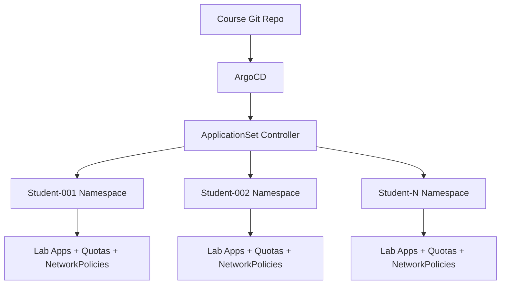

# ArgoCD for Education: Multi-Tenant Lab Environments

Author: [nawazdhandala](https://github.com/nawazdhandala)

Tags: ArgoCD, GitOps, Kubernetes, Education, Multi-Tenancy

Description: Learn how to use ArgoCD to manage multi-tenant Kubernetes lab environments for educational institutions, including student isolation, resource quotas, and self-service deployments.

---

Educational institutions running Kubernetes courses, workshops, or research labs face a recurring problem: how do you give dozens or hundreds of students their own isolated environments without spending all your time on provisioning and cleanup? ArgoCD combined with the ApplicationSet controller solves this elegantly. Each student gets a namespace, resource quotas, and pre-configured applications - all managed through Git and automatically provisioned.

This guide covers setting up ArgoCD for educational multi-tenant lab environments, from course setup to teardown.

## The Education Lab Challenge

Picture this: you are running a Kubernetes course with 60 students. Each student needs their own namespace with specific applications deployed, network policies to prevent cross-namespace interference, resource limits to prevent any single student from consuming the entire cluster, and a way to reset their environment when things go wrong.

Doing this manually is not sustainable. Doing it with shell scripts is fragile. ArgoCD makes it declarative and repeatable.

## Architecture Overview



## Student Roster as Code

Start with a Git repository that defines your course. The student list drives everything:

```yaml
# courses/kubernetes-101/students.yaml
students:
  - id: student-001
    name: "Alice Johnson"
    email: "ajohnson@university.edu"
    lab-group: "morning"
  - id: student-002
    name: "Bob Smith"
    email: "bsmith@university.edu"
    lab-group: "morning"
  - id: student-003
    name: "Charlie Davis"
    email: "cdavis@university.edu"
    lab-group: "afternoon"
```

## ApplicationSet for Student Environments

Use an ApplicationSet with a Git generator to create one ArgoCD Application per student:

```yaml
# applicationsets/student-environments.yaml
apiVersion: argoproj.io/v1alpha1
kind: ApplicationSet
metadata:
  name: kubernetes-101-labs
  namespace: argocd
spec:
  generators:
  - git:
      repoURL: https://git.university.edu/courses/kubernetes-101.git
      revision: HEAD
      files:
      - path: "students.yaml"
    selector:
      matchExpressions: []
  # Use the list generator parsing the students array
  - list:
      elementsYaml: |
        {{- range .students }}
        - id: {{ .id }}
          name: {{ .name }}
          email: {{ .email }}
          labGroup: {{ .lab-group }}
        {{- end }}
  template:
    metadata:
      name: 'lab-{{id}}'
      annotations:
        student-email: '{{email}}'
        lab-group: '{{labGroup}}'
    spec:
      project: kubernetes-101
      source:
        repoURL: https://git.university.edu/courses/kubernetes-101.git
        targetRevision: HEAD
        path: 'lab-environment'
        helm:
          parameters:
          - name: studentId
            value: '{{id}}'
          - name: studentName
            value: '{{name}}'
          - name: namespace
            value: 'lab-{{id}}'
      destination:
        server: https://kubernetes.default.svc
        namespace: 'lab-{{id}}'
      syncPolicy:
        automated:
          prune: true
          selfHeal: true
        syncOptions:
        - CreateNamespace=true
```

A simpler and more practical approach uses the list generator directly:

```yaml
apiVersion: argoproj.io/v1alpha1
kind: ApplicationSet
metadata:
  name: kubernetes-101-labs
  namespace: argocd
spec:
  generators:
  - list:
      elements:
      - id: student-001
        email: ajohnson@university.edu
      - id: student-002
        email: bsmith@university.edu
      - id: student-003
        email: cdavis@university.edu
  template:
    metadata:
      name: 'lab-{{id}}'
    spec:
      project: kubernetes-101
      source:
        repoURL: https://git.university.edu/courses/kubernetes-101.git
        targetRevision: HEAD
        path: 'lab-environment'
        helm:
          parameters:
          - name: studentId
            value: '{{id}}'
      destination:
        server: https://kubernetes.default.svc
        namespace: 'lab-{{id}}'
      syncPolicy:
        automated:
          prune: true
          selfHeal: true
        syncOptions:
        - CreateNamespace=true
```

## Lab Environment Helm Chart

The Helm chart deployed per student includes everything they need:

```yaml
# lab-environment/templates/resource-quota.yaml
apiVersion: v1
kind: ResourceQuota
metadata:
  name: student-quota
  namespace: lab-{{ .Values.studentId }}
spec:
  hard:
    requests.cpu: "2"
    requests.memory: 4Gi
    limits.cpu: "4"
    limits.memory: 8Gi
    pods: "20"
    services: "10"
    persistentvolumeclaims: "5"
    requests.storage: 20Gi
```

```yaml
# lab-environment/templates/limit-range.yaml
apiVersion: v1
kind: LimitRange
metadata:
  name: student-limits
  namespace: lab-{{ .Values.studentId }}
spec:
  limits:
  - default:
      cpu: 500m
      memory: 512Mi
    defaultRequest:
      cpu: 100m
      memory: 128Mi
    type: Container
```

```yaml
# lab-environment/templates/network-policy.yaml
apiVersion: networking.k8s.io/v1
kind: NetworkPolicy
metadata:
  name: isolate-student
  namespace: lab-{{ .Values.studentId }}
spec:
  podSelector: {}
  policyTypes:
  - Ingress
  - Egress
  ingress:
  # Allow traffic only within the student's own namespace
  - from:
    - podSelector: {}
  egress:
  # Allow DNS
  - to:
    - namespaceSelector:
        matchLabels:
          kubernetes.io/metadata.name: kube-system
    ports:
    - protocol: UDP
      port: 53
  # Allow traffic within own namespace
  - to:
    - podSelector: {}
  # Allow internet access for pulling images and docs
  - to:
    - ipBlock:
        cidr: 0.0.0.0/0
        except:
        - 10.0.0.0/8
        - 172.16.0.0/12
        - 192.168.0.0/16
```

## Pre-Deployed Lab Applications

For a Kubernetes 101 course, you might pre-deploy applications students will interact with:

```yaml
# lab-environment/templates/sample-app.yaml
apiVersion: apps/v1
kind: Deployment
metadata:
  name: sample-web-app
  namespace: lab-{{ .Values.studentId }}
  labels:
    app: sample-web-app
    purpose: lab-exercise
spec:
  replicas: 1
  selector:
    matchLabels:
      app: sample-web-app
  template:
    metadata:
      labels:
        app: sample-web-app
    spec:
      containers:
      - name: web
        image: nginx:1.25-alpine
        ports:
        - containerPort: 80
        resources:
          requests:
            cpu: 50m
            memory: 64Mi
          limits:
            cpu: 200m
            memory: 128Mi
---
apiVersion: v1
kind: Service
metadata:
  name: sample-web-app
  namespace: lab-{{ .Values.studentId }}
spec:
  selector:
    app: sample-web-app
  ports:
  - port: 80
    targetPort: 80
```

## RBAC: Give Students Access to Only Their Namespace

Create Kubernetes RBAC bindings so each student can only interact with their own namespace:

```yaml
# lab-environment/templates/rbac.yaml
apiVersion: v1
kind: ServiceAccount
metadata:
  name: {{ .Values.studentId }}
  namespace: lab-{{ .Values.studentId }}
---
apiVersion: rbac.authorization.k8s.io/v1
kind: RoleBinding
metadata:
  name: student-access
  namespace: lab-{{ .Values.studentId }}
roleRef:
  apiGroup: rbac.authorization.k8s.io
  kind: ClusterRole
  name: edit
subjects:
- kind: ServiceAccount
  name: {{ .Values.studentId }}
  namespace: lab-{{ .Values.studentId }}
```

Generate kubeconfig files for students automatically:

```bash
#!/bin/bash
# generate-student-kubeconfig.sh
STUDENT_ID=$1
NAMESPACE="lab-${STUDENT_ID}"
SERVER=$(kubectl config view --minify -o jsonpath='{.clusters[0].cluster.server}')

# Get the service account token
TOKEN=$(kubectl create token ${STUDENT_ID} -n ${NAMESPACE} --duration=720h)

# Generate kubeconfig
cat > kubeconfig-${STUDENT_ID}.yaml <<EOF
apiVersion: v1
kind: Config
clusters:
- cluster:
    server: ${SERVER}
    certificate-authority-data: $(kubectl config view --raw -o jsonpath='{.clusters[0].cluster.certificate-authority-data}')
  name: lab-cluster
contexts:
- context:
    cluster: lab-cluster
    namespace: ${NAMESPACE}
    user: ${STUDENT_ID}
  name: lab
current-context: lab
users:
- name: ${STUDENT_ID}
  user:
    token: ${TOKEN}
EOF

echo "Generated kubeconfig for ${STUDENT_ID}"
```

## Self-Healing for Lab Resilience

One of the best features for education is ArgoCD's self-heal capability. Students will inevitably break things. With self-heal enabled, ArgoCD automatically restores the baseline configuration:

```yaml
syncPolicy:
  automated:
    prune: true
    selfHeal: true  # Automatically fix drift
  retry:
    limit: 5
    backoff:
      duration: 5s
      factor: 2
      maxDuration: 1m
```

If a student accidentally deletes the sample web app, ArgoCD recreates it within seconds. This is incredibly useful during labs because students cannot permanently break their environment.

For exercises where students need to make persistent changes, create a separate "workspace" directory that ArgoCD does not manage:

```yaml
# lab-environment/templates/workspace-note.yaml
apiVersion: v1
kind: ConfigMap
metadata:
  name: workspace-instructions
  namespace: lab-{{ .Values.studentId }}
data:
  README: |
    Resources with the label "managed-by: student" are not
    auto-healed by ArgoCD. Use this label for your exercises.
```

## Course Lifecycle Management

When a course starts, add students to Git. When it ends, remove them and ArgoCD prunes everything:

```bash
# Start of semester: add students from enrollment system
python3 scripts/import-roster.py --course kubernetes-101 --semester spring-2026

# This commits to Git, ArgoCD picks up the changes and creates all namespaces

# End of semester: clean up
git rm courses/kubernetes-101/students.yaml
git commit -m "End of Spring 2026 Kubernetes 101 course"
git push

# ArgoCD prunes all student namespaces automatically
```

## Monitoring Lab Health

Use ArgoCD's built-in metrics to monitor lab status. Connect these to OneUptime for alerting when student environments have issues:

```yaml
# Monitor that all student apps are healthy
apiVersion: monitoring.coreos.com/v1
kind: PrometheusRule
metadata:
  name: lab-health
spec:
  groups:
  - name: lab-environment-health
    rules:
    - alert: StudentLabDegraded
      expr: |
        argocd_app_info{project="kubernetes-101", health_status!="Healthy"} == 1
      for: 10m
      labels:
        severity: warning
      annotations:
        summary: "Student lab {{ $labels.name }} is unhealthy"
```

## Conclusion

ArgoCD transforms the management of educational lab environments from a manual headache into a declarative, self-healing system. The ApplicationSet controller handles provisioning at scale, network policies provide student isolation, resource quotas prevent resource hogging, and self-heal keeps environments functional even when students break things. The entire lifecycle - from course creation to teardown - lives in Git, making it reproducible semester after semester. For institutions running regular Kubernetes training, this pattern saves dozens of hours per course while providing a better experience for students.
