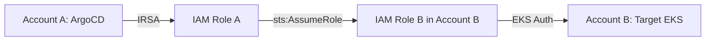

# How to Configure IAM/IRSA Auth for EKS Clusters in ArgoCD

Author: [nawazdhandala](https://github.com/nawazdhandala)

Tags: ArgoCD, GitOps, Kubernetes, AWS EKS, IAM

Description: Learn how to configure IAM Roles for Service Accounts (IRSA) authentication for Amazon EKS clusters in ArgoCD, eliminating static credentials and enabling secure cross-account cluster management.

---

IAM Roles for Service Accounts (IRSA) is the recommended authentication method for connecting ArgoCD to Amazon EKS clusters. Unlike static bearer tokens, IRSA uses short-lived AWS STS tokens that are automatically rotated. This means no static credentials to manage, full AWS CloudTrail auditing, and seamless cross-account access patterns.

In this guide, I will walk through the complete IRSA setup for ArgoCD, from OIDC provider configuration to cross-account EKS management.

## Why IRSA Over Static Tokens

| Feature | Static Token | IRSA |
|---------|-------------|------|
| Token expiry | Never (until manually rotated) | Auto-rotated (typically 1h) |
| AWS audit trail | No | Yes (CloudTrail) |
| Cross-account | Complex | Built-in with role chaining |
| Credential risk | Token leak = permanent access | Token leak = temporary access |
| Rotation | Manual | Automatic |

## Prerequisites

- An EKS cluster running ArgoCD (the "management" cluster)
- One or more target EKS clusters to manage
- OIDC provider associated with the management EKS cluster
- `eksctl` or `aws` CLI installed

## Step 1: Enable OIDC Provider on the Management Cluster

IRSA requires an OIDC identity provider. Most EKS clusters created with eksctl have this enabled by default:

```bash
# Check if OIDC is already associated
aws eks describe-cluster \
  --name argocd-management-cluster \
  --region us-east-1 \
  --query "cluster.identity.oidc.issuer" \
  --output text

# If not, create the OIDC provider
eksctl utils associate-iam-oidc-provider \
  --cluster argocd-management-cluster \
  --region us-east-1 \
  --approve
```

## Step 2: Create the IAM Policy

Define what the ArgoCD role can do:

```bash
cat > argocd-eks-policy.json << 'EOF'
{
  "Version": "2012-10-17",
  "Statement": [
    {
      "Sid": "EKSDescribe",
      "Effect": "Allow",
      "Action": [
        "eks:DescribeCluster",
        "eks:ListClusters"
      ],
      "Resource": "*"
    },
    {
      "Sid": "StsAssumeRole",
      "Effect": "Allow",
      "Action": "sts:AssumeRole",
      "Resource": [
        "arn:aws:iam::123456789012:role/ArgoCD-Target-*"
      ]
    }
  ]
}
EOF

aws iam create-policy \
  --policy-name ArgoCD-EKS-Management \
  --policy-document file://argocd-eks-policy.json
```

## Step 3: Create the IRSA Role

```bash
# Get the OIDC provider URL
OIDC_PROVIDER=$(aws eks describe-cluster \
  --name argocd-management-cluster \
  --region us-east-1 \
  --query "cluster.identity.oidc.issuer" \
  --output text | sed 's|https://||')

ACCOUNT_ID=$(aws sts get-caller-identity --query Account --output text)

# Create the trust policy
cat > irsa-trust-policy.json << EOF
{
  "Version": "2012-10-17",
  "Statement": [
    {
      "Effect": "Allow",
      "Principal": {
        "Federated": "arn:aws:iam::${ACCOUNT_ID}:oidc-provider/${OIDC_PROVIDER}"
      },
      "Action": "sts:AssumeRoleWithWebIdentity",
      "Condition": {
        "StringEquals": {
          "${OIDC_PROVIDER}:aud": "sts.amazonaws.com"
        },
        "StringLike": {
          "${OIDC_PROVIDER}:sub": "system:serviceaccount:argocd:argocd-*"
        }
      }
    }
  ]
}
EOF

# Create the role
aws iam create-role \
  --role-name ArgoCD-IRSA-Controller \
  --assume-role-policy-document file://irsa-trust-policy.json

# Attach the policy
aws iam attach-role-policy \
  --role-name ArgoCD-IRSA-Controller \
  --policy-arn arn:aws:iam::${ACCOUNT_ID}:policy/ArgoCD-EKS-Management
```

Note: The trust policy uses `StringLike` with a wildcard so both `argocd-application-controller` and `argocd-server` can assume the role.

## Step 4: Annotate ArgoCD Service Accounts

```bash
# Annotate the application controller
kubectl annotate serviceaccount argocd-application-controller \
  -n argocd \
  eks.amazonaws.com/role-arn=arn:aws:iam::${ACCOUNT_ID}:role/ArgoCD-IRSA-Controller

# Annotate the server (needed for UI-triggered syncs)
kubectl annotate serviceaccount argocd-server \
  -n argocd \
  eks.amazonaws.com/role-arn=arn:aws:iam::${ACCOUNT_ID}:role/ArgoCD-IRSA-Controller

# Restart the pods to pick up the new annotations
kubectl rollout restart deployment argocd-server -n argocd
kubectl rollout restart statefulset argocd-application-controller -n argocd
```

## Step 5: Configure the Target EKS Cluster

Map the ArgoCD IAM role in the target cluster's aws-auth ConfigMap:

```bash
# Edit aws-auth in the target cluster
kubectl edit configmap aws-auth -n kube-system --context target-eks-cluster
```

```yaml
apiVersion: v1
kind: ConfigMap
metadata:
  name: aws-auth
  namespace: kube-system
data:
  mapRoles: |
    # Existing node role mappings...
    - rolearn: arn:aws:iam::123456789012:role/ArgoCD-IRSA-Controller
      username: argocd-controller
      groups:
        - argocd-managers  # Map to a custom group for least privilege
```

Create the corresponding RBAC in the target cluster:

```yaml
# Apply to the TARGET cluster
apiVersion: rbac.authorization.k8s.io/v1
kind: ClusterRole
metadata:
  name: argocd-manager
rules:
  - apiGroups: ["*"]
    resources: ["*"]
    verbs: ["*"]
  - nonResourceURLs: ["*"]
    verbs: ["*"]

---
apiVersion: rbac.authorization.k8s.io/v1
kind: ClusterRoleBinding
metadata:
  name: argocd-manager
roleRef:
  apiGroup: rbac.authorization.k8s.io
  kind: ClusterRole
  name: argocd-manager
subjects:
  - kind: Group
    name: argocd-managers
    apiGroup: rbac.authorization.k8s.io
```

## Step 6: Register the Cluster with awsAuthConfig

```yaml
apiVersion: v1
kind: Secret
metadata:
  name: eks-target-cluster
  namespace: argocd
  labels:
    argocd.argoproj.io/secret-type: cluster
    provider: aws
    environment: production
    region: us-east-1
type: Opaque
stringData:
  name: eks-production
  server: "https://ABCDEF1234.gr7.us-east-1.eks.amazonaws.com"
  config: |
    {
      "awsAuthConfig": {
        "clusterName": "production-cluster",
        "roleARN": "arn:aws:iam::123456789012:role/ArgoCD-IRSA-Controller"
      },
      "tlsClientConfig": {
        "insecure": false,
        "caData": "<base64-encoded-eks-ca>"
      }
    }
```

The `awsAuthConfig` section tells ArgoCD to:
1. Use the IRSA credentials from the service account
2. Optionally assume the specified roleARN (for cross-account or role chaining)
3. Generate an EKS auth token for the specified cluster name

## Cross-Account Configuration

When the target EKS cluster is in a different AWS account:



### In Account B (target), create a role:

```bash
# Account B trust policy
cat > cross-account-trust.json << EOF
{
  "Version": "2012-10-17",
  "Statement": [
    {
      "Effect": "Allow",
      "Principal": {
        "AWS": "arn:aws:iam::111111111111:role/ArgoCD-IRSA-Controller"
      },
      "Action": "sts:AssumeRole",
      "Condition": {
        "StringEquals": {
          "sts:ExternalId": "argocd-cross-account"
        }
      }
    }
  ]
}
EOF

aws iam create-role \
  --role-name ArgoCD-Target-Production \
  --assume-role-policy-document file://cross-account-trust.json \
  --profile account-b
```

### Register with role chaining:

```yaml
apiVersion: v1
kind: Secret
metadata:
  name: cross-account-eks
  namespace: argocd
  labels:
    argocd.argoproj.io/secret-type: cluster
type: Opaque
stringData:
  name: account-b-production
  server: "https://XYZABC.gr7.us-west-2.eks.amazonaws.com"
  config: |
    {
      "awsAuthConfig": {
        "clusterName": "production-cluster",
        "roleARN": "arn:aws:iam::222222222222:role/ArgoCD-Target-Production"
      },
      "tlsClientConfig": {
        "insecure": false,
        "caData": "<ca-data>"
      }
    }
```

ArgoCD will:
1. Use IRSA to get credentials for the role in Account A
2. Assume the role in Account B using those credentials
3. Use the Account B role to generate an EKS auth token

## Using eksctl for Simpler Setup

eksctl can automate much of the IRSA setup:

```bash
# Create the IRSA role with eksctl
eksctl create iamserviceaccount \
  --cluster argocd-management-cluster \
  --region us-east-1 \
  --namespace argocd \
  --name argocd-application-controller \
  --attach-policy-arn arn:aws:iam::123456789012:policy/ArgoCD-EKS-Management \
  --override-existing-serviceaccounts \
  --approve
```

## Verifying IRSA Configuration

```bash
# Check that the service account has the annotation
kubectl get sa argocd-application-controller -n argocd -o yaml | grep eks.amazonaws.com

# Verify the IRSA token is mounted
kubectl exec -n argocd deploy/argocd-application-controller -- \
  ls -la /var/run/secrets/eks.amazonaws.com/serviceaccount/

# Test AWS identity
kubectl exec -n argocd deploy/argocd-application-controller -- \
  aws sts get-caller-identity

# Expected output should show the IRSA role ARN:
# {
#   "UserId": "AROA...:botocore-session-...",
#   "Account": "123456789012",
#   "Arn": "arn:aws:sts::123456789012:assumed-role/ArgoCD-IRSA-Controller/..."
# }

# Check cluster connection
argocd cluster list
argocd cluster get https://ABCDEF1234.gr7.us-east-1.eks.amazonaws.com
```

## Troubleshooting IRSA

```bash
# Problem: "An error occurred (AccessDenied) when calling AssumeRoleWithWebIdentity"
# Fix: Check trust policy and OIDC provider configuration

# Problem: "Unauthorized" when connecting to target cluster
# Fix: Check aws-auth ConfigMap in target cluster

# Problem: No AWS credentials in pod
# Fix: Ensure SA annotation is correct and pod has been restarted

# Check the OIDC provider
aws iam list-open-id-connect-providers

# Verify the provider details
aws iam get-open-id-connect-provider \
  --open-id-connect-provider-arn arn:aws:iam::123456789012:oidc-provider/${OIDC_PROVIDER}

# Check pod environment variables for IRSA
kubectl exec -n argocd deploy/argocd-application-controller -- env | grep AWS
# Should see:
# AWS_ROLE_ARN=arn:aws:iam::123456789012:role/ArgoCD-IRSA-Controller
# AWS_WEB_IDENTITY_TOKEN_FILE=/var/run/secrets/eks.amazonaws.com/serviceaccount/token
```

## Summary

IRSA is the gold standard for connecting ArgoCD to EKS clusters. It eliminates static credentials, provides automatic token rotation, enables full AWS audit trails, and supports clean cross-account access patterns. The setup requires creating an IAM role with IRSA trust, annotating the ArgoCD service accounts, configuring the target cluster's aws-auth ConfigMap, and registering the cluster with `awsAuthConfig`. While the initial setup is more involved than a static bearer token, the security benefits make it well worth the effort for any production environment.
