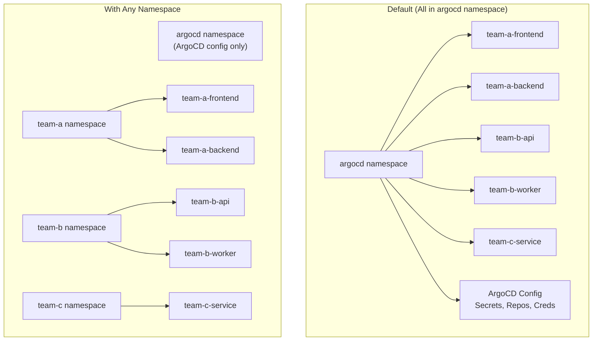
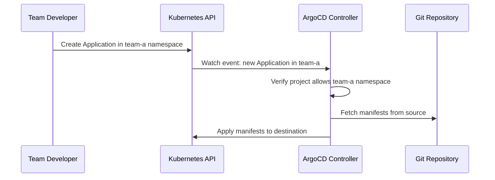

# How to Enable Applications in Any Namespace in ArgoCD

Author: [nawazdhandala](https://github.com/nawazdhandala)

Tags: ArgoCD, GitOps, Kubernetes, Namespaces, Multi-Tenancy

Description: Learn how to configure ArgoCD to allow Application resources to be created in namespaces other than argocd, enabling better multi-tenant isolation and team autonomy.

---

By default, ArgoCD only watches for Application resources in its own namespace (typically `argocd`). This means every team that wants to create or manage an ArgoCD Application needs access to the argocd namespace. In multi-tenant environments, this is a security concern - you do not want development teams having any access to the namespace where ArgoCD's sensitive configuration lives. The "Applications in Any Namespace" feature solves this by letting Application resources live in team-specific namespaces.

## Why Applications in Any Namespace?

Consider a typical multi-tenant setup:



With applications in any namespace:

- **Teams manage their own Application resources** without accessing the argocd namespace
- **RBAC is simpler** because you use standard Kubernetes RBAC on team namespaces
- **Blast radius is reduced** since teams cannot accidentally modify other teams' applications
- **Self-service is easier** because teams do not need ArgoCD admin access to create applications

## Enabling the Feature

The feature requires configuration in two places: the ArgoCD server and the Application controller.

### Step 1: Configure argocd-cmd-params-cm

Set the list of namespaces that ArgoCD should watch for Application resources:

```yaml
apiVersion: v1
kind: ConfigMap
metadata:
  name: argocd-cmd-params-cm
  namespace: argocd
data:
  # Comma-separated list of namespaces to watch
  application.namespaces: "team-a, team-b, team-c"
```

Or use a glob pattern to match namespaces dynamically:

```yaml
data:
  # Watch all namespaces matching a pattern
  application.namespaces: "team-*"
```

Or watch all namespaces (use with caution):

```yaml
data:
  # Watch all namespaces
  application.namespaces: "*"
```

### Step 2: Restart ArgoCD Components

After updating the ConfigMap, restart the ArgoCD components to pick up the change:

```bash
# Restart the application controller and server
kubectl rollout restart deployment argocd-server -n argocd
kubectl rollout restart statefulset argocd-application-controller -n argocd

# Wait for rollout to complete
kubectl rollout status deployment/argocd-server -n argocd
kubectl rollout status statefulset/argocd-application-controller -n argocd
```

### Step 3: Configure AppProject Source Namespaces

Each AppProject must explicitly allow applications from specific namespaces. This is a security control that prevents arbitrary namespaces from creating applications in a project:

```yaml
apiVersion: argoproj.io/v1alpha1
kind: AppProject
metadata:
  name: team-a
  namespace: argocd
spec:
  description: "Team A's applications"
  sourceNamespaces:
    - team-a    # Allow Application resources from the team-a namespace
  sourceRepos:
    - 'https://github.com/myorg/team-a-*'
  destinations:
    - server: https://kubernetes.default.svc
      namespace: team-a-*
```

Without the `sourceNamespaces` field, the project only accepts Application resources from the argocd namespace.

### Step 4: Set Up RBAC in Team Namespaces

Grant teams permission to create Application resources in their namespace:

```yaml
# RBAC for team-a to manage Application resources
apiVersion: rbac.authorization.k8s.io/v1
kind: Role
metadata:
  name: argocd-application-manager
  namespace: team-a
rules:
  - apiGroups: ['argoproj.io']
    resources: ['applications']
    verbs: ['get', 'list', 'watch', 'create', 'update', 'patch', 'delete']
---
apiVersion: rbac.authorization.k8s.io/v1
kind: RoleBinding
metadata:
  name: team-a-argocd-apps
  namespace: team-a
roleRef:
  apiGroup: rbac.authorization.k8s.io
  kind: Role
  name: argocd-application-manager
subjects:
  - kind: Group
    name: team-a-developers
    apiGroup: rbac.authorization.k8s.io
```

## Creating Applications in Team Namespaces

Once configured, teams create Application resources in their own namespace:

```yaml
# This lives in the team-a namespace, NOT argocd
apiVersion: argoproj.io/v1alpha1
kind: Application
metadata:
  name: frontend
  namespace: team-a       # Application lives in team namespace
  finalizers:
    - resources-finalizer.argocd.argoproj.io
spec:
  project: team-a         # Must reference a project that allows this namespace
  source:
    repoURL: https://github.com/myorg/team-a-frontend.git
    targetRevision: main
    path: k8s/overlays/production
  destination:
    server: https://kubernetes.default.svc
    namespace: team-a-frontend   # Where the actual workload deploys
  syncPolicy:
    automated:
      prune: true
      selfHeal: true
    syncOptions:
      - CreateNamespace=true
```

Apply it using standard kubectl commands:

```bash
# Team members apply in their own namespace
kubectl apply -f frontend-app.yaml -n team-a
```

## How It Works Under the Hood

When the feature is enabled, ArgoCD's application controller watches for Application resources across the configured namespaces using a multi-namespace informer. The reconciliation loop processes applications from all watched namespaces the same way it processes applications from the argocd namespace.



## Security Considerations

### Project Namespace Restrictions

Always use `sourceNamespaces` in your AppProjects to prevent unauthorized namespaces from creating applications:

```yaml
spec:
  sourceNamespaces:
    - team-a       # Only team-a namespace can create apps in this project
  # NOT: sourceNamespaces: ['*']  # This would allow any namespace
```

### RBAC Configuration

ArgoCD's RBAC policies also apply. Even if a team can create Application resources in their namespace, ArgoCD checks its own RBAC policies before processing them:

```csv
# argocd-rbac-cm
p, role:team-a, applications, *, team-a/*, allow
g, team-a-developers, role:team-a
```

The RBAC policy format for namespaced applications is `<project>/<application>`, where the application name may include the namespace prefix.

### Prevent Namespace Escalation

Ensure that team namespaces cannot reference projects they should not have access to. The AppProject's `sourceNamespaces` is the primary guard:

```yaml
# Team A's project - only allows their namespace
spec:
  sourceNamespaces: [team-a]

# Team B's project - only allows their namespace
spec:
  sourceNamespaces: [team-b]
```

If a developer in team-a tries to create an Application with `project: team-b`, ArgoCD rejects it because the team-b project does not list team-a in its sourceNamespaces.

## Combining with App-of-Apps

You can use the App-of-Apps pattern with namespaced applications. The parent application (which may live in argocd namespace) creates child applications in team namespaces:

```yaml
# Parent app in argocd namespace
apiVersion: argoproj.io/v1alpha1
kind: Application
metadata:
  name: team-a-apps
  namespace: argocd
spec:
  project: default
  source:
    repoURL: https://github.com/myorg/argocd-config.git
    path: teams/team-a/applications
  destination:
    server: https://kubernetes.default.svc
    namespace: team-a   # Child apps created here, not in argocd
```

The child application YAML files specify `namespace: team-a`:

```yaml
# teams/team-a/applications/frontend.yaml
apiVersion: argoproj.io/v1alpha1
kind: Application
metadata:
  name: frontend
  namespace: team-a
spec:
  project: team-a
  source:
    repoURL: https://github.com/myorg/team-a-frontend.git
    path: k8s/production
  destination:
    server: https://kubernetes.default.svc
    namespace: team-a-frontend
```

## Viewing Namespaced Applications

The ArgoCD UI and CLI show applications from all watched namespaces:

```bash
# List all applications across all namespaces
argocd app list

# List applications in a specific application namespace
argocd app list --app-namespace team-a

# Get details of a namespaced application
argocd app get frontend --app-namespace team-a

# Sync a namespaced application
argocd app sync frontend --app-namespace team-a
```

In the CLI and API, you reference namespaced applications as `<namespace>/<name>` when there might be ambiguity:

```bash
argocd app get team-a/frontend
```

## Troubleshooting

### Application Not Being Watched

If ArgoCD is not picking up applications in a namespace:

```bash
# Check the configured namespaces
kubectl get configmap argocd-cmd-params-cm -n argocd \
  -o jsonpath='{.data.application\.namespaces}'

# Verify the controller was restarted after config change
kubectl get pods -n argocd -l app.kubernetes.io/name=argocd-application-controller \
  -o jsonpath='{.items[*].metadata.creationTimestamp}'
```

### Project Rejecting Namespace

If ArgoCD rejects the application with a project error:

```bash
# Check the project's sourceNamespaces
kubectl get appproject team-a -n argocd \
  -o jsonpath='{.spec.sourceNamespaces}'

# Should include the namespace where the Application resource lives
```

### CRD Not Available in Team Namespace

Ensure the ArgoCD Application CRD is cluster-scoped (which it is by default). If it is not installed, applications in other namespaces will fail:

```bash
kubectl get crd applications.argoproj.io
```

Applications in any namespace is a powerful feature for multi-tenant ArgoCD environments. It shifts the access model from "everyone shares the argocd namespace" to "each team manages their own namespace," which is more aligned with Kubernetes-native access control patterns. For more on multi-tenancy, see our guide on [managing projects declaratively](https://oneuptime.com/blog/post/2026-02-26-argocd-manage-projects-declaratively/view).
