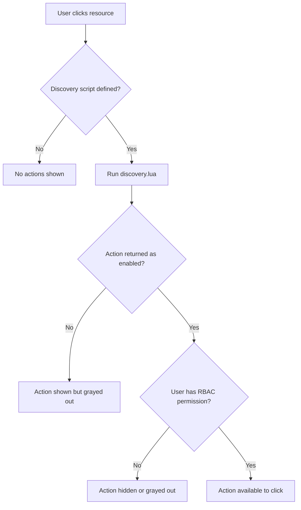

# How to Enable and Disable Resource Actions per Resource Type in ArgoCD

Author: [nawazdhandala](https://github.com/nawazdhandala)

Tags: ArgoCD, GitOps, Kubernetes, Security

Description: Learn how to selectively enable and disable resource actions per resource type in ArgoCD to control which operations are available for Deployments, StatefulSets, CRDs, and other Kubernetes resources.

---

Resource actions in ArgoCD are powerful, but not every action should be available for every resource type. You might want restart actions on Deployments but not on StatefulSets in a database namespace. You might want to disable all actions on certain CRDs to prevent accidental modifications. Or you might want to enable actions only for specific teams through RBAC.

This guide covers the different methods for controlling which resource actions are available and for whom.

## How Action Availability Is Controlled

ArgoCD provides three layers of control for resource actions:

1. **Discovery scripts** determine which actions appear for a resource type
2. **RBAC policies** determine which users can execute actions
3. **Resource action configuration** determines which resource types have actions at all



## Method 1: Remove Actions via ConfigMap

The simplest way to disable all actions for a resource type is to not define them. If there is no `resource.customizations.actions.<group>_<kind>` entry in `argocd-cm`, no actions will appear.

To remove existing actions:

```bash
# Remove actions for StatefulSets
kubectl patch configmap argocd-cm -n argocd --type json \
  -p='[{"op": "remove", "path": "/data/resource.customizations.actions.apps_StatefulSet"}]'
```

To verify what actions are defined:

```bash
# List all configured actions
kubectl get configmap argocd-cm -n argocd -o yaml | grep "resource.customizations.actions"
```

## Method 2: Use Discovery Scripts for Conditional Actions

The discovery script is the most flexible way to control action availability. You can enable or disable actions based on any property of the resource:

### Disable All Actions for Specific Namespaces

```yaml
resource.customizations.actions.apps_Deployment: |
  discovery.lua: |
    actions = {}

    -- Disable all actions in production namespace
    local ns = obj.metadata.namespace or ""
    if ns == "production" or ns == "kube-system" then
      return actions  -- Return empty table, no actions shown
    end

    actions["restart"] = {["disabled"] = false}
    actions["scale-up"] = {["disabled"] = false}
    actions["scale-down"] = {["disabled"] = false}
    return actions
  definitions:
    - name: restart
      action.lua: |
        local os = require("os")
        if obj.spec.template.metadata == nil then obj.spec.template.metadata = {} end
        if obj.spec.template.metadata.annotations == nil then obj.spec.template.metadata.annotations = {} end
        obj.spec.template.metadata.annotations["kubectl.kubernetes.io/restartedAt"] = tostring(os.time())
        return obj
    - name: scale-up
      action.lua: |
        obj.spec.replicas = (obj.spec.replicas or 1) + 1
        return obj
    - name: scale-down
      action.lua: |
        local r = obj.spec.replicas or 1
        if r > 1 then obj.spec.replicas = r - 1 end
        return obj
```

### Disable Actions Based on Labels

```lua
-- discovery.lua
actions = {}

-- Check for a "no-actions" label
if obj.metadata.labels ~= nil and obj.metadata.labels["argocd.example.com/actions-disabled"] == "true" then
  return actions  -- No actions
end

-- Check for environment-specific restrictions
local env = ""
if obj.metadata.labels ~= nil then
  env = obj.metadata.labels["environment"] or ""
end

if env == "production" then
  -- Only restart in production, no scaling
  actions["restart"] = {["disabled"] = false}
else
  -- Full actions in non-production
  actions["restart"] = {["disabled"] = false}
  actions["scale-up"] = {["disabled"] = false}
  actions["scale-down"] = {["disabled"] = false}
  actions["scale-to-zero"] = {["disabled"] = false}
end

return actions
```

### Disable Actions Based on Annotations

```lua
-- discovery.lua
actions = {}

-- Check for a lock annotation
local locked = false
if obj.metadata.annotations ~= nil then
  if obj.metadata.annotations["argocd.example.com/locked"] == "true" then
    locked = true
  end
end

-- Show all actions but disable them if locked
actions["restart"] = {["disabled"] = locked}
actions["scale-up"] = {["disabled"] = locked}
actions["scale-down"] = {["disabled"] = locked}

-- Always allow unlock
if locked then
  actions["unlock"] = {["disabled"] = false}
end

return actions
```

## Method 3: Use RBAC to Control Action Execution

Even if an action is defined and enabled in the discovery script, RBAC can prevent specific users or roles from executing it.

The RBAC resource format for actions is:

```
p, <role>, applications, action/<group>/<kind>/<action>, <project>/<app>, <allow|deny>
```

### Examples:

```csv
# Deny all actions for readonly users
p, role:readonly, applications, action/*, *, deny

# Allow only restart for developers
p, role:developer, applications, action/apps/Deployment/restart, *, allow
p, role:developer, applications, action/apps/Deployment/scale-up, *, deny
p, role:developer, applications, action/apps/Deployment/scale-down, *, deny

# Allow all actions for ops team
p, role:ops, applications, action/*, *, allow

# Allow actions only in specific projects
p, role:team-a, applications, action/*, team-a-project/*, allow
p, role:team-a, applications, action/*, team-b-project/*, deny

# Deny dangerous actions for everyone except admin
p, role:admin, applications, action/apps/Deployment/scale-to-zero, *, allow
p, role:ops, applications, action/apps/Deployment/scale-to-zero, *, deny
p, role:developer, applications, action/apps/Deployment/scale-to-zero, *, deny
```

Apply RBAC policies in the `argocd-rbac-cm` ConfigMap:

```yaml
apiVersion: v1
kind: ConfigMap
metadata:
  name: argocd-rbac-cm
  namespace: argocd
data:
  policy.csv: |
    p, role:readonly, applications, get, *, allow
    p, role:readonly, applications, action/*, *, deny
    p, role:developer, applications, action/apps/Deployment/restart, *, allow
    p, role:developer, applications, action/apps/StatefulSet/restart, *, allow
    p, role:developer, applications, action/apps/Deployment/scale-up, *, deny
    p, role:developer, applications, action/apps/Deployment/scale-down, *, deny
    p, role:ops, applications, action/*, *, allow
  policy.default: role:readonly
```

### Testing RBAC Policies

Use the ArgoCD admin CLI to test whether a user has permission to execute an action:

```bash
# Test if a user in 'developer' role can restart deployments
argocd admin settings rbac can role:developer action/apps/Deployment/restart '*/*' \
  --policy-file policy.csv

# Test if a user can scale
argocd admin settings rbac can role:developer action/apps/Deployment/scale-up '*/*' \
  --policy-file policy.csv
```

## Method 4: Disable Built-in Actions

ArgoCD comes with some built-in actions for certain resource types (like Rollout resume/abort). To disable these, override them with an empty discovery script:

```yaml
# Disable all built-in actions for Argo Rollouts
resource.customizations.actions.argoproj.io_Rollout: |
  discovery.lua: |
    actions = {}
    return actions
  definitions: []
```

## Method 5: Per-Application Action Control

You can use application-level annotations to control actions per application:

```yaml
apiVersion: argoproj.io/v1alpha1
kind: Application
metadata:
  name: production-app
  annotations:
    argocd.example.com/actions-mode: "restricted"
```

Then check this annotation in your discovery scripts (though note that the discovery script operates on individual resources, not the Application object itself, so you would need to propagate this information via labels or annotations on the managed resources).

## Complete Configuration Example

Here is a complete setup that implements tiered action control:

```yaml
apiVersion: v1
kind: ConfigMap
metadata:
  name: argocd-cm
  namespace: argocd
data:
  # Deployment actions with namespace-based restrictions
  resource.customizations.actions.apps_Deployment: |
    discovery.lua: |
      actions = {}
      local ns = obj.metadata.namespace or ""
      local env = ""
      if obj.metadata.labels ~= nil then
        env = obj.metadata.labels["environment"] or ""
      end
      -- Always allow restart
      actions["restart"] = {["disabled"] = false}
      -- Scaling only in non-production
      if env ~= "production" and ns ~= "production" then
        actions["scale-up"] = {["disabled"] = false}
        actions["scale-down"] = {["disabled"] = (obj.spec.replicas or 1) <= 1}
        actions["scale-to-zero"] = {["disabled"] = false}
      end
      return actions
    definitions:
      - name: restart
        action.lua: |
          local os = require("os")
          if obj.spec.template.metadata == nil then obj.spec.template.metadata = {} end
          if obj.spec.template.metadata.annotations == nil then obj.spec.template.metadata.annotations = {} end
          obj.spec.template.metadata.annotations["kubectl.kubernetes.io/restartedAt"] = tostring(os.time())
          return obj
      - name: scale-up
        action.lua: |
          obj.spec.replicas = (obj.spec.replicas or 1) + 1
          return obj
      - name: scale-down
        action.lua: |
          local r = obj.spec.replicas or 1
          if r > 1 then obj.spec.replicas = r - 1 end
          return obj
      - name: scale-to-zero
        action.lua: |
          obj.spec.replicas = 0
          return obj

  # No actions for StatefulSets (too risky for database workloads)
  resource.customizations.actions.apps_StatefulSet: |
    discovery.lua: |
      actions = {}
      actions["restart"] = {["disabled"] = false}
      return actions
    definitions:
      - name: restart
        action.lua: |
          local os = require("os")
          if obj.spec.template.metadata == nil then obj.spec.template.metadata = {} end
          if obj.spec.template.metadata.annotations == nil then obj.spec.template.metadata.annotations = {} end
          obj.spec.template.metadata.annotations["kubectl.kubernetes.io/restartedAt"] = tostring(os.time())
          return obj
```

The combination of discovery scripts and RBAC gives you fine-grained control over who can do what to which resources. For writing the Lua scripts themselves, see [how to write Lua scripts for custom resource actions](https://oneuptime.com/blog/post/2026-02-26-argocd-lua-scripts-resource-actions/view). For RBAC configuration details, check out [how to configure RBAC policies in ArgoCD](https://oneuptime.com/blog/post/2026-02-26-argocd-rbac-policies/view).
