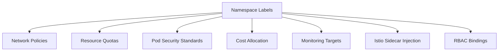

# How to Enforce Namespace Labels and Annotations with ArgoCD

Author: [nawazdhandala](https://github.com/nawazdhandala)

Tags: ArgoCD, GitOps, Kubernetes, Namespace Management, Compliance

Description: Learn how to enforce consistent namespace labels and annotations across your Kubernetes clusters using ArgoCD with policy engines and ApplicationSets.

---

Namespace labels and annotations are the foundation of multi-tenant Kubernetes. They drive network policies, resource quotas, monitoring targets, cost allocation, and access control. When a namespace is missing critical labels, your entire governance model breaks down. Istio sidecars do not get injected, network policies do not match, and cost reports show unattributed spend.

In this guide, I will show you how to use ArgoCD to ensure every namespace in your cluster has the required labels and annotations, and how to prevent non-compliant namespaces from being created.

## Why Namespace Labels Matter

Labels and annotations on namespaces serve many purposes in a production Kubernetes cluster.



A missing `istio-injection: enabled` label means your pods run without a service mesh. A missing `team` label means you cannot attribute costs. A missing `pod-security.kubernetes.io/enforce` label means your namespace has no security baseline.

## Defining Required Labels

First, establish which labels and annotations are mandatory in your organization.

```yaml
# Example required labels for a well-governed namespace
apiVersion: v1
kind: Namespace
metadata:
  name: team-alpha-production
  labels:
    # Ownership
    team: alpha
    cost-center: cc-1234
    # Environment
    environment: production
    tier: backend
    # Security
    pod-security.kubernetes.io/enforce: restricted
    pod-security.kubernetes.io/audit: restricted
    pod-security.kubernetes.io/warn: restricted
    # Service mesh
    istio-injection: enabled
  annotations:
    # Contact information
    team-contact: alpha-team@company.com
    slack-channel: "#team-alpha"
    # Governance
    data-classification: confidential
    compliance-scope: pci-dss
```

## Enforcing Labels with Kyverno

Create a Kyverno policy that validates required labels on namespace creation and updates.

```yaml
# require-namespace-labels.yaml
apiVersion: kyverno.io/v1
kind: ClusterPolicy
metadata:
  name: require-namespace-labels
  annotations:
    policies.kyverno.io/title: Require Namespace Labels
    policies.kyverno.io/severity: high
spec:
  validationFailureAction: Enforce
  background: true
  rules:
    - name: check-required-labels
      match:
        any:
          - resources:
              kinds:
                - Namespace
      exclude:
        any:
          - resources:
              names:
                - kube-system
                - kube-public
                - kube-node-lease
                - default
                - argocd
                - kyverno
      validate:
        message: >-
          Namespace '{{request.object.metadata.name}}' must have the following
          labels: team, cost-center, environment, pod-security.kubernetes.io/enforce.
          Missing labels: {{request.object.metadata.labels}}
        pattern:
          metadata:
            labels:
              team: "?*"
              cost-center: "cc-?*"
              environment: "production | staging | development"
              pod-security.kubernetes.io/enforce: "restricted | baseline"
    - name: check-required-annotations
      match:
        any:
          - resources:
              kinds:
                - Namespace
      exclude:
        any:
          - resources:
              names:
                - kube-system
                - kube-public
                - kube-node-lease
                - default
                - argocd
      validate:
        message: >-
          Namespace must have team-contact and slack-channel annotations.
        pattern:
          metadata:
            annotations:
              team-contact: "?*@?*.?*"
              slack-channel: "#?*"
```

## Adding Default Labels with Kyverno Mutation

For labels that should have consistent defaults, use a mutation policy to add them automatically.

```yaml
# add-default-namespace-labels.yaml
apiVersion: kyverno.io/v1
kind: ClusterPolicy
metadata:
  name: add-default-namespace-labels
spec:
  rules:
    - name: add-pod-security-labels
      match:
        any:
          - resources:
              kinds:
                - Namespace
      exclude:
        any:
          - resources:
              names:
                - kube-system
                - kube-public
      mutate:
        patchStrategicMerge:
          metadata:
            labels:
              # Add baseline pod security if not specified
              +(pod-security.kubernetes.io/enforce): baseline
              +(pod-security.kubernetes.io/audit): restricted
              +(pod-security.kubernetes.io/warn): restricted
              # Add managed-by label
              +(app.kubernetes.io/managed-by): argocd
            annotations:
              +(created-by): argocd-gitops
```

The `+()` syntax in Kyverno means "add only if not already present," so existing values are preserved.

## Managing Namespaces Through ArgoCD

The best approach is to manage all namespaces as ArgoCD Applications. This ensures namespaces are created with proper labels from the start.

```yaml
# namespaces-application.yaml
apiVersion: argoproj.io/v1alpha1
kind: Application
metadata:
  name: cluster-namespaces
  namespace: argocd
spec:
  project: platform
  source:
    repoURL: https://github.com/myorg/cluster-config.git
    path: namespaces
    targetRevision: main
  destination:
    server: https://kubernetes.default.svc
  syncPolicy:
    automated:
      prune: true
      selfHeal: true
```

Your namespaces directory would contain individual namespace definitions.

```yaml
# namespaces/team-alpha-production.yaml
apiVersion: v1
kind: Namespace
metadata:
  name: team-alpha-production
  labels:
    team: alpha
    cost-center: cc-1234
    environment: production
    pod-security.kubernetes.io/enforce: restricted
  annotations:
    team-contact: alpha-team@company.com
    slack-channel: "#team-alpha"
    data-classification: confidential
```

## Using ApplicationSets for Namespace Generation

When you have many teams and environments, ApplicationSets can generate namespace configurations from a template.

```yaml
# namespace-appset.yaml
apiVersion: argoproj.io/v1alpha1
kind: ApplicationSet
metadata:
  name: team-namespaces
  namespace: argocd
spec:
  generators:
    - matrix:
        generators:
          - list:
              elements:
                - team: alpha
                  costCenter: cc-1234
                  contact: alpha-team@company.com
                  slack: "#team-alpha"
                - team: beta
                  costCenter: cc-5678
                  contact: beta-team@company.com
                  slack: "#team-beta"
          - list:
              elements:
                - environment: production
                  pss: restricted
                - environment: staging
                  pss: baseline
                - environment: development
                  pss: baseline
  template:
    metadata:
      name: "ns-{{team}}-{{environment}}"
    spec:
      project: platform
      source:
        repoURL: https://github.com/myorg/cluster-config.git
        path: namespace-template
        targetRevision: main
        helm:
          values: |
            team: "{{team}}"
            costCenter: "{{costCenter}}"
            environment: "{{environment}}"
            contact: "{{contact}}"
            slack: "{{slack}}"
            podSecurityStandard: "{{pss}}"
      destination:
        server: https://kubernetes.default.svc
      syncPolicy:
        automated:
          selfHeal: true
```

## Preventing Label Removal

One common issue is that someone or something removes critical labels from a namespace. ArgoCD's self-healing helps here.

```yaml
syncPolicy:
  automated:
    selfHeal: true  # Restores labels if they're removed
```

With self-healing enabled, if someone manually removes a label from a namespace, ArgoCD detects the drift and restores it. This is one of the strongest reasons to manage namespaces through ArgoCD.

## Auditing Existing Namespace Labels

Before enforcing new label requirements, audit your current state.

```bash
# Find namespaces missing the 'team' label
kubectl get namespaces -o json | \
  jq -r '.items[] | select(.metadata.labels.team == null) | .metadata.name'

# Show all namespace labels in a readable format
kubectl get namespaces --show-labels

# Check specific label compliance
kubectl get namespaces -l '!team' --no-headers | wc -l
```

## OPA Gatekeeper Alternative

If you use OPA Gatekeeper instead of Kyverno, here is the equivalent constraint.

```yaml
apiVersion: templates.gatekeeper.sh/v1
kind: ConstraintTemplate
metadata:
  name: k8srequirednamespacelabels
spec:
  crd:
    spec:
      names:
        kind: K8sRequiredNamespaceLabels
      validation:
        openAPIV3Schema:
          type: object
          properties:
            labels:
              type: array
              items:
                type: string
  targets:
    - target: admission.k8s.gatekeeper.sh
      rego: |
        package k8srequirednamespacelabels

        violation[{"msg": msg}] {
          required := input.parameters.labels[_]
          not input.review.object.metadata.labels[required]
          msg := sprintf("Namespace '%v' must have label '%v'",
            [input.review.object.metadata.name, required])
        }
---
apiVersion: constraints.gatekeeper.sh/v1beta1
kind: K8sRequiredNamespaceLabels
metadata:
  name: require-ns-labels
spec:
  match:
    kinds:
      - apiGroups: [""]
        kinds: ["Namespace"]
    excludedNamespaces:
      - kube-system
      - kube-public
  parameters:
    labels:
      - team
      - cost-center
      - environment
```

## Conclusion

Consistent namespace labels and annotations are the backbone of Kubernetes governance. By managing namespaces through ArgoCD and enforcing label requirements with policy engines, you create a system where compliance is automatic. Every namespace gets proper labels at creation, drift is corrected by self-healing, and non-compliant namespaces are rejected before they can cause problems. Start by defining your label standards, deploy them through ArgoCD, and let automation handle the rest.
