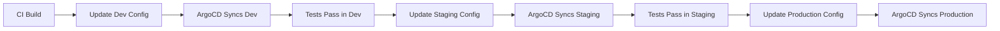

# How to Implement Environment Promotion with ArgoCD

Author: [nawazdhandala](https://github.com/nawazdhandala)

Tags: ArgoCD, GitOps, Kubernetes, CI/CD, Environment Management

Description: Learn how to implement environment promotion workflows with ArgoCD to safely move application versions from dev through staging to production using GitOps principles.

---

Environment promotion is the process of moving a tested application version from one environment to the next - typically from dev to staging to production. In a GitOps workflow with ArgoCD, promotion means updating the desired state in Git rather than pushing artifacts directly to clusters. This approach gives you an auditable trail of every promotion, easy rollbacks, and the ability to use pull requests as approval gates.

## The Promotion Flow

A typical promotion flow looks like this:



Each step updates a Git repository, and ArgoCD picks up the change to sync the target environment. The key insight is that promotion is a Git operation, not a cluster operation.

## Repository Structure for Promotion

Organize your configuration repository so each environment has its own directory with a clear specification of which version to deploy:

```text
config-repo/
  apps/
    my-app/
      base/
        kustomization.yaml
        deployment.yaml
        service.yaml
      overlays/
        dev/
          kustomization.yaml
          version.yaml
        staging/
          kustomization.yaml
          version.yaml
        production/
          kustomization.yaml
          version.yaml
```

Each environment's `version.yaml` contains the image reference:

```yaml
# overlays/dev/version.yaml
apiVersion: apps/v1
kind: Deployment
metadata:
  name: my-app
spec:
  template:
    spec:
      containers:
        - name: my-app
          image: myregistry/my-app:v1.3.0-rc.2
```

Promoting means updating the image tag in the next environment's `version.yaml`.

## Automated Promotion with CI Pipeline

The most common pattern is using your CI system to automate promotion between environments. After a successful build, the CI pipeline updates the dev configuration:

```yaml
# .github/workflows/promote.yaml
name: Promote Application

on:
  workflow_dispatch:
    inputs:
      version:
        description: 'Version to promote'
        required: true
      target_env:
        description: 'Target environment'
        required: true
        type: choice
        options:
          - dev
          - staging
          - production

jobs:
  promote:
    runs-on: ubuntu-latest
    steps:
      - name: Checkout config repo
        uses: actions/checkout@v4
        with:
          repository: myorg/app-config
          token: ${{ secrets.GIT_TOKEN }}

      - name: Update image version
        run: |
          # Update the Kustomize image tag for the target environment
          cd apps/my-app/overlays/${{ inputs.target_env }}
          kustomize edit set image myregistry/my-app=myregistry/my-app:${{ inputs.version }}

      - name: Commit and push
        run: |
          git config user.name "CI Bot"
          git config user.email "ci@myorg.com"
          git add .
          git commit -m "Promote my-app ${{ inputs.version }} to ${{ inputs.target_env }}"
          git push
```

## Pull Request-Based Promotion

For production promotions, you typically want a human review step. Instead of pushing directly to main, create a pull request:

```yaml
# Promotion step that creates a PR for production
- name: Create promotion PR
  if: inputs.target_env == 'production'
  run: |
    BRANCH="promote/my-app-${{ inputs.version }}-to-production"
    git checkout -b "$BRANCH"

    cd apps/my-app/overlays/production
    kustomize edit set image myregistry/my-app=myregistry/my-app:${{ inputs.version }}

    git add .
    git commit -m "Promote my-app ${{ inputs.version }} to production"
    git push origin "$BRANCH"

    gh pr create \
      --title "Promote my-app ${{ inputs.version }} to production" \
      --body "## Promotion Request

    **Version:** ${{ inputs.version }}
    **Source:** staging (validated)
    **Target:** production

    ### Checklist
    - [ ] Staging tests passed
    - [ ] Performance benchmarks acceptable
    - [ ] Rollback plan documented" \
      --reviewer platform-team
```

When the PR is merged, ArgoCD detects the change and syncs production.

## Using ArgoCD Image Updater for Automatic Promotion

ArgoCD Image Updater can automate the first stage of promotion by watching a container registry for new tags:

```yaml
apiVersion: argoproj.io/v1alpha1
kind: Application
metadata:
  name: my-app-dev
  namespace: argocd
  annotations:
    # Automatically update to the latest dev tag
    argocd-image-updater.argoproj.io/image-list: app=myregistry/my-app
    argocd-image-updater.argoproj.io/app.update-strategy: latest
    argocd-image-updater.argoproj.io/app.allow-tags: regexp:^dev-.*
    argocd-image-updater.argoproj.io/write-back-method: git
    argocd-image-updater.argoproj.io/write-back-target: kustomization
spec:
  project: default
  source:
    repoURL: https://github.com/myorg/app-config.git
    path: apps/my-app/overlays/dev
    targetRevision: main
  destination:
    server: https://kubernetes.default.svc
    namespace: dev
```

For staging and production, you would not use automatic image updates. Instead, promotion happens through deliberate Git commits or PRs.

## Promotion with Helm Values

If you are using Helm instead of Kustomize, promotion means updating the image tag in the environment's values file:

```bash
#!/bin/bash
# promote.sh - Script to promote a version to a target environment
VERSION=$1
TARGET_ENV=$2
APP_NAME=$3

VALUES_FILE="environments/${TARGET_ENV}/values-${APP_NAME}.yaml"

# Update the image tag using yq
yq eval ".image.tag = \"${VERSION}\"" -i "$VALUES_FILE"

git add "$VALUES_FILE"
git commit -m "Promote ${APP_NAME} ${VERSION} to ${TARGET_ENV}"
git push
```

## Tracking Promotion History

Since every promotion is a Git commit, you get a full audit trail for free:

```bash
# See all promotions to production
git log --oneline -- apps/my-app/overlays/production/

# Output:
# a1b2c3d Promote my-app v1.3.0 to production
# d4e5f6a Promote my-app v1.2.1 to production
# g7h8i9j Promote my-app v1.2.0 to production
```

You can also use ArgoCD's built-in revision history to see what was synced and when:

```bash
# View sync history for the production application
argocd app history my-app-production
```

## Implementing Promotion Validation

Add a validation step between environments to ensure the application is healthy before promoting further:

```yaml
# GitHub Actions job that validates before promoting
validate-staging:
  runs-on: ubuntu-latest
  needs: deploy-staging
  steps:
    - name: Wait for ArgoCD sync
      run: |
        argocd app wait my-app-staging --sync --timeout 300

    - name: Run integration tests
      run: |
        kubectl run integration-tests \
          --image=myregistry/test-runner:latest \
          --restart=Never \
          --rm -it \
          -- /run-tests.sh staging

    - name: Check health metrics
      run: |
        # Query monitoring to verify error rates
        ERROR_RATE=$(curl -s "http://prometheus:9090/api/v1/query?query=rate(http_errors_total[5m])" | jq '.data.result[0].value[1]')
        if (( $(echo "$ERROR_RATE > 0.01" | bc -l) )); then
          echo "Error rate too high: $ERROR_RATE"
          exit 1
        fi

promote-to-production:
  runs-on: ubuntu-latest
  needs: validate-staging
  # Only after validation passes
```

## Rollback as Reverse Promotion

In GitOps, rolling back is simply promoting the previous version. You can revert the Git commit or explicitly set the previous version:

```bash
# Option 1: Git revert
git revert HEAD  # Reverts the last promotion commit

# Option 2: Explicit rollback by setting previous version
cd apps/my-app/overlays/production
kustomize edit set image myregistry/my-app=myregistry/my-app:v1.2.1
git commit -am "Rollback my-app to v1.2.1 in production"
git push
```

Both approaches create a new Git commit, maintaining a clean audit trail.

## Best Practices for Environment Promotion

Use semantic versioning for your application images. Tags like `v1.2.3` make it clear what is running in each environment and simplify rollback decisions.

Never promote directly from dev to production. Always go through staging first. The extra environment catches integration issues that unit tests miss.

Automate everything before production, but keep production promotion manual. Dev and staging syncs should be automatic. Production should require an explicit approval, whether that is a merged PR or a manual ArgoCD sync.

Monitor your applications after promotion. Set up ArgoCD notifications to alert your team on sync success or failure, and integrate with your observability stack to catch regressions early. For comprehensive monitoring of your promotion pipeline, consider using [OneUptime](https://oneuptime.com/blog/post/2026-02-26-argocd-environment-specific-configmaps/view) to track deployment health across environments.

Environment promotion with ArgoCD and GitOps is a powerful pattern that gives you safety, auditability, and repeatability. Every promotion is a Git commit, every rollback is a revert, and your entire deployment history lives in version control.
