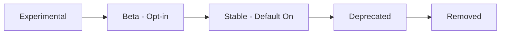

# How to Use Environment Variables for Feature Flags in ArgoCD

Author: [nawazdhandala](https://github.com/nawazdhandala)

Tags: ArgoCD, GitOps, Kubernetes, Feature Flag, Configuration

Description: Learn how to use ArgoCD environment variables as feature flags to enable or disable ArgoCD features, control experimental functionality, and customize component behavior.

---

ArgoCD uses environment variables and ConfigMap settings as feature flags to control experimental features, enable optional functionality, and customize component behavior. Understanding these flags lets you opt into new capabilities before they become defaults, or disable features that are not relevant to your deployment.

This guide covers the feature flag settings available in ArgoCD, how to set them, and when to use each one.

## How Feature Flags Work in ArgoCD

ArgoCD implements feature flags through two mechanisms:

1. **Environment variables** on individual components (server, controller, repo server)
2. **ConfigMap settings** in `argocd-cm` and `argocd-cmd-params-cm`

Feature flags typically start as opt-in experimental features and eventually become defaults in later releases. Setting them through environment variables or ConfigMaps lets you test new behavior before upgrading.

## Server Feature Flags

### Disable Admin Account

```yaml
# argocd-cm ConfigMap

apiVersion: v1
kind: ConfigMap
metadata:
  name: argocd-cm
  namespace: argocd
data:
  # Disable the built-in admin account
  admin.enabled: "false"
```

This is a security best practice for production. Once SSO is configured, disable the admin account.

### Enable gRPC Web

```yaml
env:
  # Use gRPC-Web from the Argo CD CLI when a proxy does not support HTTP/2
  - name: ARGOCD_OPTS
    value: "--grpc-web"
```

Required for CLI clients when using ingress controllers or proxies that do not support HTTP/2 or native gRPC.

### Enable Status Badge

```yaml
data:
  # Enable status badge API endpoint
  statusbadge.enabled: "true"
```

This enables the `/api/badge` endpoint that returns SVG badges showing application sync and health status. Useful for embedding in dashboards or README files.

### Enable Proxy Extension

```yaml
apiVersion: v1
kind: ConfigMap
metadata:
  name: argocd-cmd-params-cm
  namespace: argocd
data:
  # Enable the proxy extension feature
  server.enable.proxy.extension: "true"
```

Allows ArgoCD to proxy requests to backend services, enabling custom UI extensions. Configure the actual extension backends separately with `extension.config` or `extension.config.<name>` in `argocd-cm`.

### Anonymous Access

```yaml
data:
  # Allow anonymous (unauthenticated) access
  users.anonymous.enabled: "true"
```

This lets users view applications without logging in. Only enable for internal or demo environments.

## Controller Feature Flags

### Server-Side Diff

```yaml
apiVersion: v1
kind: ConfigMap
metadata:
  name: argocd-cmd-params-cm
  namespace: argocd
data:
  # Enable server-side diff for more accurate comparisons
  controller.diff.server.side: "true"
```

Server-side diff sends manifests to the Kubernetes API server's dry-run endpoint to compute diffs. This is more accurate than client-side diff because it accounts for defaulting, validation, and mutation webhooks.

Resource Tracking Method

```yaml
apiVersion: v1
kind: ConfigMap
metadata:
  name: argocd-cm
  namespace: argocd
data:
  # Choose resource tracking method
  # Options: label, annotation, annotation+label
  application.resourceTrackingMethod: "annotation"
```

- **label**: Uses `app.kubernetes.io/instance` label (default in older releases, has size limitations)
- **annotation**: Uses an annotation (default in current releases, no size limit, but requires migration from label tracking)
- **annotation+label**: Uses both (best compatibility, smooth migration)

### Dynamic Cluster Distribution

```yaml
env:
  # Enable dynamic cluster distribution across controller shards
  - name: ARGOCD_ENABLE_DYNAMIC_CLUSTER_DISTRIBUTION
    value: "true"
```

When running the application controller as a Deployment, this re-runs the sharding algorithm when controller replicas change. It is most useful with round-robin or custom shard assignment algorithms.

### Ignore Resource Updates

```yaml
data:
  # Keep resource update detection ignoring enabled
  resource.ignoreResourceUpdatesEnabled: "true"
```

In current ArgoCD releases this is enabled by default. When enabled, you can configure specific resource fields to ignore during reconciliation, reducing unnecessary reconciliation cycles.

## Repo Server Feature Flags

### Helm Registry (Older Helm Versions)

```yaml
env:
  # Enable Helm OCI registry support
  - name: HELM_EXPERIMENTAL_OCI
    value: "1"
```

Only required when ArgoCD is using a Helm version older than 3.8.0. Helm OCI support is enabled by default in Helm 3.8.0 and later.

### Limit Concurrent Manifest Generation

```yaml
data:
  # Limit concurrent manifest generation requests; values less than 1 mean no limit
  reposerver.parallelism.limit: "20"
```

This can reduce repo-server memory spikes when many manifests are generated at once, but setting it too low can slow reconciliation.

## Application-Level Feature Flags

Some feature flags are set per-application through annotations or sync options:

### Server-Side Apply

```yaml
apiVersion: argoproj.io/v1alpha1
kind: Application
metadata:
  name: my-app
spec:
  syncPolicy:
    syncOptions:
      - ServerSideApply=true
```

Uses Kubernetes server-side apply instead of client-side apply. Better for CRDs and resources managed by multiple controllers.

### Replace Resource on Sync

```yaml
spec:
  syncPolicy:
    syncOptions:
      - Replace=true
```

Replaces resources instead of patching them. Useful when patches cause issues with specific resource types.

### Respect Ignore Differences

```yaml
spec:
  syncPolicy:
    syncOptions:
      - RespectIgnoreDifferences=true
```

When enabled, the sync operation respects the `ignoreDifferences` configuration and does not revert ignored fields.

## Enabling Applications in Any Namespace

```yaml
apiVersion: v1
kind: ConfigMap
metadata:
  name: argocd-cmd-params-cm
  namespace: argocd
data:
  # Allow Applications to be created in specified namespaces
  application.namespaces: "team-alpha,team-beta,team-*"
```

This feature flag enables multi-tenant ArgoCD where different teams manage their Applications in their own namespaces.
Each `AppProject` must also allow the relevant namespaces in `spec.sourceNamespaces`, and the server may need additional Kubernetes RBAC to manage `Application` resources outside the ArgoCD control plane namespace.

## Enabling Notifications

ArgoCD notifications are built-in but need to be configured:

```yaml
apiVersion: v1
kind: ConfigMap
metadata:
  name: argocd-notifications-cm
  namespace: argocd
data:
  # Configure notification triggers and templates
  trigger.on-sync-succeeded: |
    - description: Application sync succeeded
      send: [slack-notification]
      when: app.status.operationState.phase in ['Succeeded']
```

## Setting Feature Flags with Helm

When installing ArgoCD with Helm, set feature flags through values:

```yaml
# values.yaml
configs:
  cm:
    admin.enabled: "false"
    statusbadge.enabled: "true"
    application.resourceTrackingMethod: "annotation"

  params:
    controller.diff.server.side: "true"
    server.enable.proxy.extension: "true"
    application.namespaces: "team-*"
    reposerver.parallelism.limit: "20"

server:
  extraEnv:
    - name: ARGOCD_SERVER_ENABLE_GZIP
      value: "true"

controller:
  extraEnv:
    - name: ARGOCD_K8S_CLIENT_QPS
      value: "50"
    - name: ARGOCD_ENABLE_DYNAMIC_CLUSTER_DISTRIBUTION
      value: "true"

repoServer:
  extraEnv:
    - name: ARGOCD_EXEC_TIMEOUT
      value: "2m30s"
```

## Setting Feature Flags with Kustomize

```yaml
apiVersion: kustomize.config.k8s.io/v1beta1
kind: Kustomization
resources:
  - https://raw.githubusercontent.com/argoproj/argo-cd/stable/manifests/install.yaml

patches:
  # Patch argocd-cm
  - target:
      kind: ConfigMap
      name: argocd-cm
    patch: |
      apiVersion: v1
      kind: ConfigMap
      metadata:
        name: argocd-cm
      data:
        admin.enabled: "false"
        statusbadge.enabled: "true"
        application.resourceTrackingMethod: "annotation"

  # Patch argocd-cmd-params-cm
  - target:
      kind: ConfigMap
      name: argocd-cmd-params-cm
    patch: |
      apiVersion: v1
      kind: ConfigMap
      metadata:
        name: argocd-cmd-params-cm
      data:
        controller.diff.server.side: "true"
        application.namespaces: "team-*"
```

## Feature Flag Lifecycle

Feature flags in ArgoCD follow a typical lifecycle:


```mermaid
graph LR
    A[Experimental] --> B[Beta - Opt-in]
    B --> C[Stable - Default On]
    C --> D[Deprecated]
    D --> E[Removed]
```

Check the ArgoCD release notes when upgrading to see which feature flags have changed their default behavior. A flag you explicitly set may become the default, making your configuration redundant but not harmful.

## Checking Active Feature Flags

Verify which features are enabled:

```bash
# Check ConfigMap settings
kubectl get configmap argocd-cm -n argocd -o yaml | grep -v "^  #"
kubectl get configmap argocd-cmd-params-cm -n argocd -o yaml | grep -v "^  #"

# Check environment variables on each component
kubectl get deployment argocd-server -n argocd -o json | \
  jq '.spec.template.spec.containers[0].env'

kubectl get statefulset argocd-application-controller -n argocd -o json | \
  jq '.spec.template.spec.containers[0].env'

kubectl get deployment argocd-repo-server -n argocd -o json | \
  jq '.spec.template.spec.containers[0].env'

# Use the admin CLI to test resource update ignore rules from a local argocd-cm
argocd admin settings resource-overrides ignore-resource-updates ./deploy.yaml --argocd-cm-path ./argocd-cm.yaml
```

## Recommended Feature Flags for Production

For a new ArgoCD installation in 2025+, these feature flags are recommended:

```yaml
# argocd-cm
data:
  admin.enabled: "false"                           # Use SSO instead
  statusbadge.enabled: "true"                      # Enable status badges
  application.resourceTrackingMethod: "annotation"  # Better tracking
  resource.ignoreResourceUpdatesEnabled: "true"     # Default in current releases

# argocd-cmd-params-cm
data:
  controller.diff.server.side: "true"              # Accurate diffs
  server.insecure: "true"                          # TLS at ingress
  server.log.format: "json"                        # Structured logging
  controller.log.format: "json"
  reposerver.log.format: "json"
```

## Summary

ArgoCD feature flags let you control which features are active in your installation, from experimental functionality to production optimizations. Set them through ConfigMaps for a GitOps-friendly approach or through environment variables for quick testing. Key flags include server-side diff, resource tracking method, applications in any namespace, and dynamic cluster distribution. Review the ArgoCD release notes with each upgrade to stay current on which flags have changed defaults and which new flags are available.
