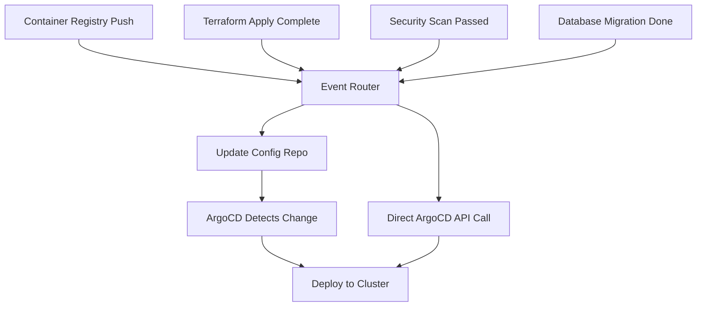
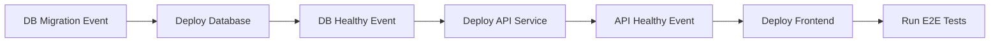

# How to Implement Event-Driven Deployments with ArgoCD

Author: [nawazdhandala](https://github.com/nawazdhandala)

Tags: ArgoCD, GitOps, Kubernetes, Event-Driven, Automation

Description: Learn how to implement event-driven deployment workflows with ArgoCD, including webhook triggers, Argo Events integration, cloud event processing, and reactive deployment patterns.

---

Event-driven deployments take GitOps beyond simple "merge and sync" by triggering deployments in response to external events. A new container image pushed to a registry, a Terraform infrastructure change completing, a security scan passing, or a database migration finishing - any of these events can trigger an ArgoCD deployment. This pattern decouples your deployment pipeline from Git polling and makes your infrastructure reactive.

This guide covers implementing event-driven deployment patterns with ArgoCD using webhooks, Argo Events, and custom event processors.

## Event-Driven Architecture



There are two approaches: events update the Git config repo (pure GitOps), or events call the ArgoCD API directly (faster but less auditable).

## Pattern 1: Argo Events Integration

Argo Events is a companion project to ArgoCD designed specifically for event-driven workflows. It watches for events and triggers actions:

```yaml
# Install Argo Events
apiVersion: argoproj.io/v1alpha1
kind: Application
metadata:
  name: argo-events
  namespace: argocd
spec:
  project: infrastructure
  source:
    repoURL: https://argoproj.github.io/argo-helm
    chart: argo-events
    targetRevision: 2.4.x
  destination:
    server: https://kubernetes.default.svc
    namespace: argo-events
  syncPolicy:
    automated:
      prune: true
    syncOptions:
    - CreateNamespace=true
```

### Event Source: Container Registry Webhook

Listen for new image pushes:

```yaml
apiVersion: argoproj.io/v1alpha1
kind: EventSource
metadata:
  name: registry-webhook
  namespace: argo-events
spec:
  service:
    ports:
    - port: 12000
      targetPort: 12000
  webhook:
    image-push:
      port: "12000"
      endpoint: /push
      method: POST
```

### Event Source: GitHub Webhook

Listen for specific GitHub events:

```yaml
apiVersion: argoproj.io/v1alpha1
kind: EventSource
metadata:
  name: github-events
  namespace: argo-events
spec:
  github:
    app-repo:
      repositories:
      - owner: org
        names:
        - myapp
      webhook:
        endpoint: /github
        port: "13000"
        method: POST
      events:
      - push
      - release
      apiToken:
        name: github-token
        key: token
      webhookSecret:
        name: github-webhook-secret
        key: secret
```

### Sensor: React to Events and Trigger Deployment

```yaml
apiVersion: argoproj.io/v1alpha1
kind: Sensor
metadata:
  name: deploy-on-image-push
  namespace: argo-events
spec:
  dependencies:
  - name: image-push
    eventSourceName: registry-webhook
    eventName: image-push
    filters:
      data:
      # Only trigger for production-tagged images
      - path: body.tag
        type: string
        value:
        - "v*"

  triggers:
  - template:
      name: update-config-repo
      k8s:
        operation: create
        source:
          resource:
            apiVersion: batch/v1
            kind: Job
            metadata:
              generateName: update-image-tag-
              namespace: argo-events
            spec:
              template:
                spec:
                  containers:
                  - name: update
                    image: alpine/git:latest
                    command:
                    - /bin/sh
                    - -c
                    - |
                      # Extract image tag from event
                      IMAGE_TAG="${IMAGE_TAG}"

                      # Clone config repo
                      git clone https://${GIT_TOKEN}@github.com/org/config-repo.git /repo
                      cd /repo

                      # Update image tag
                      cd environments/production
                      kustomize edit set image myapp=registry.example.com/myapp:${IMAGE_TAG}

                      # Commit and push
                      git config user.email "argo-events@example.com"
                      git config user.name "Argo Events Bot"
                      git add .
                      git commit -m "Update myapp to ${IMAGE_TAG} (event-driven)"
                      git push
                    env:
                    - name: IMAGE_TAG
                      value: ""  # Populated by event parameter
                    - name: GIT_TOKEN
                      valueFrom:
                        secretKeyRef:
                          name: git-credentials
                          key: token
                  restartPolicy: Never
        parameters:
        - src:
            dependencyName: image-push
            dataKey: body.tag
          dest: spec.template.spec.containers.0.env.0.value
```

## Pattern 2: Direct ArgoCD API Triggers

For faster deployment (skipping the Git commit step), call the ArgoCD API directly:

```yaml
apiVersion: argoproj.io/v1alpha1
kind: Sensor
metadata:
  name: direct-sync-trigger
  namespace: argo-events
spec:
  dependencies:
  - name: infra-ready
    eventSourceName: webhook-events
    eventName: infrastructure-ready

  triggers:
  - template:
      name: sync-argocd-app
      http:
        url: https://argocd-server.argocd.svc.cluster.local/api/v1/applications/myapp/sync
        method: POST
        headers:
          Content-Type: application/json
          Authorization: "Bearer ${ARGOCD_TOKEN}"
        payload:
        - src:
            dependencyName: infra-ready
            dataKey: body.revision
          dest: revision
        secureHeaders:
        - name: Authorization
          valueFrom:
            secretKeyRef:
              name: argocd-api-token
              key: token
```

## Pattern 3: Cloud Events Pipeline

React to cloud infrastructure events:

### AWS EventBridge to ArgoCD

```yaml
# EventSource for AWS SQS (receives EventBridge events)
apiVersion: argoproj.io/v1alpha1
kind: EventSource
metadata:
  name: aws-events
  namespace: argo-events
spec:
  sqs:
    infrastructure-events:
      region: us-east-1
      queue: argocd-deployment-events
      waitTimeSeconds: 20
      accessKey:
        name: aws-credentials
        key: access-key
      secretKey:
        name: aws-credentials
        key: secret-key
---
# Sensor: Deploy after RDS migration completes
apiVersion: argoproj.io/v1alpha1
kind: Sensor
metadata:
  name: post-migration-deploy
  namespace: argo-events
spec:
  dependencies:
  - name: rds-migration-complete
    eventSourceName: aws-events
    eventName: infrastructure-events
    filters:
      data:
      - path: body.detail-type
        type: string
        value:
        - "RDS DB Instance Event"
      - path: body.detail.message
        type: string
        value:
        - "Migration completed"

  triggers:
  - template:
      name: deploy-after-migration
      k8s:
        operation: create
        source:
          resource:
            apiVersion: batch/v1
            kind: Job
            metadata:
              generateName: post-migration-deploy-
            spec:
              template:
                spec:
                  containers:
                  - name: deploy
                    image: argoproj/argocd:v2.13.0
                    command:
                    - /bin/sh
                    - -c
                    - |
                      argocd login argocd-server:443 \
                        --grpc-web --insecure \
                        --auth-token "$TOKEN"
                      argocd app sync myapp --grpc-web
                      argocd app wait myapp --grpc-web --health
                    env:
                    - name: TOKEN
                      valueFrom:
                        secretKeyRef:
                          name: argocd-token
                          key: token
                  restartPolicy: Never
```

## Pattern 4: Chained Event Deployments

Deploy services in order based on dependency events:

```yaml
# Sensor: Database deployed -> Deploy API -> Deploy Frontend
apiVersion: argoproj.io/v1alpha1
kind: Sensor
metadata:
  name: chained-deployment
  namespace: argo-events
spec:
  dependencies:
  - name: db-healthy
    eventSourceName: argocd-notifications
    eventName: db-deployment-healthy

  triggers:
  # Step 1: Deploy API service
  - template:
      name: deploy-api
      http:
        url: https://argocd-server.argocd:443/api/v1/applications/api-service/sync
        method: POST
        secureHeaders:
        - name: Authorization
          valueFrom:
            secretKeyRef:
              name: argocd-token
              key: token

  # Step 2: Wait, then deploy frontend (triggered by separate sensor)
```



## Pattern 5: Security Scan Gate

Only deploy when security scans pass:

```yaml
apiVersion: argoproj.io/v1alpha1
kind: Sensor
metadata:
  name: security-gated-deploy
  namespace: argo-events
spec:
  dependencies:
  - name: scan-complete
    eventSourceName: webhook-events
    eventName: security-scan
    filters:
      data:
      # Only proceed if scan passed
      - path: body.result
        type: string
        value:
        - "passed"
      # Only for production deployments
      - path: body.environment
        type: string
        value:
        - "production"

  triggers:
  - template:
      name: deploy-after-scan
      conditions: "scan-complete"
      k8s:
        operation: create
        source:
          resource:
            apiVersion: batch/v1
            kind: Job
            metadata:
              generateName: security-approved-deploy-
            spec:
              template:
                spec:
                  containers:
                  - name: deploy
                    image: argoproj/argocd:v2.13.0
                    command:
                    - /bin/sh
                    - -c
                    - |
                      argocd login argocd-server:443 \
                        --grpc-web --insecure \
                        --auth-token "$TOKEN"

                      echo "Security scan passed, deploying..."
                      argocd app sync myapp-production --grpc-web
                      argocd app wait myapp-production --grpc-web --health

                      echo "Deployment complete"
                    env:
                    - name: TOKEN
                      valueFrom:
                        secretKeyRef:
                          name: argocd-token
                          key: token
                  restartPolicy: Never
```

## Monitoring Event-Driven Deployments

Track the health of your event pipeline alongside ArgoCD:

```yaml
apiVersion: monitoring.coreos.com/v1
kind: PrometheusRule
metadata:
  name: event-driven-deploy-alerts
spec:
  groups:
  - name: argo-events-health
    rules:
    - alert: EventSourceDown
      expr: up{job="argo-events-eventsource"} == 0
      for: 5m
      labels:
        severity: critical

    - alert: SensorProcessingFailed
      expr: increase(argo_events_sensor_trigger_failed_total[5m]) > 0
      for: 1m
      labels:
        severity: warning
```

Integrate with OneUptime for end-to-end visibility across your event-driven deployment pipeline.

## Conclusion

Event-driven deployments with ArgoCD move beyond simple polling to create reactive infrastructure that responds to real-world triggers. Argo Events provides the most native integration, handling event sources from webhooks to cloud services and triggering ArgoCD syncs or Git updates in response. The pure GitOps approach (events update Git, ArgoCD syncs from Git) provides the best auditability, while direct API triggers offer speed. For most production environments, combining both patterns - Git updates for planned deployments and direct API triggers for infrastructure dependency chains - provides the right balance of speed and traceability.
