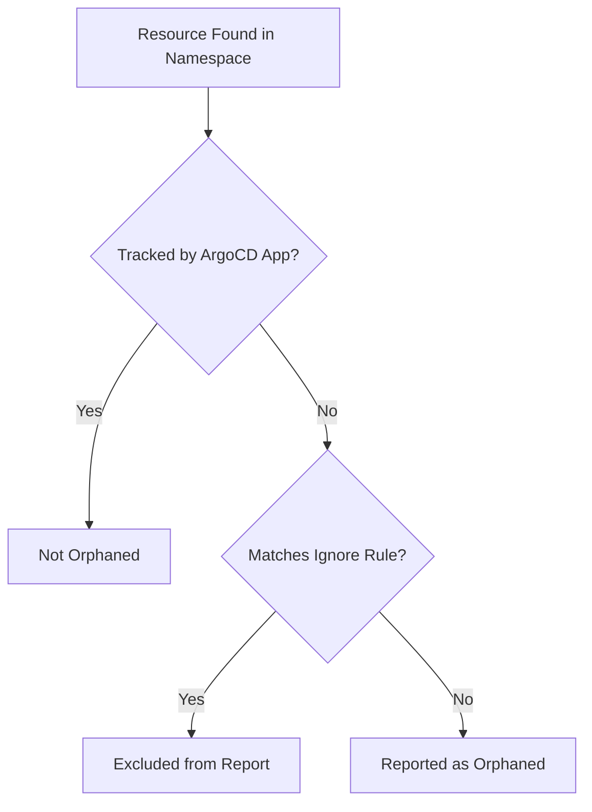

# How to Exclude Resources from Orphan Detection in ArgoCD

Author: [nawazdhandala](https://github.com/nawazdhandala)

Tags: ArgoCD, GitOps, Kubernetes, Resource Management, Configuration

Description: Learn how to configure ArgoCD orphan detection ignore rules to exclude auto-generated, operator-managed, and legitimately untracked resources from false warnings.

---

Once you enable orphaned resource monitoring in your ArgoCD projects, you will quickly discover that many resources in your cluster are technically "orphaned" but perfectly legitimate. Kubernetes auto-generates Endpoints for Services, ServiceAccount tokens get created automatically, and operators spawn child resources that are not directly tracked by ArgoCD. Without proper exclusion rules, your orphan report becomes noisy and unusable.

This guide covers how to build effective ignore rules that suppress false positives while still catching genuinely orphaned resources.

## How Orphan Detection Ignore Rules Work

The `ignore` field in an AppProject's `orphanedResources` section defines patterns for resources that should not be reported as orphaned. ArgoCD checks each discovered resource against these patterns and skips any that match.

```yaml
apiVersion: argoproj.io/v1alpha1
kind: AppProject
metadata:
  name: my-project
  namespace: argocd
spec:
  orphanedResources:
    warn: true
    ignore:
      - group: ""
        kind: Endpoints
```



## Ignore Rule Fields

Each ignore rule can specify three fields:

- **group** - The API group of the resource (empty string for core resources)
- **kind** - The resource kind
- **name** - The resource name (supports glob patterns)

All specified fields must match for a resource to be excluded. Omitting a field means "match any value" for that field.

```yaml
ignore:
  # Matches ALL Endpoints in ANY group (practically core group only)
  - kind: Endpoints

  # Matches Endpoints in core group specifically
  - group: ""
    kind: Endpoints

  # Matches a specific ConfigMap by name
  - group: ""
    kind: ConfigMap
    name: kube-root-ca.crt

  # Matches ConfigMaps with names matching a glob pattern
  - group: ""
    kind: ConfigMap
    name: "*.config"
```

## Kubernetes Auto-Generated Resources

These resources are created automatically by Kubernetes and should almost always be excluded.

### Core Auto-Generated Resources

```yaml
orphanedResources:
  warn: true
  ignore:
    # Endpoints are auto-created for every Service
    - group: ""
      kind: Endpoints

    # EndpointSlices replace Endpoints in newer clusters
    - group: discovery.k8s.io
      kind: EndpointSlice

    # Events are transient system records
    - group: ""
      kind: Event
    - group: events.k8s.io
      kind: Event

    # kube-root-ca.crt ConfigMap is auto-created in every namespace
    - group: ""
      kind: ConfigMap
      name: kube-root-ca.crt

    # Default ServiceAccount exists in every namespace
    - group: ""
      kind: ServiceAccount
      name: default
```

### Controller-Managed Child Resources

These resources are managed by parent controllers, not directly by users:

```yaml
ignore:
  # ReplicaSets are managed by Deployments
  - group: apps
    kind: ReplicaSet

  # Pods are managed by ReplicaSets, StatefulSets, DaemonSets, Jobs
  - group: ""
    kind: Pod

  # ControllerRevisions are managed by StatefulSets and DaemonSets
  - group: apps
    kind: ControllerRevision

  # Jobs created by CronJobs
  # Be careful: this ignores ALL Jobs, including orphaned ones
  # Use a name pattern instead if your CronJob-created Jobs have a naming convention
  # - group: batch
  #   kind: Job
  #   name: "cronjob-*"
```

## Operator-Created Resources

Many operators create resources as side effects of their primary resources.

### Cert-Manager

Cert-Manager creates CertificateRequests, Orders, and Challenges as part of the certificate issuance process:

```yaml
ignore:
  # Certificate issuance process resources
  - group: cert-manager.io
    kind: CertificateRequest
  - group: acme.cert-manager.io
    kind: Order
  - group: acme.cert-manager.io
    kind: Challenge

  # cert-manager created Secrets (TLS certificates)
  # Only if you want to ignore cert-manager managed TLS secrets
  # - group: ""
  #   kind: Secret
  #   name: "*-tls"
```

### Istio

Istio's control plane generates several resource types:

```yaml
ignore:
  # Istio auto-generated peer authentication
  - group: security.istio.io
    kind: PeerAuthentication
  # Istio envoy filter configurations
  - group: networking.istio.io
    kind: EnvoyFilter
```

### Prometheus Operator

The Prometheus Operator creates resources based on its CRDs:

```yaml
ignore:
  # Auto-generated configuration secrets
  - group: ""
    kind: Secret
    name: "prometheus-*"
  - group: ""
    kind: Secret
    name: "alertmanager-*"
  # Auto-generated ConfigMaps for rule files
  - group: ""
    kind: ConfigMap
    name: "prometheus-*-rulefiles-*"
```

### External Secrets Operator

```yaml
ignore:
  # Secrets created by ExternalSecrets
  # Only if you track ExternalSecret CRs but not the resulting Secrets
  - group: ""
    kind: Secret
    name: "es-*"   # Adjust pattern to match your naming convention
```

## Using Name Patterns

Name patterns use glob syntax for flexible matching:

```yaml
ignore:
  # Match a specific prefix
  - group: ""
    kind: ConfigMap
    name: "auto-generated-*"

  # Match a specific suffix
  - group: ""
    kind: Secret
    name: "*-token-*"

  # Match any name (equivalent to omitting the name field)
  - group: ""
    kind: Event
    name: "*"
```

### Pattern Examples

```yaml
ignore:
  # ServiceAccount token secrets (legacy format)
  - group: ""
    kind: Secret
    name: "*-token-*"

  # Helm release secrets
  - group: ""
    kind: Secret
    name: "sh.helm.release.v1.*"

  # Test or debug resources
  - group: "*"
    kind: "*"
    name: "test-*"
  - group: "*"
    kind: "*"
    name: "debug-*"
  - group: "*"
    kind: "*"
    name: "*-temp"
```

## Environment-Specific Ignore Rules

### Production (Strict)

In production, keep the ignore list minimal to catch as many orphans as possible:

```yaml
apiVersion: argoproj.io/v1alpha1
kind: AppProject
metadata:
  name: production
spec:
  orphanedResources:
    warn: true
    ignore:
      # Only auto-generated Kubernetes resources
      - group: ""
        kind: Endpoints
      - group: discovery.k8s.io
        kind: EndpointSlice
      - group: ""
        kind: Event
      - group: events.k8s.io
        kind: Event
      - group: ""
        kind: ConfigMap
        name: kube-root-ca.crt
      - group: ""
        kind: ServiceAccount
        name: default
      - group: apps
        kind: ReplicaSet
      - group: ""
        kind: Pod
      - group: apps
        kind: ControllerRevision
```

### Staging (Moderate)

Staging may have test resources and temporary debugging artifacts:

```yaml
apiVersion: argoproj.io/v1alpha1
kind: AppProject
metadata:
  name: staging
spec:
  orphanedResources:
    warn: true
    ignore:
      # Standard Kubernetes auto-generated
      - group: ""
        kind: Endpoints
      - group: discovery.k8s.io
        kind: EndpointSlice
      - group: ""
        kind: Event
      - group: events.k8s.io
        kind: Event
      - group: ""
        kind: ConfigMap
        name: kube-root-ca.crt
      - group: ""
        kind: ServiceAccount
        name: default
      - group: apps
        kind: ReplicaSet
      - group: ""
        kind: Pod
      - group: apps
        kind: ControllerRevision
      # Allow temp resources in staging
      - group: "*"
        kind: "*"
        name: "test-*"
      - group: "*"
        kind: "*"
        name: "temp-*"
      # Cert-manager intermediaries
      - group: cert-manager.io
        kind: CertificateRequest
      - group: acme.cert-manager.io
        kind: Order
      - group: acme.cert-manager.io
        kind: Challenge
```

### Development (Relaxed)

Development namespaces often have many ad-hoc resources:

```yaml
apiVersion: argoproj.io/v1alpha1
kind: AppProject
metadata:
  name: development
spec:
  orphanedResources:
    warn: true
    ignore:
      # Ignore most resource types in dev
      - group: ""
        kind: Endpoints
      - group: discovery.k8s.io
        kind: EndpointSlice
      - group: ""
        kind: Event
      - group: events.k8s.io
        kind: Event
      - group: ""
        kind: ConfigMap
      - group: ""
        kind: Secret
      - group: ""
        kind: ServiceAccount
      - group: apps
        kind: ReplicaSet
      - group: ""
        kind: Pod
      - group: apps
        kind: ControllerRevision
      - group: batch
        kind: Job
```

## Building Your Ignore List Iteratively

Start with an empty ignore list and add rules based on what you find:

```bash
# Step 1: Enable monitoring with no ignores
# Apply the project with orphanedResources.warn: true

# Step 2: Check what shows up as orphaned
argocd proj get production -o json | jq '.status.orphanedResources[] | {group, kind, name}'

# Step 3: Categorize each orphan:
# - Auto-generated by Kubernetes? -> Add to ignore list
# - Created by an operator? -> Add to ignore list
# - Actually orphaned? -> Leave it, investigate and clean up

# Step 4: Update the project with your ignore rules
# Step 5: Repeat until the report only shows genuine orphans
```

## Validating Ignore Rules

After updating your ignore rules, verify they work correctly:

```bash
# Apply the updated project
kubectl apply -f appproject.yaml

# Wait for ArgoCD to recalculate
sleep 30

# Check the orphaned resources report
argocd proj get production -o json | jq '.status.orphanedResources'

# The list should only contain genuinely orphaned resources
```

## Best Practices

1. **Start with standard Kubernetes auto-generated resources** - These are safe to ignore everywhere
2. **Add operator resources as you identify them** - Do not guess; verify that the operator actually creates them
3. **Use name patterns sparingly** - Broad patterns like `*-temp` could hide real orphans
4. **Keep production strict** - In production, every untracked resource should be investigated
5. **Document your ignore rules** - Add comments explaining why each rule exists
6. **Review periodically** - As you add new operators or tools, update the ignore list

For the complete orphaned resource workflow, see [How to Enable Orphaned Resource Monitoring](https://oneuptime.com/blog/post/2026-02-26-argocd-orphaned-resource-monitoring/view) and [How to Clean Up Orphaned Resources Safely](https://oneuptime.com/blog/post/2026-02-26-argocd-clean-up-orphaned-resources/view).
