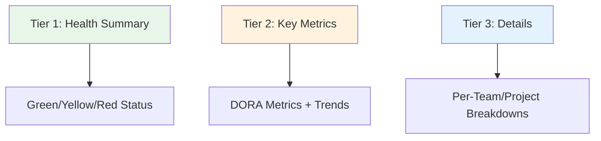

# How to Build Executive Dashboards for ArgoCD

Author: [nawazdhandala](https://github.com/nawazdhandala)

Tags: ArgoCD, GitOps, Kubernetes, Grafana, Observability

Description: Learn how to build executive-level dashboards for ArgoCD that communicate deployment health, team velocity, and platform reliability to non-technical stakeholders.

---

Executive dashboards serve a different audience than engineering dashboards. While engineers need detailed traces and log queries, executives want to see trends, risk indicators, and delivery velocity at a glance. The challenge is translating ArgoCD's technical metrics into business-relevant visualizations that inform decisions without overwhelming with detail.

This guide covers designing and building executive dashboards that bridge the gap between GitOps operations and business outcomes.

## What Executives Care About

Based on conversations with engineering leaders, the key questions executives ask about deployments are:

1. **How often are we shipping?** (Deployment frequency)
2. **How reliable are our deployments?** (Success rate, change failure rate)
3. **How fast can we recover from issues?** (MTTR)
4. **Are we improving over time?** (Trends)
5. **Where are the risks?** (Unhealthy apps, stale deployments)

Your dashboard should answer these questions in under 10 seconds.

## Dashboard Layout Design

Structure the dashboard in three tiers:



## Tier 1: Platform Health Summary

The top row should give an instant health assessment. Use large stat panels with color-coded thresholds.

```json
{
  "panels": [
    {
      "title": "Platform Status",
      "type": "stat",
      "gridPos": {"h": 4, "w": 6, "x": 0, "y": 0},
      "targets": [{
        "expr": "count(argocd_app_info{health_status='Healthy'}) / count(argocd_app_info) * 100"
      }],
      "fieldConfig": {
        "defaults": {
          "unit": "percent",
          "thresholds": {
            "steps": [
              {"color": "red", "value": 0},
              {"color": "yellow", "value": 90},
              {"color": "green", "value": 95}
            ]
          },
          "mappings": [{
            "type": "range",
            "options": {
              "from": 95, "to": 100,
              "result": {"text": "Healthy"}
            }
          }, {
            "type": "range",
            "options": {
              "from": 90, "to": 95,
              "result": {"text": "Degraded"}
            }
          }, {
            "type": "range",
            "options": {
              "from": 0, "to": 90,
              "result": {"text": "Critical"}
            }
          }]
        }
      }
    },
    {
      "title": "Total Applications",
      "type": "stat",
      "gridPos": {"h": 4, "w": 6, "x": 6, "y": 0},
      "targets": [{
        "expr": "count(argocd_app_info)"
      }]
    },
    {
      "title": "Deployments Today",
      "type": "stat",
      "gridPos": {"h": 4, "w": 6, "x": 12, "y": 0},
      "targets": [{
        "expr": "sum(increase(argocd_app_sync_total{phase='Succeeded'}[24h]))"
      }],
      "fieldConfig": {
        "defaults": {
          "decimals": 0
        }
      }
    },
    {
      "title": "Active Incidents",
      "type": "stat",
      "gridPos": {"h": 4, "w": 6, "x": 18, "y": 0},
      "targets": [{
        "expr": "count(argocd_app_info{health_status=~'Degraded|Missing|Unknown'}) or vector(0)"
      }],
      "fieldConfig": {
        "defaults": {
          "thresholds": {
            "steps": [
              {"color": "green", "value": 0},
              {"color": "yellow", "value": 1},
              {"color": "red", "value": 3}
            ]
          }
        }
      }
    }
  ]
}
```

## Tier 2: DORA Metrics with Trends

The middle section shows the four DORA metrics with week-over-week trend indicators.

### Deployment Frequency with Trend

```json
{
  "title": "Weekly Deployment Frequency",
  "type": "stat",
  "targets": [{
    "expr": "sum(increase(argocd_app_sync_total{phase='Succeeded'}[7d]))",
    "legendFormat": "This Week"
  }, {
    "expr": "sum(increase(argocd_app_sync_total{phase='Succeeded'}[7d] offset 7d))",
    "legendFormat": "Last Week"
  }],
  "fieldConfig": {
    "defaults": {
      "decimals": 0
    }
  }
}
```

### Success Rate Gauge

```json
{
  "title": "Deployment Success Rate",
  "type": "gauge",
  "targets": [{
    "expr": "sum(increase(argocd_app_sync_total{phase='Succeeded'}[30d])) / sum(increase(argocd_app_sync_total[30d])) * 100"
  }],
  "fieldConfig": {
    "defaults": {
      "unit": "percent",
      "min": 0,
      "max": 100,
      "thresholds": {
        "steps": [
          {"color": "red", "value": 0},
          {"color": "orange", "value": 80},
          {"color": "yellow", "value": 90},
          {"color": "green", "value": 95}
        ]
      }
    }
  }
}
```

### Deployment Trend Over Time

```json
{
  "title": "Daily Deployments (30-Day Trend)",
  "type": "timeseries",
  "gridPos": {"h": 8, "w": 24, "x": 0, "y": 8},
  "targets": [{
    "expr": "sum(increase(argocd_app_sync_total{phase='Succeeded'}[24h]))",
    "legendFormat": "Successful"
  }, {
    "expr": "sum(increase(argocd_app_sync_total{phase=~'Failed|Error'}[24h]))",
    "legendFormat": "Failed"
  }],
  "fieldConfig": {
    "overrides": [{
      "matcher": {"id": "byName", "options": "Failed"},
      "properties": [{"id": "color", "value": {"fixedColor": "red"}}]
    }]
  }
}
```

## Tier 3: Team and Project Breakdown

The bottom section lets executives drill into specific teams or projects.

### Project Scorecard

```json
{
  "title": "Team Delivery Scorecard",
  "type": "table",
  "gridPos": {"h": 10, "w": 24, "x": 0, "y": 16},
  "targets": [
    {
      "expr": "count(argocd_app_info) by (project)",
      "legendFormat": "{{project}}",
      "instant": true,
      "format": "table"
    },
    {
      "expr": "count(argocd_app_info{health_status='Healthy'}) by (project)",
      "legendFormat": "{{project}}",
      "instant": true,
      "format": "table"
    },
    {
      "expr": "sum(increase(argocd_app_sync_total{phase='Succeeded'}[7d])) by (project)",
      "legendFormat": "{{project}}",
      "instant": true,
      "format": "table"
    }
  ],
  "transformations": [
    {"id": "merge"},
    {"id": "organize", "options": {
      "renameByName": {
        "Value #A": "Total Apps",
        "Value #B": "Healthy Apps",
        "Value #C": "Deploys This Week"
      }
    }}
  ]
}
```

## Recording Rules for Dashboard Performance

Pre-compute expensive queries so the dashboard loads fast:

```yaml
apiVersion: monitoring.coreos.com/v1
kind: PrometheusRule
metadata:
  name: argocd-executive-dashboard
  namespace: argocd
spec:
  groups:
    - name: executive-dashboard
      interval: 5m
      rules:
        - record: argocd:exec_platform_health_pct
          expr: >
            count(argocd_app_info{health_status="Healthy"})
            / count(argocd_app_info) * 100

        - record: argocd:exec_weekly_deploys
          expr: >
            sum(increase(
              argocd_app_sync_total{phase="Succeeded"}[7d]
            ))

        - record: argocd:exec_weekly_deploys_by_project
          expr: >
            sum(increase(
              argocd_app_sync_total{phase="Succeeded"}[7d]
            )) by (project)

        - record: argocd:exec_success_rate_30d
          expr: >
            sum(increase(
              argocd_app_sync_total{phase="Succeeded"}[30d]
            ))
            /
            clamp_min(sum(increase(
              argocd_app_sync_total[30d]
            )), 1) * 100

        - record: argocd:exec_unhealthy_apps
          expr: >
            count(
              argocd_app_info{health_status!="Healthy"}
            ) or vector(0)
```

## Adding Annotations for Context

Mark important events on the dashboard timeline so executives can correlate metrics with real-world events:

```bash
# Add an annotation for a major release
curl -X POST http://grafana:3000/api/annotations \
  -H "Content-Type: application/json" \
  -H "Authorization: Bearer $GRAFANA_TOKEN" \
  -d '{
    "dashboardUID": "argocd-executive",
    "time": 1709000000000,
    "tags": ["release", "major"],
    "text": "v2.0 Platform Release"
  }'
```

Automate annotations from ArgoCD Notifications:

```yaml
template.grafana-annotation: |
  webhook:
    grafana:
      method: POST
      path: /api/annotations
      body: |
        {
          "dashboardUID": "argocd-executive",
          "tags": ["deployment", "{{.app.spec.project}}"],
          "text": "Deployed {{.app.metadata.name}} revision {{.app.status.sync.revision | truncate 8}}"
        }
```

## Scheduled Reports

For executives who prefer email reports, create a Grafana reporting schedule:

1. Install the Grafana Image Renderer plugin
2. Set up a Grafana Report with the executive dashboard
3. Schedule weekly delivery to the leadership distribution list

Alternatively, use the Grafana API to generate snapshots:

```bash
# Generate a dashboard snapshot and email it
curl -X POST http://grafana:3000/api/snapshots \
  -H "Content-Type: application/json" \
  -H "Authorization: Bearer $GRAFANA_TOKEN" \
  -d '{
    "dashboard": {...},
    "expires": 604800
  }'
```

## Summary

Executive dashboards for ArgoCD translate technical GitOps metrics into business-relevant insights. Structure them in three tiers: instant health assessment at the top, DORA metrics with trends in the middle, and team breakdowns at the bottom. Pre-compute metrics with recording rules for fast dashboard loads, and add annotations for real-world context. The goal is to answer "How is our deployment pipeline performing?" in under 10 seconds, enabling leadership to make informed decisions about engineering investment.
