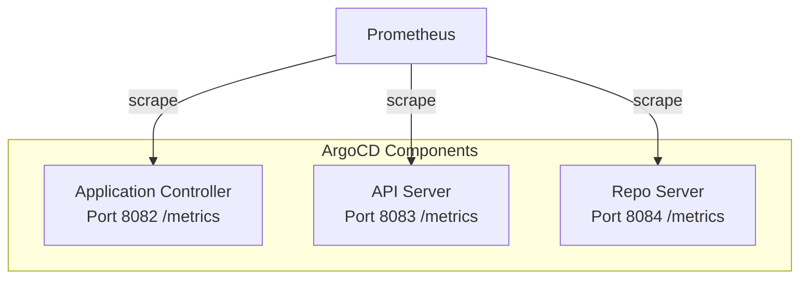

# How to Expose ArgoCD Prometheus Metrics

Author: [nawazdhandala](https://github.com/nawazdhandala)

Tags: ArgoCD, GitOps, Kubernetes, Prometheus, Monitoring

Description: Learn how to expose and configure Prometheus metrics from ArgoCD components including the application controller, API server, and repo server for comprehensive GitOps monitoring.

---

ArgoCD exposes a rich set of Prometheus metrics from each of its core components. These metrics give you visibility into sync operations, application health, Git operations, reconciliation performance, and resource utilization. But by default, these metrics endpoints are not always easily accessible to your Prometheus installation. You need to configure the right ports, service monitors, and annotations to make them scrapable.

This guide covers how to expose metrics from every ArgoCD component and make them available to your Prometheus stack.

## ArgoCD Components That Expose Metrics

ArgoCD has three main components, and each exposes its own metrics endpoint:



| Component | Default Metrics Port | Endpoint |
|-----------|---------------------|----------|
| Application Controller | 8082 | /metrics |
| API Server | 8083 | /metrics |
| Repo Server | 8084 | /metrics |

## Verifying Metrics Are Accessible

Before configuring Prometheus, verify that each component is exposing metrics:

```bash
# Port-forward to the application controller metrics port
kubectl port-forward -n argocd deployment/argocd-application-controller 8082:8082 &

# Check if metrics are being served
curl localhost:8082/metrics | head -20

# Port-forward to the API server metrics port
kubectl port-forward -n argocd deployment/argocd-server 8083:8083 &
curl localhost:8083/metrics | head -20

# Port-forward to the repo server metrics port
kubectl port-forward -n argocd deployment/argocd-repo-server 8084:8084 &
curl localhost:8084/metrics | head -20
```

You should see Prometheus-formatted metrics output with lines like:

```
# HELP argocd_app_info Information about application.
# TYPE argocd_app_info gauge
argocd_app_info{dest_namespace="default",dest_server="https://kubernetes.default.svc",...} 1
```

## Creating Kubernetes Services for Metrics

To make metrics endpoints accessible to Prometheus, create dedicated services for each component's metrics port:

```yaml
# Application Controller metrics service
apiVersion: v1
kind: Service
metadata:
  name: argocd-application-controller-metrics
  namespace: argocd
  labels:
    app.kubernetes.io/name: argocd-application-controller
    app.kubernetes.io/component: application-controller
spec:
  selector:
    app.kubernetes.io/name: argocd-application-controller
  ports:
  - name: metrics
    port: 8082
    targetPort: 8082
    protocol: TCP
---
# API Server metrics service
apiVersion: v1
kind: Service
metadata:
  name: argocd-server-metrics
  namespace: argocd
  labels:
    app.kubernetes.io/name: argocd-server
    app.kubernetes.io/component: server
spec:
  selector:
    app.kubernetes.io/name: argocd-server
  ports:
  - name: metrics
    port: 8083
    targetPort: 8083
    protocol: TCP
---
# Repo Server metrics service
apiVersion: v1
kind: Service
metadata:
  name: argocd-repo-server-metrics
  namespace: argocd
  labels:
    app.kubernetes.io/name: argocd-repo-server
    app.kubernetes.io/component: repo-server
spec:
  selector:
    app.kubernetes.io/name: argocd-repo-server
  ports:
  - name: metrics
    port: 8084
    targetPort: 8084
    protocol: TCP
```

## Configuring Metrics via Prometheus Annotations

If your Prometheus is configured to discover targets via pod annotations, add the appropriate annotations to ArgoCD deployments:

```yaml
apiVersion: apps/v1
kind: Deployment
metadata:
  name: argocd-application-controller
  namespace: argocd
spec:
  template:
    metadata:
      annotations:
        prometheus.io/scrape: "true"
        prometheus.io/port: "8082"
        prometheus.io/path: "/metrics"
```

Apply similar annotations for the API server (port 8083) and repo server (port 8084).

If you manage ArgoCD with Helm, set the annotations in your values file:

```yaml
# values.yaml
controller:
  metrics:
    enabled: true
    service:
      annotations:
        prometheus.io/scrape: "true"
      servicePort: 8082
    serviceMonitor:
      enabled: false  # We'll configure ServiceMonitors separately

server:
  metrics:
    enabled: true
    service:
      annotations:
        prometheus.io/scrape: "true"
      servicePort: 8083

repoServer:
  metrics:
    enabled: true
    service:
      annotations:
        prometheus.io/scrape: "true"
      servicePort: 8084
```

## Creating ServiceMonitor Resources

If you use the Prometheus Operator (kube-prometheus-stack), create ServiceMonitor resources for automatic target discovery:

```yaml
# Application Controller ServiceMonitor
apiVersion: monitoring.coreos.com/v1
kind: ServiceMonitor
metadata:
  name: argocd-application-controller
  namespace: argocd
  labels:
    release: prometheus  # Match your Prometheus operator label selector
spec:
  selector:
    matchLabels:
      app.kubernetes.io/name: argocd-application-controller
  endpoints:
  - port: metrics
    interval: 30s
    path: /metrics
---
# API Server ServiceMonitor
apiVersion: monitoring.coreos.com/v1
kind: ServiceMonitor
metadata:
  name: argocd-server
  namespace: argocd
  labels:
    release: prometheus
spec:
  selector:
    matchLabels:
      app.kubernetes.io/name: argocd-server
  endpoints:
  - port: metrics
    interval: 30s
    path: /metrics
---
# Repo Server ServiceMonitor
apiVersion: monitoring.coreos.com/v1
kind: ServiceMonitor
metadata:
  name: argocd-repo-server
  namespace: argocd
  labels:
    release: prometheus
spec:
  selector:
    matchLabels:
      app.kubernetes.io/name: argocd-repo-server
  endpoints:
  - port: metrics
    interval: 30s
    path: /metrics
```

The `release: prometheus` label must match the label selector configured in your Prometheus Operator. Check your Prometheus configuration to find the correct label:

```bash
# Find the label selector your Prometheus uses for ServiceMonitors
kubectl get prometheus -n monitoring -o jsonpath='{.items[0].spec.serviceMonitorSelector}'
```

## Enabling Metrics via Helm Chart

The ArgoCD Helm chart has built-in support for metrics and ServiceMonitors:

```yaml
# values.yaml
controller:
  metrics:
    enabled: true
    serviceMonitor:
      enabled: true
      interval: 30s
      namespace: argocd
      additionalLabels:
        release: prometheus

server:
  metrics:
    enabled: true
    serviceMonitor:
      enabled: true
      interval: 30s
      namespace: argocd
      additionalLabels:
        release: prometheus

repoServer:
  metrics:
    enabled: true
    serviceMonitor:
      enabled: true
      interval: 30s
      namespace: argocd
      additionalLabels:
        release: prometheus
```

This creates all the necessary services and ServiceMonitor resources automatically.

## Key Metrics to Verify After Setup

Once Prometheus is scraping ArgoCD, verify the key metrics are being collected:

```promql
# Application information (should return one time series per app)
argocd_app_info

# Application sync status
argocd_app_sync_total

# Git request metrics
argocd_git_request_total

# API server request metrics
argocd_argocd_server_request_total

# Repo server request metrics
argocd_repo_server_request_total
```

Run these queries in your Prometheus UI or Grafana. If they return results, your metrics pipeline is working correctly.

## Configuring Metrics Port Customization

If the default metrics ports conflict with other services in your cluster, you can change them:

```yaml
# argocd-cmd-params-cm
apiVersion: v1
kind: ConfigMap
metadata:
  name: argocd-cmd-params-cm
  namespace: argocd
data:
  controller.metrics.port: "9082"
  server.metrics.port: "9083"
  reposerver.metrics.port: "9084"
```

Update your services and ServiceMonitors to match the new ports after making this change.

## Securing Metrics Endpoints

By default, metrics endpoints are unauthenticated. In production environments, consider restricting access using Network Policies:

```yaml
apiVersion: networking.k8s.io/v1
kind: NetworkPolicy
metadata:
  name: argocd-metrics-allow-prometheus
  namespace: argocd
spec:
  podSelector:
    matchLabels:
      app.kubernetes.io/part-of: argocd
  ingress:
  - from:
    - namespaceSelector:
        matchLabels:
          kubernetes.io/metadata.name: monitoring
    ports:
    - port: 8082
    - port: 8083
    - port: 8084
```

This allows only pods in the monitoring namespace (where Prometheus typically runs) to access the metrics endpoints.

Exposing ArgoCD Prometheus metrics is the foundation for all GitOps observability. Once metrics are flowing, you can build dashboards, set up alerts, and gain deep insight into your deployment pipeline performance. Check out our guides on [creating Grafana dashboards for ArgoCD](https://oneuptime.com/blog/post/2026-02-26-argocd-grafana-dashboards/view) and [setting up alerts for failed syncs](https://oneuptime.com/blog/post/2026-02-26-argocd-alerts-failed-syncs/view) for the next steps.
