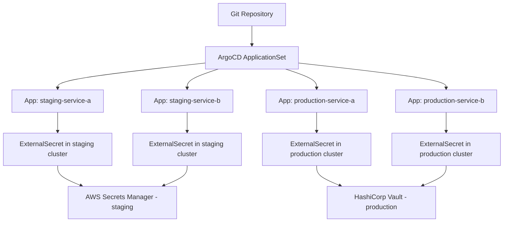

# How to Use External Secrets with ArgoCD ApplicationSets

Author: [nawazdhandala](https://github.com/nawazdhandala)

Tags: ArgoCD, GitOps, Kubernetes, External Secrets, ApplicationSet

Description: Learn how to combine External Secrets Operator with ArgoCD ApplicationSets to manage secrets across multiple clusters and environments using templated ExternalSecret manifests.

---

When you manage dozens of applications across multiple clusters, manually creating ExternalSecret resources for each one becomes tedious and error-prone. ArgoCD ApplicationSets can generate applications automatically from templates, and when you combine this with the External Secrets Operator (ESO), you get a scalable secret management solution that works across your entire fleet.

In this guide, I will show you how to set up this combination so that every application in every cluster gets its secrets from the right external store, all driven from a single Git repository.

## The Architecture

Here is how the pieces fit together:



## Prerequisites

You need the following installed:

- ArgoCD with ApplicationSet controller (included by default since ArgoCD 2.3)
- External Secrets Operator deployed to each target cluster
- A ClusterSecretStore configured in each target cluster

## Setting Up ClusterSecretStores Per Cluster

First, ensure each cluster has its own ClusterSecretStore. This is typically deployed with a bootstrap ArgoCD Application:

```yaml
# clusters/staging/external-secrets-store.yaml
apiVersion: external-secrets.io/v1beta1
kind: ClusterSecretStore
metadata:
  name: aws-secrets-manager
spec:
  provider:
    aws:
      service: SecretsManager
      region: us-east-1
      auth:
        jwt:
          serviceAccountRef:
            name: external-secrets-sa
            namespace: external-secrets

---
# clusters/production/external-secrets-store.yaml
apiVersion: external-secrets.io/v1beta1
kind: ClusterSecretStore
metadata:
  name: vault-store
spec:
  provider:
    vault:
      server: "https://vault.internal.example.com"
      path: "secret"
      version: "v2"
      auth:
        kubernetes:
          mountPath: "kubernetes"
          role: "external-secrets"
```

## Repository Structure

Organize your Git repository so ApplicationSets can template paths and values:

```
repo/
  apps/
    service-a/
      base/
        deployment.yaml
        service.yaml
        external-secret.yaml    # Templated ExternalSecret
      overlays/
        staging/
          kustomization.yaml
        production/
          kustomization.yaml
    service-b/
      base/
        deployment.yaml
        service.yaml
        external-secret.yaml
      overlays/
        staging/
          kustomization.yaml
        production/
          kustomization.yaml
```

## The Templated ExternalSecret

The base ExternalSecret uses Kustomize variables that will be set per environment:

```yaml
# apps/service-a/base/external-secret.yaml
apiVersion: external-secrets.io/v1beta1
kind: ExternalSecret
metadata:
  name: service-a-secrets
spec:
  refreshInterval: 15m
  secretStoreRef:
    name: default-store  # Will be overridden per environment
    kind: ClusterSecretStore
  target:
    name: service-a-secrets
    creationPolicy: Owner
  data:
    - secretKey: DATABASE_URL
      remoteRef:
        key: services/service-a/database-url
    - secretKey: API_KEY
      remoteRef:
        key: services/service-a/api-key
    - secretKey: JWT_SECRET
      remoteRef:
        key: services/service-a/jwt-secret
```

The Kustomize overlay patches the store reference and secret paths per environment:

```yaml
# apps/service-a/overlays/staging/kustomization.yaml
apiVersion: kustomize.config.k8s.io/v1beta1
kind: Kustomization
resources:
  - ../../base
patches:
  - target:
      kind: ExternalSecret
      name: service-a-secrets
    patch: |
      - op: replace
        path: /spec/secretStoreRef/name
        value: aws-secrets-manager
      - op: replace
        path: /spec/data/0/remoteRef/key
        value: staging/services/service-a/database-url
      - op: replace
        path: /spec/data/1/remoteRef/key
        value: staging/services/service-a/api-key
      - op: replace
        path: /spec/data/2/remoteRef/key
        value: staging/services/service-a/jwt-secret
```

```yaml
# apps/service-a/overlays/production/kustomization.yaml
apiVersion: kustomize.config.k8s.io/v1beta1
kind: Kustomization
resources:
  - ../../base
patches:
  - target:
      kind: ExternalSecret
      name: service-a-secrets
    patch: |
      - op: replace
        path: /spec/secretStoreRef/name
        value: vault-store
      - op: replace
        path: /spec/data/0/remoteRef/key
        value: secret/data/production/services/service-a/database-url
      - op: replace
        path: /spec/data/1/remoteRef/key
        value: secret/data/production/services/service-a/api-key
      - op: replace
        path: /spec/data/2/remoteRef/key
        value: secret/data/production/services/service-a/jwt-secret
```

## ApplicationSet with Matrix Generator

Now create an ApplicationSet that generates applications for every combination of service and environment:

```yaml
apiVersion: argoproj.io/v1alpha1
kind: ApplicationSet
metadata:
  name: services-with-secrets
  namespace: argocd
spec:
  generators:
    - matrix:
        generators:
          # First generator: list of services
          - list:
              elements:
                - service: service-a
                  namespace: service-a
                - service: service-b
                  namespace: service-b
                - service: service-c
                  namespace: service-c
          # Second generator: list of environments
          - list:
              elements:
                - environment: staging
                  cluster: https://staging.k8s.example.com
                  secretStore: aws-secrets-manager
                - environment: production
                  cluster: https://production.k8s.example.com
                  secretStore: vault-store
  template:
    metadata:
      name: '{{service}}-{{environment}}'
      namespace: argocd
    spec:
      project: '{{environment}}'
      source:
        repoURL: https://github.com/your-org/apps-repo.git
        targetRevision: main
        path: 'apps/{{service}}/overlays/{{environment}}'
      destination:
        server: '{{cluster}}'
        namespace: '{{namespace}}'
      syncPolicy:
        automated:
          selfHeal: true
          prune: true
        syncOptions:
          - CreateNamespace=true
```

## ApplicationSet with Git Generator

If you prefer autodiscovery over explicit lists, use a Git generator that finds all services automatically:

```yaml
apiVersion: argoproj.io/v1alpha1
kind: ApplicationSet
metadata:
  name: auto-discover-services
  namespace: argocd
spec:
  generators:
    - matrix:
        generators:
          # Discover services from directory structure
          - git:
              repoURL: https://github.com/your-org/apps-repo.git
              revision: main
              directories:
                - path: 'apps/*/overlays/staging'
                - path: 'apps/*/overlays/production'
          # Cluster mapping
          - clusters:
              selector:
                matchLabels:
                  environment: '{{path[3]}}'
  template:
    metadata:
      name: '{{path[1]}}-{{path[3]}}'
      namespace: argocd
    spec:
      project: '{{path[3]}}'
      source:
        repoURL: https://github.com/your-org/apps-repo.git
        targetRevision: main
        path: '{{path}}'
      destination:
        server: '{{server}}'
        namespace: '{{path[1]}}'
      syncPolicy:
        automated:
          selfHeal: true
          prune: true
        syncOptions:
          - CreateNamespace=true
```

## Handling Per-Service Secret Stores

Sometimes different services need different secret stores even within the same environment. Use a Helm-based approach with ApplicationSet parameters:

```yaml
apiVersion: argoproj.io/v1alpha1
kind: ApplicationSet
metadata:
  name: services-custom-stores
  namespace: argocd
spec:
  generators:
    - list:
        elements:
          - service: payment-api
            environment: production
            cluster: https://prod.k8s.example.com
            secretStore: vault-pci-store
            secretPath: pci/services/payment-api
          - service: user-api
            environment: production
            cluster: https://prod.k8s.example.com
            secretStore: vault-store
            secretPath: secret/data/production/services/user-api
          - service: analytics
            environment: production
            cluster: https://prod.k8s.example.com
            secretStore: aws-secrets-manager
            secretPath: production/services/analytics
  template:
    metadata:
      name: '{{service}}-{{environment}}'
      namespace: argocd
    spec:
      project: '{{environment}}'
      source:
        repoURL: https://github.com/your-org/apps-repo.git
        targetRevision: main
        path: 'apps/{{service}}'
        helm:
          parameters:
            - name: externalSecret.store
              value: '{{secretStore}}'
            - name: externalSecret.path
              value: '{{secretPath}}'
      destination:
        server: '{{cluster}}'
        namespace: '{{service}}'
```

With a Helm chart that templates the ExternalSecret:

```yaml
# apps/service-template/templates/external-secret.yaml
apiVersion: external-secrets.io/v1beta1
kind: ExternalSecret
metadata:
  name: {{ .Release.Name }}-secrets
spec:
  refreshInterval: {{ .Values.externalSecret.refreshInterval | default "15m" }}
  secretStoreRef:
    name: {{ .Values.externalSecret.store }}
    kind: ClusterSecretStore
  target:
    name: {{ .Release.Name }}-secrets
    creationPolicy: Owner
  data:
    {{- range .Values.externalSecret.keys }}
    - secretKey: {{ .name }}
      remoteRef:
        key: {{ $.Values.externalSecret.path }}/{{ .remoteKey }}
        {{- if .property }}
        property: {{ .property }}
        {{- end }}
    {{- end }}
```

## Ignoring Secret Data in ArgoCD Diffs

When ESO creates the actual Kubernetes Secret, ArgoCD might flag it as OutOfSync because the Secret's data fields differ from what is in Git. Configure ignoreDifferences to handle this:

```yaml
apiVersion: argoproj.io/v1alpha1
kind: ApplicationSet
metadata:
  name: services-with-secrets
  namespace: argocd
spec:
  # ... generators ...
  template:
    spec:
      ignoreDifferences:
        - group: ""
          kind: Secret
          jsonPointers:
            - /data
            - /metadata/labels/reconcile.external-secrets.io
            - /metadata/annotations
```

## Verifying the Setup

After applying your ApplicationSet, verify everything works:

```bash
# Check ApplicationSet status
kubectl get applicationsets -n argocd

# List generated applications
argocd app list | grep -E "service-a|service-b"

# Check ExternalSecret status in each cluster
kubectl get externalsecrets -A --context staging
kubectl get externalsecrets -A --context production

# Verify secrets were created
kubectl get secrets -n service-a --context production
```

## Summary

Combining External Secrets Operator with ArgoCD ApplicationSets gives you a scalable, declarative approach to managing secrets across your entire fleet. ApplicationSets handle the multiplication of applications across services, environments, and clusters, while ESO handles the actual secret fetching from external stores. The result is a system where adding a new service or environment requires only a few lines of configuration, and the secrets follow automatically.
