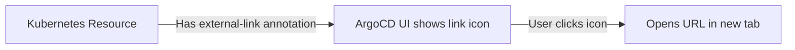

# How to Add External URLs to Application Resources in ArgoCD

Author: [nawazdhandala](https://github.com/nawazdhandala)

Tags: ArgoCD, GitOps, Kubernetes, UI Customization, Productivity

Description: Learn how to add external URLs to Kubernetes resources in ArgoCD so your team can quickly navigate to related dashboards, documentation, and tools directly from the resource tree.

---

ArgoCD lets you attach external URLs to Kubernetes resources through annotations. These URLs appear as clickable links in the ArgoCD UI resource tree, making it easy for operators to jump from a specific resource to a related tool, dashboard, or documentation page. Unlike deep links which are configured globally in the ArgoCD ConfigMap, external URLs are defined per resource in your Kubernetes manifests.

This guide covers how to configure external URLs on your resources and practical patterns for using them effectively.

## How External URLs Work

External URLs in ArgoCD use the `link.argocd.argoproj.io/external-link` annotation on any Kubernetes resource. When this annotation is present, ArgoCD displays a clickable link icon next to the resource in the resource tree view.



## Adding External URLs to Resources

Add the annotation to any Kubernetes resource in your manifest:

```yaml
apiVersion: apps/v1
kind: Deployment
metadata:
  name: payment-service
  namespace: production
  annotations:
    # This URL will appear as a clickable link in the ArgoCD UI
    link.argocd.argoproj.io/external-link: "https://grafana.example.com/d/payment-service"
spec:
  replicas: 3
  selector:
    matchLabels:
      app: payment-service
  template:
    metadata:
      labels:
        app: payment-service
    spec:
      containers:
        - name: payment-service
          image: payment-service:v1.2.3
```

When you view this Deployment in the ArgoCD UI resource tree, you will see a small external link icon that opens the Grafana dashboard when clicked.

## Common External URL Patterns

### Linking Deployments to Monitoring Dashboards

```yaml
apiVersion: apps/v1
kind: Deployment
metadata:
  name: api-gateway
  annotations:
    link.argocd.argoproj.io/external-link: "https://grafana.example.com/d/api-gateway-metrics?var-namespace=production"
```

### Linking Services to API Documentation

```yaml
apiVersion: v1
kind: Service
metadata:
  name: user-service
  annotations:
    link.argocd.argoproj.io/external-link: "https://api-docs.example.com/services/user-service/swagger"
```

### Linking ConfigMaps to Configuration Management

```yaml
apiVersion: v1
kind: ConfigMap
metadata:
  name: feature-flags
  annotations:
    link.argocd.argoproj.io/external-link: "https://launchdarkly.example.com/projects/my-app/flags"
```

### Linking CronJobs to Scheduling Documentation

```yaml
apiVersion: batch/v1
kind: CronJob
metadata:
  name: nightly-report
  annotations:
    link.argocd.argoproj.io/external-link: "https://wiki.example.com/runbooks/nightly-report-job"
```

### Linking Ingress to the Live Application

```yaml
apiVersion: networking.k8s.io/v1
kind: Ingress
metadata:
  name: frontend-ingress
  annotations:
    link.argocd.argoproj.io/external-link: "https://app.example.com"
```

## Using External URLs with Kustomize

When using Kustomize for multi-environment deployments, you can add environment-specific external URLs in your overlays:

### Base Deployment (Without External URL)

```yaml
# base/deployment.yaml
apiVersion: apps/v1
kind: Deployment
metadata:
  name: my-app
spec:
  replicas: 1
  selector:
    matchLabels:
      app: my-app
  template:
    metadata:
      labels:
        app: my-app
    spec:
      containers:
        - name: my-app
          image: my-app:latest
```

### Production Overlay (With External URL)

```yaml
# overlays/production/kustomization.yaml
apiVersion: kustomize.config.k8s.io/v1beta1
kind: Kustomization
resources:
  - ../../base
patches:
  - target:
      kind: Deployment
      name: my-app
    patch: |
      - op: add
        path: /metadata/annotations
        value:
          link.argocd.argoproj.io/external-link: "https://grafana.example.com/d/my-app-prod"
```

### Staging Overlay (With Different External URL)

```yaml
# overlays/staging/kustomization.yaml
apiVersion: kustomize.config.k8s.io/v1beta1
kind: Kustomization
resources:
  - ../../base
patches:
  - target:
      kind: Deployment
      name: my-app
    patch: |
      - op: add
        path: /metadata/annotations
        value:
          link.argocd.argoproj.io/external-link: "https://grafana.example.com/d/my-app-staging"
```

## Using External URLs with Helm

In Helm charts, you can template the external URL:

```yaml
# templates/deployment.yaml
apiVersion: apps/v1
kind: Deployment
metadata:
  name: {{ .Release.Name }}
  annotations:
    {{- if .Values.externalLink }}
    link.argocd.argoproj.io/external-link: {{ .Values.externalLink | quote }}
    {{- end }}
```

```yaml
# values.yaml
externalLink: "https://grafana.example.com/d/my-app"

# values-production.yaml
externalLink: "https://grafana.example.com/d/my-app-prod"
```

## Multiple Resources with External URLs

You can add external URLs to every resource in your application. Here is a complete example:

```yaml
# deployment.yaml
apiVersion: apps/v1
kind: Deployment
metadata:
  name: order-service
  annotations:
    link.argocd.argoproj.io/external-link: "https://grafana.example.com/d/order-service"
spec:
  # ...
---
# service.yaml
apiVersion: v1
kind: Service
metadata:
  name: order-service
  annotations:
    link.argocd.argoproj.io/external-link: "https://api-docs.example.com/order-service"
spec:
  # ...
---
# hpa.yaml
apiVersion: autoscaling/v2
kind: HorizontalPodAutoscaler
metadata:
  name: order-service
  annotations:
    link.argocd.argoproj.io/external-link: "https://grafana.example.com/d/order-service-autoscaling"
spec:
  # ...
---
# configmap.yaml
apiVersion: v1
kind: ConfigMap
metadata:
  name: order-service-config
  annotations:
    link.argocd.argoproj.io/external-link: "https://wiki.example.com/config/order-service"
```

## External URLs vs Deep Links: When to Use Which

Both external URLs and deep links create clickable links in the ArgoCD UI, but they serve different purposes:

| Feature | External URLs | Deep Links |
|---------|--------------|------------|
| Configured in | Resource annotations | argocd-cm ConfigMap |
| Scope | Per-resource | Per-resource-type |
| Managed by | Application teams | Platform team |
| Dynamic URLs | Manual per resource | Template-based |
| One link per resource | Yes (single annotation) | Multiple links possible |

**Use external URLs when:**
- Each resource needs a unique, specific link
- Application teams should manage their own links
- Links are highly specific to a single resource

**Use deep links when:**
- All resources of a type need the same link pattern
- URLs can be templated from resource metadata
- You need multiple links per resource
- Platform team manages links centrally

For the best experience, combine both approaches. Use deep links for generic patterns (e.g., "view logs in Grafana") and external URLs for specific resources that need unique links (e.g., "this deployment's specific dashboard").

## Automating External URL Annotations

You can automate adding external URLs to resources using CI/CD pipelines:

```yaml
# GitHub Actions step to add external URLs
- name: Add monitoring links to manifests
  run: |
    for file in k8s/*.yaml; do
      name=$(yq eval '.metadata.name' "$file")
      kind=$(yq eval '.kind' "$file")
      if [ "$kind" = "Deployment" ]; then
        yq eval ".metadata.annotations[\"link.argocd.argoproj.io/external-link\"] = \"https://grafana.example.com/d/${name}-dashboard\"" \
          -i "$file"
      fi
    done
```

## Verifying External URLs

After deploying your resources with the annotation:

```bash
# Check if the annotation is present on the deployed resource
kubectl get deployment payment-service -n production \
  -o jsonpath='{.metadata.annotations.link\.argocd\.argoproj\.io/external-link}'
```

Then open the ArgoCD UI, navigate to the application, and look for the external link icon next to the resource in the tree view.

## Troubleshooting

**Link not showing**: Verify the annotation key is exactly `link.argocd.argoproj.io/external-link`. Typos in the annotation key will silently fail.

**Link opens wrong URL**: Check the annotation value. Make sure the URL is complete and properly formatted.

**Annotation lost after sync**: If ArgoCD manages the resource and the annotation is not in your Git source, ArgoCD will remove it on the next sync. Always add the annotation in your Git-stored manifests.

## Conclusion

External URLs are a straightforward way to create per-resource links from ArgoCD to any external tool. By adding a single annotation to your Kubernetes manifests, you give your team instant access to relevant dashboards, documentation, and tools. For broader, template-based linking, combine external URLs with ArgoCD deep links. See our guide on [configuring deep links in ArgoCD](https://oneuptime.com/blog/post/2026-02-26-argocd-configure-deep-links/view) for more details.
