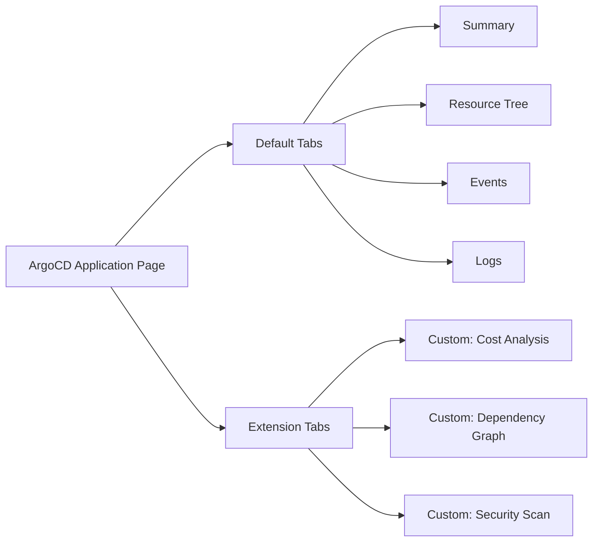

# How to Add Extra Application Info to ArgoCD UI

Author: [nawazdhandala](https://github.com/nawazdhandala)

Tags: ArgoCD, GitOps, Kubernetes, UI Customization, Operations

Description: Learn how to add custom information fields to ArgoCD application pages using annotations, extra info configuration, and labels to display team ownership, environment details, and more.

---

ArgoCD's application overview page shows standard information like sync status, health, source repository, and target cluster. But in larger organizations, you often need to display additional context like which team owns the application, the environment tier, the on-call schedule, or the cost center. ArgoCD supports adding extra information to the application UI through several mechanisms.

This guide covers how to add custom info fields, use annotations for metadata, and configure the ArgoCD UI to display the information your team needs.

## Method 1: Application Info Fields

ArgoCD Applications support an `info` field in the spec that lets you add arbitrary key-value pairs. These show up in the application details panel in the UI.

```yaml
apiVersion: argoproj.io/v1alpha1
kind: Application
metadata:
  name: payment-service
  namespace: argocd
spec:
  project: production
  source:
    repoURL: https://github.com/myorg/payment-service
    targetRevision: main
    path: k8s/production
  destination:
    server: https://kubernetes.default.svc
    namespace: production
  # Extra information displayed in the UI
  info:
    - name: "Owner"
      value: "payments-team"
    - name: "Slack Channel"
      value: "#payments-engineering"
    - name: "Tier"
      value: "Tier 1 - Business Critical"
    - name: "Cost Center"
      value: "CC-12345"
    - name: "Documentation"
      value: "https://wiki.example.com/payments"
```

The `info` field accepts a list of name-value pairs. These appear in the ArgoCD UI on the application summary page under a dedicated "Info" section.

### Adding Info Fields with the CLI

You can also add info fields using the ArgoCD CLI:

```bash
# Add an info field to an existing application
argocd app set payment-service \
  --info "Owner=payments-team" \
  --info "Tier=Tier 1 - Business Critical" \
  --info "Slack Channel=#payments-engineering"
```

### Info Fields with Links

If the value is a URL, ArgoCD renders it as a clickable link:

```yaml
info:
  - name: "Runbook"
    value: "https://wiki.example.com/runbooks/payment-service"
  - name: "Dashboard"
    value: "https://grafana.example.com/d/payment-service"
  - name: "On-Call"
    value: "https://pagerduty.example.com/schedules/payments"
```

## Method 2: Application Annotations

Annotations on the Application resource itself can also display additional context. While they do not show up in a dedicated section like `info` fields, they are visible in the application's YAML view and can be used by external tools.

```yaml
apiVersion: argoproj.io/v1alpha1
kind: Application
metadata:
  name: payment-service
  namespace: argocd
  annotations:
    # Team and ownership information
    team: "payments"
    team-email: "payments@example.com"
    escalation-policy: "https://pagerduty.example.com/escalation/payments"

    # Deployment information
    deployment-strategy: "canary"
    max-unavailable: "25%"

    # Compliance and governance
    data-classification: "PCI-DSS"
    last-security-review: "2026-01-15"

    # Notification subscriptions
    notifications.argoproj.io/subscribe.on-sync-succeeded.slack: "payments-deploys"
    notifications.argoproj.io/subscribe.on-sync-failed.slack: "payments-alerts"
spec:
  # ...
```

## Method 3: Labels for Filtering

Labels are particularly useful because they allow filtering applications in the ArgoCD UI:

```yaml
apiVersion: argoproj.io/v1alpha1
kind: Application
metadata:
  name: payment-service
  namespace: argocd
  labels:
    team: payments
    env: production
    tier: "1"
    region: us-east-1
    cost-center: cc-12345
spec:
  # ...
```

In the ArgoCD UI, you can filter the application list by these labels. For example, to see all Tier 1 production applications:

```
tier=1,env=production
```

Or all applications owned by the payments team:

```
team=payments
```

## Method 4: Extra Application Tabs via Extensions

ArgoCD supports UI extensions that can add entirely new tabs to the application page. This is useful for displaying complex information that does not fit in simple key-value pairs.

While building a full extension is beyond the scope of this guide, here is a basic overview of how it works:



## Practical Examples

### Microservices Application with Full Context

```yaml
apiVersion: argoproj.io/v1alpha1
kind: Application
metadata:
  name: user-service
  namespace: argocd
  labels:
    team: identity
    env: production
    tier: "1"
    language: golang
spec:
  project: identity-team
  source:
    repoURL: https://github.com/myorg/user-service
    targetRevision: main
    path: deploy/production
  destination:
    server: https://kubernetes.default.svc
    namespace: identity
  info:
    - name: "Owner"
      value: "Identity Team"
    - name: "Tech Lead"
      value: "Jane Smith"
    - name: "Slack"
      value: "#identity-engineering"
    - name: "On-Call"
      value: "https://pagerduty.example.com/schedules/identity"
    - name: "Runbook"
      value: "https://wiki.example.com/runbooks/user-service"
    - name: "Dashboard"
      value: "https://grafana.example.com/d/user-service-prod"
    - name: "SLA"
      value: "99.99% uptime"
    - name: "Language"
      value: "Go 1.22"
    - name: "Last Deploy"
      value: "Managed by CI/CD"
```

### Database Application with Compliance Info

```yaml
apiVersion: argoproj.io/v1alpha1
kind: Application
metadata:
  name: customer-database
  namespace: argocd
  labels:
    team: data-platform
    env: production
    data-classification: pci
    backup-required: "true"
spec:
  project: data-platform
  source:
    repoURL: https://github.com/myorg/database-configs
    targetRevision: main
    path: customer-db/production
  destination:
    server: https://kubernetes.default.svc
    namespace: databases
  info:
    - name: "Data Classification"
      value: "PCI-DSS Level 1"
    - name: "Backup Schedule"
      value: "Every 4 hours, 30-day retention"
    - name: "DR Site"
      value: "us-west-2 (hot standby)"
    - name: "Last Backup Verified"
      value: "2026-02-25"
    - name: "Compliance Contact"
      value: "security@example.com"
    - name: "Encryption"
      value: "AES-256 at rest, TLS 1.3 in transit"
```

## Using ApplicationSets to Standardize Info Fields

When you create applications with ApplicationSets, you can standardize the info fields across all generated applications:

```yaml
apiVersion: argoproj.io/v1alpha1
kind: ApplicationSet
metadata:
  name: microservices
  namespace: argocd
spec:
  generators:
    - git:
        repoURL: https://github.com/myorg/app-configs
        revision: main
        files:
          - path: "apps/*/config.json"
  template:
    metadata:
      name: "{{name}}"
      labels:
        team: "{{team}}"
        env: "{{env}}"
    spec:
      project: "{{project}}"
      source:
        repoURL: "{{repoURL}}"
        targetRevision: "{{targetRevision}}"
        path: "{{path}}"
      destination:
        server: "{{cluster}}"
        namespace: "{{namespace}}"
      info:
        - name: "Owner"
          value: "{{team}}"
        - name: "Slack"
          value: "#{{team}}-engineering"
        - name: "Runbook"
          value: "https://wiki.example.com/runbooks/{{name}}"
        - name: "Dashboard"
          value: "https://grafana.example.com/d/{{name}}"
```

The config.json files in the Git repo provide the values:

```json
{
  "name": "payment-service",
  "team": "payments",
  "env": "production",
  "project": "payments-project",
  "repoURL": "https://github.com/myorg/payment-service",
  "targetRevision": "main",
  "path": "deploy/production",
  "cluster": "https://kubernetes.default.svc",
  "namespace": "payments"
}
```

## Querying Application Info Programmatically

You can retrieve application info fields through the ArgoCD API or CLI:

```bash
# Get application info via CLI
argocd app get payment-service -o json | jq '.spec.info'

# Output:
# [
#   { "name": "Owner", "value": "payments-team" },
#   { "name": "Tier", "value": "Tier 1 - Business Critical" },
#   { "name": "Slack Channel", "value": "#payments-engineering" }
# ]

# Get applications by label
argocd app list -l team=payments -o name

# Get all Tier 1 applications
argocd app list -l tier=1 -o json | jq '.[].metadata.name'
```

## Best Practices

**Standardize info field names**: Agree on a consistent set of info field names across all applications. Common fields include Owner, Tier, Slack, Runbook, and Dashboard.

**Use labels for filtering, info for display**: Labels are optimized for filtering and selection. Info fields are optimized for human-readable display.

**Keep info fields up to date**: Stale information is worse than no information. Consider automating info field updates through your CI/CD pipeline.

**Link to dynamic sources**: Instead of hardcoding values that change, link to the source of truth (e.g., link to the PagerDuty schedule page instead of listing the current on-call person).

## Conclusion

Adding extra application info to ArgoCD transforms the application page from a basic deployment status display into a comprehensive operational dashboard. By combining info fields for display, labels for filtering, and annotations for tool integration, you create a single pane of glass that gives your team everything they need to manage applications effectively. For more ArgoCD UI customization, see our guide on [using status badges for ArgoCD applications](https://oneuptime.com/blog/post/2026-02-26-argocd-status-badges/view).
