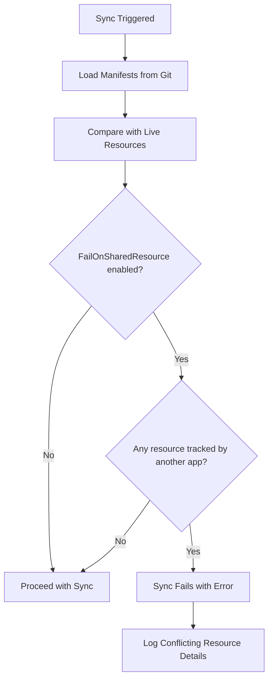

# How to Use FailOnSharedResource for Safety in ArgoCD

Author: [nawazdhandala](https://github.com/nawazdhandala)

Tags: ArgoCD, GitOps, Kubernetes, Safety, Sync Options

Description: Learn how to enable and use the FailOnSharedResource sync option in ArgoCD to prevent applications from accidentally overwriting resources owned by other applications.

---

When you have dozens or hundreds of ArgoCD applications running in a cluster, it is almost inevitable that two applications will eventually try to manage the same resource. Without safeguards, the last application to sync wins, silently overwriting whatever the other application set. The `FailOnSharedResource` sync option is ArgoCD's built-in protection against this. In this guide, we will cover how it works, when to use it, and how to handle the errors it produces.

## What FailOnSharedResource Does

The `FailOnSharedResource` sync option tells ArgoCD to check whether any resource in an application is already tracked by a different ArgoCD application. If a shared resource is detected, the sync operation fails immediately instead of proceeding. This prevents one application from silently overwriting another application's resources.

```yaml
apiVersion: argoproj.io/v1alpha1
kind: Application
metadata:
  name: my-app
  namespace: argocd
spec:
  project: default
  source:
    repoURL: https://github.com/org/repo
    targetRevision: main
    path: manifests/
  destination:
    server: https://kubernetes.default.svc
    namespace: production
  syncPolicy:
    syncOptions:
      - FailOnSharedResource=true
```

When this option is enabled and a conflict is detected, you will see an error like:

```
ComparisonError: shared resource found: apps/Deployment production/my-deployment is already
managed by application other-app
```

## How FailOnSharedResource Works Internally

During the sync process, ArgoCD compares the resources in your application's manifests against the tracking metadata (labels or annotations) on the live cluster resources. The check happens as follows:



The check examines the tracking label (`app.kubernetes.io/instance`) or annotation (`argocd.argoproj.io/tracking-id`) depending on your configured tracking method. If the value on the live resource does not match the current application's name and is not empty, ArgoCD considers it a shared resource.

## Enabling FailOnSharedResource Per Application

The most common approach is to enable this option on individual applications that you want to protect.

```yaml
# For a single application
apiVersion: argoproj.io/v1alpha1
kind: Application
metadata:
  name: payment-service
  namespace: argocd
spec:
  project: default
  source:
    repoURL: https://github.com/org/payment-service
    targetRevision: main
    path: k8s/
  destination:
    server: https://kubernetes.default.svc
    namespace: payments
  syncPolicy:
    automated:
      prune: true
      selfHeal: true
    syncOptions:
      - FailOnSharedResource=true
      - CreateNamespace=true
```

## Enabling FailOnSharedResource Globally

If you want all applications to fail on shared resources by default, you can set it as a default sync option in the ArgoCD configuration.

```yaml
# argocd-cm ConfigMap
apiVersion: v1
kind: ConfigMap
metadata:
  name: argocd-cm
  namespace: argocd
data:
  # Set default sync options for all applications
  resource.customizations.syncOptions.all: |
    - FailOnSharedResource=true
```

Alternatively, you can enforce this at the project level by requiring it in your team's deployment standards. While ArgoCD does not have a native project-level sync option enforcement, you can use admission controllers or policy engines to validate this:

```yaml
# Kyverno policy to enforce FailOnSharedResource
apiVersion: kyverno.io/v1
kind: ClusterPolicy
metadata:
  name: require-failonsharedresource
spec:
  validationFailureAction: enforce
  rules:
    - name: check-failonsharedresource
      match:
        resources:
          kinds:
            - argoproj.io/v1alpha1/Application
      validate:
        message: "All ArgoCD applications must have FailOnSharedResource=true"
        pattern:
          spec:
            syncPolicy:
              syncOptions:
                - "FailOnSharedResource=true"
```

## Handling FailOnSharedResource Errors

When the sync fails due to a shared resource, you need to determine which application legitimately owns the resource and fix the conflict.

### Step 1: Identify the Conflicting Resource

```bash
# Check the sync result for details
argocd app get my-app --output json | jq '.status.conditions[] | select(.type=="SyncError")'

# Look at the application's operation state for detailed error messages
argocd app get my-app --show-operation
```

### Step 2: Find the Owning Application

```bash
# Check which application owns the conflicting resource
kubectl get deployment my-deployment -n production \
  -o jsonpath='{.metadata.labels.app\.kubernetes\.io/instance}'

# For annotation-based tracking
kubectl get deployment my-deployment -n production \
  -o jsonpath='{.metadata.annotations.argocd\.argoproj\.io/tracking-id}'
```

### Step 3: Resolve the Conflict

You have three options:

**Option A: Remove the resource from one application**

```bash
# Remove the conflicting resource definition from Git
# This is the cleanest approach
git rm manifests/shared-deployment.yaml
git commit -m "Remove shared resource - managed by other-app"
git push
```

**Option B: Transfer ownership**

```bash
# Remove from old app first (without pruning)
# Edit old app's Git source to remove the resource, then sync
argocd app sync old-app --prune=false

# Wait for reconciliation, then sync the new app
argocd app sync my-app
```

**Option C: Mark as intentionally shared**

If the resource truly needs to be in both applications (rare), disable FailOnSharedResource for that specific sync:

```bash
# One-time sync with the option disabled
argocd app sync my-app --sync-option FailOnSharedResource=false
```

## Using FailOnSharedResource with ApplicationSets

When using ApplicationSets, you can include FailOnSharedResource in the template:

```yaml
apiVersion: argoproj.io/v1alpha1
kind: ApplicationSet
metadata:
  name: microservices
  namespace: argocd
spec:
  generators:
    - git:
        repoURL: https://github.com/org/services
        revision: main
        directories:
          - path: services/*
  template:
    metadata:
      name: "{{path.basename}}"
    spec:
      project: default
      source:
        repoURL: https://github.com/org/services
        targetRevision: main
        path: "{{path}}"
      destination:
        server: https://kubernetes.default.svc
        namespace: "{{path.basename}}"
      syncPolicy:
        automated:
          prune: true
          selfHeal: true
        syncOptions:
          - FailOnSharedResource=true
          - CreateNamespace=true
```

This ensures every application generated by the ApplicationSet is protected from resource conflicts.

## Combining FailOnSharedResource with Other Sync Options

FailOnSharedResource works well alongside other protective sync options:

```yaml
syncPolicy:
  syncOptions:
    - FailOnSharedResource=true     # Prevent resource conflicts
    - Validate=true                  # Validate manifests before applying
    - PrunePropagationPolicy=foreground  # Clean deletion
    - PruneLast=true                 # Prune only after successful sync
    - RespectIgnoreDifferences=true  # Honor ignore rules during sync
```

## Real-World Scenario: Preventing Namespace Conflicts

One of the most common shared resource scenarios involves Kubernetes Namespaces. Multiple applications often include a Namespace manifest for the namespace they deploy into.

```yaml
# This is in BOTH app-a and app-b manifests
apiVersion: v1
kind: Namespace
metadata:
  name: production
```

With FailOnSharedResource enabled, the second application to sync will fail. The fix is straightforward:

```yaml
# Remove the Namespace from individual apps and use CreateNamespace instead
apiVersion: argoproj.io/v1alpha1
kind: Application
metadata:
  name: app-a
spec:
  destination:
    namespace: production
  syncPolicy:
    syncOptions:
      - CreateNamespace=true         # ArgoCD creates the namespace if needed
      - FailOnSharedResource=true    # Still protected from other conflicts
```

## When NOT to Use FailOnSharedResource

There are some cases where this option causes more trouble than it solves:

1. **During migration** - When you are actively moving resources between applications, temporarily disable it
2. **App-of-Apps parent** - The parent application might intentionally reference resources managed by child apps
3. **Umbrella charts** - Helm umbrella charts can create resources that child charts also define

```bash
# Temporarily disable for a migration sync
argocd app sync my-app \
  --sync-option FailOnSharedResource=false \
  --prune=false
```

## Monitoring FailOnSharedResource Failures

Set up alerts so your team knows when sync failures are caused by shared resources:

```yaml
# Prometheus alert for FailOnSharedResource sync failures
groups:
  - name: argocd-shared-resource-alerts
    rules:
      - alert: ArgocdSharedResourceConflict
        expr: |
          increase(argocd_app_sync_total{phase="Error"}[5m]) > 0
          and on(name)
          argocd_app_info{sync_status="OutOfSync"}
        for: 5m
        labels:
          severity: warning
        annotations:
          summary: "ArgoCD application {{ $labels.name }} may have a shared resource conflict"
          description: "Check sync errors for shared resource warnings"
```

For comprehensive monitoring of sync failures and resource conflicts across your ArgoCD environment, [OneUptime](https://oneuptime.com) provides alerting and dashboards that help you catch these issues before they impact your deployments.

## Key Takeaways

- `FailOnSharedResource=true` is a safety net that prevents silent resource overwrites
- Enable it on all production applications as a best practice
- Use the `CreateNamespace` sync option instead of including Namespace manifests
- When conflicts occur, remove the duplicate resource from one application
- Combine it with other protective sync options for defense in depth
- Temporarily disable during migrations but re-enable immediately after
- Monitor sync failures to catch shared resource issues early
