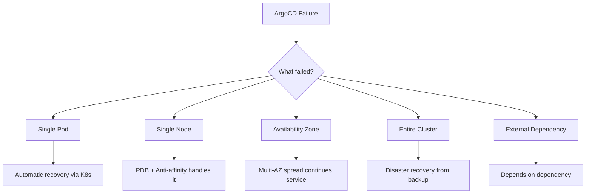

# How to Handle ArgoCD Failover Scenarios

Author: [nawazdhandala](https://github.com/nawazdhandala)

Tags: ArgoCD, GitOps, Kubernetes, Disaster Recovery, Failover

Description: Learn how to prepare for and handle ArgoCD failover scenarios including component failures, node failures, zone outages, and complete cluster loss, with runbooks for each scenario.

---

ArgoCD failover planning means understanding what happens when each component fails and having tested procedures for recovery. Different failure scenarios require different responses. A single pod restart is routine. Losing the entire ArgoCD cluster is a disaster that requires a well-practiced recovery plan. This guide covers the most common failure scenarios and provides concrete runbooks for each.

## Failure Scenario Matrix



## Scenario 1: Single Pod Failure

**Impact**: Minimal if you have multiple replicas.

**What happens**:
- API Server pod dies: Load balancer routes to remaining pods. Users may see a brief interruption.
- Controller pod dies: If it was the leader, another replica takes over via leader election (10-30 seconds). If it was a standby, no impact.
- Repo Server pod dies: Other repo server instances handle requests. Slightly slower manifest generation until the pod restarts.
- Redis pod dies: If it was the master, Sentinel promotes a replica (10-15 seconds). Brief cache miss period.

**Recovery**: Automatic. Kubernetes restarts the pod.

```bash
# Verify automatic recovery
kubectl get pods -n argocd -w

# Check that the new pod is ready
kubectl get pods -n argocd -l app.kubernetes.io/name=argocd-server

# Verify ArgoCD functionality
argocd app list
```

**Preparation**: Ensure replicas > 1 for all components. Configure PDBs.

## Scenario 2: Controller Leader Failure

**Impact**: 10 to 30 seconds of no reconciliation.

**What happens**: The leader controller fails. The remaining controller(s) detect the lease expiry and one acquires the lease to become the new leader. During the gap, no applications are reconciled, and no syncs are processed.

```bash
# Monitor leader election
kubectl get lease argocd-application-controller -n argocd -w

# Check which controller is now leader
kubectl get lease argocd-application-controller -n argocd \
  -o jsonpath='{.spec.holderIdentity}'
```

**Recovery**: Automatic. Leader election handles failover.

**Runbook if leader election is stuck**:

```bash
# Step 1: Check if any controller is running
kubectl get pods -n argocd -l app.kubernetes.io/name=argocd-application-controller

# Step 2: If pods are running but no leader, delete the stale lease
kubectl delete lease argocd-application-controller -n argocd

# Step 3: A controller will acquire the new lease within seconds
kubectl get lease argocd-application-controller -n argocd -w

# Step 4: Verify reconciliation resumes
kubectl logs statefulset/argocd-application-controller -n argocd --tail=20
```

## Scenario 3: Redis Failure

**Impact**: Cache loss. Temporary performance degradation.

**What happens without Redis HA**: All ArgoCD components lose their cache. Every request hits Git repositories and Kubernetes APIs directly. Performance drops significantly. After Redis restarts, the cache rebuilds gradually.

**What happens with Redis HA**: Sentinel detects the master failure and promotes a replica. HAProxy redirects to the new master. ArgoCD experiences 1-2 seconds of cache misses during failover.

**Runbook for complete Redis failure (no HA)**:

```bash
# Step 1: Check Redis status
kubectl get pods -n argocd -l app.kubernetes.io/name=argocd-redis

# Step 2: If Redis is CrashLoopBackOff, check logs
kubectl logs -n argocd -l app.kubernetes.io/name=argocd-redis --previous

# Step 3: Common fix - delete the pod to get a fresh start
kubectl delete pod -n argocd -l app.kubernetes.io/name=argocd-redis

# Step 4: If persistent data is corrupted, delete the PVC
kubectl delete pvc redis-data-argocd-redis-0 -n argocd
kubectl delete pod -n argocd -l app.kubernetes.io/name=argocd-redis

# Step 5: ArgoCD will rebuild cache automatically
# Monitor recovery
kubectl logs deployment/argocd-application-controller -n argocd --tail=10 -f
```

**Runbook for Redis HA failover verification**:

```bash
# Check Sentinel status
kubectl exec -n argocd argocd-redis-ha-server-0 -c sentinel -- \
  redis-cli -p 26379 sentinel master mymaster

# Verify the new master is accepting writes
MASTER_IP=$(kubectl exec -n argocd argocd-redis-ha-server-0 -c sentinel -- \
  redis-cli -p 26379 sentinel get-master-addr-by-name mymaster | head -1)
echo "Current master: $MASTER_IP"

# Check replication status
kubectl exec -n argocd argocd-redis-ha-server-0 -c redis -- \
  redis-cli info replication
```

## Scenario 4: Node Failure

**Impact**: Pods on the failed node are rescheduled. With proper anti-affinity and PDBs, service continues.

**What happens**: Kubernetes detects the node failure (takes up to 5 minutes with default settings). Pods are marked for rescheduling. New pods start on healthy nodes.

```bash
# Check which pods were affected
kubectl get pods -n argocd -o wide | grep -v Running

# Check node status
kubectl get nodes

# Speed up rescheduling by deleting pods on the failed node
kubectl get pods -n argocd --field-selector spec.nodeName=failed-node-name -o name | \
  xargs kubectl delete -n argocd
```

**Preparation**: Use pod anti-affinity to avoid all replicas on one node. Use PDBs to prevent drain operations from killing too many pods.

## Scenario 5: Zone Outage

**Impact**: All pods in the affected zone become unavailable. With multi-AZ deployment, remaining zones handle traffic.

**Runbook**:

```bash
# Step 1: Identify affected pods
ZONE="us-east-1a"
AFFECTED_NODES=$(kubectl get nodes -l topology.kubernetes.io/zone=$ZONE -o name)
echo "Affected nodes: $AFFECTED_NODES"

kubectl get pods -n argocd -o wide | grep -f <(echo "$AFFECTED_NODES" | sed 's|node/||')

# Step 2: Verify remaining capacity
kubectl get pods -n argocd -o wide | grep Running

# Step 3: If not enough capacity, temporarily relax PDBs
kubectl patch pdb argocd-server -n argocd \
  --type merge -p '{"spec": {"minAvailable": 1}}'

# Step 4: Scale up in healthy zones if needed
kubectl scale deployment argocd-server -n argocd --replicas=5

# Step 5: Verify ArgoCD is functional
argocd cluster list
argocd app list
```

## Scenario 6: Complete ArgoCD Cluster Loss

**Impact**: Total loss of ArgoCD. No deployments, no monitoring, no self-healing.

This is the worst case and requires a recovery plan.

**Runbook**:

```bash
# Step 1: Deploy ArgoCD on a new cluster (or the recovered cluster)
kubectl create namespace argocd
kubectl apply -n argocd -f https://raw.githubusercontent.com/argoproj/argo-cd/stable/manifests/ha/install.yaml

# Step 2: Restore from backup (if available)
# Assuming you have a backup created with argocd admin export
argocd admin import - < argocd-backup.yaml

# Step 3: If no backup, re-add clusters
argocd cluster add production-context --name production
argocd cluster add staging-context --name staging

# Step 4: Re-add repositories
argocd repo add https://github.com/myorg/gitops-config \
  --username git --password "$GIT_TOKEN"

# Step 5: Re-create applications
# If using app-of-apps pattern, just create the root application
argocd app create root-app \
  --repo https://github.com/myorg/gitops-config \
  --path argocd-apps \
  --dest-server https://kubernetes.default.svc \
  --dest-namespace argocd

# Step 6: Sync all applications
argocd app sync root-app
```

## Scenario 7: Git Repository Unavailable

**Impact**: No new syncs possible. Existing deployments continue running. Applications show "ComparisonError".

```bash
# Check repo server logs
kubectl logs deployment/argocd-repo-server -n argocd | grep -i "error\|fail"

# Verify by testing Git connectivity from argocd namespace
kubectl run git-test --rm -it --namespace=argocd \
  --image=alpine/git:latest --restart=Never -- \
  git ls-remote https://github.com/myorg/gitops-config

# If using a Git mirror, switch to it
# Update the repository URL in ArgoCD
argocd repo add https://git-mirror.internal/myorg/gitops-config \
  --username git --password "$GIT_TOKEN"
```

## Failover Testing Schedule

Test each scenario regularly:

| Scenario | Test Frequency | Test Method |
|---|---|---|
| Single pod failure | Monthly | `kubectl delete pod` |
| Controller leader failover | Monthly | Delete the leader pod |
| Redis failover | Quarterly | Delete Redis master pod |
| Node failure | Quarterly | Cordon and drain a node |
| Zone outage | Bi-annually | Cordon all nodes in a zone |
| Full cluster recovery | Annually | Restore from backup to a new cluster |

## Automation for Failover Testing

Create a CronJob that periodically tests failover:

```yaml
apiVersion: batch/v1
kind: CronJob
metadata:
  name: argocd-failover-test
  namespace: argocd
spec:
  schedule: "0 3 1 * *"  # Monthly at 3 AM on the 1st
  jobTemplate:
    spec:
      template:
        spec:
          serviceAccountName: argocd-failover-tester
          containers:
            - name: test
              image: bitnami/kubectl:latest
              command:
                - /bin/bash
                - -c
                - |
                  echo "Starting ArgoCD failover test..."

                  # Delete one API server pod
                  POD=$(kubectl get pods -n argocd \
                    -l app.kubernetes.io/name=argocd-server \
                    -o jsonpath='{.items[0].metadata.name}')
                  kubectl delete pod "$POD" -n argocd

                  # Wait for recovery
                  sleep 30

                  # Verify all pods are running
                  RUNNING=$(kubectl get pods -n argocd \
                    -l app.kubernetes.io/name=argocd-server \
                    --field-selector=status.phase=Running \
                    -o name | wc -l)

                  if [ "$RUNNING" -ge 2 ]; then
                    echo "PASS: API server failover successful"
                  else
                    echo "FAIL: API server did not recover"
                    exit 1
                  fi
          restartPolicy: OnFailure
```

Failover planning is not about preventing failures - it is about ensuring your system recovers quickly and predictably when they happen. Test your failover procedures regularly and document the runbooks for your on-call team. For continuous health monitoring that detects issues before they become failures, see our guide on [monitoring ArgoCD component health](https://oneuptime.com/blog/post/2026-02-26-argocd-monitor-component-health/view).
