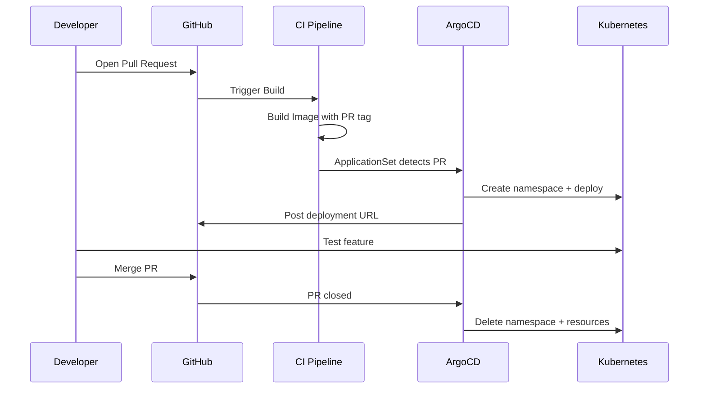

# How to Implement Feature Branch Deployments with ArgoCD

Author: [nawazdhandala](https://github.com/nawazdhandala)

Tags: ArgoCD, GitOps, Kubernetes, Feature Branches, CI/CD

Description: Learn how to create isolated Kubernetes environments for each feature branch using ArgoCD ApplicationSets with the pull request generator for dynamic preview deployments.

---

Feature branch deployments give developers isolated Kubernetes environments where they can test their changes before merging to main. With ArgoCD, you can automatically create and destroy these environments using ApplicationSets and the Pull Request generator. Every feature branch gets its own namespace, its own deployment, and its own URL.

## How Feature Branch Deployments Work

When a developer creates a feature branch and opens a pull request, ArgoCD automatically:

1. Creates a new Kubernetes namespace for the branch
2. Deploys the application with the branch-specific image
3. Creates an ingress so the deployment is accessible
4. Destroys everything when the branch is merged or the PR is closed



## Setting Up the ApplicationSet

The Pull Request generator in ArgoCD ApplicationSets watches for open pull requests and creates an Application for each one.

### GitHub Pull Request Generator

```yaml
# feature-branch-appset.yaml
apiVersion: argoproj.io/v1alpha1
kind: ApplicationSet
metadata:
  name: myapp-feature-branches
  namespace: argocd
spec:
  generators:
    - pullRequest:
        github:
          owner: my-org
          repo: my-app
          tokenRef:
            secretName: github-token
            key: token
          labels:
            - preview  # Only create envs for PRs with this label
        requeueAfterSeconds: 60
  template:
    metadata:
      name: 'myapp-pr-{{number}}'
      namespace: argocd
    spec:
      project: feature-branches
      source:
        repoURL: https://github.com/my-org/k8s-manifests.git
        targetRevision: main
        path: overlays/preview
        kustomize:
          namePrefix: 'pr-{{number}}-'
          nameSuffix: ''
          images:
            - 'myregistry.com/myapp=myregistry.com/myapp:pr-{{number}}-{{head_sha_short}}'
          commonLabels:
            app.kubernetes.io/instance: 'pr-{{number}}'
            preview-branch: '{{branch}}'
      destination:
        server: https://kubernetes.default.svc
        namespace: 'preview-{{number}}'
      syncPolicy:
        automated:
          prune: true
          selfHeal: true
        syncOptions:
          - CreateNamespace=true
```

### Create the GitHub Token Secret

```bash
kubectl create secret generic github-token \
  -n argocd \
  --from-literal=token=ghp_your_github_token
```

## Manifest Structure for Feature Branches

Create a preview overlay that can be parameterized:

```yaml
# overlays/preview/kustomization.yaml
apiVersion: kustomize.config.k8s.io/v1beta1
kind: Kustomization
resources:
  - ../../base
  - ingress.yaml
patches:
  - target:
      kind: Deployment
      name: myapp
    patch: |
      - op: replace
        path: /spec/replicas
        value: 1
      - op: add
        path: /spec/template/spec/containers/0/resources
        value:
          requests:
            cpu: 100m
            memory: 128Mi
          limits:
            cpu: 250m
            memory: 256Mi
```

### Preview Ingress

```yaml
# overlays/preview/ingress.yaml
apiVersion: networking.k8s.io/v1
kind: Ingress
metadata:
  name: myapp
  annotations:
    cert-manager.io/cluster-issuer: letsencrypt-prod
spec:
  ingressClassName: nginx
  rules:
    - host: myapp-preview.example.com
      http:
        paths:
          - path: /
            pathType: Prefix
            backend:
              service:
                name: myapp
                port:
                  number: 80
  tls:
    - hosts:
        - myapp-preview.example.com
      secretName: myapp-preview-tls
```

For branch-specific hostnames, use a Kustomize patch in the ApplicationSet:

```yaml
# In the ApplicationSet template
spec:
  source:
    kustomize:
      patches:
        - target:
            kind: Ingress
            name: myapp
          patch: |
            - op: replace
              path: /spec/rules/0/host
              value: pr-{{number}}.preview.example.com
            - op: replace
              path: /spec/tls/0/hosts/0
              value: pr-{{number}}.preview.example.com
```

## CI Pipeline for Feature Branches

Your CI pipeline needs to build a branch-specific image when a PR is opened or updated.

```yaml
# .github/workflows/feature-branch.yml
name: Feature Branch Build
on:
  pull_request:
    types: [opened, synchronize, reopened]

jobs:
  build:
    runs-on: ubuntu-latest
    steps:
      - uses: actions/checkout@v4

      - name: Build feature branch image
        run: |
          PR_NUMBER=${{ github.event.pull_request.number }}
          SHORT_SHA="${GITHUB_SHA::7}"
          IMAGE_TAG="pr-${PR_NUMBER}-${SHORT_SHA}"

          docker build -t myregistry.com/myapp:$IMAGE_TAG .
          docker push myregistry.com/myapp:$IMAGE_TAG

      - name: Comment deployment URL
        uses: actions/github-script@v7
        with:
          script: |
            const prNumber = context.payload.pull_request.number;
            const url = `https://pr-${prNumber}.preview.example.com`;
            const body = `Preview environment deployed: ${url}\n\nThis environment will be automatically destroyed when the PR is closed.`;

            // Check if we already posted a comment
            const comments = await github.rest.issues.listComments({
              owner: context.repo.owner,
              repo: context.repo.repo,
              issue_number: prNumber,
            });
            const existing = comments.data.find(c =>
              c.body.includes('Preview environment deployed')
            );

            if (existing) {
              await github.rest.issues.updateComment({
                owner: context.repo.owner,
                repo: context.repo.repo,
                comment_id: existing.id,
                body: body,
              });
            } else {
              await github.rest.issues.createComment({
                owner: context.repo.owner,
                repo: context.repo.repo,
                issue_number: prNumber,
                body: body,
              });
            }
```

## ArgoCD Project for Feature Branches

Create a dedicated ArgoCD project with limited permissions for feature branches:

```yaml
# argocd-project.yaml
apiVersion: argoproj.io/v1alpha1
kind: AppProject
metadata:
  name: feature-branches
  namespace: argocd
spec:
  description: "Feature branch preview environments"
  sourceRepos:
    - https://github.com/my-org/k8s-manifests.git
  destinations:
    # Only allow preview namespaces
    - server: https://kubernetes.default.svc
      namespace: 'preview-*'
  # Limit what resources can be created
  clusterResourceWhitelist:
    - group: ''
      kind: Namespace
  namespaceResourceWhitelist:
    - group: '*'
      kind: '*'
  # Resource quotas for preview environments
  orphanedResources:
    warn: true
```

## Resource Limits for Feature Branches

Prevent feature branches from consuming too many cluster resources:

```yaml
# preview-namespace-quota.yaml
apiVersion: v1
kind: ResourceQuota
metadata:
  name: preview-quota
spec:
  hard:
    requests.cpu: "500m"
    requests.memory: "512Mi"
    limits.cpu: "1"
    limits.memory: "1Gi"
    pods: "10"
---
apiVersion: v1
kind: LimitRange
metadata:
  name: preview-limits
spec:
  limits:
    - default:
        cpu: 250m
        memory: 256Mi
      defaultRequest:
        cpu: 100m
        memory: 128Mi
      type: Container
```

Include these in your preview overlay:

```yaml
# overlays/preview/kustomization.yaml
resources:
  - ../../base
  - ingress.yaml
  - resource-quota.yaml
  - limit-range.yaml
```

## Cleanup on PR Close

ArgoCD ApplicationSets handle cleanup automatically. When a PR is closed or merged, the Pull Request generator removes it from the list, and ArgoCD deletes the corresponding Application. With `prune: true` in the sync policy, all Kubernetes resources are deleted.

To also delete the namespace, ensure the Application has cascade deletion configured:

```yaml
# In the ApplicationSet template
template:
  metadata:
    name: 'myapp-pr-{{number}}'
    namespace: argocd
    finalizers:
      - resources-finalizer.argocd.argoproj.io
```

## Monitoring Feature Branch Environments

Track the health of your feature branch deployments with [ArgoCD health checks](https://oneuptime.com/blog/post/2026-01-25-health-checks-argocd/view) and set up [notifications](https://oneuptime.com/blog/post/2026-01-25-notifications-argocd/view) to alert when preview environments fail to deploy.

## Best Practices

1. **Use labels to gate preview creation** - Not every PR needs a preview environment. Use a label like `preview` to opt in.

2. **Set strict resource quotas** - Feature branch environments can multiply quickly. Limit CPU and memory per namespace.

3. **Auto-expire environments** - Add a TTL or cleanup job that removes preview environments older than a configurable threshold.

4. **Use small replicas** - Preview environments only need one replica with minimal resources.

5. **Share databases wisely** - Consider using separate database schemas or ephemeral databases for each preview to avoid data conflicts.

Feature branch deployments with ArgoCD ApplicationSets bring the power of isolated testing environments to every developer on your team without manual infrastructure management.
