# How to Manage Feature Flag Configuration with GitOps

Author: [nawazdhandala](https://github.com/nawazdhandala)

Tags: ArgoCD, GitOps, Kubernetes, Feature Flags, Configuration Management

Description: Learn how to manage feature flag configuration through GitOps workflows using ArgoCD including flag definitions, targeting rules, and environment promotion.

---

Feature flags are typically managed through a UI - someone logs into the feature flag dashboard and flips a toggle. This works for simple cases, but as your flag count grows and you need consistency across environments, a GitOps approach to flag configuration becomes essential. ArgoCD can manage your feature flag definitions alongside your application code.

This guide covers managing feature flag configuration as code through ArgoCD.

## The Problem with UI-Only Flag Management

When flags are only managed through a UI:

- No audit trail of who changed what and when (beyond basic logging)
- No review process before a flag change goes live
- No easy way to replicate flag state across environments
- No rollback mechanism other than manual reversal
- Flag configuration can drift between staging and production

GitOps solves all of these problems.

## Feature Flags as Kubernetes Resources

The OpenFeature standard defines Kubernetes custom resources for feature flags. These are perfect for GitOps management:

```yaml
# flags/production/checkout-flags.yaml
apiVersion: core.openfeature.dev/v1beta1
kind: FeatureFlag
metadata:
  name: checkout-flags
  namespace: production
spec:
  flagSpec:
    flags:
      new-checkout-flow:
        state: ENABLED
        variants:
          "on": true
          "off": false
        defaultVariant: "off"
        targeting:
          # Enable for 10% of users
          if:
            - in:
                - var:
                    - $flagd.timestamp
                    - "%"
                    - 100
                - [0, 1, 2, 3, 4, 5, 6, 7, 8, 9]
            - "on"
            - "off"

      express-checkout:
        state: ENABLED
        variants:
          "on": true
          "off": false
        defaultVariant: "off"
        targeting:
          # Enable for premium users only
          if:
            - "=="
              - var: subscription-tier
              - "premium"
            - "on"
            - "off"

      one-click-reorder:
        state: DISABLED
        variants:
          "on": true
          "off": false
        defaultVariant: "off"
```

## ArgoCD Application for Flag Configuration

```yaml
# feature-flags-app.yaml
apiVersion: argoproj.io/v1alpha1
kind: Application
metadata:
  name: feature-flags
  namespace: argocd
spec:
  project: applications
  source:
    repoURL: https://github.com/myorg/feature-flags.git
    path: flags/production
    targetRevision: main
  destination:
    server: https://kubernetes.default.svc
    namespace: production
  syncPolicy:
    automated:
      selfHeal: true
      prune: true
```

## Flag Configuration Structure

Organize flags by domain or service:

```
flags/
  base/
    checkout-flags.yaml
    user-flags.yaml
    payment-flags.yaml
    search-flags.yaml
  overlays/
    dev/
      kustomization.yaml
      patches/
        enable-all.yaml
    staging/
      kustomization.yaml
      patches/
        staging-overrides.yaml
    production/
      kustomization.yaml
      patches/
        production-targeting.yaml
```

## Environment-Specific Flag Overrides

In development, you might want all flags enabled. In production, you want careful targeting:

```yaml
# flags/base/checkout-flags.yaml
apiVersion: core.openfeature.dev/v1beta1
kind: FeatureFlag
metadata:
  name: checkout-flags
spec:
  flagSpec:
    flags:
      new-checkout-flow:
        state: ENABLED
        variants:
          "on": true
          "off": false
        defaultVariant: "off"
```

```yaml
# flags/overlays/dev/patches/enable-all.yaml
apiVersion: core.openfeature.dev/v1beta1
kind: FeatureFlag
metadata:
  name: checkout-flags
spec:
  flagSpec:
    flags:
      new-checkout-flow:
        state: ENABLED
        defaultVariant: "on"  # Always on in dev
```

```yaml
# flags/overlays/staging/patches/staging-overrides.yaml
apiVersion: core.openfeature.dev/v1beta1
kind: FeatureFlag
metadata:
  name: checkout-flags
spec:
  flagSpec:
    flags:
      new-checkout-flow:
        state: ENABLED
        defaultVariant: "off"
        targeting:
          # 50% rollout in staging
          if:
            - in:
                - var:
                    - $flagd.timestamp
                    - "%"
                    - 100
                - [0, 1, 2, 3, 4, 5, 6, 7, 8, 9, 10, 11, 12, 13, 14, 15, 16, 17, 18, 19, 20, 21, 22, 23, 24, 25, 26, 27, 28, 29, 30, 31, 32, 33, 34, 35, 36, 37, 38, 39, 40, 41, 42, 43, 44, 45, 46, 47, 48, 49]
            - "on"
            - "off"
```

The Kustomize setup:

```yaml
# flags/overlays/dev/kustomization.yaml
apiVersion: kustomize.config.k8s.io/v1beta1
kind: Kustomization
resources:
  - ../../base
patches:
  - path: patches/enable-all.yaml
```

## Flag Promotion Workflow

Promote flag configuration through environments using Git:

```mermaid
graph LR
    A[Developer Creates Flag PR] --> B[Review & Merge to Dev]
    B --> C[ArgoCD Syncs to Dev Cluster]
    C --> D[Test in Dev]
    D --> E[PR to Promote to Staging]
    E --> F[ArgoCD Syncs to Staging]
    F --> G[Test in Staging]
    G --> H[PR to Promote to Production]
    H --> I[ArgoCD Syncs to Production]
    I --> J[Gradual Rollout]
```



## ConfigMap-Based Flags

If you are not using OpenFeature CRDs, you can manage flags through ConfigMaps that your application reads:

```yaml
# flags/production/app-flags-cm.yaml
apiVersion: v1
kind: ConfigMap
metadata:
  name: feature-flags
  namespace: production
data:
  flags.json: |
    {
      "flags": {
        "new-checkout-flow": {
          "enabled": false,
          "rollout_percentage": 10,
          "targeting": {
            "include_users": ["beta-group-a"],
            "exclude_users": []
          }
        },
        "dark-mode": {
          "enabled": true,
          "rollout_percentage": 100
        },
        "ai-recommendations": {
          "enabled": false,
          "rollout_percentage": 0,
          "targeting": {
            "include_users": ["internal-testers"]
          }
        }
      }
    }
```

Your application watches this ConfigMap and reacts to changes:

```yaml
# Application deployment referencing the flag ConfigMap
apiVersion: apps/v1
kind: Deployment
metadata:
  name: web-app
  namespace: production
spec:
  template:
    metadata:
      annotations:
        # Trigger restart when flags change
        checksum/flags: "{{ include (print $.Template.BasePath '/flags-cm.yaml') . | sha256sum }}"
    spec:
      containers:
        - name: web-app
          image: ghcr.io/myorg/web-app:v3.0.0
          volumeMounts:
            - name: flags
              mountPath: /etc/flags
              readOnly: true
      volumes:
        - name: flags
          configMap:
            name: feature-flags
```

## Flagd Sidecar Injection

With the OpenFeature operator, inject a flagd sidecar that serves flags to your application:

```yaml
# Application with flagd sidecar
apiVersion: apps/v1
kind: Deployment
metadata:
  name: web-app
  namespace: production
  annotations:
    openfeature.dev/enabled: "true"
    openfeature.dev/featureflagsource: "flagd-source"
spec:
  template:
    spec:
      containers:
        - name: web-app
          image: ghcr.io/myorg/web-app:v3.0.0
          env:
            - name: FLAGD_HOST
              value: localhost
            - name: FLAGD_PORT
              value: "8013"
```

The operator automatically injects the flagd container:

```yaml
# openfeature/flagd-source.yaml
apiVersion: core.openfeature.dev/v1beta1
kind: FeatureFlagSource
metadata:
  name: flagd-source
  namespace: production
spec:
  sources:
    - source: checkout-flags
      provider: kubernetes
    - source: user-flags
      provider: kubernetes
  port: 8013
```

## Pull Request Workflow for Flag Changes

A typical flag change PR looks like this:

```diff
# flags/production/checkout-flags.yaml
 apiVersion: core.openfeature.dev/v1beta1
 kind: FeatureFlag
 metadata:
   name: checkout-flags
 spec:
   flagSpec:
     flags:
       new-checkout-flow:
         state: ENABLED
-        defaultVariant: "off"
+        defaultVariant: "on"
         targeting:
-          # 10% rollout
-          if:
-            - in:
-                - var: user-id-hash
-                - [0, 1, 2, 3, 4, 5, 6, 7, 8, 9]
-            - "on"
-            - "off"
+          # 100% rollout - flag fully enabled
+          {}
```

This PR clearly shows what changed, who approved it, and when it was merged.

## Emergency Flag Kill Switch

For quick rollbacks, create a standardized emergency process:

```bash
# Emergency: disable a flag immediately
git checkout -b emergency/disable-new-checkout
# Edit the flag file to disable
git commit -m "EMERGENCY: Disable new-checkout-flow due to payment errors"
git push origin emergency/disable-new-checkout

# Fast-track merge (skip normal review process if needed)
gh pr create --title "EMERGENCY: Disable new-checkout-flow" --body "Payment error rate spiked"
gh pr merge --auto --squash
```

ArgoCD picks up the change within its sync interval (default 3 minutes, or immediate with a webhook).

## Summary

Managing feature flag configuration through GitOps with ArgoCD gives you the control and auditability that UI-only management lacks. Every flag change is a Git commit with an author and reviewer. Environment promotion follows your standard PR workflow. ArgoCD keeps flags in sync across environments and self-heals unauthorized changes. This approach works whether you use OpenFeature CRDs, ConfigMaps, or any file-based flag configuration.
