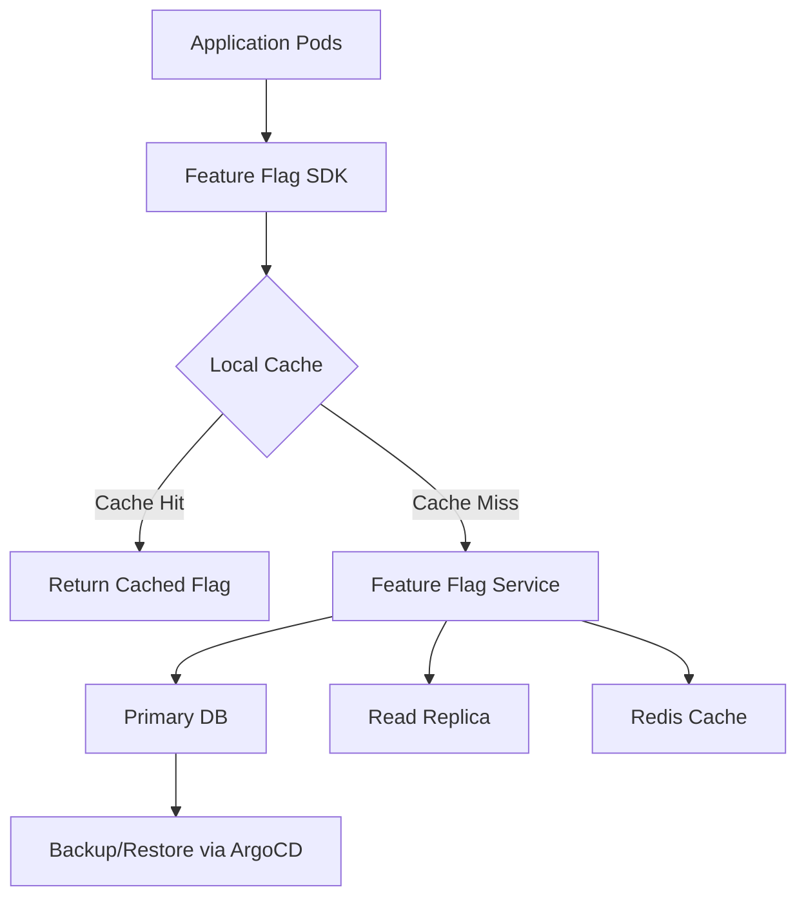

# How to Deploy Feature Flag Services with ArgoCD

Author: [nawazdhandala](https://github.com/nawazdhandala)

Tags: ArgoCD, GitOps, Kubernetes, Feature Flags, Deployment

Description: Learn how to deploy and manage feature flag services like Flagsmith, Unleash, and OpenFeature on Kubernetes using ArgoCD GitOps workflows.

---

Feature flags let you separate code deployment from feature release. You deploy code with flags that control which features are active, then toggle those flags without redeploying. Running your own feature flag service on Kubernetes gives you full control, and managing it through ArgoCD means the service itself follows GitOps principles.

This guide covers deploying popular open-source feature flag platforms on Kubernetes with ArgoCD.

## Why Self-Hosted Feature Flags

Cloud-hosted feature flag services like LaunchDarkly and Split work well, but self-hosted options give you:

- No per-seat or per-flag pricing
- Data stays in your infrastructure
- Lower latency (same cluster as your services)
- Full control over availability and backups

The tradeoff is that you manage the infrastructure. ArgoCD makes that manageable.

## Deploying Flagsmith with ArgoCD

Flagsmith is a popular open-source feature flag platform with a clean UI and robust API. Deploy it with Helm through ArgoCD:

```yaml
# flagsmith-app.yaml
apiVersion: argoproj.io/v1alpha1
kind: Application
metadata:
  name: flagsmith
  namespace: argocd
spec:
  project: platform
  source:
    repoURL: https://github.com/Flagsmith/flagsmith-charts.git
    path: charts/flagsmith
    targetRevision: main
    helm:
      values: |
        api:
          replicaCount: 3
          resources:
            requests:
              cpu: 250m
              memory: 256Mi
            limits:
              cpu: "1"
              memory: 512Mi
          env:
            - name: DJANGO_ALLOWED_HOSTS
              value: "*"
            - name: DATABASE_URL
              valueFrom:
                secretKeyRef:
                  name: flagsmith-db
                  key: url
            - name: ENABLE_ADMIN_ACCESS_USER_PASS
              value: "true"

        frontend:
          replicaCount: 2
          resources:
            requests:
              cpu: 100m
              memory: 128Mi

        postgresql:
          enabled: true
          auth:
            database: flagsmith
            existingSecret: flagsmith-db-password
          primary:
            persistence:
              size: 20Gi
              storageClass: gp3

        ingress:
          enabled: true
          className: nginx
          hosts:
            - host: flags.internal.example.com
              paths:
                - path: /
                  pathType: Prefix

        redis:
          enabled: true
  destination:
    server: https://kubernetes.default.svc
    namespace: flagsmith
  syncPolicy:
    automated:
      selfHeal: true
    syncOptions:
      - CreateNamespace=true
```

## Deploying Unleash with ArgoCD

Unleash is another mature open-source feature flag platform. It has a strong ecosystem with SDKs for many languages:

```yaml
# unleash-app.yaml
apiVersion: argoproj.io/v1alpha1
kind: Application
metadata:
  name: unleash
  namespace: argocd
spec:
  project: platform
  source:
    repoURL: https://github.com/myorg/k8s-platform.git
    path: unleash
    targetRevision: main
  destination:
    server: https://kubernetes.default.svc
    namespace: unleash
  syncPolicy:
    automated:
      selfHeal: true
    syncOptions:
      - CreateNamespace=true
```

The Unleash deployment manifests in Git:

```yaml
# unleash/deployment.yaml
apiVersion: apps/v1
kind: Deployment
metadata:
  name: unleash
  namespace: unleash
spec:
  replicas: 3
  selector:
    matchLabels:
      app: unleash
  template:
    metadata:
      labels:
        app: unleash
    spec:
      containers:
        - name: unleash
          image: unleashorg/unleash-server:5.9
          ports:
            - containerPort: 4242
          env:
            - name: DATABASE_URL
              valueFrom:
                secretKeyRef:
                  name: unleash-db
                  key: url
            - name: DATABASE_SSL
              value: "false"
            - name: INIT_ADMIN_API_TOKENS
              valueFrom:
                secretKeyRef:
                  name: unleash-admin
                  key: api-token
            - name: LOG_LEVEL
              value: info
          resources:
            requests:
              cpu: 200m
              memory: 256Mi
            limits:
              cpu: "1"
              memory: 512Mi
          readinessProbe:
            httpGet:
              path: /health
              port: 4242
            initialDelaySeconds: 15
            periodSeconds: 10
          livenessProbe:
            httpGet:
              path: /health
              port: 4242
            initialDelaySeconds: 30
            periodSeconds: 30
---
apiVersion: v1
kind: Service
metadata:
  name: unleash
  namespace: unleash
spec:
  selector:
    app: unleash
  ports:
    - port: 4242
      targetPort: 4242
```

## OpenFeature Operator

OpenFeature is a vendor-neutral standard for feature flags. Deploy the OpenFeature operator with ArgoCD to inject feature flag sidecars into your pods:

```yaml
# openfeature-operator-app.yaml
apiVersion: argoproj.io/v1alpha1
kind: Application
metadata:
  name: openfeature-operator
  namespace: argocd
spec:
  project: platform
  source:
    repoURL: https://open-feature.github.io/open-feature-operator/
    chart: open-feature-operator
    targetRevision: 0.6.0
    helm:
      values: |
        controllerManager:
          resources:
            requests:
              cpu: 100m
              memory: 128Mi
  destination:
    server: https://kubernetes.default.svc
    namespace: open-feature-system
  syncPolicy:
    automated:
      selfHeal: true
    syncOptions:
      - CreateNamespace=true
```

Configure feature flag sources:

```yaml
# openfeature/flag-source.yaml
apiVersion: core.openfeature.dev/v1beta1
kind: FeatureFlagSource
metadata:
  name: flagd-source
  namespace: production
spec:
  sources:
    - source: flagsmith
      provider: flagd
  port: 8013
  evaluator: json
  defaultSyncProvider: kubernetes
```

```yaml
# openfeature/feature-flags.yaml
apiVersion: core.openfeature.dev/v1beta1
kind: FeatureFlag
metadata:
  name: app-flags
  namespace: production
spec:
  flagSpec:
    flags:
      new-checkout-flow:
        state: ENABLED
        variants:
          "on": true
          "off": false
        defaultVariant: "off"
        targeting:
          if:
            - in:
                - var: email
                - - "@beta-testers.com"
            - "on"
            - "off"
      dark-mode:
        state: ENABLED
        variants:
          "on": true
          "off": false
        defaultVariant: "on"
```

## High Availability Architecture

For production feature flag services, configure high availability:



The SDK should cache flags locally so your application continues working even if the feature flag service is temporarily down.

## Database Backup Configuration

Manage database backups through ArgoCD:

```yaml
# flagsmith/backup-cronjob.yaml
apiVersion: batch/v1
kind: CronJob
metadata:
  name: flagsmith-db-backup
  namespace: flagsmith
spec:
  schedule: "0 */6 * * *"  # Every 6 hours
  jobTemplate:
    spec:
      template:
        spec:
          containers:
            - name: backup
              image: postgres:15
              command:
                - /bin/sh
                - -c
                - |
                  pg_dump "$DATABASE_URL" | gzip > /backups/flagsmith-$(date +%Y%m%d-%H%M%S).sql.gz

                  # Keep only last 7 days of backups
                  find /backups -name "flagsmith-*.sql.gz" -mtime +7 -delete
              envFrom:
                - secretRef:
                    name: flagsmith-db
              volumeMounts:
                - name: backup-storage
                  mountPath: /backups
          volumes:
            - name: backup-storage
              persistentVolumeClaim:
                claimName: flagsmith-backups
          restartPolicy: OnFailure
```

## Monitoring Feature Flag Services

Monitor your feature flag service health:

```yaml
# monitoring/flagsmith-alerts.yaml
apiVersion: monitoring.coreos.com/v1
kind: PrometheusRule
metadata:
  name: feature-flag-alerts
  namespace: monitoring
spec:
  groups:
    - name: feature-flags
      rules:
        - alert: FeatureFlagServiceDown
          expr: up{job="flagsmith"} == 0
          for: 2m
          labels:
            severity: critical
          annotations:
            summary: "Feature flag service is down"
            description: "Flagsmith has been unreachable for more than 2 minutes"

        - alert: FeatureFlagHighLatency
          expr: |
            histogram_quantile(0.99,
              rate(http_request_duration_seconds_bucket{service="flagsmith"}[5m])
            ) > 1
          for: 5m
          labels:
            severity: warning
          annotations:
            summary: "Feature flag API latency is high"

        - alert: FeatureFlagDBConnectionErrors
          expr: |
            rate(django_db_errors_total{service="flagsmith"}[5m]) > 0
          for: 5m
          labels:
            severity: critical
          annotations:
            summary: "Feature flag service database connection errors"
```

## Integration with Application Deployments

Connect your feature flag service with your application deployments through ArgoCD. When deploying a new feature behind a flag, the workflow is:

1. Deploy the code with the flag defaulting to off
2. Verify the deployment is healthy
3. Enable the flag through the feature flag UI or API
4. Monitor for issues
5. If problems occur, disable the flag without redeploying

This separation of deployment from release is the key benefit of feature flags.

## Summary

Deploying feature flag services with ArgoCD gives you a self-hosted, GitOps-managed feature management platform. Whether you choose Flagsmith, Unleash, or the OpenFeature operator, ArgoCD ensures the service itself is reliably deployed and configured. Combined with proper HA setup, database backups, and monitoring, you get a production-grade feature flag platform that your team fully controls.
