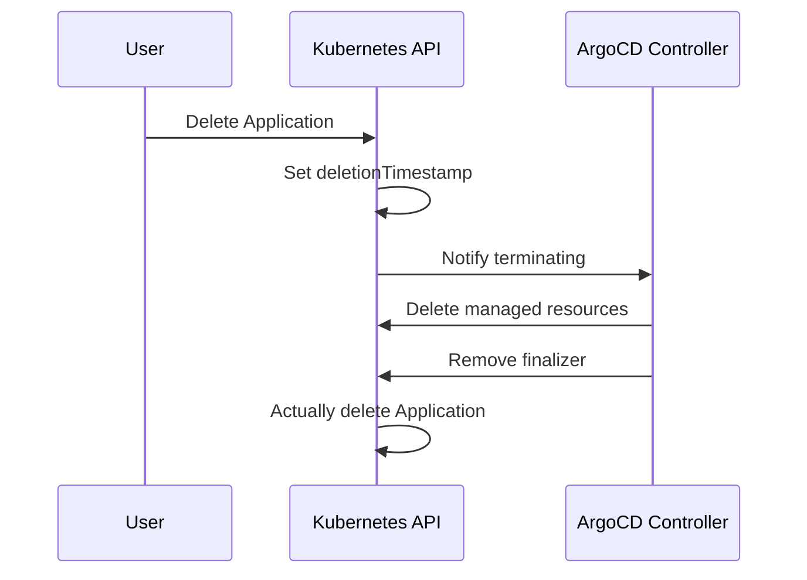

# How to Use Finalizer Annotations for Deletion Control in ArgoCD

Author: [nawazdhandala](https://github.com/nawazdhandala)

Tags: ArgoCD, GitOps, Kubernetes, Finalizer, Application Lifecycle

Description: Learn how to use ArgoCD finalizer annotations to control what happens when you delete applications, including cascade and orphan deletion strategies.

---

Deleting an ArgoCD Application is not as simple as running `kubectl delete`. What happens to the Kubernetes resources the application manages? Do they get cleaned up, or do they remain in the cluster? The ArgoCD finalizer annotation controls this behavior, and getting it right is crucial for both cleanup and safety.

## What Is the ArgoCD Finalizer?

The ArgoCD finalizer is a metadata entry on the Application resource that tells Kubernetes (and ArgoCD) to perform cleanup actions before the Application resource is actually removed. The specific finalizer ArgoCD uses is:

```
resources-finalizer.argocd.argoproj.io
```

When this finalizer is present, deleting an Application triggers ArgoCD to delete all managed Kubernetes resources (cascade delete) before removing the Application resource itself.

## How Finalizers Work in Kubernetes

Finalizers are a standard Kubernetes mechanism. When you delete a resource that has a finalizer:

1. Kubernetes sets the `deletionTimestamp` on the resource
2. The resource enters a "terminating" state but is not actually deleted
3. The controller responsible for the finalizer performs cleanup
4. The controller removes the finalizer from the resource
5. Kubernetes completes the deletion



## Adding the Finalizer for Cascade Delete

If you want ArgoCD to delete all managed resources when the Application is deleted (cascade delete), add the finalizer:

```yaml
apiVersion: argoproj.io/v1alpha1
kind: Application
metadata:
  name: my-web-app
  namespace: argocd
  finalizers:
    - resources-finalizer.argocd.argoproj.io
spec:
  project: default
  source:
    repoURL: https://github.com/my-org/manifests.git
    targetRevision: HEAD
    path: apps/web-app
  destination:
    server: https://kubernetes.default.svc
    namespace: web-app
  syncPolicy:
    automated:
      selfHeal: true
      prune: true
```

With this configuration, running `argocd app delete my-web-app` or `kubectl delete application my-web-app -n argocd` will:

1. Delete all Deployments, Services, ConfigMaps, etc. managed by this application
2. Then remove the Application resource itself

## Omitting the Finalizer for Orphan Delete

If you want to delete the Application resource without affecting the running workloads, omit the finalizer:

```yaml
apiVersion: argoproj.io/v1alpha1
kind: Application
metadata:
  name: my-web-app
  namespace: argocd
  # No finalizers - resources will be orphaned on deletion
spec:
  project: default
  source:
    repoURL: https://github.com/my-org/manifests.git
    targetRevision: HEAD
    path: apps/web-app
  destination:
    server: https://kubernetes.default.svc
    namespace: web-app
```

This approach is useful when:

- You are migrating applications between ArgoCD instances
- You want to stop managing an application with ArgoCD but keep it running
- You are restructuring your ArgoCD setup without downtime

## The Background Deletion Finalizer

ArgoCD also supports a background deletion finalizer that uses Kubernetes background propagation instead of foreground:

```yaml
apiVersion: argoproj.io/v1alpha1
kind: Application
metadata:
  name: my-web-app
  namespace: argocd
  finalizers:
    - resources-finalizer.argocd.argoproj.io/background
spec:
  project: default
  source:
    repoURL: https://github.com/my-org/manifests.git
    targetRevision: HEAD
    path: apps/web-app
  destination:
    server: https://kubernetes.default.svc
    namespace: web-app
```

The difference between the standard and background finalizer:

- **Standard (`resources-finalizer.argocd.argoproj.io`)**: ArgoCD deletes each resource and waits for confirmation in the foreground
- **Background (`resources-finalizer.argocd.argoproj.io/background`)**: ArgoCD issues delete commands and relies on Kubernetes garbage collection to clean up dependents

Background deletion is faster but less predictable in ordering.

## CLI Control Over Deletion Behavior

The ArgoCD CLI lets you override the finalizer behavior at deletion time:

```bash
# Cascade delete (default if finalizer exists)
argocd app delete my-web-app --cascade

# Orphan delete (ignore finalizer, keep resources)
argocd app delete my-web-app --cascade=false

# Force delete with propagation policy
argocd app delete my-web-app --propagation-policy foreground
argocd app delete my-web-app --propagation-policy background
```

The `--cascade=false` flag is particularly useful for emergency situations where you want to remove the Application resource without waiting for all resources to be cleaned up.

## Declarative Finalizer Management

When managing applications declaratively with the app-of-apps pattern, you control the finalizer in the Application YAML stored in Git:

```yaml
# app-of-apps/applications/web-app.yaml
apiVersion: argoproj.io/v1alpha1
kind: Application
metadata:
  name: web-app
  namespace: argocd
  finalizers:
    - resources-finalizer.argocd.argoproj.io
spec:
  project: default
  source:
    repoURL: https://github.com/my-org/manifests.git
    path: apps/web-app
    targetRevision: HEAD
  destination:
    server: https://kubernetes.default.svc
    namespace: web-app
  syncPolicy:
    automated:
      selfHeal: true
      prune: true
---
# app-of-apps/applications/monitoring.yaml
# No finalizer - we never want monitoring deleted accidentally
apiVersion: argoproj.io/v1alpha1
kind: Application
metadata:
  name: monitoring-stack
  namespace: argocd
  # Deliberately no finalizer for safety
spec:
  project: infrastructure
  source:
    repoURL: https://github.com/my-org/manifests.git
    path: infrastructure/monitoring
    targetRevision: HEAD
  destination:
    server: https://kubernetes.default.svc
    namespace: monitoring
```

This pattern lets you make deliberate decisions about deletion behavior per application.

## Handling Stuck Deletions

Sometimes an application gets stuck in a terminating state because the finalizer cannot complete. Common causes include:

1. The target cluster is unreachable
2. RBAC permissions have changed and ArgoCD cannot delete resources
3. A resource has its own finalizer that is stuck

### Diagnosing a Stuck Deletion

```bash
# Check the application status
kubectl get application my-web-app -n argocd -o yaml

# Look for the deletionTimestamp and finalizers
kubectl get application my-web-app -n argocd \
  -o jsonpath='{.metadata.deletionTimestamp}'

# Check ArgoCD controller logs for errors
kubectl logs -n argocd deployment/argocd-application-controller | grep my-web-app
```

### Forcing a Stuck Deletion

If you need to force-delete a stuck application, you can remove the finalizer manually:

```bash
# Remove the finalizer using kubectl patch
kubectl patch application my-web-app -n argocd \
  --type json \
  -p '[{"op": "remove", "path": "/metadata/finalizers"}]'
```

**Warning**: This will remove the Application resource without deleting its managed resources. You will need to clean up those resources manually.

## Best Practices for Finalizer Usage

### Production Applications

For production workloads, think carefully about whether you want cascade deletion:

```yaml
# Production app - NO finalizer to prevent accidental deletion
apiVersion: argoproj.io/v1alpha1
kind: Application
metadata:
  name: payment-service
  namespace: argocd
  annotations:
    argocd.argoproj.io/sync-options: "Delete=false"
  # No finalizer - production resources should never be auto-deleted
spec:
  project: production
  source:
    repoURL: https://github.com/my-org/manifests.git
    path: production/payment-service
    targetRevision: main
  destination:
    server: https://kubernetes.default.svc
    namespace: payment
```

### Development and Staging Applications

For ephemeral environments, cascade delete makes cleanup easy:

```yaml
# Dev/staging app - finalizer for easy cleanup
apiVersion: argoproj.io/v1alpha1
kind: Application
metadata:
  name: feature-branch-app
  namespace: argocd
  finalizers:
    - resources-finalizer.argocd.argoproj.io
spec:
  project: development
  source:
    repoURL: https://github.com/my-org/manifests.git
    path: dev/feature-branch
    targetRevision: feature/new-ui
  destination:
    server: https://kubernetes.default.svc
    namespace: feature-branch-ns
```

### ApplicationSet-Generated Applications

When using ApplicationSets, the finalizer behavior is controlled by the template:

```yaml
apiVersion: argoproj.io/v1alpha1
kind: ApplicationSet
metadata:
  name: pr-environments
  namespace: argocd
spec:
  generators:
    - pullRequest:
        github:
          owner: my-org
          repo: my-app
  template:
    metadata:
      name: 'pr-{{number}}'
      finalizers:
        # Clean up PR environments when the PR is closed
        - resources-finalizer.argocd.argoproj.io
    spec:
      project: development
      source:
        repoURL: https://github.com/my-org/manifests.git
        path: 'pr-environments/{{number}}'
        targetRevision: '{{branch}}'
      destination:
        server: https://kubernetes.default.svc
        namespace: 'pr-{{number}}'
```

## Prevention Over Recovery

The best strategy is to design your finalizer configuration upfront as part of your application lifecycle:

- **Infrastructure apps** (monitoring, ingress, cert-manager): No finalizer. These should survive Application resource changes.
- **Application workloads in production**: No finalizer by default. Use RBAC to restrict who can delete.
- **Application workloads in dev/staging**: Finalizer for easy cleanup.
- **PR preview environments**: Finalizer for automatic cleanup when the ApplicationSet removes the generated app.

## Summary

The ArgoCD finalizer annotation is a simple but powerful control over what happens when an Application is deleted. The `resources-finalizer.argocd.argoproj.io` finalizer triggers cascade deletion of all managed resources, while omitting it leaves resources in place. Choose the right strategy per application based on its environment and criticality, and always have a plan for handling stuck deletions.
